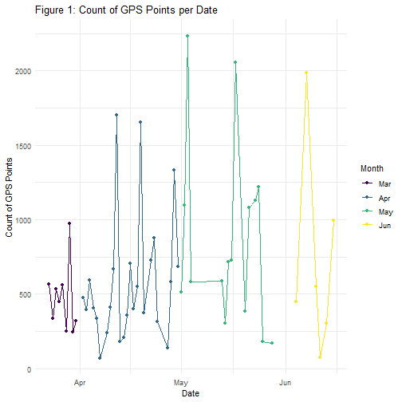
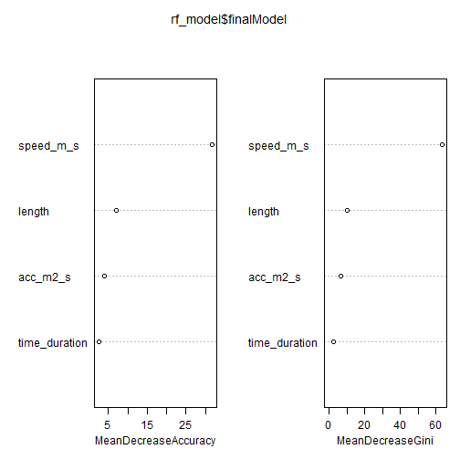
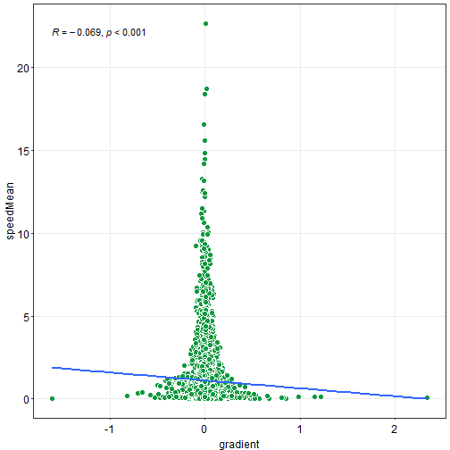

```r
# packages:

## Default repository
local({r <- getOption("repos")
r["CRAN"] <- "http://cran.r-project.org" 
options(repos=r)
})

check_pkg <- function(x)
{
  if (!require(x, character.only = TRUE, quietly = TRUE))
  {
    install.packages(x, dep = TRUE, verbose = FALSE, quiet = TRUE)
    if(!require(x, character.only = TRUE, quietly = TRUE)) stop("Package not found")
  }
}
check_pkg("dplyr")
check_pkg("lubridate")
check_pkg("geosphere")
check_pkg("tidyverse")
check_pkg("sf") # 
check_pkg("purrr") # package for precise calculation
check_pkg("readr") # a better way to read data than basic R
check_pkg("rnaturalearth") # package for requiring DEM data
check_pkg("raster")
check_pkg("elevatr") # package for handling DEM
check_pkg("terra") # package for raster data handling
check_pkg("skimr") # a better package to summarize data
check_pkg("ggplot2") # package for plots
check_pkg("smplot2") # package for more functions based on ggplot
check_pkg("mapview") # package for interactive maps
check_pkg("randomForest") # package for random forest
check_pkg("caret") # package for random forest
check_pkg("e1071") # package for random forest
```

```r
# importing data
posmo_df <- readr::read_csv("posmo_2024-03-23_2024-06-15.csv",
                            col_types = cols(
                              user_id = col_character(),
                              datetime = col_datetime(),
                              weekday = col_factor(levels = c("Sun", "Mon", "Tue", "Wed", "Thu", "Fri", "Sat")), # read daytime as a factor
                              place_name = col_character(),
                              transport_mode = col_factor(levels = c("Walk", "Tram", "Bus", "Bike", "Train", "Car")),
                              lon_x = col_double(),
                              lat_y = col_double()
                            )) |> dplyr::select(-user_id) # remove id because we only have one "user" here
```

```r
# have a breif view of our data
# Check structure of dataset
skimr::skim(posmo_df)
```

```
## Warning: There was 1 warning in `dplyr::summarize()`.
## ℹ In argument:
##   `dplyr::across(tidyselect::any_of(variable_names),
##   mangled_skimmers$funs)`.
## ℹ In group 0: .
## Caused by warning:
## ! There were 155 warnings in `dplyr::summarize()`.
## The first warning was:
## ℹ In argument:
##   `dplyr::across(tidyselect::any_of(variable_names),
##   mangled_skimmers$funs)`.
## Caused by warning in `grepl()`:
## ! unable to translate 'Z<a8><b9>rich  Bahnhofplatz/HB' to a wide string
## ℹ Run `dplyr::last_dplyr_warnings()` to see the 154 remaining
##   warnings.
```


Table: Data summary

|                         |         |
|:------------------------|:--------|
|Name                     |posmo_df |
|Number of rows           |37174    |
|Number of columns        |6        |
|_______________________  |         |
|Column type frequency:   |         |
|character                |1        |
|factor                   |2        |
|numeric                  |2        |
|POSIXct                  |1        |
|________________________ |         |
|Group variables          |None     |


**Variable type: character**

|skim_variable | n_missing| complete_rate| min| max| empty| n_unique| whitespace|
|:-------------|---------:|-------------:|---:|---:|-----:|--------:|----------:|
|place_name    |     36739|          0.01|   4|  34|     0|       76|          0|


**Variable type: factor**

|skim_variable  | n_missing| complete_rate|ordered | n_unique|top_counts                                  |
|:--------------|---------:|-------------:|:-------|--------:|:-------------------------------------------|
|weekday        |         0|          1.00|FALSE   |        7|Fri: 13075, Tue: 5754, Thu: 4947, Mon: 4614 |
|transport_mode |       435|          0.99|FALSE   |        6|Wal: 14898, Tra: 9781, Tra: 7165, Bus: 2684 |


**Variable type: numeric**

|skim_variable | n_missing| complete_rate|  mean|   sd|    p0|   p25|   p50|   p75|  p100|hist  |
|:-------------|---------:|-------------:|-----:|----:|-----:|-----:|-----:|-----:|-----:|:-----|
|lon_x         |         0|             1|  8.55| 0.04|  8.50|  8.52|  8.54|  8.55|  8.69|▇▆▁▁▁ |
|lat_y         |         0|             1| 47.36| 0.04| 47.22| 47.36| 47.37| 47.38| 47.41|▁▁▁▆▇ |


**Variable type: POSIXct**

|skim_variable | n_missing| complete_rate|min                 |max                 |median              | n_unique|
|:-------------|---------:|-------------:|:-------------------|:-------------------|:-------------------|--------:|
|datetime      |         0|             1|2024-03-23 10:35:10 |2024-06-15 13:00:40 |2024-04-29 21:19:28 |    36071|

```r
head(posmo_df)
```

```
## # A tibble: 6 × 6
##   datetime            weekday place_name    transport_mode lon_x
##   <dttm>              <fct>   <chr>         <fct>          <dbl>
## 1 2024-03-23 10:35:10 Sat     Careum Bildu… <NA>            8.55
## 2 2024-03-23 11:55:38 Sat     <NA>          Walk            8.55
## 3 2024-03-23 11:55:38 Sat     <NA>          Walk            8.55
## 4 2024-03-23 11:55:49 Sat     <NA>          Walk            8.55
## 5 2024-03-23 11:56:00 Sat     <NA>          Walk            8.55
## 6 2024-03-23 11:56:11 Sat     <NA>          Walk            8.55
## # ℹ 1 more variable: lat_y <dbl>
```

```r
tail(posmo_df)
```

```
## # A tibble: 6 × 6
##   datetime            weekday place_name    transport_mode lon_x
##   <dttm>              <fct>   <chr>         <fct>          <dbl>
## 1 2024-06-15 13:00:18 Sat     <NA>          Walk            8.52
## 2 2024-06-15 13:00:25 Sat     <NA>          Walk            8.52
## 3 2024-06-15 13:00:34 Sat     <NA>          Walk            8.52
## 4 2024-06-15 13:00:40 Sat     <NA>          Walk            8.52
## 5 2024-06-15 13:00:40 Sat     <NA>          Walk            8.52
## 6 2024-06-15 13:00:40 Sat     Uetlibergstr… <NA>            8.52
## # ℹ 1 more variable: lat_y <dbl>
```

```r
# Extract the date from the datetime column
posmo_df <- posmo_df |> mutate(date = as_date(datetime))
# Count of days with records
length(unique(posmo_df$date))
```

```
## [1] 78
```

```r
# date records from
min(posmo_df$date)
```

```
## [1] "2024-03-23"
```

```r
# date records from
max(posmo_df$date)
```

```
## [1] "2024-06-15"
```

```r
# Check rows where datetime is out of order
disordered_df <- posmo_df %>%
  mutate(is_ordered = c(TRUE, diff(datetime) >= 0)) %>%
  filter(is_ordered = FALSE) |> as_tibble()
```

```r
# Group by datetime and count the number of occurrences
repeated_counts <- posmo_df |> 
  group_by(datetime) |> 
  summarise(count = n()) |> 
  filter(count > 1)

# Display the repeated_counts partly
cat(" Stop points detection:", "\n","Total count of stops:", nrow(repeated_counts), "\n","Possible point count of each stop:", unique(repeated_counts$count), "\n")
```

```
##  Stop points detection: 
##  Total count of stops: 804 
##  Possible point count of each stop: 2 3 4
```

```r
# remove the temporary dataframe
rm(repeated_counts)
```

```r
# Convert coordinates to LV95 (Swiss coordinate system)
coordinates <- st_as_sf(posmo_df, coords = c("lon_x", "lat_y"), crs = 4326, remove = FALSE)
coordinates_lv95 <- st_transform(coordinates, 2056)
posmo_df$lv95_x <- st_coordinates(coordinates_lv95)[,1]
posmo_df$lv95_y <- st_coordinates(coordinates_lv95)[,2]

# Assign transport_mode_id based on transport_mode
# Filter out rows with null values in the transport_mode column
posmo_df <- posmo_df %>%
  filter(!is.na(transport_mode))

# Assign trip identifiers based on changes in transport_mode
posmo_df <- posmo_df %>%
  mutate(transport_mode_id = cumsum(c(1, as.numeric(transport_mode[-1] != transport_mode[-n()]))))

walk <- posmo_df |> filter(transport_mode == "Walk")

walk_sf <- st_as_sf(walk,
                    coords = c("lv95_x", "lv95_y"),
                    crs = 2056, remove = FALSE
)

# Create LINESTRING by grouping by transport_mode_id
walk_line <- walk_sf %>% 
  group_by(transport_mode_id) %>% 
  summarise(do_union = FALSE) %>% 
  st_cast("LINESTRING") |> 
  mutate(length = st_length(geometry))

# Group points by transport_mode_id and calculate the time duration for each group
time_durations <- walk_sf %>%
  group_by(transport_mode_id) %>%
  summarise(
    start_time = min(datetime),
    end_time = max(datetime),
    time_duration = as.numeric(difftime(max(datetime), min(datetime)), units = "secs")
  ) |> st_drop_geometry()

# Create LINESTRING by grouping by transport_mode_id
walk_line <- walk_sf %>%
  group_by(transport_mode_id) %>%
  summarise(do_union = FALSE) %>%
  st_cast("LINESTRING") %>%
  mutate(length = st_length(geometry))

# Join the time durations back to walk_line
walk_line <- walk_line %>%
  left_join(time_durations %>% dplyr::select(transport_mode_id, time_duration), by = "transport_mode_id")

# Calculate the mean speed
walk_line <- walk_line %>%
  mutate(speed_m_s = as.numeric(length / time_duration))|>
  mutate()

# Sample the walk_line data
sampled_walk_line <- walk_line %>%
  sample_n(1)

# view the sample by map
mapview(sampled_walk_line, zcol = "transport_mode_id")
```


```r
posmo_df <- distinct(posmo_df,datetime,.keep_all=TRUE)
```

```r
# Extract the date from the datetime column
# Exclude the data if the record of the day is less than three
posmo_df <- posmo_df |> mutate(date = as_date(datetime)) |> group_by(date) |>
  filter(n() >= 3) |>
  ungroup()

# Count the number of data points per date
# Create a new column for the month
date_counts <- posmo_df |> 
  mutate(date = as.Date(datetime),
         month = month(date, label = TRUE)) |> 
  group_by(date, month) |> 
  summarise(count = n(), .groups = 'drop')

# Plot the result with points colored by month
ggplot(date_counts, aes(x = date, y = count, color = month)) +
  geom_line() + 
  geom_point() +
  labs(x = "Date", y = "Count of GPS Points", title = "Figure 1: Count of GPS Points per Date", color = "Month") +
  theme_minimal() 
```



```r
# remove this temporary dataframe after plotting the result
rm(date_counts)

# Define helper functions
distance_by_element <- function(later, now) {
  as.numeric(st_distance(later, now, by_element = TRUE))
}

difftime_secs <- function(later, now){
  as.numeric(difftime(later, now, units = "secs"))
}

posmo_sf <- posmo_df |>
  st_as_sf(coords = c("lon_x", "lat_y"), crs = 4326, remove = FALSE) |> 
  st_transform(2056)

# rebuilding algorithm
posmo_sf_chong <- posmo_sf |>
  mutate(
    stepMean = distance_by_element(geometry, lag(geometry, 6))
  ) |>
  mutate(
    timeMean = difftime_secs(datetime, lag(datetime, 6))
  ) |> 
  mutate(speedMean = stepMean / timeMean) |>
  mutate(walk = ifelse(speedMean > 0.56 & speedMean < 2.22, TRUE, FALSE))

# Assign trip IDs based on gaps
posmo_sf_chong <- posmo_sf_chong |> 
  mutate(gap_id = ifelse(is.na(walk), 0, walk), # Replace NA values with 0
         walk_id = cumsum(ifelse(gap_id == 1 & lag(gap_id, default = 0) == 0, 1, 0))) |> filter(gap_id == 1)

# filter walk and consecutive group
walk_chong <- posmo_sf_chong |> filter(gap_id == 1) |> 
  group_by(walk_id) |> 
  filter(n() >= 5) |> 
  ungroup()

# have an overview
walk_chong |> as_tibble()
```

```
## # A tibble: 11,612 × 17
##    datetime            weekday place_name transport_mode lon_x
##    <dttm>              <fct>   <chr>      <fct>          <dbl>
##  1 2024-03-23 11:59:32 Sat     <NA>       Walk            8.55
##  2 2024-03-23 11:59:43 Sat     <NA>       Walk            8.55
##  3 2024-03-23 11:59:54 Sat     <NA>       Walk            8.55
##  4 2024-03-23 12:00:05 Sat     <NA>       Walk            8.55
##  5 2024-03-23 12:00:16 Sat     <NA>       Walk            8.55
##  6 2024-03-23 12:00:27 Sat     <NA>       Walk            8.55
##  7 2024-03-23 12:00:37 Sat     <NA>       Walk            8.55
##  8 2024-03-23 12:00:48 Sat     <NA>       Walk            8.55
##  9 2024-03-23 12:00:59 Sat     <NA>       Walk            8.55
## 10 2024-03-23 12:01:09 Sat     <NA>       Walk            8.55
## # ℹ 11,602 more rows
## # ℹ 12 more variables: lat_y <dbl>, date <date>, lv95_x <dbl>,
## #   lv95_y <dbl>, transport_mode_id <dbl>,
## #   geometry <POINT [m]>, stepMean <dbl>, timeMean <dbl>,
## #   speedMean <dbl>, walk <lgl>, gap_id <dbl>, walk_id <dbl>
```

```r
# Define helper functions
distance_by_element <- function(later, now) {
  as.numeric(st_distance(later, now, by_element = TRUE))
}

difftime_secs <- function(later, now){
  as.numeric(difftime(later, now, units = "secs"))
}

posmo_sf <- posmo_df |>
  st_as_sf(coords = c("lon_x", "lat_y"), crs = 4326, remove = FALSE) |> 
  st_transform(2056)

# rebuilding algorithm
posmo_sf_gong <- posmo_sf |>
  mutate(
    stepMean = distance_by_element(geometry, lag(geometry, 6))
  ) |>
  mutate(
    timeMean = difftime_secs(datetime, lag(datetime, 6))
  ) |> 
  mutate(speedMean = stepMean / timeMean) |>
  mutate(gap = ifelse(stepMean > 250 | timeMean > 150, TRUE, FALSE))

# Assign trip IDs based on gaps
posmo_sf_gong <- posmo_sf_gong |> 
  mutate(gap_id = ifelse(is.na(gap), 0, gap), # Replace NA values with 0
         tra_id = cumsum(gap_id) + 1)

# Function to check and adjust trip IDs based on average speed
adjust_trip_ids <- function(df) {
  df <- df |> arrange(datetime)
  df <- df |> group_by(tra_id) |> 
    mutate(avg_speed = mean(speedMean, na.rm = TRUE)) |> 
    ungroup()
  
  df <- df |> 
    mutate(
      tra_id = cumsum(lag(cumsum(gap), default = 0)) + 1,
      new_gap = ifelse(avg_speed > 1.67, 1, 0)
    ) |> 
    mutate(tra_id = cumsum(new_gap) + 1) |> 
    dplyr::select(-avg_speed, -new_gap)
  
  return(df)
}

# Apply the adjustment function
walk_gong <- adjust_trip_ids(posmo_sf_gong) |>   group_by(tra_id) |> 
  filter(n() > 1) |> 
  ungroup()

walk_gong |> as_tibble()
```

```
## # A tibble: 15,279 × 17
##    datetime            weekday place_name transport_mode lon_x
##    <dttm>              <fct>   <chr>      <fct>          <dbl>
##  1 2024-03-23 11:55:38 Sat     <NA>       Walk            8.55
##  2 2024-03-23 11:55:49 Sat     <NA>       Walk            8.55
##  3 2024-03-23 11:56:00 Sat     <NA>       Walk            8.55
##  4 2024-03-23 11:56:11 Sat     <NA>       Walk            8.55
##  5 2024-03-23 11:56:22 Sat     <NA>       Walk            8.55
##  6 2024-03-23 11:56:33 Sat     <NA>       Walk            8.55
##  7 2024-03-23 11:56:44 Sat     <NA>       Walk            8.55
##  8 2024-03-23 11:56:55 Sat     <NA>       Walk            8.55
##  9 2024-03-23 11:57:05 Sat     <NA>       Walk            8.55
## 10 2024-03-23 11:57:16 Sat     <NA>       Walk            8.55
## # ℹ 15,269 more rows
## # ℹ 12 more variables: lat_y <dbl>, date <date>, lv95_x <dbl>,
## #   lv95_y <dbl>, transport_mode_id <dbl>,
## #   geometry <POINT [m]>, stepMean <dbl>, timeMean <dbl>,
## #   speedMean <dbl>, gap <lgl>, gap_id <dbl>, tra_id <dbl>
```

```r
# Define the function to compute performance metrics for different lag values
compute_metrics_for_lag <- function(posmo_df, lag_values) {
  
  # Define helper functions
  distance_by_element <- function(later, now) {
    as.numeric(st_distance(later, now, by_element = TRUE))
  }
  
  difftime_secs <- function(later, now){
    as.numeric(difftime(later, now, units = "secs"))
  }
  
  # Convert dataframe to sf object
  posmo_sf <- posmo_df |>
    st_as_sf(coords = c("lon_x", "lat_y"), crs = 4326, remove = FALSE) |> 
    st_transform(2056)
  
  # Initialize results list
  results <- list()
  
  # Iterate over each lag value
  for (lag_value in lag_values) {
    
    posmo_sf <- posmo_sf |>
      mutate(
        stepMean = distance_by_element(geometry, lag(geometry, lag_value))
      ) |>
      mutate(
        timeMean = difftime_secs(datetime, lag(datetime, lag_value))
      ) |> 
      mutate (speedMean = stepMean / timeMean) |> 
      mutate (acc = (lead(speedMean) - speedMean) / timeMean) |>
      mutate(
        walk = (speedMean <= 1.7)
      ) |>
      mutate(
        walk_s_a = (speedMean <= 1.7) & (abs(acc) <= 0.009)
      )
    
    # Validation of speed and acceleration based detection
    walk_tp <- posmo_sf |> filter(transport_mode == "Walk" & walk == TRUE)
    walk_fp <- posmo_sf |> filter(transport_mode != "Walk" & walk == TRUE)
    walk_fn <- posmo_sf |> filter(transport_mode == "Walk" & walk != TRUE)
    walk_tn <- posmo_sf |> filter(transport_mode != "Walk" & walk != TRUE)
    
    tp <- nrow(walk_tp)
    fp <- nrow(walk_fp)
    fn <- nrow(walk_fn)
    tn <- nrow(walk_tn)
    
    accuracy <- (tp + tn) / (tp + tn + fp + fn)
    precision <- tp/ (tp + fp)
    specificity <- tn / (tn + fp)
    sensitivity <- tp / (tp + fn)
    recall <- tp / (tp + fn)
    balance_accuracy <- (specificity + sensitivity) / 2
    f1 <- 2 * (precision * recall) / (precision + recall)
    
    # Store results for the current lag value
    results[[as.character(lag_value)]] <- c(
      accuracy = accuracy,
      precision = precision,
      specificity = specificity,
      sensitivity = sensitivity,
      recall = recall,
      balance_accuracy = balance_accuracy,
      f1_score = f1
    )
  }
  
  # Convert results list to data frame
  results_df <- do.call(rbind, results)
  return(results_df)
}

# Values here represent minutes
lag_values <- c(1, 2, 3, 4, 5)

# Compute metrics for the given lag values
metrics_df <- compute_metrics_for_lag(posmo_df, lag_values)

# Display the results
print(metrics_df)
```

```
##    accuracy precision specificity sensitivity    recall
## 1 0.7601726 0.6715632   0.7383683   0.7924724 0.7924724
## 2 0.7847143 0.6919180   0.7476457   0.8396298 0.8396298
## 3 0.8036350 0.7086871   0.7584615   0.8705622 0.8705622
## 4 0.8180477 0.7224090   0.7689977   0.8907232 0.8907232
## 5 0.8287870 0.7331019   0.7778089   0.9043244 0.9043244
##   balance_accuracy  f1_score
## 1        0.7654203 0.7270251
## 2        0.7936377 0.7586508
## 3        0.8145119 0.7813285
## 4        0.8298604 0.7977851
## 5        0.8410666 0.8097609
```

```r
# Define the function to compute performance metrics for different lag values
compute_metrics_for_lag <- function(posmo_df, lag_values) {
  
  # Define helper functions
  distance_by_element <- function(later, now) {
    as.numeric(st_distance(later, now, by_element = TRUE))
  }
  
  difftime_secs <- function(later, now){
    as.numeric(difftime(later, now, units = "secs"))
  }
  
  # Convert dataframe to sf object
  posmo_sf <- posmo_df |>
    st_as_sf(coords = c("lon_x", "lat_y"), crs = 4326, remove = FALSE) |> 
    st_transform(2056)
  
  # Initialize results list
  results <- list()
  
  # Iterate over each lag value
  for (lag_value in lag_values) {
    
    posmo_sf <- posmo_sf |>
      mutate(
        stepMean = distance_by_element(geometry, lag(geometry, lag_value))
      ) |>
      mutate(
        timeMean = difftime_secs(datetime, lag(datetime, lag_value))
      ) |> 
      mutate (speedMean = stepMean / timeMean) |> 
      mutate (acc = (lead(speedMean) - speedMean) / timeMean) |>
      mutate(
        walk = (speedMean <= 1.7)
      ) |>
      mutate(
        walk_s_a = (speedMean <= 1.7) & (abs(acc) <= 0.009)
      )
    
    # Validation of speed and acceleration based detection
    walk_tp_s_a <- posmo_sf |> filter(transport_mode == "Walk" & walk_s_a == TRUE)
    walk_fp_s_a <- posmo_sf |> filter(transport_mode != "Walk" & walk_s_a == TRUE)
    walk_fn_s_a <- posmo_sf |> filter(transport_mode == "Walk" & walk_s_a != TRUE)
    walk_tn_s_a <- posmo_sf |> filter(transport_mode != "Walk" & walk_s_a != TRUE)
    
    tp_s_a <- nrow(walk_tp_s_a)
    fp_s_a <- nrow(walk_fp_s_a)
    fn_s_a <- nrow(walk_fn_s_a)
    tn_s_a <- nrow(walk_tn_s_a)
    
    accuracy_s_a <- (tp_s_a + tn_s_a) / (tp_s_a + tn_s_a + fp_s_a + fn_s_a)
    precision_s_a <- tp_s_a / (tp_s_a + fp_s_a)
    specificity_s_a <- tn_s_a / (tn_s_a + fp_s_a)
    sensitivity_s_a <- tp_s_a / (tp_s_a + fn_s_a)
    recall_s_a <- tp_s_a / (tp_s_a + fn_s_a)
    balance_accuracy_s_a <- (specificity_s_a + sensitivity_s_a) / 2
    f1_s_a <- 2 * (precision_s_a * recall_s_a) / (precision_s_a + recall_s_a)
    
    # Store results for the current lag value
    results[[as.character(lag_value)]] <- c(
      accuracy = accuracy_s_a,
      precision = precision_s_a,
      specificity = specificity_s_a,
      sensitivity = sensitivity_s_a,
      recall = recall_s_a,
      balance_accuracy = balance_accuracy_s_a,
      f1_score = f1_s_a
    )
  }
  
  # Convert results list to data frame
  results_df <- do.call(rbind, results)
  return(results_df)
}

# Example usage
lag_values <- c(1, 2, 3, 4, 5)

# Compute metrics for the given lag values
metrics_df <- compute_metrics_for_lag(posmo_df, lag_values)

# Display the results
print(metrics_df)
```

```
##    accuracy precision specificity sensitivity    recall
## 1 0.6327581 0.7245718   0.9632634   0.1431630 0.1431630
## 2 0.6923655 0.7500000   0.9201399   0.3549278 0.3549278
## 3 0.7551770 0.7711395   0.8882051   0.5580881 0.5580881
## 4 0.8008183 0.7788527   0.8646620   0.7062237 0.7062237
## 5 0.8251079 0.7776196   0.8470396   0.7926079 0.7926079
##   balance_accuracy  f1_score
## 1        0.5532132 0.2390866
## 2        0.6375338 0.4818340
## 3        0.7231466 0.6475397
## 4        0.7854428 0.7407622
## 5        0.8198238 0.7850423
```

```r
compute_metrics_for_thresholds <- function(posmo_df, thresholds) {
  
  # Define helper functions
  distance_by_element <- function(later, now) {
    as.numeric(st_distance(later, now, by_element = TRUE))
  }
  
  difftime_secs <- function(later, now){
    as.numeric(difftime(later, now, units = "secs"))
  }
  
  # Convert dataframe to sf object
  posmo_sf <- posmo_df |>
    st_as_sf(coords = c("lon_x", "lat_y"), crs = 4326, remove = FALSE) |> 
    st_transform(2056)
  
  # Initialize results list
  results <- list()
  
  # Iterate over each pair of thresholds
  for (threshold in thresholds) {
    speed_threshold <- threshold[1]
    acc_threshold <- threshold[2]
    
    posmo_sf <- posmo_sf |>
      mutate(
        stepMean = distance_by_element(geometry, lag(geometry, 6))  # Keeping lag value fixed as 6
      ) |>
      mutate(
        timeMean = difftime_secs(datetime, lag(datetime, 6))
      ) |> 
      mutate (speedMean = stepMean / timeMean) |> 
      mutate (acc = (lead(speedMean) - speedMean) / timeMean) |>
      mutate(
        walk = (speedMean <= speed_threshold)
      ) |>
      mutate(
        walk_s_a = (speedMean <= speed_threshold) & (abs(acc) <= acc_threshold)
      )
    
    # Validation of speed and acceleration based detection
    walk_tp_s_a <- posmo_sf |> filter(transport_mode == "Walk" & walk_s_a == TRUE)
    walk_fp_s_a <- posmo_sf |> filter(transport_mode != "Walk" & walk_s_a == TRUE)
    walk_fn_s_a <- posmo_sf |> filter(transport_mode == "Walk" & walk_s_a != TRUE)
    walk_tn_s_a <- posmo_sf |> filter(transport_mode != "Walk" & walk_s_a != TRUE)
    
    tp_s_a <- nrow(walk_tp_s_a)
    fp_s_a <- nrow(walk_fp_s_a)
    fn_s_a <- nrow(walk_fn_s_a)
    tn_s_a <- nrow(walk_tn_s_a)
    
    accuracy_s_a <- (tp_s_a + tn_s_a) / (tp_s_a + tn_s_a + fp_s_a + fn_s_a)
    precision_s_a <- tp_s_a / (tp_s_a + fp_s_a)
    specificity_s_a <- tn_s_a / (tn_s_a + fp_s_a)
    sensitivity_s_a <- tp_s_a / (tp_s_a + fn_s_a)
    recall_s_a <- tp_s_a / (tp_s_a + fn_s_a)
    balance_accuracy_s_a <- (specificity_s_a + sensitivity_s_a) / 2
    f1_s_a <- 2 * (precision_s_a * recall_s_a) / (precision_s_a + recall_s_a)
    
    # Create a row name based on the current thresholds
    row_name <- paste0("speed=", speed_threshold, ",acc=", acc_threshold)
    
    # Store results for the current pair of thresholds
    results[[row_name]] <- c(
      accuracy = accuracy_s_a,
      precision = precision_s_a,
      specificity = specificity_s_a,
      sensitivity = sensitivity_s_a,
      recall = recall_s_a,
      balance_accuracy = balance_accuracy_s_a,
      f1_score = f1_s_a
    )
  }
  
  # Convert results list to data frame
  results_df <- do.call(rbind, results)
  return(results_df)
}

# Example usage
thresholds <- list(
  c(1.5, 0.001),
  c(1.7, 0.001),
  c(1.9, 0.001),
  c(1.5, 0.002),
  c(1.7, 0.002),
  c(1.9, 0.002)
)

# Compute metrics for the given thresholds
metrics_df <- compute_metrics_for_thresholds(posmo_df, thresholds)

# Display the results
print(metrics_df)
```

```
##                      accuracy precision specificity sensitivity
## speed=1.5,acc=0.001 0.6895112 0.7806899   0.9395338   0.3189858
## speed=1.7,acc=0.001 0.6929351 0.7789661   0.9364103   0.3321128
## speed=1.9,acc=0.001 0.6932970 0.7768343   0.9350583   0.3350145
## speed=1.5,acc=0.002 0.7395335 0.7867952   0.9113287   0.4849385
## speed=1.7,acc=0.002 0.7464926 0.7858741   0.9062937   0.5096725
## speed=1.9,acc=0.002 0.7469937 0.7827959   0.9035897   0.5149233
##                        recall balance_accuracy  f1_score
## speed=1.5,acc=0.001 0.3189858        0.6292598 0.4529135
## speed=1.7,acc=0.001 0.3321128        0.6342615 0.4656818
## speed=1.9,acc=0.001 0.3350145        0.6350364 0.4681406
## speed=1.5,acc=0.002 0.4849385        0.6981336 0.6000427
## speed=1.7,acc=0.002 0.5096725        0.7079831 0.6183312
## speed=1.9,acc=0.002 0.5149233        0.7092565 0.6212128
```

```r
# code summary: random forest with parameters
# Prepare the data
posmo_simple <- posmo_df %>%
  mutate(transport_mode = case_when(
    transport_mode %in% c("Tram", "Train", "Bus", "Car") ~ "Vehicle",
    transport_mode == "Bike" ~ "Walk",
    TRUE ~ transport_mode
  ))

trajectories_all_sf <- st_as_sf(posmo_simple,
                                coords = c("lv95_x", "lv95_y"),
                                crs = 2056, remove = FALSE
)

# Group points by transport_mode_id and get the unique transport_mode for each group
mode_mapping <- posmo_simple %>%
  group_by(transport_mode_id) %>%
  summarise(transport_mode = first(transport_mode)) %>%
  ungroup()

# Create LINESTRING by grouping by transport_mode_id
trajectories_all_line <- trajectories_all_sf %>% 
  group_by(transport_mode_id) %>% 
  summarise(do_union = FALSE) %>% 
  st_cast("LINESTRING") %>% 
  mutate(length = st_length(geometry))

# Join transport_mode to trajectories_all_line
trajectories_all_line <- trajectories_all_line %>%
  left_join(mode_mapping, by = "transport_mode_id") %>%
  mutate(transport_mode = as.factor(transport_mode))

# Group points by transport_mode_id and calculate the time duration for each group
time_duration_all <- trajectories_all_sf %>%
  group_by(transport_mode_id) %>%
  summarise(
    start_time = min(datetime),
    end_time = max(datetime),
    time_duration = as.numeric(difftime(max(datetime), min(datetime)), units = "secs")
  ) %>% st_drop_geometry()

# Join the time durations back to walk_line
trajectories_all_line <- trajectories_all_line %>%
  left_join(time_duration_all %>% dplyr::select(transport_mode_id, time_duration), by = "transport_mode_id")

# Calculate the mean speed and acceleration
trajectories_all_line <- trajectories_all_line %>%
  mutate(
    speed_m_s = as.numeric(length / time_duration),
    acc_m2_s = as.numeric(speed_m_s / time_duration)
  )

# Remove rows with NA values
trajectories_all_line <- trajectories_all_line %>%
  drop_na()

# Split the data into training and testing datasets
set.seed(123)
train_index <- createDataPartition(trajectories_all_line$transport_mode, p = 0.7, list = FALSE)
train_set <- trajectories_all_line[train_index, ]
test_set <- trajectories_all_line[-train_index, ]

# Define the control parameters for cross-validation
trControl <- trainControl(method = "cv", number = 10, search = "grid")

# Tune mtry, maxnodes, and ntree
tuneGrid <- expand.grid(
  mtry = 1:10,
  maxnodes = 5:15,
  ntree = c(100, 200, 300, 400, 500)
)

customRF <- list(type = "Classification",
                 library = "randomForest",
                 loop = NULL,
                 parameters = data.frame(parameter = c("mtry", "maxnodes", "ntree"),
                                         class = rep("numeric", 3),
                                         label = c("mtry", "maxnodes", "ntree")),
                 grid = function(x, y, len = NULL, search = "grid") {
                   expand.grid(mtry = 1:10, maxnodes = 5:15, ntree = c(100, 200, 300, 400, 500))
                 },
                 fit = function(x, y, wts, param, lev, last, classProbs, ...) {
                   randomForest(x, y, mtry = param$mtry, maxnodes = param$maxnodes, ntree = param$ntree, ...)
                 },
                 predict = function(modelFit, newdata, submodels = NULL) {
                   predict(modelFit, newdata)
                 },
                 prob = function(modelFit, newdata, submodels = NULL) {
                   predict(modelFit, newdata, type = "prob")
                 },
                 levels = function(x) x$classes)

# Train the model
set.seed(123)
rf_model <- train(
  transport_mode ~ length + time_duration + speed_m_s + acc_m2_s, 
  data = train_set,
  method = customRF,
  metric = "Accuracy",
  tuneGrid = tuneGrid,
  trControl = trControl,
  nodesize = 14,
  importance = TRUE
)
```

```
## Warning in randomForest.default(x, y, mtry = param$mtry,
## maxnodes = param$maxnodes, : invalid mtry: reset to within
## valid range
## Warning in randomForest.default(x, y, mtry = param$mtry,
## maxnodes = param$maxnodes, : invalid mtry: reset to within
## valid range
## Warning in randomForest.default(x, y, mtry = param$mtry,
## maxnodes = param$maxnodes, : invalid mtry: reset to within
## valid range
## Warning in randomForest.default(x, y, mtry = param$mtry,
## maxnodes = param$maxnodes, : invalid mtry: reset to within
## valid range
## Warning in randomForest.default(x, y, mtry = param$mtry,
## maxnodes = param$maxnodes, : invalid mtry: reset to within
## valid range
## Warning in randomForest.default(x, y, mtry = param$mtry,
## maxnodes = param$maxnodes, : invalid mtry: reset to within
## valid range
## Warning in randomForest.default(x, y, mtry = param$mtry,
## maxnodes = param$maxnodes, : invalid mtry: reset to within
## valid range
## Warning in randomForest.default(x, y, mtry = param$mtry,
## maxnodes = param$maxnodes, : invalid mtry: reset to within
## valid range
## Warning in randomForest.default(x, y, mtry = param$mtry,
## maxnodes = param$maxnodes, : invalid mtry: reset to within
## valid range
## Warning in randomForest.default(x, y, mtry = param$mtry,
## maxnodes = param$maxnodes, : invalid mtry: reset to within
## valid range
## Warning in randomForest.default(x, y, mtry = param$mtry,
## maxnodes = param$maxnodes, : invalid mtry: reset to within
## valid range
## Warning in randomForest.default(x, y, mtry = param$mtry,
## maxnodes = param$maxnodes, : invalid mtry: reset to within
## valid range
## Warning in randomForest.default(x, y, mtry = param$mtry,
## maxnodes = param$maxnodes, : invalid mtry: reset to within
## valid range
## Warning in randomForest.default(x, y, mtry = param$mtry,
## maxnodes = param$maxnodes, : invalid mtry: reset to within
## valid range
## Warning in randomForest.default(x, y, mtry = param$mtry,
## maxnodes = param$maxnodes, : invalid mtry: reset to within
## valid range
## Warning in randomForest.default(x, y, mtry = param$mtry,
## maxnodes = param$maxnodes, : invalid mtry: reset to within
## valid range
## Warning in randomForest.default(x, y, mtry = param$mtry,
## maxnodes = param$maxnodes, : invalid mtry: reset to within
## valid range
## Warning in randomForest.default(x, y, mtry = param$mtry,
## maxnodes = param$maxnodes, : invalid mtry: reset to within
## valid range
## Warning in randomForest.default(x, y, mtry = param$mtry,
## maxnodes = param$maxnodes, : invalid mtry: reset to within
## valid range
## Warning in randomForest.default(x, y, mtry = param$mtry,
## maxnodes = param$maxnodes, : invalid mtry: reset to within
## valid range
## Warning in randomForest.default(x, y, mtry = param$mtry,
## maxnodes = param$maxnodes, : invalid mtry: reset to within
## valid range
## Warning in randomForest.default(x, y, mtry = param$mtry,
## maxnodes = param$maxnodes, : invalid mtry: reset to within
## valid range
## Warning in randomForest.default(x, y, mtry = param$mtry,
## maxnodes = param$maxnodes, : invalid mtry: reset to within
## valid range
## Warning in randomForest.default(x, y, mtry = param$mtry,
## maxnodes = param$maxnodes, : invalid mtry: reset to within
## valid range
## Warning in randomForest.default(x, y, mtry = param$mtry,
## maxnodes = param$maxnodes, : invalid mtry: reset to within
## valid range
## Warning in randomForest.default(x, y, mtry = param$mtry,
## maxnodes = param$maxnodes, : invalid mtry: reset to within
## valid range
## Warning in randomForest.default(x, y, mtry = param$mtry,
## maxnodes = param$maxnodes, : invalid mtry: reset to within
## valid range
## Warning in randomForest.default(x, y, mtry = param$mtry,
## maxnodes = param$maxnodes, : invalid mtry: reset to within
## valid range
## Warning in randomForest.default(x, y, mtry = param$mtry,
## maxnodes = param$maxnodes, : invalid mtry: reset to within
## valid range
## Warning in randomForest.default(x, y, mtry = param$mtry,
## maxnodes = param$maxnodes, : invalid mtry: reset to within
## valid range
## Warning in randomForest.default(x, y, mtry = param$mtry,
## maxnodes = param$maxnodes, : invalid mtry: reset to within
## valid range
## Warning in randomForest.default(x, y, mtry = param$mtry,
## maxnodes = param$maxnodes, : invalid mtry: reset to within
## valid range
## Warning in randomForest.default(x, y, mtry = param$mtry,
## maxnodes = param$maxnodes, : invalid mtry: reset to within
## valid range
## Warning in randomForest.default(x, y, mtry = param$mtry,
## maxnodes = param$maxnodes, : invalid mtry: reset to within
## valid range
## Warning in randomForest.default(x, y, mtry = param$mtry,
## maxnodes = param$maxnodes, : invalid mtry: reset to within
## valid range
## Warning in randomForest.default(x, y, mtry = param$mtry,
## maxnodes = param$maxnodes, : invalid mtry: reset to within
## valid range
## Warning in randomForest.default(x, y, mtry = param$mtry,
## maxnodes = param$maxnodes, : invalid mtry: reset to within
## valid range
## Warning in randomForest.default(x, y, mtry = param$mtry,
## maxnodes = param$maxnodes, : invalid mtry: reset to within
## valid range
## Warning in randomForest.default(x, y, mtry = param$mtry,
## maxnodes = param$maxnodes, : invalid mtry: reset to within
## valid range
## Warning in randomForest.default(x, y, mtry = param$mtry,
## maxnodes = param$maxnodes, : invalid mtry: reset to within
## valid range
## Warning in randomForest.default(x, y, mtry = param$mtry,
## maxnodes = param$maxnodes, : invalid mtry: reset to within
## valid range
## Warning in randomForest.default(x, y, mtry = param$mtry,
## maxnodes = param$maxnodes, : invalid mtry: reset to within
## valid range
## Warning in randomForest.default(x, y, mtry = param$mtry,
## maxnodes = param$maxnodes, : invalid mtry: reset to within
## valid range
## Warning in randomForest.default(x, y, mtry = param$mtry,
## maxnodes = param$maxnodes, : invalid mtry: reset to within
## valid range
## Warning in randomForest.default(x, y, mtry = param$mtry,
## maxnodes = param$maxnodes, : invalid mtry: reset to within
## valid range
## Warning in randomForest.default(x, y, mtry = param$mtry,
## maxnodes = param$maxnodes, : invalid mtry: reset to within
## valid range
## Warning in randomForest.default(x, y, mtry = param$mtry,
## maxnodes = param$maxnodes, : invalid mtry: reset to within
## valid range
## Warning in randomForest.default(x, y, mtry = param$mtry,
## maxnodes = param$maxnodes, : invalid mtry: reset to within
## valid range
## Warning in randomForest.default(x, y, mtry = param$mtry,
## maxnodes = param$maxnodes, : invalid mtry: reset to within
## valid range
## Warning in randomForest.default(x, y, mtry = param$mtry,
## maxnodes = param$maxnodes, : invalid mtry: reset to within
## valid range
## Warning in randomForest.default(x, y, mtry = param$mtry,
## maxnodes = param$maxnodes, : invalid mtry: reset to within
## valid range
## Warning in randomForest.default(x, y, mtry = param$mtry,
## maxnodes = param$maxnodes, : invalid mtry: reset to within
## valid range
## Warning in randomForest.default(x, y, mtry = param$mtry,
## maxnodes = param$maxnodes, : invalid mtry: reset to within
## valid range
## Warning in randomForest.default(x, y, mtry = param$mtry,
## maxnodes = param$maxnodes, : invalid mtry: reset to within
## valid range
## Warning in randomForest.default(x, y, mtry = param$mtry,
## maxnodes = param$maxnodes, : invalid mtry: reset to within
## valid range
## Warning in randomForest.default(x, y, mtry = param$mtry,
## maxnodes = param$maxnodes, : invalid mtry: reset to within
## valid range
## Warning in randomForest.default(x, y, mtry = param$mtry,
## maxnodes = param$maxnodes, : invalid mtry: reset to within
## valid range
## Warning in randomForest.default(x, y, mtry = param$mtry,
## maxnodes = param$maxnodes, : invalid mtry: reset to within
## valid range
## Warning in randomForest.default(x, y, mtry = param$mtry,
## maxnodes = param$maxnodes, : invalid mtry: reset to within
## valid range
## Warning in randomForest.default(x, y, mtry = param$mtry,
## maxnodes = param$maxnodes, : invalid mtry: reset to within
## valid range
## Warning in randomForest.default(x, y, mtry = param$mtry,
## maxnodes = param$maxnodes, : invalid mtry: reset to within
## valid range
## Warning in randomForest.default(x, y, mtry = param$mtry,
## maxnodes = param$maxnodes, : invalid mtry: reset to within
## valid range
## Warning in randomForest.default(x, y, mtry = param$mtry,
## maxnodes = param$maxnodes, : invalid mtry: reset to within
## valid range
## Warning in randomForest.default(x, y, mtry = param$mtry,
## maxnodes = param$maxnodes, : invalid mtry: reset to within
## valid range
## Warning in randomForest.default(x, y, mtry = param$mtry,
## maxnodes = param$maxnodes, : invalid mtry: reset to within
## valid range
## Warning in randomForest.default(x, y, mtry = param$mtry,
## maxnodes = param$maxnodes, : invalid mtry: reset to within
## valid range
## Warning in randomForest.default(x, y, mtry = param$mtry,
## maxnodes = param$maxnodes, : invalid mtry: reset to within
## valid range
## Warning in randomForest.default(x, y, mtry = param$mtry,
## maxnodes = param$maxnodes, : invalid mtry: reset to within
## valid range
## Warning in randomForest.default(x, y, mtry = param$mtry,
## maxnodes = param$maxnodes, : invalid mtry: reset to within
## valid range
## Warning in randomForest.default(x, y, mtry = param$mtry,
## maxnodes = param$maxnodes, : invalid mtry: reset to within
## valid range
## Warning in randomForest.default(x, y, mtry = param$mtry,
## maxnodes = param$maxnodes, : invalid mtry: reset to within
## valid range
## Warning in randomForest.default(x, y, mtry = param$mtry,
## maxnodes = param$maxnodes, : invalid mtry: reset to within
## valid range
## Warning in randomForest.default(x, y, mtry = param$mtry,
## maxnodes = param$maxnodes, : invalid mtry: reset to within
## valid range
## Warning in randomForest.default(x, y, mtry = param$mtry,
## maxnodes = param$maxnodes, : invalid mtry: reset to within
## valid range
## Warning in randomForest.default(x, y, mtry = param$mtry,
## maxnodes = param$maxnodes, : invalid mtry: reset to within
## valid range
## Warning in randomForest.default(x, y, mtry = param$mtry,
## maxnodes = param$maxnodes, : invalid mtry: reset to within
## valid range
## Warning in randomForest.default(x, y, mtry = param$mtry,
## maxnodes = param$maxnodes, : invalid mtry: reset to within
## valid range
## Warning in randomForest.default(x, y, mtry = param$mtry,
## maxnodes = param$maxnodes, : invalid mtry: reset to within
## valid range
## Warning in randomForest.default(x, y, mtry = param$mtry,
## maxnodes = param$maxnodes, : invalid mtry: reset to within
## valid range
## Warning in randomForest.default(x, y, mtry = param$mtry,
## maxnodes = param$maxnodes, : invalid mtry: reset to within
## valid range
## Warning in randomForest.default(x, y, mtry = param$mtry,
## maxnodes = param$maxnodes, : invalid mtry: reset to within
## valid range
## Warning in randomForest.default(x, y, mtry = param$mtry,
## maxnodes = param$maxnodes, : invalid mtry: reset to within
## valid range
## Warning in randomForest.default(x, y, mtry = param$mtry,
## maxnodes = param$maxnodes, : invalid mtry: reset to within
## valid range
## Warning in randomForest.default(x, y, mtry = param$mtry,
## maxnodes = param$maxnodes, : invalid mtry: reset to within
## valid range
## Warning in randomForest.default(x, y, mtry = param$mtry,
## maxnodes = param$maxnodes, : invalid mtry: reset to within
## valid range
## Warning in randomForest.default(x, y, mtry = param$mtry,
## maxnodes = param$maxnodes, : invalid mtry: reset to within
## valid range
## Warning in randomForest.default(x, y, mtry = param$mtry,
## maxnodes = param$maxnodes, : invalid mtry: reset to within
## valid range
## Warning in randomForest.default(x, y, mtry = param$mtry,
## maxnodes = param$maxnodes, : invalid mtry: reset to within
## valid range
## Warning in randomForest.default(x, y, mtry = param$mtry,
## maxnodes = param$maxnodes, : invalid mtry: reset to within
## valid range
## Warning in randomForest.default(x, y, mtry = param$mtry,
## maxnodes = param$maxnodes, : invalid mtry: reset to within
## valid range
## Warning in randomForest.default(x, y, mtry = param$mtry,
## maxnodes = param$maxnodes, : invalid mtry: reset to within
## valid range
## Warning in randomForest.default(x, y, mtry = param$mtry,
## maxnodes = param$maxnodes, : invalid mtry: reset to within
## valid range
## Warning in randomForest.default(x, y, mtry = param$mtry,
## maxnodes = param$maxnodes, : invalid mtry: reset to within
## valid range
## Warning in randomForest.default(x, y, mtry = param$mtry,
## maxnodes = param$maxnodes, : invalid mtry: reset to within
## valid range
## Warning in randomForest.default(x, y, mtry = param$mtry,
## maxnodes = param$maxnodes, : invalid mtry: reset to within
## valid range
## Warning in randomForest.default(x, y, mtry = param$mtry,
## maxnodes = param$maxnodes, : invalid mtry: reset to within
## valid range
## Warning in randomForest.default(x, y, mtry = param$mtry,
## maxnodes = param$maxnodes, : invalid mtry: reset to within
## valid range
## Warning in randomForest.default(x, y, mtry = param$mtry,
## maxnodes = param$maxnodes, : invalid mtry: reset to within
## valid range
## Warning in randomForest.default(x, y, mtry = param$mtry,
## maxnodes = param$maxnodes, : invalid mtry: reset to within
## valid range
## Warning in randomForest.default(x, y, mtry = param$mtry,
## maxnodes = param$maxnodes, : invalid mtry: reset to within
## valid range
## Warning in randomForest.default(x, y, mtry = param$mtry,
## maxnodes = param$maxnodes, : invalid mtry: reset to within
## valid range
## Warning in randomForest.default(x, y, mtry = param$mtry,
## maxnodes = param$maxnodes, : invalid mtry: reset to within
## valid range
## Warning in randomForest.default(x, y, mtry = param$mtry,
## maxnodes = param$maxnodes, : invalid mtry: reset to within
## valid range
## Warning in randomForest.default(x, y, mtry = param$mtry,
## maxnodes = param$maxnodes, : invalid mtry: reset to within
## valid range
## Warning in randomForest.default(x, y, mtry = param$mtry,
## maxnodes = param$maxnodes, : invalid mtry: reset to within
## valid range
## Warning in randomForest.default(x, y, mtry = param$mtry,
## maxnodes = param$maxnodes, : invalid mtry: reset to within
## valid range
## Warning in randomForest.default(x, y, mtry = param$mtry,
## maxnodes = param$maxnodes, : invalid mtry: reset to within
## valid range
## Warning in randomForest.default(x, y, mtry = param$mtry,
## maxnodes = param$maxnodes, : invalid mtry: reset to within
## valid range
## Warning in randomForest.default(x, y, mtry = param$mtry,
## maxnodes = param$maxnodes, : invalid mtry: reset to within
## valid range
## Warning in randomForest.default(x, y, mtry = param$mtry,
## maxnodes = param$maxnodes, : invalid mtry: reset to within
## valid range
## Warning in randomForest.default(x, y, mtry = param$mtry,
## maxnodes = param$maxnodes, : invalid mtry: reset to within
## valid range
## Warning in randomForest.default(x, y, mtry = param$mtry,
## maxnodes = param$maxnodes, : invalid mtry: reset to within
## valid range
## Warning in randomForest.default(x, y, mtry = param$mtry,
## maxnodes = param$maxnodes, : invalid mtry: reset to within
## valid range
## Warning in randomForest.default(x, y, mtry = param$mtry,
## maxnodes = param$maxnodes, : invalid mtry: reset to within
## valid range
## Warning in randomForest.default(x, y, mtry = param$mtry,
## maxnodes = param$maxnodes, : invalid mtry: reset to within
## valid range
## Warning in randomForest.default(x, y, mtry = param$mtry,
## maxnodes = param$maxnodes, : invalid mtry: reset to within
## valid range
## Warning in randomForest.default(x, y, mtry = param$mtry,
## maxnodes = param$maxnodes, : invalid mtry: reset to within
## valid range
## Warning in randomForest.default(x, y, mtry = param$mtry,
## maxnodes = param$maxnodes, : invalid mtry: reset to within
## valid range
## Warning in randomForest.default(x, y, mtry = param$mtry,
## maxnodes = param$maxnodes, : invalid mtry: reset to within
## valid range
## Warning in randomForest.default(x, y, mtry = param$mtry,
## maxnodes = param$maxnodes, : invalid mtry: reset to within
## valid range
## Warning in randomForest.default(x, y, mtry = param$mtry,
## maxnodes = param$maxnodes, : invalid mtry: reset to within
## valid range
## Warning in randomForest.default(x, y, mtry = param$mtry,
## maxnodes = param$maxnodes, : invalid mtry: reset to within
## valid range
## Warning in randomForest.default(x, y, mtry = param$mtry,
## maxnodes = param$maxnodes, : invalid mtry: reset to within
## valid range
## Warning in randomForest.default(x, y, mtry = param$mtry,
## maxnodes = param$maxnodes, : invalid mtry: reset to within
## valid range
## Warning in randomForest.default(x, y, mtry = param$mtry,
## maxnodes = param$maxnodes, : invalid mtry: reset to within
## valid range
## Warning in randomForest.default(x, y, mtry = param$mtry,
## maxnodes = param$maxnodes, : invalid mtry: reset to within
## valid range
## Warning in randomForest.default(x, y, mtry = param$mtry,
## maxnodes = param$maxnodes, : invalid mtry: reset to within
## valid range
## Warning in randomForest.default(x, y, mtry = param$mtry,
## maxnodes = param$maxnodes, : invalid mtry: reset to within
## valid range
## Warning in randomForest.default(x, y, mtry = param$mtry,
## maxnodes = param$maxnodes, : invalid mtry: reset to within
## valid range
## Warning in randomForest.default(x, y, mtry = param$mtry,
## maxnodes = param$maxnodes, : invalid mtry: reset to within
## valid range
## Warning in randomForest.default(x, y, mtry = param$mtry,
## maxnodes = param$maxnodes, : invalid mtry: reset to within
## valid range
## Warning in randomForest.default(x, y, mtry = param$mtry,
## maxnodes = param$maxnodes, : invalid mtry: reset to within
## valid range
## Warning in randomForest.default(x, y, mtry = param$mtry,
## maxnodes = param$maxnodes, : invalid mtry: reset to within
## valid range
## Warning in randomForest.default(x, y, mtry = param$mtry,
## maxnodes = param$maxnodes, : invalid mtry: reset to within
## valid range
## Warning in randomForest.default(x, y, mtry = param$mtry,
## maxnodes = param$maxnodes, : invalid mtry: reset to within
## valid range
## Warning in randomForest.default(x, y, mtry = param$mtry,
## maxnodes = param$maxnodes, : invalid mtry: reset to within
## valid range
## Warning in randomForest.default(x, y, mtry = param$mtry,
## maxnodes = param$maxnodes, : invalid mtry: reset to within
## valid range
## Warning in randomForest.default(x, y, mtry = param$mtry,
## maxnodes = param$maxnodes, : invalid mtry: reset to within
## valid range
## Warning in randomForest.default(x, y, mtry = param$mtry,
## maxnodes = param$maxnodes, : invalid mtry: reset to within
## valid range
## Warning in randomForest.default(x, y, mtry = param$mtry,
## maxnodes = param$maxnodes, : invalid mtry: reset to within
## valid range
## Warning in randomForest.default(x, y, mtry = param$mtry,
## maxnodes = param$maxnodes, : invalid mtry: reset to within
## valid range
## Warning in randomForest.default(x, y, mtry = param$mtry,
## maxnodes = param$maxnodes, : invalid mtry: reset to within
## valid range
## Warning in randomForest.default(x, y, mtry = param$mtry,
## maxnodes = param$maxnodes, : invalid mtry: reset to within
## valid range
## Warning in randomForest.default(x, y, mtry = param$mtry,
## maxnodes = param$maxnodes, : invalid mtry: reset to within
## valid range
## Warning in randomForest.default(x, y, mtry = param$mtry,
## maxnodes = param$maxnodes, : invalid mtry: reset to within
## valid range
## Warning in randomForest.default(x, y, mtry = param$mtry,
## maxnodes = param$maxnodes, : invalid mtry: reset to within
## valid range
## Warning in randomForest.default(x, y, mtry = param$mtry,
## maxnodes = param$maxnodes, : invalid mtry: reset to within
## valid range
## Warning in randomForest.default(x, y, mtry = param$mtry,
## maxnodes = param$maxnodes, : invalid mtry: reset to within
## valid range
## Warning in randomForest.default(x, y, mtry = param$mtry,
## maxnodes = param$maxnodes, : invalid mtry: reset to within
## valid range
## Warning in randomForest.default(x, y, mtry = param$mtry,
## maxnodes = param$maxnodes, : invalid mtry: reset to within
## valid range
## Warning in randomForest.default(x, y, mtry = param$mtry,
## maxnodes = param$maxnodes, : invalid mtry: reset to within
## valid range
## Warning in randomForest.default(x, y, mtry = param$mtry,
## maxnodes = param$maxnodes, : invalid mtry: reset to within
## valid range
## Warning in randomForest.default(x, y, mtry = param$mtry,
## maxnodes = param$maxnodes, : invalid mtry: reset to within
## valid range
## Warning in randomForest.default(x, y, mtry = param$mtry,
## maxnodes = param$maxnodes, : invalid mtry: reset to within
## valid range
## Warning in randomForest.default(x, y, mtry = param$mtry,
## maxnodes = param$maxnodes, : invalid mtry: reset to within
## valid range
## Warning in randomForest.default(x, y, mtry = param$mtry,
## maxnodes = param$maxnodes, : invalid mtry: reset to within
## valid range
## Warning in randomForest.default(x, y, mtry = param$mtry,
## maxnodes = param$maxnodes, : invalid mtry: reset to within
## valid range
## Warning in randomForest.default(x, y, mtry = param$mtry,
## maxnodes = param$maxnodes, : invalid mtry: reset to within
## valid range
## Warning in randomForest.default(x, y, mtry = param$mtry,
## maxnodes = param$maxnodes, : invalid mtry: reset to within
## valid range
## Warning in randomForest.default(x, y, mtry = param$mtry,
## maxnodes = param$maxnodes, : invalid mtry: reset to within
## valid range
## Warning in randomForest.default(x, y, mtry = param$mtry,
## maxnodes = param$maxnodes, : invalid mtry: reset to within
## valid range
## Warning in randomForest.default(x, y, mtry = param$mtry,
## maxnodes = param$maxnodes, : invalid mtry: reset to within
## valid range
## Warning in randomForest.default(x, y, mtry = param$mtry,
## maxnodes = param$maxnodes, : invalid mtry: reset to within
## valid range
## Warning in randomForest.default(x, y, mtry = param$mtry,
## maxnodes = param$maxnodes, : invalid mtry: reset to within
## valid range
## Warning in randomForest.default(x, y, mtry = param$mtry,
## maxnodes = param$maxnodes, : invalid mtry: reset to within
## valid range
## Warning in randomForest.default(x, y, mtry = param$mtry,
## maxnodes = param$maxnodes, : invalid mtry: reset to within
## valid range
## Warning in randomForest.default(x, y, mtry = param$mtry,
## maxnodes = param$maxnodes, : invalid mtry: reset to within
## valid range
## Warning in randomForest.default(x, y, mtry = param$mtry,
## maxnodes = param$maxnodes, : invalid mtry: reset to within
## valid range
## Warning in randomForest.default(x, y, mtry = param$mtry,
## maxnodes = param$maxnodes, : invalid mtry: reset to within
## valid range
## Warning in randomForest.default(x, y, mtry = param$mtry,
## maxnodes = param$maxnodes, : invalid mtry: reset to within
## valid range
## Warning in randomForest.default(x, y, mtry = param$mtry,
## maxnodes = param$maxnodes, : invalid mtry: reset to within
## valid range
## Warning in randomForest.default(x, y, mtry = param$mtry,
## maxnodes = param$maxnodes, : invalid mtry: reset to within
## valid range
## Warning in randomForest.default(x, y, mtry = param$mtry,
## maxnodes = param$maxnodes, : invalid mtry: reset to within
## valid range
## Warning in randomForest.default(x, y, mtry = param$mtry,
## maxnodes = param$maxnodes, : invalid mtry: reset to within
## valid range
## Warning in randomForest.default(x, y, mtry = param$mtry,
## maxnodes = param$maxnodes, : invalid mtry: reset to within
## valid range
## Warning in randomForest.default(x, y, mtry = param$mtry,
## maxnodes = param$maxnodes, : invalid mtry: reset to within
## valid range
## Warning in randomForest.default(x, y, mtry = param$mtry,
## maxnodes = param$maxnodes, : invalid mtry: reset to within
## valid range
## Warning in randomForest.default(x, y, mtry = param$mtry,
## maxnodes = param$maxnodes, : invalid mtry: reset to within
## valid range
## Warning in randomForest.default(x, y, mtry = param$mtry,
## maxnodes = param$maxnodes, : invalid mtry: reset to within
## valid range
## Warning in randomForest.default(x, y, mtry = param$mtry,
## maxnodes = param$maxnodes, : invalid mtry: reset to within
## valid range
## Warning in randomForest.default(x, y, mtry = param$mtry,
## maxnodes = param$maxnodes, : invalid mtry: reset to within
## valid range
## Warning in randomForest.default(x, y, mtry = param$mtry,
## maxnodes = param$maxnodes, : invalid mtry: reset to within
## valid range
## Warning in randomForest.default(x, y, mtry = param$mtry,
## maxnodes = param$maxnodes, : invalid mtry: reset to within
## valid range
## Warning in randomForest.default(x, y, mtry = param$mtry,
## maxnodes = param$maxnodes, : invalid mtry: reset to within
## valid range
## Warning in randomForest.default(x, y, mtry = param$mtry,
## maxnodes = param$maxnodes, : invalid mtry: reset to within
## valid range
## Warning in randomForest.default(x, y, mtry = param$mtry,
## maxnodes = param$maxnodes, : invalid mtry: reset to within
## valid range
## Warning in randomForest.default(x, y, mtry = param$mtry,
## maxnodes = param$maxnodes, : invalid mtry: reset to within
## valid range
## Warning in randomForest.default(x, y, mtry = param$mtry,
## maxnodes = param$maxnodes, : invalid mtry: reset to within
## valid range
## Warning in randomForest.default(x, y, mtry = param$mtry,
## maxnodes = param$maxnodes, : invalid mtry: reset to within
## valid range
## Warning in randomForest.default(x, y, mtry = param$mtry,
## maxnodes = param$maxnodes, : invalid mtry: reset to within
## valid range
## Warning in randomForest.default(x, y, mtry = param$mtry,
## maxnodes = param$maxnodes, : invalid mtry: reset to within
## valid range
## Warning in randomForest.default(x, y, mtry = param$mtry,
## maxnodes = param$maxnodes, : invalid mtry: reset to within
## valid range
## Warning in randomForest.default(x, y, mtry = param$mtry,
## maxnodes = param$maxnodes, : invalid mtry: reset to within
## valid range
## Warning in randomForest.default(x, y, mtry = param$mtry,
## maxnodes = param$maxnodes, : invalid mtry: reset to within
## valid range
## Warning in randomForest.default(x, y, mtry = param$mtry,
## maxnodes = param$maxnodes, : invalid mtry: reset to within
## valid range
## Warning in randomForest.default(x, y, mtry = param$mtry,
## maxnodes = param$maxnodes, : invalid mtry: reset to within
## valid range
## Warning in randomForest.default(x, y, mtry = param$mtry,
## maxnodes = param$maxnodes, : invalid mtry: reset to within
## valid range
## Warning in randomForest.default(x, y, mtry = param$mtry,
## maxnodes = param$maxnodes, : invalid mtry: reset to within
## valid range
## Warning in randomForest.default(x, y, mtry = param$mtry,
## maxnodes = param$maxnodes, : invalid mtry: reset to within
## valid range
## Warning in randomForest.default(x, y, mtry = param$mtry,
## maxnodes = param$maxnodes, : invalid mtry: reset to within
## valid range
## Warning in randomForest.default(x, y, mtry = param$mtry,
## maxnodes = param$maxnodes, : invalid mtry: reset to within
## valid range
## Warning in randomForest.default(x, y, mtry = param$mtry,
## maxnodes = param$maxnodes, : invalid mtry: reset to within
## valid range
## Warning in randomForest.default(x, y, mtry = param$mtry,
## maxnodes = param$maxnodes, : invalid mtry: reset to within
## valid range
## Warning in randomForest.default(x, y, mtry = param$mtry,
## maxnodes = param$maxnodes, : invalid mtry: reset to within
## valid range
## Warning in randomForest.default(x, y, mtry = param$mtry,
## maxnodes = param$maxnodes, : invalid mtry: reset to within
## valid range
## Warning in randomForest.default(x, y, mtry = param$mtry,
## maxnodes = param$maxnodes, : invalid mtry: reset to within
## valid range
## Warning in randomForest.default(x, y, mtry = param$mtry,
## maxnodes = param$maxnodes, : invalid mtry: reset to within
## valid range
## Warning in randomForest.default(x, y, mtry = param$mtry,
## maxnodes = param$maxnodes, : invalid mtry: reset to within
## valid range
## Warning in randomForest.default(x, y, mtry = param$mtry,
## maxnodes = param$maxnodes, : invalid mtry: reset to within
## valid range
## Warning in randomForest.default(x, y, mtry = param$mtry,
## maxnodes = param$maxnodes, : invalid mtry: reset to within
## valid range
## Warning in randomForest.default(x, y, mtry = param$mtry,
## maxnodes = param$maxnodes, : invalid mtry: reset to within
## valid range
## Warning in randomForest.default(x, y, mtry = param$mtry,
## maxnodes = param$maxnodes, : invalid mtry: reset to within
## valid range
## Warning in randomForest.default(x, y, mtry = param$mtry,
## maxnodes = param$maxnodes, : invalid mtry: reset to within
## valid range
## Warning in randomForest.default(x, y, mtry = param$mtry,
## maxnodes = param$maxnodes, : invalid mtry: reset to within
## valid range
## Warning in randomForest.default(x, y, mtry = param$mtry,
## maxnodes = param$maxnodes, : invalid mtry: reset to within
## valid range
## Warning in randomForest.default(x, y, mtry = param$mtry,
## maxnodes = param$maxnodes, : invalid mtry: reset to within
## valid range
## Warning in randomForest.default(x, y, mtry = param$mtry,
## maxnodes = param$maxnodes, : invalid mtry: reset to within
## valid range
## Warning in randomForest.default(x, y, mtry = param$mtry,
## maxnodes = param$maxnodes, : invalid mtry: reset to within
## valid range
## Warning in randomForest.default(x, y, mtry = param$mtry,
## maxnodes = param$maxnodes, : invalid mtry: reset to within
## valid range
## Warning in randomForest.default(x, y, mtry = param$mtry,
## maxnodes = param$maxnodes, : invalid mtry: reset to within
## valid range
## Warning in randomForest.default(x, y, mtry = param$mtry,
## maxnodes = param$maxnodes, : invalid mtry: reset to within
## valid range
## Warning in randomForest.default(x, y, mtry = param$mtry,
## maxnodes = param$maxnodes, : invalid mtry: reset to within
## valid range
## Warning in randomForest.default(x, y, mtry = param$mtry,
## maxnodes = param$maxnodes, : invalid mtry: reset to within
## valid range
## Warning in randomForest.default(x, y, mtry = param$mtry,
## maxnodes = param$maxnodes, : invalid mtry: reset to within
## valid range
## Warning in randomForest.default(x, y, mtry = param$mtry,
## maxnodes = param$maxnodes, : invalid mtry: reset to within
## valid range
## Warning in randomForest.default(x, y, mtry = param$mtry,
## maxnodes = param$maxnodes, : invalid mtry: reset to within
## valid range
## Warning in randomForest.default(x, y, mtry = param$mtry,
## maxnodes = param$maxnodes, : invalid mtry: reset to within
## valid range
## Warning in randomForest.default(x, y, mtry = param$mtry,
## maxnodes = param$maxnodes, : invalid mtry: reset to within
## valid range
## Warning in randomForest.default(x, y, mtry = param$mtry,
## maxnodes = param$maxnodes, : invalid mtry: reset to within
## valid range
## Warning in randomForest.default(x, y, mtry = param$mtry,
## maxnodes = param$maxnodes, : invalid mtry: reset to within
## valid range
## Warning in randomForest.default(x, y, mtry = param$mtry,
## maxnodes = param$maxnodes, : invalid mtry: reset to within
## valid range
## Warning in randomForest.default(x, y, mtry = param$mtry,
## maxnodes = param$maxnodes, : invalid mtry: reset to within
## valid range
## Warning in randomForest.default(x, y, mtry = param$mtry,
## maxnodes = param$maxnodes, : invalid mtry: reset to within
## valid range
## Warning in randomForest.default(x, y, mtry = param$mtry,
## maxnodes = param$maxnodes, : invalid mtry: reset to within
## valid range
## Warning in randomForest.default(x, y, mtry = param$mtry,
## maxnodes = param$maxnodes, : invalid mtry: reset to within
## valid range
## Warning in randomForest.default(x, y, mtry = param$mtry,
## maxnodes = param$maxnodes, : invalid mtry: reset to within
## valid range
## Warning in randomForest.default(x, y, mtry = param$mtry,
## maxnodes = param$maxnodes, : invalid mtry: reset to within
## valid range
## Warning in randomForest.default(x, y, mtry = param$mtry,
## maxnodes = param$maxnodes, : invalid mtry: reset to within
## valid range
## Warning in randomForest.default(x, y, mtry = param$mtry,
## maxnodes = param$maxnodes, : invalid mtry: reset to within
## valid range
## Warning in randomForest.default(x, y, mtry = param$mtry,
## maxnodes = param$maxnodes, : invalid mtry: reset to within
## valid range
## Warning in randomForest.default(x, y, mtry = param$mtry,
## maxnodes = param$maxnodes, : invalid mtry: reset to within
## valid range
## Warning in randomForest.default(x, y, mtry = param$mtry,
## maxnodes = param$maxnodes, : invalid mtry: reset to within
## valid range
## Warning in randomForest.default(x, y, mtry = param$mtry,
## maxnodes = param$maxnodes, : invalid mtry: reset to within
## valid range
## Warning in randomForest.default(x, y, mtry = param$mtry,
## maxnodes = param$maxnodes, : invalid mtry: reset to within
## valid range
## Warning in randomForest.default(x, y, mtry = param$mtry,
## maxnodes = param$maxnodes, : invalid mtry: reset to within
## valid range
## Warning in randomForest.default(x, y, mtry = param$mtry,
## maxnodes = param$maxnodes, : invalid mtry: reset to within
## valid range
## Warning in randomForest.default(x, y, mtry = param$mtry,
## maxnodes = param$maxnodes, : invalid mtry: reset to within
## valid range
## Warning in randomForest.default(x, y, mtry = param$mtry,
## maxnodes = param$maxnodes, : invalid mtry: reset to within
## valid range
## Warning in randomForest.default(x, y, mtry = param$mtry,
## maxnodes = param$maxnodes, : invalid mtry: reset to within
## valid range
## Warning in randomForest.default(x, y, mtry = param$mtry,
## maxnodes = param$maxnodes, : invalid mtry: reset to within
## valid range
## Warning in randomForest.default(x, y, mtry = param$mtry,
## maxnodes = param$maxnodes, : invalid mtry: reset to within
## valid range
## Warning in randomForest.default(x, y, mtry = param$mtry,
## maxnodes = param$maxnodes, : invalid mtry: reset to within
## valid range
## Warning in randomForest.default(x, y, mtry = param$mtry,
## maxnodes = param$maxnodes, : invalid mtry: reset to within
## valid range
## Warning in randomForest.default(x, y, mtry = param$mtry,
## maxnodes = param$maxnodes, : invalid mtry: reset to within
## valid range
## Warning in randomForest.default(x, y, mtry = param$mtry,
## maxnodes = param$maxnodes, : invalid mtry: reset to within
## valid range
## Warning in randomForest.default(x, y, mtry = param$mtry,
## maxnodes = param$maxnodes, : invalid mtry: reset to within
## valid range
## Warning in randomForest.default(x, y, mtry = param$mtry,
## maxnodes = param$maxnodes, : invalid mtry: reset to within
## valid range
## Warning in randomForest.default(x, y, mtry = param$mtry,
## maxnodes = param$maxnodes, : invalid mtry: reset to within
## valid range
## Warning in randomForest.default(x, y, mtry = param$mtry,
## maxnodes = param$maxnodes, : invalid mtry: reset to within
## valid range
## Warning in randomForest.default(x, y, mtry = param$mtry,
## maxnodes = param$maxnodes, : invalid mtry: reset to within
## valid range
## Warning in randomForest.default(x, y, mtry = param$mtry,
## maxnodes = param$maxnodes, : invalid mtry: reset to within
## valid range
## Warning in randomForest.default(x, y, mtry = param$mtry,
## maxnodes = param$maxnodes, : invalid mtry: reset to within
## valid range
## Warning in randomForest.default(x, y, mtry = param$mtry,
## maxnodes = param$maxnodes, : invalid mtry: reset to within
## valid range
## Warning in randomForest.default(x, y, mtry = param$mtry,
## maxnodes = param$maxnodes, : invalid mtry: reset to within
## valid range
## Warning in randomForest.default(x, y, mtry = param$mtry,
## maxnodes = param$maxnodes, : invalid mtry: reset to within
## valid range
## Warning in randomForest.default(x, y, mtry = param$mtry,
## maxnodes = param$maxnodes, : invalid mtry: reset to within
## valid range
## Warning in randomForest.default(x, y, mtry = param$mtry,
## maxnodes = param$maxnodes, : invalid mtry: reset to within
## valid range
## Warning in randomForest.default(x, y, mtry = param$mtry,
## maxnodes = param$maxnodes, : invalid mtry: reset to within
## valid range
## Warning in randomForest.default(x, y, mtry = param$mtry,
## maxnodes = param$maxnodes, : invalid mtry: reset to within
## valid range
## Warning in randomForest.default(x, y, mtry = param$mtry,
## maxnodes = param$maxnodes, : invalid mtry: reset to within
## valid range
## Warning in randomForest.default(x, y, mtry = param$mtry,
## maxnodes = param$maxnodes, : invalid mtry: reset to within
## valid range
## Warning in randomForest.default(x, y, mtry = param$mtry,
## maxnodes = param$maxnodes, : invalid mtry: reset to within
## valid range
## Warning in randomForest.default(x, y, mtry = param$mtry,
## maxnodes = param$maxnodes, : invalid mtry: reset to within
## valid range
## Warning in randomForest.default(x, y, mtry = param$mtry,
## maxnodes = param$maxnodes, : invalid mtry: reset to within
## valid range
## Warning in randomForest.default(x, y, mtry = param$mtry,
## maxnodes = param$maxnodes, : invalid mtry: reset to within
## valid range
## Warning in randomForest.default(x, y, mtry = param$mtry,
## maxnodes = param$maxnodes, : invalid mtry: reset to within
## valid range
## Warning in randomForest.default(x, y, mtry = param$mtry,
## maxnodes = param$maxnodes, : invalid mtry: reset to within
## valid range
## Warning in randomForest.default(x, y, mtry = param$mtry,
## maxnodes = param$maxnodes, : invalid mtry: reset to within
## valid range
## Warning in randomForest.default(x, y, mtry = param$mtry,
## maxnodes = param$maxnodes, : invalid mtry: reset to within
## valid range
## Warning in randomForest.default(x, y, mtry = param$mtry,
## maxnodes = param$maxnodes, : invalid mtry: reset to within
## valid range
## Warning in randomForest.default(x, y, mtry = param$mtry,
## maxnodes = param$maxnodes, : invalid mtry: reset to within
## valid range
## Warning in randomForest.default(x, y, mtry = param$mtry,
## maxnodes = param$maxnodes, : invalid mtry: reset to within
## valid range
## Warning in randomForest.default(x, y, mtry = param$mtry,
## maxnodes = param$maxnodes, : invalid mtry: reset to within
## valid range
## Warning in randomForest.default(x, y, mtry = param$mtry,
## maxnodes = param$maxnodes, : invalid mtry: reset to within
## valid range
## Warning in randomForest.default(x, y, mtry = param$mtry,
## maxnodes = param$maxnodes, : invalid mtry: reset to within
## valid range
## Warning in randomForest.default(x, y, mtry = param$mtry,
## maxnodes = param$maxnodes, : invalid mtry: reset to within
## valid range
## Warning in randomForest.default(x, y, mtry = param$mtry,
## maxnodes = param$maxnodes, : invalid mtry: reset to within
## valid range
## Warning in randomForest.default(x, y, mtry = param$mtry,
## maxnodes = param$maxnodes, : invalid mtry: reset to within
## valid range
## Warning in randomForest.default(x, y, mtry = param$mtry,
## maxnodes = param$maxnodes, : invalid mtry: reset to within
## valid range
## Warning in randomForest.default(x, y, mtry = param$mtry,
## maxnodes = param$maxnodes, : invalid mtry: reset to within
## valid range
## Warning in randomForest.default(x, y, mtry = param$mtry,
## maxnodes = param$maxnodes, : invalid mtry: reset to within
## valid range
## Warning in randomForest.default(x, y, mtry = param$mtry,
## maxnodes = param$maxnodes, : invalid mtry: reset to within
## valid range
## Warning in randomForest.default(x, y, mtry = param$mtry,
## maxnodes = param$maxnodes, : invalid mtry: reset to within
## valid range
## Warning in randomForest.default(x, y, mtry = param$mtry,
## maxnodes = param$maxnodes, : invalid mtry: reset to within
## valid range
## Warning in randomForest.default(x, y, mtry = param$mtry,
## maxnodes = param$maxnodes, : invalid mtry: reset to within
## valid range
## Warning in randomForest.default(x, y, mtry = param$mtry,
## maxnodes = param$maxnodes, : invalid mtry: reset to within
## valid range
## Warning in randomForest.default(x, y, mtry = param$mtry,
## maxnodes = param$maxnodes, : invalid mtry: reset to within
## valid range
## Warning in randomForest.default(x, y, mtry = param$mtry,
## maxnodes = param$maxnodes, : invalid mtry: reset to within
## valid range
## Warning in randomForest.default(x, y, mtry = param$mtry,
## maxnodes = param$maxnodes, : invalid mtry: reset to within
## valid range
## Warning in randomForest.default(x, y, mtry = param$mtry,
## maxnodes = param$maxnodes, : invalid mtry: reset to within
## valid range
## Warning in randomForest.default(x, y, mtry = param$mtry,
## maxnodes = param$maxnodes, : invalid mtry: reset to within
## valid range
## Warning in randomForest.default(x, y, mtry = param$mtry,
## maxnodes = param$maxnodes, : invalid mtry: reset to within
## valid range
## Warning in randomForest.default(x, y, mtry = param$mtry,
## maxnodes = param$maxnodes, : invalid mtry: reset to within
## valid range
## Warning in randomForest.default(x, y, mtry = param$mtry,
## maxnodes = param$maxnodes, : invalid mtry: reset to within
## valid range
## Warning in randomForest.default(x, y, mtry = param$mtry,
## maxnodes = param$maxnodes, : invalid mtry: reset to within
## valid range
## Warning in randomForest.default(x, y, mtry = param$mtry,
## maxnodes = param$maxnodes, : invalid mtry: reset to within
## valid range
## Warning in randomForest.default(x, y, mtry = param$mtry,
## maxnodes = param$maxnodes, : invalid mtry: reset to within
## valid range
## Warning in randomForest.default(x, y, mtry = param$mtry,
## maxnodes = param$maxnodes, : invalid mtry: reset to within
## valid range
## Warning in randomForest.default(x, y, mtry = param$mtry,
## maxnodes = param$maxnodes, : invalid mtry: reset to within
## valid range
## Warning in randomForest.default(x, y, mtry = param$mtry,
## maxnodes = param$maxnodes, : invalid mtry: reset to within
## valid range
## Warning in randomForest.default(x, y, mtry = param$mtry,
## maxnodes = param$maxnodes, : invalid mtry: reset to within
## valid range
## Warning in randomForest.default(x, y, mtry = param$mtry,
## maxnodes = param$maxnodes, : invalid mtry: reset to within
## valid range
## Warning in randomForest.default(x, y, mtry = param$mtry,
## maxnodes = param$maxnodes, : invalid mtry: reset to within
## valid range
## Warning in randomForest.default(x, y, mtry = param$mtry,
## maxnodes = param$maxnodes, : invalid mtry: reset to within
## valid range
## Warning in randomForest.default(x, y, mtry = param$mtry,
## maxnodes = param$maxnodes, : invalid mtry: reset to within
## valid range
## Warning in randomForest.default(x, y, mtry = param$mtry,
## maxnodes = param$maxnodes, : invalid mtry: reset to within
## valid range
## Warning in randomForest.default(x, y, mtry = param$mtry,
## maxnodes = param$maxnodes, : invalid mtry: reset to within
## valid range
## Warning in randomForest.default(x, y, mtry = param$mtry,
## maxnodes = param$maxnodes, : invalid mtry: reset to within
## valid range
## Warning in randomForest.default(x, y, mtry = param$mtry,
## maxnodes = param$maxnodes, : invalid mtry: reset to within
## valid range
## Warning in randomForest.default(x, y, mtry = param$mtry,
## maxnodes = param$maxnodes, : invalid mtry: reset to within
## valid range
## Warning in randomForest.default(x, y, mtry = param$mtry,
## maxnodes = param$maxnodes, : invalid mtry: reset to within
## valid range
## Warning in randomForest.default(x, y, mtry = param$mtry,
## maxnodes = param$maxnodes, : invalid mtry: reset to within
## valid range
## Warning in randomForest.default(x, y, mtry = param$mtry,
## maxnodes = param$maxnodes, : invalid mtry: reset to within
## valid range
## Warning in randomForest.default(x, y, mtry = param$mtry,
## maxnodes = param$maxnodes, : invalid mtry: reset to within
## valid range
## Warning in randomForest.default(x, y, mtry = param$mtry,
## maxnodes = param$maxnodes, : invalid mtry: reset to within
## valid range
## Warning in randomForest.default(x, y, mtry = param$mtry,
## maxnodes = param$maxnodes, : invalid mtry: reset to within
## valid range
## Warning in randomForest.default(x, y, mtry = param$mtry,
## maxnodes = param$maxnodes, : invalid mtry: reset to within
## valid range
## Warning in randomForest.default(x, y, mtry = param$mtry,
## maxnodes = param$maxnodes, : invalid mtry: reset to within
## valid range
## Warning in randomForest.default(x, y, mtry = param$mtry,
## maxnodes = param$maxnodes, : invalid mtry: reset to within
## valid range
## Warning in randomForest.default(x, y, mtry = param$mtry,
## maxnodes = param$maxnodes, : invalid mtry: reset to within
## valid range
## Warning in randomForest.default(x, y, mtry = param$mtry,
## maxnodes = param$maxnodes, : invalid mtry: reset to within
## valid range
## Warning in randomForest.default(x, y, mtry = param$mtry,
## maxnodes = param$maxnodes, : invalid mtry: reset to within
## valid range
## Warning in randomForest.default(x, y, mtry = param$mtry,
## maxnodes = param$maxnodes, : invalid mtry: reset to within
## valid range
## Warning in randomForest.default(x, y, mtry = param$mtry,
## maxnodes = param$maxnodes, : invalid mtry: reset to within
## valid range
## Warning in randomForest.default(x, y, mtry = param$mtry,
## maxnodes = param$maxnodes, : invalid mtry: reset to within
## valid range
## Warning in randomForest.default(x, y, mtry = param$mtry,
## maxnodes = param$maxnodes, : invalid mtry: reset to within
## valid range
## Warning in randomForest.default(x, y, mtry = param$mtry,
## maxnodes = param$maxnodes, : invalid mtry: reset to within
## valid range
## Warning in randomForest.default(x, y, mtry = param$mtry,
## maxnodes = param$maxnodes, : invalid mtry: reset to within
## valid range
## Warning in randomForest.default(x, y, mtry = param$mtry,
## maxnodes = param$maxnodes, : invalid mtry: reset to within
## valid range
## Warning in randomForest.default(x, y, mtry = param$mtry,
## maxnodes = param$maxnodes, : invalid mtry: reset to within
## valid range
## Warning in randomForest.default(x, y, mtry = param$mtry,
## maxnodes = param$maxnodes, : invalid mtry: reset to within
## valid range
## Warning in randomForest.default(x, y, mtry = param$mtry,
## maxnodes = param$maxnodes, : invalid mtry: reset to within
## valid range
## Warning in randomForest.default(x, y, mtry = param$mtry,
## maxnodes = param$maxnodes, : invalid mtry: reset to within
## valid range
## Warning in randomForest.default(x, y, mtry = param$mtry,
## maxnodes = param$maxnodes, : invalid mtry: reset to within
## valid range
## Warning in randomForest.default(x, y, mtry = param$mtry,
## maxnodes = param$maxnodes, : invalid mtry: reset to within
## valid range
## Warning in randomForest.default(x, y, mtry = param$mtry,
## maxnodes = param$maxnodes, : invalid mtry: reset to within
## valid range
## Warning in randomForest.default(x, y, mtry = param$mtry,
## maxnodes = param$maxnodes, : invalid mtry: reset to within
## valid range
## Warning in randomForest.default(x, y, mtry = param$mtry,
## maxnodes = param$maxnodes, : invalid mtry: reset to within
## valid range
## Warning in randomForest.default(x, y, mtry = param$mtry,
## maxnodes = param$maxnodes, : invalid mtry: reset to within
## valid range
## Warning in randomForest.default(x, y, mtry = param$mtry,
## maxnodes = param$maxnodes, : invalid mtry: reset to within
## valid range
## Warning in randomForest.default(x, y, mtry = param$mtry,
## maxnodes = param$maxnodes, : invalid mtry: reset to within
## valid range
## Warning in randomForest.default(x, y, mtry = param$mtry,
## maxnodes = param$maxnodes, : invalid mtry: reset to within
## valid range
## Warning in randomForest.default(x, y, mtry = param$mtry,
## maxnodes = param$maxnodes, : invalid mtry: reset to within
## valid range
## Warning in randomForest.default(x, y, mtry = param$mtry,
## maxnodes = param$maxnodes, : invalid mtry: reset to within
## valid range
## Warning in randomForest.default(x, y, mtry = param$mtry,
## maxnodes = param$maxnodes, : invalid mtry: reset to within
## valid range
## Warning in randomForest.default(x, y, mtry = param$mtry,
## maxnodes = param$maxnodes, : invalid mtry: reset to within
## valid range
## Warning in randomForest.default(x, y, mtry = param$mtry,
## maxnodes = param$maxnodes, : invalid mtry: reset to within
## valid range
## Warning in randomForest.default(x, y, mtry = param$mtry,
## maxnodes = param$maxnodes, : invalid mtry: reset to within
## valid range
## Warning in randomForest.default(x, y, mtry = param$mtry,
## maxnodes = param$maxnodes, : invalid mtry: reset to within
## valid range
## Warning in randomForest.default(x, y, mtry = param$mtry,
## maxnodes = param$maxnodes, : invalid mtry: reset to within
## valid range
## Warning in randomForest.default(x, y, mtry = param$mtry,
## maxnodes = param$maxnodes, : invalid mtry: reset to within
## valid range
## Warning in randomForest.default(x, y, mtry = param$mtry,
## maxnodes = param$maxnodes, : invalid mtry: reset to within
## valid range
## Warning in randomForest.default(x, y, mtry = param$mtry,
## maxnodes = param$maxnodes, : invalid mtry: reset to within
## valid range
## Warning in randomForest.default(x, y, mtry = param$mtry,
## maxnodes = param$maxnodes, : invalid mtry: reset to within
## valid range
## Warning in randomForest.default(x, y, mtry = param$mtry,
## maxnodes = param$maxnodes, : invalid mtry: reset to within
## valid range
## Warning in randomForest.default(x, y, mtry = param$mtry,
## maxnodes = param$maxnodes, : invalid mtry: reset to within
## valid range
## Warning in randomForest.default(x, y, mtry = param$mtry,
## maxnodes = param$maxnodes, : invalid mtry: reset to within
## valid range
## Warning in randomForest.default(x, y, mtry = param$mtry,
## maxnodes = param$maxnodes, : invalid mtry: reset to within
## valid range
## Warning in randomForest.default(x, y, mtry = param$mtry,
## maxnodes = param$maxnodes, : invalid mtry: reset to within
## valid range
## Warning in randomForest.default(x, y, mtry = param$mtry,
## maxnodes = param$maxnodes, : invalid mtry: reset to within
## valid range
## Warning in randomForest.default(x, y, mtry = param$mtry,
## maxnodes = param$maxnodes, : invalid mtry: reset to within
## valid range
## Warning in randomForest.default(x, y, mtry = param$mtry,
## maxnodes = param$maxnodes, : invalid mtry: reset to within
## valid range
## Warning in randomForest.default(x, y, mtry = param$mtry,
## maxnodes = param$maxnodes, : invalid mtry: reset to within
## valid range
## Warning in randomForest.default(x, y, mtry = param$mtry,
## maxnodes = param$maxnodes, : invalid mtry: reset to within
## valid range
## Warning in randomForest.default(x, y, mtry = param$mtry,
## maxnodes = param$maxnodes, : invalid mtry: reset to within
## valid range
## Warning in randomForest.default(x, y, mtry = param$mtry,
## maxnodes = param$maxnodes, : invalid mtry: reset to within
## valid range
## Warning in randomForest.default(x, y, mtry = param$mtry,
## maxnodes = param$maxnodes, : invalid mtry: reset to within
## valid range
## Warning in randomForest.default(x, y, mtry = param$mtry,
## maxnodes = param$maxnodes, : invalid mtry: reset to within
## valid range
## Warning in randomForest.default(x, y, mtry = param$mtry,
## maxnodes = param$maxnodes, : invalid mtry: reset to within
## valid range
## Warning in randomForest.default(x, y, mtry = param$mtry,
## maxnodes = param$maxnodes, : invalid mtry: reset to within
## valid range
## Warning in randomForest.default(x, y, mtry = param$mtry,
## maxnodes = param$maxnodes, : invalid mtry: reset to within
## valid range
## Warning in randomForest.default(x, y, mtry = param$mtry,
## maxnodes = param$maxnodes, : invalid mtry: reset to within
## valid range
## Warning in randomForest.default(x, y, mtry = param$mtry,
## maxnodes = param$maxnodes, : invalid mtry: reset to within
## valid range
## Warning in randomForest.default(x, y, mtry = param$mtry,
## maxnodes = param$maxnodes, : invalid mtry: reset to within
## valid range
## Warning in randomForest.default(x, y, mtry = param$mtry,
## maxnodes = param$maxnodes, : invalid mtry: reset to within
## valid range
## Warning in randomForest.default(x, y, mtry = param$mtry,
## maxnodes = param$maxnodes, : invalid mtry: reset to within
## valid range
## Warning in randomForest.default(x, y, mtry = param$mtry,
## maxnodes = param$maxnodes, : invalid mtry: reset to within
## valid range
## Warning in randomForest.default(x, y, mtry = param$mtry,
## maxnodes = param$maxnodes, : invalid mtry: reset to within
## valid range
## Warning in randomForest.default(x, y, mtry = param$mtry,
## maxnodes = param$maxnodes, : invalid mtry: reset to within
## valid range
## Warning in randomForest.default(x, y, mtry = param$mtry,
## maxnodes = param$maxnodes, : invalid mtry: reset to within
## valid range
## Warning in randomForest.default(x, y, mtry = param$mtry,
## maxnodes = param$maxnodes, : invalid mtry: reset to within
## valid range
## Warning in randomForest.default(x, y, mtry = param$mtry,
## maxnodes = param$maxnodes, : invalid mtry: reset to within
## valid range
## Warning in randomForest.default(x, y, mtry = param$mtry,
## maxnodes = param$maxnodes, : invalid mtry: reset to within
## valid range
## Warning in randomForest.default(x, y, mtry = param$mtry,
## maxnodes = param$maxnodes, : invalid mtry: reset to within
## valid range
## Warning in randomForest.default(x, y, mtry = param$mtry,
## maxnodes = param$maxnodes, : invalid mtry: reset to within
## valid range
## Warning in randomForest.default(x, y, mtry = param$mtry,
## maxnodes = param$maxnodes, : invalid mtry: reset to within
## valid range
## Warning in randomForest.default(x, y, mtry = param$mtry,
## maxnodes = param$maxnodes, : invalid mtry: reset to within
## valid range
## Warning in randomForest.default(x, y, mtry = param$mtry,
## maxnodes = param$maxnodes, : invalid mtry: reset to within
## valid range
## Warning in randomForest.default(x, y, mtry = param$mtry,
## maxnodes = param$maxnodes, : invalid mtry: reset to within
## valid range
## Warning in randomForest.default(x, y, mtry = param$mtry,
## maxnodes = param$maxnodes, : invalid mtry: reset to within
## valid range
## Warning in randomForest.default(x, y, mtry = param$mtry,
## maxnodes = param$maxnodes, : invalid mtry: reset to within
## valid range
## Warning in randomForest.default(x, y, mtry = param$mtry,
## maxnodes = param$maxnodes, : invalid mtry: reset to within
## valid range
## Warning in randomForest.default(x, y, mtry = param$mtry,
## maxnodes = param$maxnodes, : invalid mtry: reset to within
## valid range
## Warning in randomForest.default(x, y, mtry = param$mtry,
## maxnodes = param$maxnodes, : invalid mtry: reset to within
## valid range
## Warning in randomForest.default(x, y, mtry = param$mtry,
## maxnodes = param$maxnodes, : invalid mtry: reset to within
## valid range
## Warning in randomForest.default(x, y, mtry = param$mtry,
## maxnodes = param$maxnodes, : invalid mtry: reset to within
## valid range
## Warning in randomForest.default(x, y, mtry = param$mtry,
## maxnodes = param$maxnodes, : invalid mtry: reset to within
## valid range
## Warning in randomForest.default(x, y, mtry = param$mtry,
## maxnodes = param$maxnodes, : invalid mtry: reset to within
## valid range
## Warning in randomForest.default(x, y, mtry = param$mtry,
## maxnodes = param$maxnodes, : invalid mtry: reset to within
## valid range
## Warning in randomForest.default(x, y, mtry = param$mtry,
## maxnodes = param$maxnodes, : invalid mtry: reset to within
## valid range
## Warning in randomForest.default(x, y, mtry = param$mtry,
## maxnodes = param$maxnodes, : invalid mtry: reset to within
## valid range
## Warning in randomForest.default(x, y, mtry = param$mtry,
## maxnodes = param$maxnodes, : invalid mtry: reset to within
## valid range
## Warning in randomForest.default(x, y, mtry = param$mtry,
## maxnodes = param$maxnodes, : invalid mtry: reset to within
## valid range
## Warning in randomForest.default(x, y, mtry = param$mtry,
## maxnodes = param$maxnodes, : invalid mtry: reset to within
## valid range
## Warning in randomForest.default(x, y, mtry = param$mtry,
## maxnodes = param$maxnodes, : invalid mtry: reset to within
## valid range
## Warning in randomForest.default(x, y, mtry = param$mtry,
## maxnodes = param$maxnodes, : invalid mtry: reset to within
## valid range
## Warning in randomForest.default(x, y, mtry = param$mtry,
## maxnodes = param$maxnodes, : invalid mtry: reset to within
## valid range
## Warning in randomForest.default(x, y, mtry = param$mtry,
## maxnodes = param$maxnodes, : invalid mtry: reset to within
## valid range
## Warning in randomForest.default(x, y, mtry = param$mtry,
## maxnodes = param$maxnodes, : invalid mtry: reset to within
## valid range
## Warning in randomForest.default(x, y, mtry = param$mtry,
## maxnodes = param$maxnodes, : invalid mtry: reset to within
## valid range
## Warning in randomForest.default(x, y, mtry = param$mtry,
## maxnodes = param$maxnodes, : invalid mtry: reset to within
## valid range
## Warning in randomForest.default(x, y, mtry = param$mtry,
## maxnodes = param$maxnodes, : invalid mtry: reset to within
## valid range
## Warning in randomForest.default(x, y, mtry = param$mtry,
## maxnodes = param$maxnodes, : invalid mtry: reset to within
## valid range
## Warning in randomForest.default(x, y, mtry = param$mtry,
## maxnodes = param$maxnodes, : invalid mtry: reset to within
## valid range
## Warning in randomForest.default(x, y, mtry = param$mtry,
## maxnodes = param$maxnodes, : invalid mtry: reset to within
## valid range
## Warning in randomForest.default(x, y, mtry = param$mtry,
## maxnodes = param$maxnodes, : invalid mtry: reset to within
## valid range
## Warning in randomForest.default(x, y, mtry = param$mtry,
## maxnodes = param$maxnodes, : invalid mtry: reset to within
## valid range
## Warning in randomForest.default(x, y, mtry = param$mtry,
## maxnodes = param$maxnodes, : invalid mtry: reset to within
## valid range
## Warning in randomForest.default(x, y, mtry = param$mtry,
## maxnodes = param$maxnodes, : invalid mtry: reset to within
## valid range
## Warning in randomForest.default(x, y, mtry = param$mtry,
## maxnodes = param$maxnodes, : invalid mtry: reset to within
## valid range
## Warning in randomForest.default(x, y, mtry = param$mtry,
## maxnodes = param$maxnodes, : invalid mtry: reset to within
## valid range
## Warning in randomForest.default(x, y, mtry = param$mtry,
## maxnodes = param$maxnodes, : invalid mtry: reset to within
## valid range
## Warning in randomForest.default(x, y, mtry = param$mtry,
## maxnodes = param$maxnodes, : invalid mtry: reset to within
## valid range
## Warning in randomForest.default(x, y, mtry = param$mtry,
## maxnodes = param$maxnodes, : invalid mtry: reset to within
## valid range
## Warning in randomForest.default(x, y, mtry = param$mtry,
## maxnodes = param$maxnodes, : invalid mtry: reset to within
## valid range
## Warning in randomForest.default(x, y, mtry = param$mtry,
## maxnodes = param$maxnodes, : invalid mtry: reset to within
## valid range
## Warning in randomForest.default(x, y, mtry = param$mtry,
## maxnodes = param$maxnodes, : invalid mtry: reset to within
## valid range
## Warning in randomForest.default(x, y, mtry = param$mtry,
## maxnodes = param$maxnodes, : invalid mtry: reset to within
## valid range
## Warning in randomForest.default(x, y, mtry = param$mtry,
## maxnodes = param$maxnodes, : invalid mtry: reset to within
## valid range
## Warning in randomForest.default(x, y, mtry = param$mtry,
## maxnodes = param$maxnodes, : invalid mtry: reset to within
## valid range
## Warning in randomForest.default(x, y, mtry = param$mtry,
## maxnodes = param$maxnodes, : invalid mtry: reset to within
## valid range
## Warning in randomForest.default(x, y, mtry = param$mtry,
## maxnodes = param$maxnodes, : invalid mtry: reset to within
## valid range
## Warning in randomForest.default(x, y, mtry = param$mtry,
## maxnodes = param$maxnodes, : invalid mtry: reset to within
## valid range
## Warning in randomForest.default(x, y, mtry = param$mtry,
## maxnodes = param$maxnodes, : invalid mtry: reset to within
## valid range
## Warning in randomForest.default(x, y, mtry = param$mtry,
## maxnodes = param$maxnodes, : invalid mtry: reset to within
## valid range
## Warning in randomForest.default(x, y, mtry = param$mtry,
## maxnodes = param$maxnodes, : invalid mtry: reset to within
## valid range
## Warning in randomForest.default(x, y, mtry = param$mtry,
## maxnodes = param$maxnodes, : invalid mtry: reset to within
## valid range
## Warning in randomForest.default(x, y, mtry = param$mtry,
## maxnodes = param$maxnodes, : invalid mtry: reset to within
## valid range
## Warning in randomForest.default(x, y, mtry = param$mtry,
## maxnodes = param$maxnodes, : invalid mtry: reset to within
## valid range
## Warning in randomForest.default(x, y, mtry = param$mtry,
## maxnodes = param$maxnodes, : invalid mtry: reset to within
## valid range
## Warning in randomForest.default(x, y, mtry = param$mtry,
## maxnodes = param$maxnodes, : invalid mtry: reset to within
## valid range
## Warning in randomForest.default(x, y, mtry = param$mtry,
## maxnodes = param$maxnodes, : invalid mtry: reset to within
## valid range
## Warning in randomForest.default(x, y, mtry = param$mtry,
## maxnodes = param$maxnodes, : invalid mtry: reset to within
## valid range
## Warning in randomForest.default(x, y, mtry = param$mtry,
## maxnodes = param$maxnodes, : invalid mtry: reset to within
## valid range
## Warning in randomForest.default(x, y, mtry = param$mtry,
## maxnodes = param$maxnodes, : invalid mtry: reset to within
## valid range
## Warning in randomForest.default(x, y, mtry = param$mtry,
## maxnodes = param$maxnodes, : invalid mtry: reset to within
## valid range
## Warning in randomForest.default(x, y, mtry = param$mtry,
## maxnodes = param$maxnodes, : invalid mtry: reset to within
## valid range
## Warning in randomForest.default(x, y, mtry = param$mtry,
## maxnodes = param$maxnodes, : invalid mtry: reset to within
## valid range
## Warning in randomForest.default(x, y, mtry = param$mtry,
## maxnodes = param$maxnodes, : invalid mtry: reset to within
## valid range
## Warning in randomForest.default(x, y, mtry = param$mtry,
## maxnodes = param$maxnodes, : invalid mtry: reset to within
## valid range
## Warning in randomForest.default(x, y, mtry = param$mtry,
## maxnodes = param$maxnodes, : invalid mtry: reset to within
## valid range
## Warning in randomForest.default(x, y, mtry = param$mtry,
## maxnodes = param$maxnodes, : invalid mtry: reset to within
## valid range
## Warning in randomForest.default(x, y, mtry = param$mtry,
## maxnodes = param$maxnodes, : invalid mtry: reset to within
## valid range
## Warning in randomForest.default(x, y, mtry = param$mtry,
## maxnodes = param$maxnodes, : invalid mtry: reset to within
## valid range
## Warning in randomForest.default(x, y, mtry = param$mtry,
## maxnodes = param$maxnodes, : invalid mtry: reset to within
## valid range
## Warning in randomForest.default(x, y, mtry = param$mtry,
## maxnodes = param$maxnodes, : invalid mtry: reset to within
## valid range
## Warning in randomForest.default(x, y, mtry = param$mtry,
## maxnodes = param$maxnodes, : invalid mtry: reset to within
## valid range
## Warning in randomForest.default(x, y, mtry = param$mtry,
## maxnodes = param$maxnodes, : invalid mtry: reset to within
## valid range
## Warning in randomForest.default(x, y, mtry = param$mtry,
## maxnodes = param$maxnodes, : invalid mtry: reset to within
## valid range
## Warning in randomForest.default(x, y, mtry = param$mtry,
## maxnodes = param$maxnodes, : invalid mtry: reset to within
## valid range
## Warning in randomForest.default(x, y, mtry = param$mtry,
## maxnodes = param$maxnodes, : invalid mtry: reset to within
## valid range
## Warning in randomForest.default(x, y, mtry = param$mtry,
## maxnodes = param$maxnodes, : invalid mtry: reset to within
## valid range
## Warning in randomForest.default(x, y, mtry = param$mtry,
## maxnodes = param$maxnodes, : invalid mtry: reset to within
## valid range
## Warning in randomForest.default(x, y, mtry = param$mtry,
## maxnodes = param$maxnodes, : invalid mtry: reset to within
## valid range
## Warning in randomForest.default(x, y, mtry = param$mtry,
## maxnodes = param$maxnodes, : invalid mtry: reset to within
## valid range
## Warning in randomForest.default(x, y, mtry = param$mtry,
## maxnodes = param$maxnodes, : invalid mtry: reset to within
## valid range
## Warning in randomForest.default(x, y, mtry = param$mtry,
## maxnodes = param$maxnodes, : invalid mtry: reset to within
## valid range
## Warning in randomForest.default(x, y, mtry = param$mtry,
## maxnodes = param$maxnodes, : invalid mtry: reset to within
## valid range
## Warning in randomForest.default(x, y, mtry = param$mtry,
## maxnodes = param$maxnodes, : invalid mtry: reset to within
## valid range
## Warning in randomForest.default(x, y, mtry = param$mtry,
## maxnodes = param$maxnodes, : invalid mtry: reset to within
## valid range
## Warning in randomForest.default(x, y, mtry = param$mtry,
## maxnodes = param$maxnodes, : invalid mtry: reset to within
## valid range
## Warning in randomForest.default(x, y, mtry = param$mtry,
## maxnodes = param$maxnodes, : invalid mtry: reset to within
## valid range
## Warning in randomForest.default(x, y, mtry = param$mtry,
## maxnodes = param$maxnodes, : invalid mtry: reset to within
## valid range
## Warning in randomForest.default(x, y, mtry = param$mtry,
## maxnodes = param$maxnodes, : invalid mtry: reset to within
## valid range
## Warning in randomForest.default(x, y, mtry = param$mtry,
## maxnodes = param$maxnodes, : invalid mtry: reset to within
## valid range
## Warning in randomForest.default(x, y, mtry = param$mtry,
## maxnodes = param$maxnodes, : invalid mtry: reset to within
## valid range
## Warning in randomForest.default(x, y, mtry = param$mtry,
## maxnodes = param$maxnodes, : invalid mtry: reset to within
## valid range
## Warning in randomForest.default(x, y, mtry = param$mtry,
## maxnodes = param$maxnodes, : invalid mtry: reset to within
## valid range
## Warning in randomForest.default(x, y, mtry = param$mtry,
## maxnodes = param$maxnodes, : invalid mtry: reset to within
## valid range
## Warning in randomForest.default(x, y, mtry = param$mtry,
## maxnodes = param$maxnodes, : invalid mtry: reset to within
## valid range
## Warning in randomForest.default(x, y, mtry = param$mtry,
## maxnodes = param$maxnodes, : invalid mtry: reset to within
## valid range
## Warning in randomForest.default(x, y, mtry = param$mtry,
## maxnodes = param$maxnodes, : invalid mtry: reset to within
## valid range
## Warning in randomForest.default(x, y, mtry = param$mtry,
## maxnodes = param$maxnodes, : invalid mtry: reset to within
## valid range
## Warning in randomForest.default(x, y, mtry = param$mtry,
## maxnodes = param$maxnodes, : invalid mtry: reset to within
## valid range
## Warning in randomForest.default(x, y, mtry = param$mtry,
## maxnodes = param$maxnodes, : invalid mtry: reset to within
## valid range
## Warning in randomForest.default(x, y, mtry = param$mtry,
## maxnodes = param$maxnodes, : invalid mtry: reset to within
## valid range
## Warning in randomForest.default(x, y, mtry = param$mtry,
## maxnodes = param$maxnodes, : invalid mtry: reset to within
## valid range
## Warning in randomForest.default(x, y, mtry = param$mtry,
## maxnodes = param$maxnodes, : invalid mtry: reset to within
## valid range
## Warning in randomForest.default(x, y, mtry = param$mtry,
## maxnodes = param$maxnodes, : invalid mtry: reset to within
## valid range
## Warning in randomForest.default(x, y, mtry = param$mtry,
## maxnodes = param$maxnodes, : invalid mtry: reset to within
## valid range
## Warning in randomForest.default(x, y, mtry = param$mtry,
## maxnodes = param$maxnodes, : invalid mtry: reset to within
## valid range
## Warning in randomForest.default(x, y, mtry = param$mtry,
## maxnodes = param$maxnodes, : invalid mtry: reset to within
## valid range
## Warning in randomForest.default(x, y, mtry = param$mtry,
## maxnodes = param$maxnodes, : invalid mtry: reset to within
## valid range
## Warning in randomForest.default(x, y, mtry = param$mtry,
## maxnodes = param$maxnodes, : invalid mtry: reset to within
## valid range
## Warning in randomForest.default(x, y, mtry = param$mtry,
## maxnodes = param$maxnodes, : invalid mtry: reset to within
## valid range
## Warning in randomForest.default(x, y, mtry = param$mtry,
## maxnodes = param$maxnodes, : invalid mtry: reset to within
## valid range
## Warning in randomForest.default(x, y, mtry = param$mtry,
## maxnodes = param$maxnodes, : invalid mtry: reset to within
## valid range
## Warning in randomForest.default(x, y, mtry = param$mtry,
## maxnodes = param$maxnodes, : invalid mtry: reset to within
## valid range
## Warning in randomForest.default(x, y, mtry = param$mtry,
## maxnodes = param$maxnodes, : invalid mtry: reset to within
## valid range
## Warning in randomForest.default(x, y, mtry = param$mtry,
## maxnodes = param$maxnodes, : invalid mtry: reset to within
## valid range
## Warning in randomForest.default(x, y, mtry = param$mtry,
## maxnodes = param$maxnodes, : invalid mtry: reset to within
## valid range
## Warning in randomForest.default(x, y, mtry = param$mtry,
## maxnodes = param$maxnodes, : invalid mtry: reset to within
## valid range
## Warning in randomForest.default(x, y, mtry = param$mtry,
## maxnodes = param$maxnodes, : invalid mtry: reset to within
## valid range
## Warning in randomForest.default(x, y, mtry = param$mtry,
## maxnodes = param$maxnodes, : invalid mtry: reset to within
## valid range
## Warning in randomForest.default(x, y, mtry = param$mtry,
## maxnodes = param$maxnodes, : invalid mtry: reset to within
## valid range
## Warning in randomForest.default(x, y, mtry = param$mtry,
## maxnodes = param$maxnodes, : invalid mtry: reset to within
## valid range
## Warning in randomForest.default(x, y, mtry = param$mtry,
## maxnodes = param$maxnodes, : invalid mtry: reset to within
## valid range
## Warning in randomForest.default(x, y, mtry = param$mtry,
## maxnodes = param$maxnodes, : invalid mtry: reset to within
## valid range
## Warning in randomForest.default(x, y, mtry = param$mtry,
## maxnodes = param$maxnodes, : invalid mtry: reset to within
## valid range
## Warning in randomForest.default(x, y, mtry = param$mtry,
## maxnodes = param$maxnodes, : invalid mtry: reset to within
## valid range
## Warning in randomForest.default(x, y, mtry = param$mtry,
## maxnodes = param$maxnodes, : invalid mtry: reset to within
## valid range
## Warning in randomForest.default(x, y, mtry = param$mtry,
## maxnodes = param$maxnodes, : invalid mtry: reset to within
## valid range
## Warning in randomForest.default(x, y, mtry = param$mtry,
## maxnodes = param$maxnodes, : invalid mtry: reset to within
## valid range
## Warning in randomForest.default(x, y, mtry = param$mtry,
## maxnodes = param$maxnodes, : invalid mtry: reset to within
## valid range
## Warning in randomForest.default(x, y, mtry = param$mtry,
## maxnodes = param$maxnodes, : invalid mtry: reset to within
## valid range
## Warning in randomForest.default(x, y, mtry = param$mtry,
## maxnodes = param$maxnodes, : invalid mtry: reset to within
## valid range
## Warning in randomForest.default(x, y, mtry = param$mtry,
## maxnodes = param$maxnodes, : invalid mtry: reset to within
## valid range
## Warning in randomForest.default(x, y, mtry = param$mtry,
## maxnodes = param$maxnodes, : invalid mtry: reset to within
## valid range
## Warning in randomForest.default(x, y, mtry = param$mtry,
## maxnodes = param$maxnodes, : invalid mtry: reset to within
## valid range
## Warning in randomForest.default(x, y, mtry = param$mtry,
## maxnodes = param$maxnodes, : invalid mtry: reset to within
## valid range
## Warning in randomForest.default(x, y, mtry = param$mtry,
## maxnodes = param$maxnodes, : invalid mtry: reset to within
## valid range
## Warning in randomForest.default(x, y, mtry = param$mtry,
## maxnodes = param$maxnodes, : invalid mtry: reset to within
## valid range
## Warning in randomForest.default(x, y, mtry = param$mtry,
## maxnodes = param$maxnodes, : invalid mtry: reset to within
## valid range
## Warning in randomForest.default(x, y, mtry = param$mtry,
## maxnodes = param$maxnodes, : invalid mtry: reset to within
## valid range
## Warning in randomForest.default(x, y, mtry = param$mtry,
## maxnodes = param$maxnodes, : invalid mtry: reset to within
## valid range
## Warning in randomForest.default(x, y, mtry = param$mtry,
## maxnodes = param$maxnodes, : invalid mtry: reset to within
## valid range
## Warning in randomForest.default(x, y, mtry = param$mtry,
## maxnodes = param$maxnodes, : invalid mtry: reset to within
## valid range
## Warning in randomForest.default(x, y, mtry = param$mtry,
## maxnodes = param$maxnodes, : invalid mtry: reset to within
## valid range
## Warning in randomForest.default(x, y, mtry = param$mtry,
## maxnodes = param$maxnodes, : invalid mtry: reset to within
## valid range
## Warning in randomForest.default(x, y, mtry = param$mtry,
## maxnodes = param$maxnodes, : invalid mtry: reset to within
## valid range
## Warning in randomForest.default(x, y, mtry = param$mtry,
## maxnodes = param$maxnodes, : invalid mtry: reset to within
## valid range
## Warning in randomForest.default(x, y, mtry = param$mtry,
## maxnodes = param$maxnodes, : invalid mtry: reset to within
## valid range
## Warning in randomForest.default(x, y, mtry = param$mtry,
## maxnodes = param$maxnodes, : invalid mtry: reset to within
## valid range
## Warning in randomForest.default(x, y, mtry = param$mtry,
## maxnodes = param$maxnodes, : invalid mtry: reset to within
## valid range
## Warning in randomForest.default(x, y, mtry = param$mtry,
## maxnodes = param$maxnodes, : invalid mtry: reset to within
## valid range
## Warning in randomForest.default(x, y, mtry = param$mtry,
## maxnodes = param$maxnodes, : invalid mtry: reset to within
## valid range
## Warning in randomForest.default(x, y, mtry = param$mtry,
## maxnodes = param$maxnodes, : invalid mtry: reset to within
## valid range
## Warning in randomForest.default(x, y, mtry = param$mtry,
## maxnodes = param$maxnodes, : invalid mtry: reset to within
## valid range
## Warning in randomForest.default(x, y, mtry = param$mtry,
## maxnodes = param$maxnodes, : invalid mtry: reset to within
## valid range
## Warning in randomForest.default(x, y, mtry = param$mtry,
## maxnodes = param$maxnodes, : invalid mtry: reset to within
## valid range
## Warning in randomForest.default(x, y, mtry = param$mtry,
## maxnodes = param$maxnodes, : invalid mtry: reset to within
## valid range
## Warning in randomForest.default(x, y, mtry = param$mtry,
## maxnodes = param$maxnodes, : invalid mtry: reset to within
## valid range
## Warning in randomForest.default(x, y, mtry = param$mtry,
## maxnodes = param$maxnodes, : invalid mtry: reset to within
## valid range
## Warning in randomForest.default(x, y, mtry = param$mtry,
## maxnodes = param$maxnodes, : invalid mtry: reset to within
## valid range
## Warning in randomForest.default(x, y, mtry = param$mtry,
## maxnodes = param$maxnodes, : invalid mtry: reset to within
## valid range
## Warning in randomForest.default(x, y, mtry = param$mtry,
## maxnodes = param$maxnodes, : invalid mtry: reset to within
## valid range
## Warning in randomForest.default(x, y, mtry = param$mtry,
## maxnodes = param$maxnodes, : invalid mtry: reset to within
## valid range
## Warning in randomForest.default(x, y, mtry = param$mtry,
## maxnodes = param$maxnodes, : invalid mtry: reset to within
## valid range
## Warning in randomForest.default(x, y, mtry = param$mtry,
## maxnodes = param$maxnodes, : invalid mtry: reset to within
## valid range
## Warning in randomForest.default(x, y, mtry = param$mtry,
## maxnodes = param$maxnodes, : invalid mtry: reset to within
## valid range
## Warning in randomForest.default(x, y, mtry = param$mtry,
## maxnodes = param$maxnodes, : invalid mtry: reset to within
## valid range
## Warning in randomForest.default(x, y, mtry = param$mtry,
## maxnodes = param$maxnodes, : invalid mtry: reset to within
## valid range
## Warning in randomForest.default(x, y, mtry = param$mtry,
## maxnodes = param$maxnodes, : invalid mtry: reset to within
## valid range
## Warning in randomForest.default(x, y, mtry = param$mtry,
## maxnodes = param$maxnodes, : invalid mtry: reset to within
## valid range
## Warning in randomForest.default(x, y, mtry = param$mtry,
## maxnodes = param$maxnodes, : invalid mtry: reset to within
## valid range
## Warning in randomForest.default(x, y, mtry = param$mtry,
## maxnodes = param$maxnodes, : invalid mtry: reset to within
## valid range
## Warning in randomForest.default(x, y, mtry = param$mtry,
## maxnodes = param$maxnodes, : invalid mtry: reset to within
## valid range
## Warning in randomForest.default(x, y, mtry = param$mtry,
## maxnodes = param$maxnodes, : invalid mtry: reset to within
## valid range
## Warning in randomForest.default(x, y, mtry = param$mtry,
## maxnodes = param$maxnodes, : invalid mtry: reset to within
## valid range
## Warning in randomForest.default(x, y, mtry = param$mtry,
## maxnodes = param$maxnodes, : invalid mtry: reset to within
## valid range
## Warning in randomForest.default(x, y, mtry = param$mtry,
## maxnodes = param$maxnodes, : invalid mtry: reset to within
## valid range
## Warning in randomForest.default(x, y, mtry = param$mtry,
## maxnodes = param$maxnodes, : invalid mtry: reset to within
## valid range
## Warning in randomForest.default(x, y, mtry = param$mtry,
## maxnodes = param$maxnodes, : invalid mtry: reset to within
## valid range
## Warning in randomForest.default(x, y, mtry = param$mtry,
## maxnodes = param$maxnodes, : invalid mtry: reset to within
## valid range
## Warning in randomForest.default(x, y, mtry = param$mtry,
## maxnodes = param$maxnodes, : invalid mtry: reset to within
## valid range
## Warning in randomForest.default(x, y, mtry = param$mtry,
## maxnodes = param$maxnodes, : invalid mtry: reset to within
## valid range
## Warning in randomForest.default(x, y, mtry = param$mtry,
## maxnodes = param$maxnodes, : invalid mtry: reset to within
## valid range
## Warning in randomForest.default(x, y, mtry = param$mtry,
## maxnodes = param$maxnodes, : invalid mtry: reset to within
## valid range
## Warning in randomForest.default(x, y, mtry = param$mtry,
## maxnodes = param$maxnodes, : invalid mtry: reset to within
## valid range
## Warning in randomForest.default(x, y, mtry = param$mtry,
## maxnodes = param$maxnodes, : invalid mtry: reset to within
## valid range
## Warning in randomForest.default(x, y, mtry = param$mtry,
## maxnodes = param$maxnodes, : invalid mtry: reset to within
## valid range
## Warning in randomForest.default(x, y, mtry = param$mtry,
## maxnodes = param$maxnodes, : invalid mtry: reset to within
## valid range
## Warning in randomForest.default(x, y, mtry = param$mtry,
## maxnodes = param$maxnodes, : invalid mtry: reset to within
## valid range
## Warning in randomForest.default(x, y, mtry = param$mtry,
## maxnodes = param$maxnodes, : invalid mtry: reset to within
## valid range
## Warning in randomForest.default(x, y, mtry = param$mtry,
## maxnodes = param$maxnodes, : invalid mtry: reset to within
## valid range
## Warning in randomForest.default(x, y, mtry = param$mtry,
## maxnodes = param$maxnodes, : invalid mtry: reset to within
## valid range
## Warning in randomForest.default(x, y, mtry = param$mtry,
## maxnodes = param$maxnodes, : invalid mtry: reset to within
## valid range
## Warning in randomForest.default(x, y, mtry = param$mtry,
## maxnodes = param$maxnodes, : invalid mtry: reset to within
## valid range
## Warning in randomForest.default(x, y, mtry = param$mtry,
## maxnodes = param$maxnodes, : invalid mtry: reset to within
## valid range
## Warning in randomForest.default(x, y, mtry = param$mtry,
## maxnodes = param$maxnodes, : invalid mtry: reset to within
## valid range
## Warning in randomForest.default(x, y, mtry = param$mtry,
## maxnodes = param$maxnodes, : invalid mtry: reset to within
## valid range
## Warning in randomForest.default(x, y, mtry = param$mtry,
## maxnodes = param$maxnodes, : invalid mtry: reset to within
## valid range
## Warning in randomForest.default(x, y, mtry = param$mtry,
## maxnodes = param$maxnodes, : invalid mtry: reset to within
## valid range
## Warning in randomForest.default(x, y, mtry = param$mtry,
## maxnodes = param$maxnodes, : invalid mtry: reset to within
## valid range
## Warning in randomForest.default(x, y, mtry = param$mtry,
## maxnodes = param$maxnodes, : invalid mtry: reset to within
## valid range
## Warning in randomForest.default(x, y, mtry = param$mtry,
## maxnodes = param$maxnodes, : invalid mtry: reset to within
## valid range
## Warning in randomForest.default(x, y, mtry = param$mtry,
## maxnodes = param$maxnodes, : invalid mtry: reset to within
## valid range
## Warning in randomForest.default(x, y, mtry = param$mtry,
## maxnodes = param$maxnodes, : invalid mtry: reset to within
## valid range
## Warning in randomForest.default(x, y, mtry = param$mtry,
## maxnodes = param$maxnodes, : invalid mtry: reset to within
## valid range
## Warning in randomForest.default(x, y, mtry = param$mtry,
## maxnodes = param$maxnodes, : invalid mtry: reset to within
## valid range
## Warning in randomForest.default(x, y, mtry = param$mtry,
## maxnodes = param$maxnodes, : invalid mtry: reset to within
## valid range
## Warning in randomForest.default(x, y, mtry = param$mtry,
## maxnodes = param$maxnodes, : invalid mtry: reset to within
## valid range
## Warning in randomForest.default(x, y, mtry = param$mtry,
## maxnodes = param$maxnodes, : invalid mtry: reset to within
## valid range
## Warning in randomForest.default(x, y, mtry = param$mtry,
## maxnodes = param$maxnodes, : invalid mtry: reset to within
## valid range
## Warning in randomForest.default(x, y, mtry = param$mtry,
## maxnodes = param$maxnodes, : invalid mtry: reset to within
## valid range
## Warning in randomForest.default(x, y, mtry = param$mtry,
## maxnodes = param$maxnodes, : invalid mtry: reset to within
## valid range
## Warning in randomForest.default(x, y, mtry = param$mtry,
## maxnodes = param$maxnodes, : invalid mtry: reset to within
## valid range
## Warning in randomForest.default(x, y, mtry = param$mtry,
## maxnodes = param$maxnodes, : invalid mtry: reset to within
## valid range
## Warning in randomForest.default(x, y, mtry = param$mtry,
## maxnodes = param$maxnodes, : invalid mtry: reset to within
## valid range
## Warning in randomForest.default(x, y, mtry = param$mtry,
## maxnodes = param$maxnodes, : invalid mtry: reset to within
## valid range
## Warning in randomForest.default(x, y, mtry = param$mtry,
## maxnodes = param$maxnodes, : invalid mtry: reset to within
## valid range
## Warning in randomForest.default(x, y, mtry = param$mtry,
## maxnodes = param$maxnodes, : invalid mtry: reset to within
## valid range
## Warning in randomForest.default(x, y, mtry = param$mtry,
## maxnodes = param$maxnodes, : invalid mtry: reset to within
## valid range
## Warning in randomForest.default(x, y, mtry = param$mtry,
## maxnodes = param$maxnodes, : invalid mtry: reset to within
## valid range
## Warning in randomForest.default(x, y, mtry = param$mtry,
## maxnodes = param$maxnodes, : invalid mtry: reset to within
## valid range
## Warning in randomForest.default(x, y, mtry = param$mtry,
## maxnodes = param$maxnodes, : invalid mtry: reset to within
## valid range
## Warning in randomForest.default(x, y, mtry = param$mtry,
## maxnodes = param$maxnodes, : invalid mtry: reset to within
## valid range
## Warning in randomForest.default(x, y, mtry = param$mtry,
## maxnodes = param$maxnodes, : invalid mtry: reset to within
## valid range
## Warning in randomForest.default(x, y, mtry = param$mtry,
## maxnodes = param$maxnodes, : invalid mtry: reset to within
## valid range
## Warning in randomForest.default(x, y, mtry = param$mtry,
## maxnodes = param$maxnodes, : invalid mtry: reset to within
## valid range
## Warning in randomForest.default(x, y, mtry = param$mtry,
## maxnodes = param$maxnodes, : invalid mtry: reset to within
## valid range
## Warning in randomForest.default(x, y, mtry = param$mtry,
## maxnodes = param$maxnodes, : invalid mtry: reset to within
## valid range
## Warning in randomForest.default(x, y, mtry = param$mtry,
## maxnodes = param$maxnodes, : invalid mtry: reset to within
## valid range
## Warning in randomForest.default(x, y, mtry = param$mtry,
## maxnodes = param$maxnodes, : invalid mtry: reset to within
## valid range
## Warning in randomForest.default(x, y, mtry = param$mtry,
## maxnodes = param$maxnodes, : invalid mtry: reset to within
## valid range
## Warning in randomForest.default(x, y, mtry = param$mtry,
## maxnodes = param$maxnodes, : invalid mtry: reset to within
## valid range
## Warning in randomForest.default(x, y, mtry = param$mtry,
## maxnodes = param$maxnodes, : invalid mtry: reset to within
## valid range
## Warning in randomForest.default(x, y, mtry = param$mtry,
## maxnodes = param$maxnodes, : invalid mtry: reset to within
## valid range
## Warning in randomForest.default(x, y, mtry = param$mtry,
## maxnodes = param$maxnodes, : invalid mtry: reset to within
## valid range
## Warning in randomForest.default(x, y, mtry = param$mtry,
## maxnodes = param$maxnodes, : invalid mtry: reset to within
## valid range
## Warning in randomForest.default(x, y, mtry = param$mtry,
## maxnodes = param$maxnodes, : invalid mtry: reset to within
## valid range
## Warning in randomForest.default(x, y, mtry = param$mtry,
## maxnodes = param$maxnodes, : invalid mtry: reset to within
## valid range
## Warning in randomForest.default(x, y, mtry = param$mtry,
## maxnodes = param$maxnodes, : invalid mtry: reset to within
## valid range
## Warning in randomForest.default(x, y, mtry = param$mtry,
## maxnodes = param$maxnodes, : invalid mtry: reset to within
## valid range
## Warning in randomForest.default(x, y, mtry = param$mtry,
## maxnodes = param$maxnodes, : invalid mtry: reset to within
## valid range
## Warning in randomForest.default(x, y, mtry = param$mtry,
## maxnodes = param$maxnodes, : invalid mtry: reset to within
## valid range
## Warning in randomForest.default(x, y, mtry = param$mtry,
## maxnodes = param$maxnodes, : invalid mtry: reset to within
## valid range
## Warning in randomForest.default(x, y, mtry = param$mtry,
## maxnodes = param$maxnodes, : invalid mtry: reset to within
## valid range
## Warning in randomForest.default(x, y, mtry = param$mtry,
## maxnodes = param$maxnodes, : invalid mtry: reset to within
## valid range
## Warning in randomForest.default(x, y, mtry = param$mtry,
## maxnodes = param$maxnodes, : invalid mtry: reset to within
## valid range
## Warning in randomForest.default(x, y, mtry = param$mtry,
## maxnodes = param$maxnodes, : invalid mtry: reset to within
## valid range
## Warning in randomForest.default(x, y, mtry = param$mtry,
## maxnodes = param$maxnodes, : invalid mtry: reset to within
## valid range
## Warning in randomForest.default(x, y, mtry = param$mtry,
## maxnodes = param$maxnodes, : invalid mtry: reset to within
## valid range
## Warning in randomForest.default(x, y, mtry = param$mtry,
## maxnodes = param$maxnodes, : invalid mtry: reset to within
## valid range
## Warning in randomForest.default(x, y, mtry = param$mtry,
## maxnodes = param$maxnodes, : invalid mtry: reset to within
## valid range
## Warning in randomForest.default(x, y, mtry = param$mtry,
## maxnodes = param$maxnodes, : invalid mtry: reset to within
## valid range
## Warning in randomForest.default(x, y, mtry = param$mtry,
## maxnodes = param$maxnodes, : invalid mtry: reset to within
## valid range
## Warning in randomForest.default(x, y, mtry = param$mtry,
## maxnodes = param$maxnodes, : invalid mtry: reset to within
## valid range
## Warning in randomForest.default(x, y, mtry = param$mtry,
## maxnodes = param$maxnodes, : invalid mtry: reset to within
## valid range
## Warning in randomForest.default(x, y, mtry = param$mtry,
## maxnodes = param$maxnodes, : invalid mtry: reset to within
## valid range
## Warning in randomForest.default(x, y, mtry = param$mtry,
## maxnodes = param$maxnodes, : invalid mtry: reset to within
## valid range
## Warning in randomForest.default(x, y, mtry = param$mtry,
## maxnodes = param$maxnodes, : invalid mtry: reset to within
## valid range
## Warning in randomForest.default(x, y, mtry = param$mtry,
## maxnodes = param$maxnodes, : invalid mtry: reset to within
## valid range
## Warning in randomForest.default(x, y, mtry = param$mtry,
## maxnodes = param$maxnodes, : invalid mtry: reset to within
## valid range
## Warning in randomForest.default(x, y, mtry = param$mtry,
## maxnodes = param$maxnodes, : invalid mtry: reset to within
## valid range
## Warning in randomForest.default(x, y, mtry = param$mtry,
## maxnodes = param$maxnodes, : invalid mtry: reset to within
## valid range
## Warning in randomForest.default(x, y, mtry = param$mtry,
## maxnodes = param$maxnodes, : invalid mtry: reset to within
## valid range
## Warning in randomForest.default(x, y, mtry = param$mtry,
## maxnodes = param$maxnodes, : invalid mtry: reset to within
## valid range
## Warning in randomForest.default(x, y, mtry = param$mtry,
## maxnodes = param$maxnodes, : invalid mtry: reset to within
## valid range
## Warning in randomForest.default(x, y, mtry = param$mtry,
## maxnodes = param$maxnodes, : invalid mtry: reset to within
## valid range
## Warning in randomForest.default(x, y, mtry = param$mtry,
## maxnodes = param$maxnodes, : invalid mtry: reset to within
## valid range
## Warning in randomForest.default(x, y, mtry = param$mtry,
## maxnodes = param$maxnodes, : invalid mtry: reset to within
## valid range
## Warning in randomForest.default(x, y, mtry = param$mtry,
## maxnodes = param$maxnodes, : invalid mtry: reset to within
## valid range
## Warning in randomForest.default(x, y, mtry = param$mtry,
## maxnodes = param$maxnodes, : invalid mtry: reset to within
## valid range
## Warning in randomForest.default(x, y, mtry = param$mtry,
## maxnodes = param$maxnodes, : invalid mtry: reset to within
## valid range
## Warning in randomForest.default(x, y, mtry = param$mtry,
## maxnodes = param$maxnodes, : invalid mtry: reset to within
## valid range
## Warning in randomForest.default(x, y, mtry = param$mtry,
## maxnodes = param$maxnodes, : invalid mtry: reset to within
## valid range
## Warning in randomForest.default(x, y, mtry = param$mtry,
## maxnodes = param$maxnodes, : invalid mtry: reset to within
## valid range
## Warning in randomForest.default(x, y, mtry = param$mtry,
## maxnodes = param$maxnodes, : invalid mtry: reset to within
## valid range
## Warning in randomForest.default(x, y, mtry = param$mtry,
## maxnodes = param$maxnodes, : invalid mtry: reset to within
## valid range
## Warning in randomForest.default(x, y, mtry = param$mtry,
## maxnodes = param$maxnodes, : invalid mtry: reset to within
## valid range
## Warning in randomForest.default(x, y, mtry = param$mtry,
## maxnodes = param$maxnodes, : invalid mtry: reset to within
## valid range
## Warning in randomForest.default(x, y, mtry = param$mtry,
## maxnodes = param$maxnodes, : invalid mtry: reset to within
## valid range
## Warning in randomForest.default(x, y, mtry = param$mtry,
## maxnodes = param$maxnodes, : invalid mtry: reset to within
## valid range
## Warning in randomForest.default(x, y, mtry = param$mtry,
## maxnodes = param$maxnodes, : invalid mtry: reset to within
## valid range
## Warning in randomForest.default(x, y, mtry = param$mtry,
## maxnodes = param$maxnodes, : invalid mtry: reset to within
## valid range
## Warning in randomForest.default(x, y, mtry = param$mtry,
## maxnodes = param$maxnodes, : invalid mtry: reset to within
## valid range
## Warning in randomForest.default(x, y, mtry = param$mtry,
## maxnodes = param$maxnodes, : invalid mtry: reset to within
## valid range
## Warning in randomForest.default(x, y, mtry = param$mtry,
## maxnodes = param$maxnodes, : invalid mtry: reset to within
## valid range
## Warning in randomForest.default(x, y, mtry = param$mtry,
## maxnodes = param$maxnodes, : invalid mtry: reset to within
## valid range
## Warning in randomForest.default(x, y, mtry = param$mtry,
## maxnodes = param$maxnodes, : invalid mtry: reset to within
## valid range
## Warning in randomForest.default(x, y, mtry = param$mtry,
## maxnodes = param$maxnodes, : invalid mtry: reset to within
## valid range
## Warning in randomForest.default(x, y, mtry = param$mtry,
## maxnodes = param$maxnodes, : invalid mtry: reset to within
## valid range
## Warning in randomForest.default(x, y, mtry = param$mtry,
## maxnodes = param$maxnodes, : invalid mtry: reset to within
## valid range
## Warning in randomForest.default(x, y, mtry = param$mtry,
## maxnodes = param$maxnodes, : invalid mtry: reset to within
## valid range
## Warning in randomForest.default(x, y, mtry = param$mtry,
## maxnodes = param$maxnodes, : invalid mtry: reset to within
## valid range
## Warning in randomForest.default(x, y, mtry = param$mtry,
## maxnodes = param$maxnodes, : invalid mtry: reset to within
## valid range
## Warning in randomForest.default(x, y, mtry = param$mtry,
## maxnodes = param$maxnodes, : invalid mtry: reset to within
## valid range
## Warning in randomForest.default(x, y, mtry = param$mtry,
## maxnodes = param$maxnodes, : invalid mtry: reset to within
## valid range
## Warning in randomForest.default(x, y, mtry = param$mtry,
## maxnodes = param$maxnodes, : invalid mtry: reset to within
## valid range
## Warning in randomForest.default(x, y, mtry = param$mtry,
## maxnodes = param$maxnodes, : invalid mtry: reset to within
## valid range
## Warning in randomForest.default(x, y, mtry = param$mtry,
## maxnodes = param$maxnodes, : invalid mtry: reset to within
## valid range
## Warning in randomForest.default(x, y, mtry = param$mtry,
## maxnodes = param$maxnodes, : invalid mtry: reset to within
## valid range
## Warning in randomForest.default(x, y, mtry = param$mtry,
## maxnodes = param$maxnodes, : invalid mtry: reset to within
## valid range
## Warning in randomForest.default(x, y, mtry = param$mtry,
## maxnodes = param$maxnodes, : invalid mtry: reset to within
## valid range
## Warning in randomForest.default(x, y, mtry = param$mtry,
## maxnodes = param$maxnodes, : invalid mtry: reset to within
## valid range
## Warning in randomForest.default(x, y, mtry = param$mtry,
## maxnodes = param$maxnodes, : invalid mtry: reset to within
## valid range
## Warning in randomForest.default(x, y, mtry = param$mtry,
## maxnodes = param$maxnodes, : invalid mtry: reset to within
## valid range
## Warning in randomForest.default(x, y, mtry = param$mtry,
## maxnodes = param$maxnodes, : invalid mtry: reset to within
## valid range
## Warning in randomForest.default(x, y, mtry = param$mtry,
## maxnodes = param$maxnodes, : invalid mtry: reset to within
## valid range
## Warning in randomForest.default(x, y, mtry = param$mtry,
## maxnodes = param$maxnodes, : invalid mtry: reset to within
## valid range
## Warning in randomForest.default(x, y, mtry = param$mtry,
## maxnodes = param$maxnodes, : invalid mtry: reset to within
## valid range
## Warning in randomForest.default(x, y, mtry = param$mtry,
## maxnodes = param$maxnodes, : invalid mtry: reset to within
## valid range
## Warning in randomForest.default(x, y, mtry = param$mtry,
## maxnodes = param$maxnodes, : invalid mtry: reset to within
## valid range
## Warning in randomForest.default(x, y, mtry = param$mtry,
## maxnodes = param$maxnodes, : invalid mtry: reset to within
## valid range
## Warning in randomForest.default(x, y, mtry = param$mtry,
## maxnodes = param$maxnodes, : invalid mtry: reset to within
## valid range
## Warning in randomForest.default(x, y, mtry = param$mtry,
## maxnodes = param$maxnodes, : invalid mtry: reset to within
## valid range
## Warning in randomForest.default(x, y, mtry = param$mtry,
## maxnodes = param$maxnodes, : invalid mtry: reset to within
## valid range
## Warning in randomForest.default(x, y, mtry = param$mtry,
## maxnodes = param$maxnodes, : invalid mtry: reset to within
## valid range
## Warning in randomForest.default(x, y, mtry = param$mtry,
## maxnodes = param$maxnodes, : invalid mtry: reset to within
## valid range
## Warning in randomForest.default(x, y, mtry = param$mtry,
## maxnodes = param$maxnodes, : invalid mtry: reset to within
## valid range
## Warning in randomForest.default(x, y, mtry = param$mtry,
## maxnodes = param$maxnodes, : invalid mtry: reset to within
## valid range
## Warning in randomForest.default(x, y, mtry = param$mtry,
## maxnodes = param$maxnodes, : invalid mtry: reset to within
## valid range
## Warning in randomForest.default(x, y, mtry = param$mtry,
## maxnodes = param$maxnodes, : invalid mtry: reset to within
## valid range
## Warning in randomForest.default(x, y, mtry = param$mtry,
## maxnodes = param$maxnodes, : invalid mtry: reset to within
## valid range
## Warning in randomForest.default(x, y, mtry = param$mtry,
## maxnodes = param$maxnodes, : invalid mtry: reset to within
## valid range
## Warning in randomForest.default(x, y, mtry = param$mtry,
## maxnodes = param$maxnodes, : invalid mtry: reset to within
## valid range
## Warning in randomForest.default(x, y, mtry = param$mtry,
## maxnodes = param$maxnodes, : invalid mtry: reset to within
## valid range
## Warning in randomForest.default(x, y, mtry = param$mtry,
## maxnodes = param$maxnodes, : invalid mtry: reset to within
## valid range
## Warning in randomForest.default(x, y, mtry = param$mtry,
## maxnodes = param$maxnodes, : invalid mtry: reset to within
## valid range
## Warning in randomForest.default(x, y, mtry = param$mtry,
## maxnodes = param$maxnodes, : invalid mtry: reset to within
## valid range
## Warning in randomForest.default(x, y, mtry = param$mtry,
## maxnodes = param$maxnodes, : invalid mtry: reset to within
## valid range
## Warning in randomForest.default(x, y, mtry = param$mtry,
## maxnodes = param$maxnodes, : invalid mtry: reset to within
## valid range
## Warning in randomForest.default(x, y, mtry = param$mtry,
## maxnodes = param$maxnodes, : invalid mtry: reset to within
## valid range
## Warning in randomForest.default(x, y, mtry = param$mtry,
## maxnodes = param$maxnodes, : invalid mtry: reset to within
## valid range
## Warning in randomForest.default(x, y, mtry = param$mtry,
## maxnodes = param$maxnodes, : invalid mtry: reset to within
## valid range
## Warning in randomForest.default(x, y, mtry = param$mtry,
## maxnodes = param$maxnodes, : invalid mtry: reset to within
## valid range
## Warning in randomForest.default(x, y, mtry = param$mtry,
## maxnodes = param$maxnodes, : invalid mtry: reset to within
## valid range
## Warning in randomForest.default(x, y, mtry = param$mtry,
## maxnodes = param$maxnodes, : invalid mtry: reset to within
## valid range
## Warning in randomForest.default(x, y, mtry = param$mtry,
## maxnodes = param$maxnodes, : invalid mtry: reset to within
## valid range
## Warning in randomForest.default(x, y, mtry = param$mtry,
## maxnodes = param$maxnodes, : invalid mtry: reset to within
## valid range
## Warning in randomForest.default(x, y, mtry = param$mtry,
## maxnodes = param$maxnodes, : invalid mtry: reset to within
## valid range
## Warning in randomForest.default(x, y, mtry = param$mtry,
## maxnodes = param$maxnodes, : invalid mtry: reset to within
## valid range
## Warning in randomForest.default(x, y, mtry = param$mtry,
## maxnodes = param$maxnodes, : invalid mtry: reset to within
## valid range
## Warning in randomForest.default(x, y, mtry = param$mtry,
## maxnodes = param$maxnodes, : invalid mtry: reset to within
## valid range
## Warning in randomForest.default(x, y, mtry = param$mtry,
## maxnodes = param$maxnodes, : invalid mtry: reset to within
## valid range
## Warning in randomForest.default(x, y, mtry = param$mtry,
## maxnodes = param$maxnodes, : invalid mtry: reset to within
## valid range
## Warning in randomForest.default(x, y, mtry = param$mtry,
## maxnodes = param$maxnodes, : invalid mtry: reset to within
## valid range
## Warning in randomForest.default(x, y, mtry = param$mtry,
## maxnodes = param$maxnodes, : invalid mtry: reset to within
## valid range
## Warning in randomForest.default(x, y, mtry = param$mtry,
## maxnodes = param$maxnodes, : invalid mtry: reset to within
## valid range
## Warning in randomForest.default(x, y, mtry = param$mtry,
## maxnodes = param$maxnodes, : invalid mtry: reset to within
## valid range
## Warning in randomForest.default(x, y, mtry = param$mtry,
## maxnodes = param$maxnodes, : invalid mtry: reset to within
## valid range
## Warning in randomForest.default(x, y, mtry = param$mtry,
## maxnodes = param$maxnodes, : invalid mtry: reset to within
## valid range
## Warning in randomForest.default(x, y, mtry = param$mtry,
## maxnodes = param$maxnodes, : invalid mtry: reset to within
## valid range
## Warning in randomForest.default(x, y, mtry = param$mtry,
## maxnodes = param$maxnodes, : invalid mtry: reset to within
## valid range
## Warning in randomForest.default(x, y, mtry = param$mtry,
## maxnodes = param$maxnodes, : invalid mtry: reset to within
## valid range
## Warning in randomForest.default(x, y, mtry = param$mtry,
## maxnodes = param$maxnodes, : invalid mtry: reset to within
## valid range
## Warning in randomForest.default(x, y, mtry = param$mtry,
## maxnodes = param$maxnodes, : invalid mtry: reset to within
## valid range
## Warning in randomForest.default(x, y, mtry = param$mtry,
## maxnodes = param$maxnodes, : invalid mtry: reset to within
## valid range
## Warning in randomForest.default(x, y, mtry = param$mtry,
## maxnodes = param$maxnodes, : invalid mtry: reset to within
## valid range
## Warning in randomForest.default(x, y, mtry = param$mtry,
## maxnodes = param$maxnodes, : invalid mtry: reset to within
## valid range
## Warning in randomForest.default(x, y, mtry = param$mtry,
## maxnodes = param$maxnodes, : invalid mtry: reset to within
## valid range
## Warning in randomForest.default(x, y, mtry = param$mtry,
## maxnodes = param$maxnodes, : invalid mtry: reset to within
## valid range
## Warning in randomForest.default(x, y, mtry = param$mtry,
## maxnodes = param$maxnodes, : invalid mtry: reset to within
## valid range
## Warning in randomForest.default(x, y, mtry = param$mtry,
## maxnodes = param$maxnodes, : invalid mtry: reset to within
## valid range
## Warning in randomForest.default(x, y, mtry = param$mtry,
## maxnodes = param$maxnodes, : invalid mtry: reset to within
## valid range
## Warning in randomForest.default(x, y, mtry = param$mtry,
## maxnodes = param$maxnodes, : invalid mtry: reset to within
## valid range
## Warning in randomForest.default(x, y, mtry = param$mtry,
## maxnodes = param$maxnodes, : invalid mtry: reset to within
## valid range
## Warning in randomForest.default(x, y, mtry = param$mtry,
## maxnodes = param$maxnodes, : invalid mtry: reset to within
## valid range
## Warning in randomForest.default(x, y, mtry = param$mtry,
## maxnodes = param$maxnodes, : invalid mtry: reset to within
## valid range
## Warning in randomForest.default(x, y, mtry = param$mtry,
## maxnodes = param$maxnodes, : invalid mtry: reset to within
## valid range
## Warning in randomForest.default(x, y, mtry = param$mtry,
## maxnodes = param$maxnodes, : invalid mtry: reset to within
## valid range
## Warning in randomForest.default(x, y, mtry = param$mtry,
## maxnodes = param$maxnodes, : invalid mtry: reset to within
## valid range
## Warning in randomForest.default(x, y, mtry = param$mtry,
## maxnodes = param$maxnodes, : invalid mtry: reset to within
## valid range
## Warning in randomForest.default(x, y, mtry = param$mtry,
## maxnodes = param$maxnodes, : invalid mtry: reset to within
## valid range
## Warning in randomForest.default(x, y, mtry = param$mtry,
## maxnodes = param$maxnodes, : invalid mtry: reset to within
## valid range
## Warning in randomForest.default(x, y, mtry = param$mtry,
## maxnodes = param$maxnodes, : invalid mtry: reset to within
## valid range
## Warning in randomForest.default(x, y, mtry = param$mtry,
## maxnodes = param$maxnodes, : invalid mtry: reset to within
## valid range
## Warning in randomForest.default(x, y, mtry = param$mtry,
## maxnodes = param$maxnodes, : invalid mtry: reset to within
## valid range
## Warning in randomForest.default(x, y, mtry = param$mtry,
## maxnodes = param$maxnodes, : invalid mtry: reset to within
## valid range
## Warning in randomForest.default(x, y, mtry = param$mtry,
## maxnodes = param$maxnodes, : invalid mtry: reset to within
## valid range
## Warning in randomForest.default(x, y, mtry = param$mtry,
## maxnodes = param$maxnodes, : invalid mtry: reset to within
## valid range
## Warning in randomForest.default(x, y, mtry = param$mtry,
## maxnodes = param$maxnodes, : invalid mtry: reset to within
## valid range
## Warning in randomForest.default(x, y, mtry = param$mtry,
## maxnodes = param$maxnodes, : invalid mtry: reset to within
## valid range
## Warning in randomForest.default(x, y, mtry = param$mtry,
## maxnodes = param$maxnodes, : invalid mtry: reset to within
## valid range
## Warning in randomForest.default(x, y, mtry = param$mtry,
## maxnodes = param$maxnodes, : invalid mtry: reset to within
## valid range
## Warning in randomForest.default(x, y, mtry = param$mtry,
## maxnodes = param$maxnodes, : invalid mtry: reset to within
## valid range
## Warning in randomForest.default(x, y, mtry = param$mtry,
## maxnodes = param$maxnodes, : invalid mtry: reset to within
## valid range
## Warning in randomForest.default(x, y, mtry = param$mtry,
## maxnodes = param$maxnodes, : invalid mtry: reset to within
## valid range
## Warning in randomForest.default(x, y, mtry = param$mtry,
## maxnodes = param$maxnodes, : invalid mtry: reset to within
## valid range
## Warning in randomForest.default(x, y, mtry = param$mtry,
## maxnodes = param$maxnodes, : invalid mtry: reset to within
## valid range
## Warning in randomForest.default(x, y, mtry = param$mtry,
## maxnodes = param$maxnodes, : invalid mtry: reset to within
## valid range
## Warning in randomForest.default(x, y, mtry = param$mtry,
## maxnodes = param$maxnodes, : invalid mtry: reset to within
## valid range
## Warning in randomForest.default(x, y, mtry = param$mtry,
## maxnodes = param$maxnodes, : invalid mtry: reset to within
## valid range
## Warning in randomForest.default(x, y, mtry = param$mtry,
## maxnodes = param$maxnodes, : invalid mtry: reset to within
## valid range
## Warning in randomForest.default(x, y, mtry = param$mtry,
## maxnodes = param$maxnodes, : invalid mtry: reset to within
## valid range
## Warning in randomForest.default(x, y, mtry = param$mtry,
## maxnodes = param$maxnodes, : invalid mtry: reset to within
## valid range
## Warning in randomForest.default(x, y, mtry = param$mtry,
## maxnodes = param$maxnodes, : invalid mtry: reset to within
## valid range
## Warning in randomForest.default(x, y, mtry = param$mtry,
## maxnodes = param$maxnodes, : invalid mtry: reset to within
## valid range
## Warning in randomForest.default(x, y, mtry = param$mtry,
## maxnodes = param$maxnodes, : invalid mtry: reset to within
## valid range
## Warning in randomForest.default(x, y, mtry = param$mtry,
## maxnodes = param$maxnodes, : invalid mtry: reset to within
## valid range
## Warning in randomForest.default(x, y, mtry = param$mtry,
## maxnodes = param$maxnodes, : invalid mtry: reset to within
## valid range
## Warning in randomForest.default(x, y, mtry = param$mtry,
## maxnodes = param$maxnodes, : invalid mtry: reset to within
## valid range
## Warning in randomForest.default(x, y, mtry = param$mtry,
## maxnodes = param$maxnodes, : invalid mtry: reset to within
## valid range
## Warning in randomForest.default(x, y, mtry = param$mtry,
## maxnodes = param$maxnodes, : invalid mtry: reset to within
## valid range
## Warning in randomForest.default(x, y, mtry = param$mtry,
## maxnodes = param$maxnodes, : invalid mtry: reset to within
## valid range
## Warning in randomForest.default(x, y, mtry = param$mtry,
## maxnodes = param$maxnodes, : invalid mtry: reset to within
## valid range
## Warning in randomForest.default(x, y, mtry = param$mtry,
## maxnodes = param$maxnodes, : invalid mtry: reset to within
## valid range
## Warning in randomForest.default(x, y, mtry = param$mtry,
## maxnodes = param$maxnodes, : invalid mtry: reset to within
## valid range
## Warning in randomForest.default(x, y, mtry = param$mtry,
## maxnodes = param$maxnodes, : invalid mtry: reset to within
## valid range
## Warning in randomForest.default(x, y, mtry = param$mtry,
## maxnodes = param$maxnodes, : invalid mtry: reset to within
## valid range
## Warning in randomForest.default(x, y, mtry = param$mtry,
## maxnodes = param$maxnodes, : invalid mtry: reset to within
## valid range
## Warning in randomForest.default(x, y, mtry = param$mtry,
## maxnodes = param$maxnodes, : invalid mtry: reset to within
## valid range
## Warning in randomForest.default(x, y, mtry = param$mtry,
## maxnodes = param$maxnodes, : invalid mtry: reset to within
## valid range
## Warning in randomForest.default(x, y, mtry = param$mtry,
## maxnodes = param$maxnodes, : invalid mtry: reset to within
## valid range
## Warning in randomForest.default(x, y, mtry = param$mtry,
## maxnodes = param$maxnodes, : invalid mtry: reset to within
## valid range
## Warning in randomForest.default(x, y, mtry = param$mtry,
## maxnodes = param$maxnodes, : invalid mtry: reset to within
## valid range
## Warning in randomForest.default(x, y, mtry = param$mtry,
## maxnodes = param$maxnodes, : invalid mtry: reset to within
## valid range
## Warning in randomForest.default(x, y, mtry = param$mtry,
## maxnodes = param$maxnodes, : invalid mtry: reset to within
## valid range
## Warning in randomForest.default(x, y, mtry = param$mtry,
## maxnodes = param$maxnodes, : invalid mtry: reset to within
## valid range
## Warning in randomForest.default(x, y, mtry = param$mtry,
## maxnodes = param$maxnodes, : invalid mtry: reset to within
## valid range
## Warning in randomForest.default(x, y, mtry = param$mtry,
## maxnodes = param$maxnodes, : invalid mtry: reset to within
## valid range
## Warning in randomForest.default(x, y, mtry = param$mtry,
## maxnodes = param$maxnodes, : invalid mtry: reset to within
## valid range
## Warning in randomForest.default(x, y, mtry = param$mtry,
## maxnodes = param$maxnodes, : invalid mtry: reset to within
## valid range
## Warning in randomForest.default(x, y, mtry = param$mtry,
## maxnodes = param$maxnodes, : invalid mtry: reset to within
## valid range
## Warning in randomForest.default(x, y, mtry = param$mtry,
## maxnodes = param$maxnodes, : invalid mtry: reset to within
## valid range
## Warning in randomForest.default(x, y, mtry = param$mtry,
## maxnodes = param$maxnodes, : invalid mtry: reset to within
## valid range
## Warning in randomForest.default(x, y, mtry = param$mtry,
## maxnodes = param$maxnodes, : invalid mtry: reset to within
## valid range
## Warning in randomForest.default(x, y, mtry = param$mtry,
## maxnodes = param$maxnodes, : invalid mtry: reset to within
## valid range
## Warning in randomForest.default(x, y, mtry = param$mtry,
## maxnodes = param$maxnodes, : invalid mtry: reset to within
## valid range
## Warning in randomForest.default(x, y, mtry = param$mtry,
## maxnodes = param$maxnodes, : invalid mtry: reset to within
## valid range
## Warning in randomForest.default(x, y, mtry = param$mtry,
## maxnodes = param$maxnodes, : invalid mtry: reset to within
## valid range
## Warning in randomForest.default(x, y, mtry = param$mtry,
## maxnodes = param$maxnodes, : invalid mtry: reset to within
## valid range
## Warning in randomForest.default(x, y, mtry = param$mtry,
## maxnodes = param$maxnodes, : invalid mtry: reset to within
## valid range
## Warning in randomForest.default(x, y, mtry = param$mtry,
## maxnodes = param$maxnodes, : invalid mtry: reset to within
## valid range
## Warning in randomForest.default(x, y, mtry = param$mtry,
## maxnodes = param$maxnodes, : invalid mtry: reset to within
## valid range
## Warning in randomForest.default(x, y, mtry = param$mtry,
## maxnodes = param$maxnodes, : invalid mtry: reset to within
## valid range
## Warning in randomForest.default(x, y, mtry = param$mtry,
## maxnodes = param$maxnodes, : invalid mtry: reset to within
## valid range
## Warning in randomForest.default(x, y, mtry = param$mtry,
## maxnodes = param$maxnodes, : invalid mtry: reset to within
## valid range
## Warning in randomForest.default(x, y, mtry = param$mtry,
## maxnodes = param$maxnodes, : invalid mtry: reset to within
## valid range
## Warning in randomForest.default(x, y, mtry = param$mtry,
## maxnodes = param$maxnodes, : invalid mtry: reset to within
## valid range
## Warning in randomForest.default(x, y, mtry = param$mtry,
## maxnodes = param$maxnodes, : invalid mtry: reset to within
## valid range
## Warning in randomForest.default(x, y, mtry = param$mtry,
## maxnodes = param$maxnodes, : invalid mtry: reset to within
## valid range
## Warning in randomForest.default(x, y, mtry = param$mtry,
## maxnodes = param$maxnodes, : invalid mtry: reset to within
## valid range
## Warning in randomForest.default(x, y, mtry = param$mtry,
## maxnodes = param$maxnodes, : invalid mtry: reset to within
## valid range
## Warning in randomForest.default(x, y, mtry = param$mtry,
## maxnodes = param$maxnodes, : invalid mtry: reset to within
## valid range
## Warning in randomForest.default(x, y, mtry = param$mtry,
## maxnodes = param$maxnodes, : invalid mtry: reset to within
## valid range
## Warning in randomForest.default(x, y, mtry = param$mtry,
## maxnodes = param$maxnodes, : invalid mtry: reset to within
## valid range
## Warning in randomForest.default(x, y, mtry = param$mtry,
## maxnodes = param$maxnodes, : invalid mtry: reset to within
## valid range
## Warning in randomForest.default(x, y, mtry = param$mtry,
## maxnodes = param$maxnodes, : invalid mtry: reset to within
## valid range
## Warning in randomForest.default(x, y, mtry = param$mtry,
## maxnodes = param$maxnodes, : invalid mtry: reset to within
## valid range
## Warning in randomForest.default(x, y, mtry = param$mtry,
## maxnodes = param$maxnodes, : invalid mtry: reset to within
## valid range
## Warning in randomForest.default(x, y, mtry = param$mtry,
## maxnodes = param$maxnodes, : invalid mtry: reset to within
## valid range
## Warning in randomForest.default(x, y, mtry = param$mtry,
## maxnodes = param$maxnodes, : invalid mtry: reset to within
## valid range
## Warning in randomForest.default(x, y, mtry = param$mtry,
## maxnodes = param$maxnodes, : invalid mtry: reset to within
## valid range
## Warning in randomForest.default(x, y, mtry = param$mtry,
## maxnodes = param$maxnodes, : invalid mtry: reset to within
## valid range
## Warning in randomForest.default(x, y, mtry = param$mtry,
## maxnodes = param$maxnodes, : invalid mtry: reset to within
## valid range
## Warning in randomForest.default(x, y, mtry = param$mtry,
## maxnodes = param$maxnodes, : invalid mtry: reset to within
## valid range
## Warning in randomForest.default(x, y, mtry = param$mtry,
## maxnodes = param$maxnodes, : invalid mtry: reset to within
## valid range
## Warning in randomForest.default(x, y, mtry = param$mtry,
## maxnodes = param$maxnodes, : invalid mtry: reset to within
## valid range
## Warning in randomForest.default(x, y, mtry = param$mtry,
## maxnodes = param$maxnodes, : invalid mtry: reset to within
## valid range
## Warning in randomForest.default(x, y, mtry = param$mtry,
## maxnodes = param$maxnodes, : invalid mtry: reset to within
## valid range
## Warning in randomForest.default(x, y, mtry = param$mtry,
## maxnodes = param$maxnodes, : invalid mtry: reset to within
## valid range
## Warning in randomForest.default(x, y, mtry = param$mtry,
## maxnodes = param$maxnodes, : invalid mtry: reset to within
## valid range
## Warning in randomForest.default(x, y, mtry = param$mtry,
## maxnodes = param$maxnodes, : invalid mtry: reset to within
## valid range
## Warning in randomForest.default(x, y, mtry = param$mtry,
## maxnodes = param$maxnodes, : invalid mtry: reset to within
## valid range
## Warning in randomForest.default(x, y, mtry = param$mtry,
## maxnodes = param$maxnodes, : invalid mtry: reset to within
## valid range
## Warning in randomForest.default(x, y, mtry = param$mtry,
## maxnodes = param$maxnodes, : invalid mtry: reset to within
## valid range
## Warning in randomForest.default(x, y, mtry = param$mtry,
## maxnodes = param$maxnodes, : invalid mtry: reset to within
## valid range
## Warning in randomForest.default(x, y, mtry = param$mtry,
## maxnodes = param$maxnodes, : invalid mtry: reset to within
## valid range
## Warning in randomForest.default(x, y, mtry = param$mtry,
## maxnodes = param$maxnodes, : invalid mtry: reset to within
## valid range
## Warning in randomForest.default(x, y, mtry = param$mtry,
## maxnodes = param$maxnodes, : invalid mtry: reset to within
## valid range
## Warning in randomForest.default(x, y, mtry = param$mtry,
## maxnodes = param$maxnodes, : invalid mtry: reset to within
## valid range
## Warning in randomForest.default(x, y, mtry = param$mtry,
## maxnodes = param$maxnodes, : invalid mtry: reset to within
## valid range
## Warning in randomForest.default(x, y, mtry = param$mtry,
## maxnodes = param$maxnodes, : invalid mtry: reset to within
## valid range
## Warning in randomForest.default(x, y, mtry = param$mtry,
## maxnodes = param$maxnodes, : invalid mtry: reset to within
## valid range
## Warning in randomForest.default(x, y, mtry = param$mtry,
## maxnodes = param$maxnodes, : invalid mtry: reset to within
## valid range
## Warning in randomForest.default(x, y, mtry = param$mtry,
## maxnodes = param$maxnodes, : invalid mtry: reset to within
## valid range
## Warning in randomForest.default(x, y, mtry = param$mtry,
## maxnodes = param$maxnodes, : invalid mtry: reset to within
## valid range
## Warning in randomForest.default(x, y, mtry = param$mtry,
## maxnodes = param$maxnodes, : invalid mtry: reset to within
## valid range
## Warning in randomForest.default(x, y, mtry = param$mtry,
## maxnodes = param$maxnodes, : invalid mtry: reset to within
## valid range
## Warning in randomForest.default(x, y, mtry = param$mtry,
## maxnodes = param$maxnodes, : invalid mtry: reset to within
## valid range
## Warning in randomForest.default(x, y, mtry = param$mtry,
## maxnodes = param$maxnodes, : invalid mtry: reset to within
## valid range
## Warning in randomForest.default(x, y, mtry = param$mtry,
## maxnodes = param$maxnodes, : invalid mtry: reset to within
## valid range
## Warning in randomForest.default(x, y, mtry = param$mtry,
## maxnodes = param$maxnodes, : invalid mtry: reset to within
## valid range
## Warning in randomForest.default(x, y, mtry = param$mtry,
## maxnodes = param$maxnodes, : invalid mtry: reset to within
## valid range
## Warning in randomForest.default(x, y, mtry = param$mtry,
## maxnodes = param$maxnodes, : invalid mtry: reset to within
## valid range
## Warning in randomForest.default(x, y, mtry = param$mtry,
## maxnodes = param$maxnodes, : invalid mtry: reset to within
## valid range
## Warning in randomForest.default(x, y, mtry = param$mtry,
## maxnodes = param$maxnodes, : invalid mtry: reset to within
## valid range
## Warning in randomForest.default(x, y, mtry = param$mtry,
## maxnodes = param$maxnodes, : invalid mtry: reset to within
## valid range
## Warning in randomForest.default(x, y, mtry = param$mtry,
## maxnodes = param$maxnodes, : invalid mtry: reset to within
## valid range
## Warning in randomForest.default(x, y, mtry = param$mtry,
## maxnodes = param$maxnodes, : invalid mtry: reset to within
## valid range
## Warning in randomForest.default(x, y, mtry = param$mtry,
## maxnodes = param$maxnodes, : invalid mtry: reset to within
## valid range
## Warning in randomForest.default(x, y, mtry = param$mtry,
## maxnodes = param$maxnodes, : invalid mtry: reset to within
## valid range
## Warning in randomForest.default(x, y, mtry = param$mtry,
## maxnodes = param$maxnodes, : invalid mtry: reset to within
## valid range
## Warning in randomForest.default(x, y, mtry = param$mtry,
## maxnodes = param$maxnodes, : invalid mtry: reset to within
## valid range
## Warning in randomForest.default(x, y, mtry = param$mtry,
## maxnodes = param$maxnodes, : invalid mtry: reset to within
## valid range
## Warning in randomForest.default(x, y, mtry = param$mtry,
## maxnodes = param$maxnodes, : invalid mtry: reset to within
## valid range
## Warning in randomForest.default(x, y, mtry = param$mtry,
## maxnodes = param$maxnodes, : invalid mtry: reset to within
## valid range
## Warning in randomForest.default(x, y, mtry = param$mtry,
## maxnodes = param$maxnodes, : invalid mtry: reset to within
## valid range
## Warning in randomForest.default(x, y, mtry = param$mtry,
## maxnodes = param$maxnodes, : invalid mtry: reset to within
## valid range
## Warning in randomForest.default(x, y, mtry = param$mtry,
## maxnodes = param$maxnodes, : invalid mtry: reset to within
## valid range
## Warning in randomForest.default(x, y, mtry = param$mtry,
## maxnodes = param$maxnodes, : invalid mtry: reset to within
## valid range
## Warning in randomForest.default(x, y, mtry = param$mtry,
## maxnodes = param$maxnodes, : invalid mtry: reset to within
## valid range
## Warning in randomForest.default(x, y, mtry = param$mtry,
## maxnodes = param$maxnodes, : invalid mtry: reset to within
## valid range
## Warning in randomForest.default(x, y, mtry = param$mtry,
## maxnodes = param$maxnodes, : invalid mtry: reset to within
## valid range
## Warning in randomForest.default(x, y, mtry = param$mtry,
## maxnodes = param$maxnodes, : invalid mtry: reset to within
## valid range
## Warning in randomForest.default(x, y, mtry = param$mtry,
## maxnodes = param$maxnodes, : invalid mtry: reset to within
## valid range
## Warning in randomForest.default(x, y, mtry = param$mtry,
## maxnodes = param$maxnodes, : invalid mtry: reset to within
## valid range
## Warning in randomForest.default(x, y, mtry = param$mtry,
## maxnodes = param$maxnodes, : invalid mtry: reset to within
## valid range
## Warning in randomForest.default(x, y, mtry = param$mtry,
## maxnodes = param$maxnodes, : invalid mtry: reset to within
## valid range
## Warning in randomForest.default(x, y, mtry = param$mtry,
## maxnodes = param$maxnodes, : invalid mtry: reset to within
## valid range
## Warning in randomForest.default(x, y, mtry = param$mtry,
## maxnodes = param$maxnodes, : invalid mtry: reset to within
## valid range
## Warning in randomForest.default(x, y, mtry = param$mtry,
## maxnodes = param$maxnodes, : invalid mtry: reset to within
## valid range
## Warning in randomForest.default(x, y, mtry = param$mtry,
## maxnodes = param$maxnodes, : invalid mtry: reset to within
## valid range
## Warning in randomForest.default(x, y, mtry = param$mtry,
## maxnodes = param$maxnodes, : invalid mtry: reset to within
## valid range
## Warning in randomForest.default(x, y, mtry = param$mtry,
## maxnodes = param$maxnodes, : invalid mtry: reset to within
## valid range
## Warning in randomForest.default(x, y, mtry = param$mtry,
## maxnodes = param$maxnodes, : invalid mtry: reset to within
## valid range
## Warning in randomForest.default(x, y, mtry = param$mtry,
## maxnodes = param$maxnodes, : invalid mtry: reset to within
## valid range
## Warning in randomForest.default(x, y, mtry = param$mtry,
## maxnodes = param$maxnodes, : invalid mtry: reset to within
## valid range
## Warning in randomForest.default(x, y, mtry = param$mtry,
## maxnodes = param$maxnodes, : invalid mtry: reset to within
## valid range
## Warning in randomForest.default(x, y, mtry = param$mtry,
## maxnodes = param$maxnodes, : invalid mtry: reset to within
## valid range
## Warning in randomForest.default(x, y, mtry = param$mtry,
## maxnodes = param$maxnodes, : invalid mtry: reset to within
## valid range
## Warning in randomForest.default(x, y, mtry = param$mtry,
## maxnodes = param$maxnodes, : invalid mtry: reset to within
## valid range
## Warning in randomForest.default(x, y, mtry = param$mtry,
## maxnodes = param$maxnodes, : invalid mtry: reset to within
## valid range
## Warning in randomForest.default(x, y, mtry = param$mtry,
## maxnodes = param$maxnodes, : invalid mtry: reset to within
## valid range
## Warning in randomForest.default(x, y, mtry = param$mtry,
## maxnodes = param$maxnodes, : invalid mtry: reset to within
## valid range
## Warning in randomForest.default(x, y, mtry = param$mtry,
## maxnodes = param$maxnodes, : invalid mtry: reset to within
## valid range
## Warning in randomForest.default(x, y, mtry = param$mtry,
## maxnodes = param$maxnodes, : invalid mtry: reset to within
## valid range
## Warning in randomForest.default(x, y, mtry = param$mtry,
## maxnodes = param$maxnodes, : invalid mtry: reset to within
## valid range
## Warning in randomForest.default(x, y, mtry = param$mtry,
## maxnodes = param$maxnodes, : invalid mtry: reset to within
## valid range
## Warning in randomForest.default(x, y, mtry = param$mtry,
## maxnodes = param$maxnodes, : invalid mtry: reset to within
## valid range
## Warning in randomForest.default(x, y, mtry = param$mtry,
## maxnodes = param$maxnodes, : invalid mtry: reset to within
## valid range
## Warning in randomForest.default(x, y, mtry = param$mtry,
## maxnodes = param$maxnodes, : invalid mtry: reset to within
## valid range
## Warning in randomForest.default(x, y, mtry = param$mtry,
## maxnodes = param$maxnodes, : invalid mtry: reset to within
## valid range
## Warning in randomForest.default(x, y, mtry = param$mtry,
## maxnodes = param$maxnodes, : invalid mtry: reset to within
## valid range
## Warning in randomForest.default(x, y, mtry = param$mtry,
## maxnodes = param$maxnodes, : invalid mtry: reset to within
## valid range
## Warning in randomForest.default(x, y, mtry = param$mtry,
## maxnodes = param$maxnodes, : invalid mtry: reset to within
## valid range
## Warning in randomForest.default(x, y, mtry = param$mtry,
## maxnodes = param$maxnodes, : invalid mtry: reset to within
## valid range
## Warning in randomForest.default(x, y, mtry = param$mtry,
## maxnodes = param$maxnodes, : invalid mtry: reset to within
## valid range
## Warning in randomForest.default(x, y, mtry = param$mtry,
## maxnodes = param$maxnodes, : invalid mtry: reset to within
## valid range
## Warning in randomForest.default(x, y, mtry = param$mtry,
## maxnodes = param$maxnodes, : invalid mtry: reset to within
## valid range
## Warning in randomForest.default(x, y, mtry = param$mtry,
## maxnodes = param$maxnodes, : invalid mtry: reset to within
## valid range
## Warning in randomForest.default(x, y, mtry = param$mtry,
## maxnodes = param$maxnodes, : invalid mtry: reset to within
## valid range
## Warning in randomForest.default(x, y, mtry = param$mtry,
## maxnodes = param$maxnodes, : invalid mtry: reset to within
## valid range
## Warning in randomForest.default(x, y, mtry = param$mtry,
## maxnodes = param$maxnodes, : invalid mtry: reset to within
## valid range
## Warning in randomForest.default(x, y, mtry = param$mtry,
## maxnodes = param$maxnodes, : invalid mtry: reset to within
## valid range
## Warning in randomForest.default(x, y, mtry = param$mtry,
## maxnodes = param$maxnodes, : invalid mtry: reset to within
## valid range
## Warning in randomForest.default(x, y, mtry = param$mtry,
## maxnodes = param$maxnodes, : invalid mtry: reset to within
## valid range
## Warning in randomForest.default(x, y, mtry = param$mtry,
## maxnodes = param$maxnodes, : invalid mtry: reset to within
## valid range
## Warning in randomForest.default(x, y, mtry = param$mtry,
## maxnodes = param$maxnodes, : invalid mtry: reset to within
## valid range
## Warning in randomForest.default(x, y, mtry = param$mtry,
## maxnodes = param$maxnodes, : invalid mtry: reset to within
## valid range
## Warning in randomForest.default(x, y, mtry = param$mtry,
## maxnodes = param$maxnodes, : invalid mtry: reset to within
## valid range
## Warning in randomForest.default(x, y, mtry = param$mtry,
## maxnodes = param$maxnodes, : invalid mtry: reset to within
## valid range
## Warning in randomForest.default(x, y, mtry = param$mtry,
## maxnodes = param$maxnodes, : invalid mtry: reset to within
## valid range
## Warning in randomForest.default(x, y, mtry = param$mtry,
## maxnodes = param$maxnodes, : invalid mtry: reset to within
## valid range
## Warning in randomForest.default(x, y, mtry = param$mtry,
## maxnodes = param$maxnodes, : invalid mtry: reset to within
## valid range
## Warning in randomForest.default(x, y, mtry = param$mtry,
## maxnodes = param$maxnodes, : invalid mtry: reset to within
## valid range
## Warning in randomForest.default(x, y, mtry = param$mtry,
## maxnodes = param$maxnodes, : invalid mtry: reset to within
## valid range
## Warning in randomForest.default(x, y, mtry = param$mtry,
## maxnodes = param$maxnodes, : invalid mtry: reset to within
## valid range
## Warning in randomForest.default(x, y, mtry = param$mtry,
## maxnodes = param$maxnodes, : invalid mtry: reset to within
## valid range
## Warning in randomForest.default(x, y, mtry = param$mtry,
## maxnodes = param$maxnodes, : invalid mtry: reset to within
## valid range
## Warning in randomForest.default(x, y, mtry = param$mtry,
## maxnodes = param$maxnodes, : invalid mtry: reset to within
## valid range
## Warning in randomForest.default(x, y, mtry = param$mtry,
## maxnodes = param$maxnodes, : invalid mtry: reset to within
## valid range
## Warning in randomForest.default(x, y, mtry = param$mtry,
## maxnodes = param$maxnodes, : invalid mtry: reset to within
## valid range
## Warning in randomForest.default(x, y, mtry = param$mtry,
## maxnodes = param$maxnodes, : invalid mtry: reset to within
## valid range
## Warning in randomForest.default(x, y, mtry = param$mtry,
## maxnodes = param$maxnodes, : invalid mtry: reset to within
## valid range
## Warning in randomForest.default(x, y, mtry = param$mtry,
## maxnodes = param$maxnodes, : invalid mtry: reset to within
## valid range
## Warning in randomForest.default(x, y, mtry = param$mtry,
## maxnodes = param$maxnodes, : invalid mtry: reset to within
## valid range
## Warning in randomForest.default(x, y, mtry = param$mtry,
## maxnodes = param$maxnodes, : invalid mtry: reset to within
## valid range
## Warning in randomForest.default(x, y, mtry = param$mtry,
## maxnodes = param$maxnodes, : invalid mtry: reset to within
## valid range
## Warning in randomForest.default(x, y, mtry = param$mtry,
## maxnodes = param$maxnodes, : invalid mtry: reset to within
## valid range
## Warning in randomForest.default(x, y, mtry = param$mtry,
## maxnodes = param$maxnodes, : invalid mtry: reset to within
## valid range
## Warning in randomForest.default(x, y, mtry = param$mtry,
## maxnodes = param$maxnodes, : invalid mtry: reset to within
## valid range
## Warning in randomForest.default(x, y, mtry = param$mtry,
## maxnodes = param$maxnodes, : invalid mtry: reset to within
## valid range
## Warning in randomForest.default(x, y, mtry = param$mtry,
## maxnodes = param$maxnodes, : invalid mtry: reset to within
## valid range
## Warning in randomForest.default(x, y, mtry = param$mtry,
## maxnodes = param$maxnodes, : invalid mtry: reset to within
## valid range
## Warning in randomForest.default(x, y, mtry = param$mtry,
## maxnodes = param$maxnodes, : invalid mtry: reset to within
## valid range
## Warning in randomForest.default(x, y, mtry = param$mtry,
## maxnodes = param$maxnodes, : invalid mtry: reset to within
## valid range
## Warning in randomForest.default(x, y, mtry = param$mtry,
## maxnodes = param$maxnodes, : invalid mtry: reset to within
## valid range
## Warning in randomForest.default(x, y, mtry = param$mtry,
## maxnodes = param$maxnodes, : invalid mtry: reset to within
## valid range
## Warning in randomForest.default(x, y, mtry = param$mtry,
## maxnodes = param$maxnodes, : invalid mtry: reset to within
## valid range
## Warning in randomForest.default(x, y, mtry = param$mtry,
## maxnodes = param$maxnodes, : invalid mtry: reset to within
## valid range
## Warning in randomForest.default(x, y, mtry = param$mtry,
## maxnodes = param$maxnodes, : invalid mtry: reset to within
## valid range
## Warning in randomForest.default(x, y, mtry = param$mtry,
## maxnodes = param$maxnodes, : invalid mtry: reset to within
## valid range
## Warning in randomForest.default(x, y, mtry = param$mtry,
## maxnodes = param$maxnodes, : invalid mtry: reset to within
## valid range
## Warning in randomForest.default(x, y, mtry = param$mtry,
## maxnodes = param$maxnodes, : invalid mtry: reset to within
## valid range
## Warning in randomForest.default(x, y, mtry = param$mtry,
## maxnodes = param$maxnodes, : invalid mtry: reset to within
## valid range
## Warning in randomForest.default(x, y, mtry = param$mtry,
## maxnodes = param$maxnodes, : invalid mtry: reset to within
## valid range
## Warning in randomForest.default(x, y, mtry = param$mtry,
## maxnodes = param$maxnodes, : invalid mtry: reset to within
## valid range
## Warning in randomForest.default(x, y, mtry = param$mtry,
## maxnodes = param$maxnodes, : invalid mtry: reset to within
## valid range
## Warning in randomForest.default(x, y, mtry = param$mtry,
## maxnodes = param$maxnodes, : invalid mtry: reset to within
## valid range
## Warning in randomForest.default(x, y, mtry = param$mtry,
## maxnodes = param$maxnodes, : invalid mtry: reset to within
## valid range
## Warning in randomForest.default(x, y, mtry = param$mtry,
## maxnodes = param$maxnodes, : invalid mtry: reset to within
## valid range
## Warning in randomForest.default(x, y, mtry = param$mtry,
## maxnodes = param$maxnodes, : invalid mtry: reset to within
## valid range
## Warning in randomForest.default(x, y, mtry = param$mtry,
## maxnodes = param$maxnodes, : invalid mtry: reset to within
## valid range
## Warning in randomForest.default(x, y, mtry = param$mtry,
## maxnodes = param$maxnodes, : invalid mtry: reset to within
## valid range
## Warning in randomForest.default(x, y, mtry = param$mtry,
## maxnodes = param$maxnodes, : invalid mtry: reset to within
## valid range
## Warning in randomForest.default(x, y, mtry = param$mtry,
## maxnodes = param$maxnodes, : invalid mtry: reset to within
## valid range
## Warning in randomForest.default(x, y, mtry = param$mtry,
## maxnodes = param$maxnodes, : invalid mtry: reset to within
## valid range
## Warning in randomForest.default(x, y, mtry = param$mtry,
## maxnodes = param$maxnodes, : invalid mtry: reset to within
## valid range
## Warning in randomForest.default(x, y, mtry = param$mtry,
## maxnodes = param$maxnodes, : invalid mtry: reset to within
## valid range
## Warning in randomForest.default(x, y, mtry = param$mtry,
## maxnodes = param$maxnodes, : invalid mtry: reset to within
## valid range
## Warning in randomForest.default(x, y, mtry = param$mtry,
## maxnodes = param$maxnodes, : invalid mtry: reset to within
## valid range
## Warning in randomForest.default(x, y, mtry = param$mtry,
## maxnodes = param$maxnodes, : invalid mtry: reset to within
## valid range
## Warning in randomForest.default(x, y, mtry = param$mtry,
## maxnodes = param$maxnodes, : invalid mtry: reset to within
## valid range
## Warning in randomForest.default(x, y, mtry = param$mtry,
## maxnodes = param$maxnodes, : invalid mtry: reset to within
## valid range
## Warning in randomForest.default(x, y, mtry = param$mtry,
## maxnodes = param$maxnodes, : invalid mtry: reset to within
## valid range
## Warning in randomForest.default(x, y, mtry = param$mtry,
## maxnodes = param$maxnodes, : invalid mtry: reset to within
## valid range
## Warning in randomForest.default(x, y, mtry = param$mtry,
## maxnodes = param$maxnodes, : invalid mtry: reset to within
## valid range
## Warning in randomForest.default(x, y, mtry = param$mtry,
## maxnodes = param$maxnodes, : invalid mtry: reset to within
## valid range
## Warning in randomForest.default(x, y, mtry = param$mtry,
## maxnodes = param$maxnodes, : invalid mtry: reset to within
## valid range
## Warning in randomForest.default(x, y, mtry = param$mtry,
## maxnodes = param$maxnodes, : invalid mtry: reset to within
## valid range
## Warning in randomForest.default(x, y, mtry = param$mtry,
## maxnodes = param$maxnodes, : invalid mtry: reset to within
## valid range
## Warning in randomForest.default(x, y, mtry = param$mtry,
## maxnodes = param$maxnodes, : invalid mtry: reset to within
## valid range
## Warning in randomForest.default(x, y, mtry = param$mtry,
## maxnodes = param$maxnodes, : invalid mtry: reset to within
## valid range
## Warning in randomForest.default(x, y, mtry = param$mtry,
## maxnodes = param$maxnodes, : invalid mtry: reset to within
## valid range
## Warning in randomForest.default(x, y, mtry = param$mtry,
## maxnodes = param$maxnodes, : invalid mtry: reset to within
## valid range
## Warning in randomForest.default(x, y, mtry = param$mtry,
## maxnodes = param$maxnodes, : invalid mtry: reset to within
## valid range
## Warning in randomForest.default(x, y, mtry = param$mtry,
## maxnodes = param$maxnodes, : invalid mtry: reset to within
## valid range
## Warning in randomForest.default(x, y, mtry = param$mtry,
## maxnodes = param$maxnodes, : invalid mtry: reset to within
## valid range
## Warning in randomForest.default(x, y, mtry = param$mtry,
## maxnodes = param$maxnodes, : invalid mtry: reset to within
## valid range
## Warning in randomForest.default(x, y, mtry = param$mtry,
## maxnodes = param$maxnodes, : invalid mtry: reset to within
## valid range
## Warning in randomForest.default(x, y, mtry = param$mtry,
## maxnodes = param$maxnodes, : invalid mtry: reset to within
## valid range
## Warning in randomForest.default(x, y, mtry = param$mtry,
## maxnodes = param$maxnodes, : invalid mtry: reset to within
## valid range
## Warning in randomForest.default(x, y, mtry = param$mtry,
## maxnodes = param$maxnodes, : invalid mtry: reset to within
## valid range
## Warning in randomForest.default(x, y, mtry = param$mtry,
## maxnodes = param$maxnodes, : invalid mtry: reset to within
## valid range
## Warning in randomForest.default(x, y, mtry = param$mtry,
## maxnodes = param$maxnodes, : invalid mtry: reset to within
## valid range
## Warning in randomForest.default(x, y, mtry = param$mtry,
## maxnodes = param$maxnodes, : invalid mtry: reset to within
## valid range
## Warning in randomForest.default(x, y, mtry = param$mtry,
## maxnodes = param$maxnodes, : invalid mtry: reset to within
## valid range
## Warning in randomForest.default(x, y, mtry = param$mtry,
## maxnodes = param$maxnodes, : invalid mtry: reset to within
## valid range
## Warning in randomForest.default(x, y, mtry = param$mtry,
## maxnodes = param$maxnodes, : invalid mtry: reset to within
## valid range
## Warning in randomForest.default(x, y, mtry = param$mtry,
## maxnodes = param$maxnodes, : invalid mtry: reset to within
## valid range
## Warning in randomForest.default(x, y, mtry = param$mtry,
## maxnodes = param$maxnodes, : invalid mtry: reset to within
## valid range
## Warning in randomForest.default(x, y, mtry = param$mtry,
## maxnodes = param$maxnodes, : invalid mtry: reset to within
## valid range
## Warning in randomForest.default(x, y, mtry = param$mtry,
## maxnodes = param$maxnodes, : invalid mtry: reset to within
## valid range
## Warning in randomForest.default(x, y, mtry = param$mtry,
## maxnodes = param$maxnodes, : invalid mtry: reset to within
## valid range
## Warning in randomForest.default(x, y, mtry = param$mtry,
## maxnodes = param$maxnodes, : invalid mtry: reset to within
## valid range
## Warning in randomForest.default(x, y, mtry = param$mtry,
## maxnodes = param$maxnodes, : invalid mtry: reset to within
## valid range
## Warning in randomForest.default(x, y, mtry = param$mtry,
## maxnodes = param$maxnodes, : invalid mtry: reset to within
## valid range
## Warning in randomForest.default(x, y, mtry = param$mtry,
## maxnodes = param$maxnodes, : invalid mtry: reset to within
## valid range
## Warning in randomForest.default(x, y, mtry = param$mtry,
## maxnodes = param$maxnodes, : invalid mtry: reset to within
## valid range
## Warning in randomForest.default(x, y, mtry = param$mtry,
## maxnodes = param$maxnodes, : invalid mtry: reset to within
## valid range
## Warning in randomForest.default(x, y, mtry = param$mtry,
## maxnodes = param$maxnodes, : invalid mtry: reset to within
## valid range
## Warning in randomForest.default(x, y, mtry = param$mtry,
## maxnodes = param$maxnodes, : invalid mtry: reset to within
## valid range
## Warning in randomForest.default(x, y, mtry = param$mtry,
## maxnodes = param$maxnodes, : invalid mtry: reset to within
## valid range
## Warning in randomForest.default(x, y, mtry = param$mtry,
## maxnodes = param$maxnodes, : invalid mtry: reset to within
## valid range
## Warning in randomForest.default(x, y, mtry = param$mtry,
## maxnodes = param$maxnodes, : invalid mtry: reset to within
## valid range
## Warning in randomForest.default(x, y, mtry = param$mtry,
## maxnodes = param$maxnodes, : invalid mtry: reset to within
## valid range
## Warning in randomForest.default(x, y, mtry = param$mtry,
## maxnodes = param$maxnodes, : invalid mtry: reset to within
## valid range
## Warning in randomForest.default(x, y, mtry = param$mtry,
## maxnodes = param$maxnodes, : invalid mtry: reset to within
## valid range
## Warning in randomForest.default(x, y, mtry = param$mtry,
## maxnodes = param$maxnodes, : invalid mtry: reset to within
## valid range
## Warning in randomForest.default(x, y, mtry = param$mtry,
## maxnodes = param$maxnodes, : invalid mtry: reset to within
## valid range
## Warning in randomForest.default(x, y, mtry = param$mtry,
## maxnodes = param$maxnodes, : invalid mtry: reset to within
## valid range
## Warning in randomForest.default(x, y, mtry = param$mtry,
## maxnodes = param$maxnodes, : invalid mtry: reset to within
## valid range
## Warning in randomForest.default(x, y, mtry = param$mtry,
## maxnodes = param$maxnodes, : invalid mtry: reset to within
## valid range
## Warning in randomForest.default(x, y, mtry = param$mtry,
## maxnodes = param$maxnodes, : invalid mtry: reset to within
## valid range
## Warning in randomForest.default(x, y, mtry = param$mtry,
## maxnodes = param$maxnodes, : invalid mtry: reset to within
## valid range
## Warning in randomForest.default(x, y, mtry = param$mtry,
## maxnodes = param$maxnodes, : invalid mtry: reset to within
## valid range
## Warning in randomForest.default(x, y, mtry = param$mtry,
## maxnodes = param$maxnodes, : invalid mtry: reset to within
## valid range
## Warning in randomForest.default(x, y, mtry = param$mtry,
## maxnodes = param$maxnodes, : invalid mtry: reset to within
## valid range
## Warning in randomForest.default(x, y, mtry = param$mtry,
## maxnodes = param$maxnodes, : invalid mtry: reset to within
## valid range
## Warning in randomForest.default(x, y, mtry = param$mtry,
## maxnodes = param$maxnodes, : invalid mtry: reset to within
## valid range
## Warning in randomForest.default(x, y, mtry = param$mtry,
## maxnodes = param$maxnodes, : invalid mtry: reset to within
## valid range
## Warning in randomForest.default(x, y, mtry = param$mtry,
## maxnodes = param$maxnodes, : invalid mtry: reset to within
## valid range
## Warning in randomForest.default(x, y, mtry = param$mtry,
## maxnodes = param$maxnodes, : invalid mtry: reset to within
## valid range
## Warning in randomForest.default(x, y, mtry = param$mtry,
## maxnodes = param$maxnodes, : invalid mtry: reset to within
## valid range
## Warning in randomForest.default(x, y, mtry = param$mtry,
## maxnodes = param$maxnodes, : invalid mtry: reset to within
## valid range
## Warning in randomForest.default(x, y, mtry = param$mtry,
## maxnodes = param$maxnodes, : invalid mtry: reset to within
## valid range
## Warning in randomForest.default(x, y, mtry = param$mtry,
## maxnodes = param$maxnodes, : invalid mtry: reset to within
## valid range
## Warning in randomForest.default(x, y, mtry = param$mtry,
## maxnodes = param$maxnodes, : invalid mtry: reset to within
## valid range
## Warning in randomForest.default(x, y, mtry = param$mtry,
## maxnodes = param$maxnodes, : invalid mtry: reset to within
## valid range
## Warning in randomForest.default(x, y, mtry = param$mtry,
## maxnodes = param$maxnodes, : invalid mtry: reset to within
## valid range
## Warning in randomForest.default(x, y, mtry = param$mtry,
## maxnodes = param$maxnodes, : invalid mtry: reset to within
## valid range
## Warning in randomForest.default(x, y, mtry = param$mtry,
## maxnodes = param$maxnodes, : invalid mtry: reset to within
## valid range
## Warning in randomForest.default(x, y, mtry = param$mtry,
## maxnodes = param$maxnodes, : invalid mtry: reset to within
## valid range
## Warning in randomForest.default(x, y, mtry = param$mtry,
## maxnodes = param$maxnodes, : invalid mtry: reset to within
## valid range
## Warning in randomForest.default(x, y, mtry = param$mtry,
## maxnodes = param$maxnodes, : invalid mtry: reset to within
## valid range
## Warning in randomForest.default(x, y, mtry = param$mtry,
## maxnodes = param$maxnodes, : invalid mtry: reset to within
## valid range
## Warning in randomForest.default(x, y, mtry = param$mtry,
## maxnodes = param$maxnodes, : invalid mtry: reset to within
## valid range
## Warning in randomForest.default(x, y, mtry = param$mtry,
## maxnodes = param$maxnodes, : invalid mtry: reset to within
## valid range
## Warning in randomForest.default(x, y, mtry = param$mtry,
## maxnodes = param$maxnodes, : invalid mtry: reset to within
## valid range
## Warning in randomForest.default(x, y, mtry = param$mtry,
## maxnodes = param$maxnodes, : invalid mtry: reset to within
## valid range
## Warning in randomForest.default(x, y, mtry = param$mtry,
## maxnodes = param$maxnodes, : invalid mtry: reset to within
## valid range
## Warning in randomForest.default(x, y, mtry = param$mtry,
## maxnodes = param$maxnodes, : invalid mtry: reset to within
## valid range
## Warning in randomForest.default(x, y, mtry = param$mtry,
## maxnodes = param$maxnodes, : invalid mtry: reset to within
## valid range
## Warning in randomForest.default(x, y, mtry = param$mtry,
## maxnodes = param$maxnodes, : invalid mtry: reset to within
## valid range
## Warning in randomForest.default(x, y, mtry = param$mtry,
## maxnodes = param$maxnodes, : invalid mtry: reset to within
## valid range
## Warning in randomForest.default(x, y, mtry = param$mtry,
## maxnodes = param$maxnodes, : invalid mtry: reset to within
## valid range
## Warning in randomForest.default(x, y, mtry = param$mtry,
## maxnodes = param$maxnodes, : invalid mtry: reset to within
## valid range
## Warning in randomForest.default(x, y, mtry = param$mtry,
## maxnodes = param$maxnodes, : invalid mtry: reset to within
## valid range
## Warning in randomForest.default(x, y, mtry = param$mtry,
## maxnodes = param$maxnodes, : invalid mtry: reset to within
## valid range
## Warning in randomForest.default(x, y, mtry = param$mtry,
## maxnodes = param$maxnodes, : invalid mtry: reset to within
## valid range
## Warning in randomForest.default(x, y, mtry = param$mtry,
## maxnodes = param$maxnodes, : invalid mtry: reset to within
## valid range
## Warning in randomForest.default(x, y, mtry = param$mtry,
## maxnodes = param$maxnodes, : invalid mtry: reset to within
## valid range
## Warning in randomForest.default(x, y, mtry = param$mtry,
## maxnodes = param$maxnodes, : invalid mtry: reset to within
## valid range
## Warning in randomForest.default(x, y, mtry = param$mtry,
## maxnodes = param$maxnodes, : invalid mtry: reset to within
## valid range
## Warning in randomForest.default(x, y, mtry = param$mtry,
## maxnodes = param$maxnodes, : invalid mtry: reset to within
## valid range
## Warning in randomForest.default(x, y, mtry = param$mtry,
## maxnodes = param$maxnodes, : invalid mtry: reset to within
## valid range
## Warning in randomForest.default(x, y, mtry = param$mtry,
## maxnodes = param$maxnodes, : invalid mtry: reset to within
## valid range
## Warning in randomForest.default(x, y, mtry = param$mtry,
## maxnodes = param$maxnodes, : invalid mtry: reset to within
## valid range
## Warning in randomForest.default(x, y, mtry = param$mtry,
## maxnodes = param$maxnodes, : invalid mtry: reset to within
## valid range
## Warning in randomForest.default(x, y, mtry = param$mtry,
## maxnodes = param$maxnodes, : invalid mtry: reset to within
## valid range
## Warning in randomForest.default(x, y, mtry = param$mtry,
## maxnodes = param$maxnodes, : invalid mtry: reset to within
## valid range
## Warning in randomForest.default(x, y, mtry = param$mtry,
## maxnodes = param$maxnodes, : invalid mtry: reset to within
## valid range
## Warning in randomForest.default(x, y, mtry = param$mtry,
## maxnodes = param$maxnodes, : invalid mtry: reset to within
## valid range
## Warning in randomForest.default(x, y, mtry = param$mtry,
## maxnodes = param$maxnodes, : invalid mtry: reset to within
## valid range
## Warning in randomForest.default(x, y, mtry = param$mtry,
## maxnodes = param$maxnodes, : invalid mtry: reset to within
## valid range
## Warning in randomForest.default(x, y, mtry = param$mtry,
## maxnodes = param$maxnodes, : invalid mtry: reset to within
## valid range
## Warning in randomForest.default(x, y, mtry = param$mtry,
## maxnodes = param$maxnodes, : invalid mtry: reset to within
## valid range
## Warning in randomForest.default(x, y, mtry = param$mtry,
## maxnodes = param$maxnodes, : invalid mtry: reset to within
## valid range
## Warning in randomForest.default(x, y, mtry = param$mtry,
## maxnodes = param$maxnodes, : invalid mtry: reset to within
## valid range
## Warning in randomForest.default(x, y, mtry = param$mtry,
## maxnodes = param$maxnodes, : invalid mtry: reset to within
## valid range
## Warning in randomForest.default(x, y, mtry = param$mtry,
## maxnodes = param$maxnodes, : invalid mtry: reset to within
## valid range
## Warning in randomForest.default(x, y, mtry = param$mtry,
## maxnodes = param$maxnodes, : invalid mtry: reset to within
## valid range
## Warning in randomForest.default(x, y, mtry = param$mtry,
## maxnodes = param$maxnodes, : invalid mtry: reset to within
## valid range
## Warning in randomForest.default(x, y, mtry = param$mtry,
## maxnodes = param$maxnodes, : invalid mtry: reset to within
## valid range
## Warning in randomForest.default(x, y, mtry = param$mtry,
## maxnodes = param$maxnodes, : invalid mtry: reset to within
## valid range
## Warning in randomForest.default(x, y, mtry = param$mtry,
## maxnodes = param$maxnodes, : invalid mtry: reset to within
## valid range
## Warning in randomForest.default(x, y, mtry = param$mtry,
## maxnodes = param$maxnodes, : invalid mtry: reset to within
## valid range
## Warning in randomForest.default(x, y, mtry = param$mtry,
## maxnodes = param$maxnodes, : invalid mtry: reset to within
## valid range
## Warning in randomForest.default(x, y, mtry = param$mtry,
## maxnodes = param$maxnodes, : invalid mtry: reset to within
## valid range
## Warning in randomForest.default(x, y, mtry = param$mtry,
## maxnodes = param$maxnodes, : invalid mtry: reset to within
## valid range
## Warning in randomForest.default(x, y, mtry = param$mtry,
## maxnodes = param$maxnodes, : invalid mtry: reset to within
## valid range
## Warning in randomForest.default(x, y, mtry = param$mtry,
## maxnodes = param$maxnodes, : invalid mtry: reset to within
## valid range
## Warning in randomForest.default(x, y, mtry = param$mtry,
## maxnodes = param$maxnodes, : invalid mtry: reset to within
## valid range
## Warning in randomForest.default(x, y, mtry = param$mtry,
## maxnodes = param$maxnodes, : invalid mtry: reset to within
## valid range
## Warning in randomForest.default(x, y, mtry = param$mtry,
## maxnodes = param$maxnodes, : invalid mtry: reset to within
## valid range
## Warning in randomForest.default(x, y, mtry = param$mtry,
## maxnodes = param$maxnodes, : invalid mtry: reset to within
## valid range
## Warning in randomForest.default(x, y, mtry = param$mtry,
## maxnodes = param$maxnodes, : invalid mtry: reset to within
## valid range
## Warning in randomForest.default(x, y, mtry = param$mtry,
## maxnodes = param$maxnodes, : invalid mtry: reset to within
## valid range
## Warning in randomForest.default(x, y, mtry = param$mtry,
## maxnodes = param$maxnodes, : invalid mtry: reset to within
## valid range
## Warning in randomForest.default(x, y, mtry = param$mtry,
## maxnodes = param$maxnodes, : invalid mtry: reset to within
## valid range
## Warning in randomForest.default(x, y, mtry = param$mtry,
## maxnodes = param$maxnodes, : invalid mtry: reset to within
## valid range
## Warning in randomForest.default(x, y, mtry = param$mtry,
## maxnodes = param$maxnodes, : invalid mtry: reset to within
## valid range
## Warning in randomForest.default(x, y, mtry = param$mtry,
## maxnodes = param$maxnodes, : invalid mtry: reset to within
## valid range
## Warning in randomForest.default(x, y, mtry = param$mtry,
## maxnodes = param$maxnodes, : invalid mtry: reset to within
## valid range
## Warning in randomForest.default(x, y, mtry = param$mtry,
## maxnodes = param$maxnodes, : invalid mtry: reset to within
## valid range
## Warning in randomForest.default(x, y, mtry = param$mtry,
## maxnodes = param$maxnodes, : invalid mtry: reset to within
## valid range
## Warning in randomForest.default(x, y, mtry = param$mtry,
## maxnodes = param$maxnodes, : invalid mtry: reset to within
## valid range
## Warning in randomForest.default(x, y, mtry = param$mtry,
## maxnodes = param$maxnodes, : invalid mtry: reset to within
## valid range
## Warning in randomForest.default(x, y, mtry = param$mtry,
## maxnodes = param$maxnodes, : invalid mtry: reset to within
## valid range
## Warning in randomForest.default(x, y, mtry = param$mtry,
## maxnodes = param$maxnodes, : invalid mtry: reset to within
## valid range
## Warning in randomForest.default(x, y, mtry = param$mtry,
## maxnodes = param$maxnodes, : invalid mtry: reset to within
## valid range
## Warning in randomForest.default(x, y, mtry = param$mtry,
## maxnodes = param$maxnodes, : invalid mtry: reset to within
## valid range
## Warning in randomForest.default(x, y, mtry = param$mtry,
## maxnodes = param$maxnodes, : invalid mtry: reset to within
## valid range
## Warning in randomForest.default(x, y, mtry = param$mtry,
## maxnodes = param$maxnodes, : invalid mtry: reset to within
## valid range
## Warning in randomForest.default(x, y, mtry = param$mtry,
## maxnodes = param$maxnodes, : invalid mtry: reset to within
## valid range
## Warning in randomForest.default(x, y, mtry = param$mtry,
## maxnodes = param$maxnodes, : invalid mtry: reset to within
## valid range
## Warning in randomForest.default(x, y, mtry = param$mtry,
## maxnodes = param$maxnodes, : invalid mtry: reset to within
## valid range
## Warning in randomForest.default(x, y, mtry = param$mtry,
## maxnodes = param$maxnodes, : invalid mtry: reset to within
## valid range
## Warning in randomForest.default(x, y, mtry = param$mtry,
## maxnodes = param$maxnodes, : invalid mtry: reset to within
## valid range
## Warning in randomForest.default(x, y, mtry = param$mtry,
## maxnodes = param$maxnodes, : invalid mtry: reset to within
## valid range
## Warning in randomForest.default(x, y, mtry = param$mtry,
## maxnodes = param$maxnodes, : invalid mtry: reset to within
## valid range
## Warning in randomForest.default(x, y, mtry = param$mtry,
## maxnodes = param$maxnodes, : invalid mtry: reset to within
## valid range
## Warning in randomForest.default(x, y, mtry = param$mtry,
## maxnodes = param$maxnodes, : invalid mtry: reset to within
## valid range
## Warning in randomForest.default(x, y, mtry = param$mtry,
## maxnodes = param$maxnodes, : invalid mtry: reset to within
## valid range
## Warning in randomForest.default(x, y, mtry = param$mtry,
## maxnodes = param$maxnodes, : invalid mtry: reset to within
## valid range
## Warning in randomForest.default(x, y, mtry = param$mtry,
## maxnodes = param$maxnodes, : invalid mtry: reset to within
## valid range
## Warning in randomForest.default(x, y, mtry = param$mtry,
## maxnodes = param$maxnodes, : invalid mtry: reset to within
## valid range
## Warning in randomForest.default(x, y, mtry = param$mtry,
## maxnodes = param$maxnodes, : invalid mtry: reset to within
## valid range
## Warning in randomForest.default(x, y, mtry = param$mtry,
## maxnodes = param$maxnodes, : invalid mtry: reset to within
## valid range
## Warning in randomForest.default(x, y, mtry = param$mtry,
## maxnodes = param$maxnodes, : invalid mtry: reset to within
## valid range
## Warning in randomForest.default(x, y, mtry = param$mtry,
## maxnodes = param$maxnodes, : invalid mtry: reset to within
## valid range
## Warning in randomForest.default(x, y, mtry = param$mtry,
## maxnodes = param$maxnodes, : invalid mtry: reset to within
## valid range
## Warning in randomForest.default(x, y, mtry = param$mtry,
## maxnodes = param$maxnodes, : invalid mtry: reset to within
## valid range
## Warning in randomForest.default(x, y, mtry = param$mtry,
## maxnodes = param$maxnodes, : invalid mtry: reset to within
## valid range
## Warning in randomForest.default(x, y, mtry = param$mtry,
## maxnodes = param$maxnodes, : invalid mtry: reset to within
## valid range
## Warning in randomForest.default(x, y, mtry = param$mtry,
## maxnodes = param$maxnodes, : invalid mtry: reset to within
## valid range
## Warning in randomForest.default(x, y, mtry = param$mtry,
## maxnodes = param$maxnodes, : invalid mtry: reset to within
## valid range
## Warning in randomForest.default(x, y, mtry = param$mtry,
## maxnodes = param$maxnodes, : invalid mtry: reset to within
## valid range
## Warning in randomForest.default(x, y, mtry = param$mtry,
## maxnodes = param$maxnodes, : invalid mtry: reset to within
## valid range
## Warning in randomForest.default(x, y, mtry = param$mtry,
## maxnodes = param$maxnodes, : invalid mtry: reset to within
## valid range
## Warning in randomForest.default(x, y, mtry = param$mtry,
## maxnodes = param$maxnodes, : invalid mtry: reset to within
## valid range
## Warning in randomForest.default(x, y, mtry = param$mtry,
## maxnodes = param$maxnodes, : invalid mtry: reset to within
## valid range
## Warning in randomForest.default(x, y, mtry = param$mtry,
## maxnodes = param$maxnodes, : invalid mtry: reset to within
## valid range
## Warning in randomForest.default(x, y, mtry = param$mtry,
## maxnodes = param$maxnodes, : invalid mtry: reset to within
## valid range
## Warning in randomForest.default(x, y, mtry = param$mtry,
## maxnodes = param$maxnodes, : invalid mtry: reset to within
## valid range
## Warning in randomForest.default(x, y, mtry = param$mtry,
## maxnodes = param$maxnodes, : invalid mtry: reset to within
## valid range
## Warning in randomForest.default(x, y, mtry = param$mtry,
## maxnodes = param$maxnodes, : invalid mtry: reset to within
## valid range
## Warning in randomForest.default(x, y, mtry = param$mtry,
## maxnodes = param$maxnodes, : invalid mtry: reset to within
## valid range
## Warning in randomForest.default(x, y, mtry = param$mtry,
## maxnodes = param$maxnodes, : invalid mtry: reset to within
## valid range
## Warning in randomForest.default(x, y, mtry = param$mtry,
## maxnodes = param$maxnodes, : invalid mtry: reset to within
## valid range
## Warning in randomForest.default(x, y, mtry = param$mtry,
## maxnodes = param$maxnodes, : invalid mtry: reset to within
## valid range
## Warning in randomForest.default(x, y, mtry = param$mtry,
## maxnodes = param$maxnodes, : invalid mtry: reset to within
## valid range
## Warning in randomForest.default(x, y, mtry = param$mtry,
## maxnodes = param$maxnodes, : invalid mtry: reset to within
## valid range
## Warning in randomForest.default(x, y, mtry = param$mtry,
## maxnodes = param$maxnodes, : invalid mtry: reset to within
## valid range
## Warning in randomForest.default(x, y, mtry = param$mtry,
## maxnodes = param$maxnodes, : invalid mtry: reset to within
## valid range
## Warning in randomForest.default(x, y, mtry = param$mtry,
## maxnodes = param$maxnodes, : invalid mtry: reset to within
## valid range
## Warning in randomForest.default(x, y, mtry = param$mtry,
## maxnodes = param$maxnodes, : invalid mtry: reset to within
## valid range
## Warning in randomForest.default(x, y, mtry = param$mtry,
## maxnodes = param$maxnodes, : invalid mtry: reset to within
## valid range
## Warning in randomForest.default(x, y, mtry = param$mtry,
## maxnodes = param$maxnodes, : invalid mtry: reset to within
## valid range
## Warning in randomForest.default(x, y, mtry = param$mtry,
## maxnodes = param$maxnodes, : invalid mtry: reset to within
## valid range
## Warning in randomForest.default(x, y, mtry = param$mtry,
## maxnodes = param$maxnodes, : invalid mtry: reset to within
## valid range
## Warning in randomForest.default(x, y, mtry = param$mtry,
## maxnodes = param$maxnodes, : invalid mtry: reset to within
## valid range
## Warning in randomForest.default(x, y, mtry = param$mtry,
## maxnodes = param$maxnodes, : invalid mtry: reset to within
## valid range
## Warning in randomForest.default(x, y, mtry = param$mtry,
## maxnodes = param$maxnodes, : invalid mtry: reset to within
## valid range
## Warning in randomForest.default(x, y, mtry = param$mtry,
## maxnodes = param$maxnodes, : invalid mtry: reset to within
## valid range
## Warning in randomForest.default(x, y, mtry = param$mtry,
## maxnodes = param$maxnodes, : invalid mtry: reset to within
## valid range
## Warning in randomForest.default(x, y, mtry = param$mtry,
## maxnodes = param$maxnodes, : invalid mtry: reset to within
## valid range
## Warning in randomForest.default(x, y, mtry = param$mtry,
## maxnodes = param$maxnodes, : invalid mtry: reset to within
## valid range
## Warning in randomForest.default(x, y, mtry = param$mtry,
## maxnodes = param$maxnodes, : invalid mtry: reset to within
## valid range
## Warning in randomForest.default(x, y, mtry = param$mtry,
## maxnodes = param$maxnodes, : invalid mtry: reset to within
## valid range
## Warning in randomForest.default(x, y, mtry = param$mtry,
## maxnodes = param$maxnodes, : invalid mtry: reset to within
## valid range
## Warning in randomForest.default(x, y, mtry = param$mtry,
## maxnodes = param$maxnodes, : invalid mtry: reset to within
## valid range
## Warning in randomForest.default(x, y, mtry = param$mtry,
## maxnodes = param$maxnodes, : invalid mtry: reset to within
## valid range
## Warning in randomForest.default(x, y, mtry = param$mtry,
## maxnodes = param$maxnodes, : invalid mtry: reset to within
## valid range
## Warning in randomForest.default(x, y, mtry = param$mtry,
## maxnodes = param$maxnodes, : invalid mtry: reset to within
## valid range
## Warning in randomForest.default(x, y, mtry = param$mtry,
## maxnodes = param$maxnodes, : invalid mtry: reset to within
## valid range
## Warning in randomForest.default(x, y, mtry = param$mtry,
## maxnodes = param$maxnodes, : invalid mtry: reset to within
## valid range
## Warning in randomForest.default(x, y, mtry = param$mtry,
## maxnodes = param$maxnodes, : invalid mtry: reset to within
## valid range
## Warning in randomForest.default(x, y, mtry = param$mtry,
## maxnodes = param$maxnodes, : invalid mtry: reset to within
## valid range
## Warning in randomForest.default(x, y, mtry = param$mtry,
## maxnodes = param$maxnodes, : invalid mtry: reset to within
## valid range
## Warning in randomForest.default(x, y, mtry = param$mtry,
## maxnodes = param$maxnodes, : invalid mtry: reset to within
## valid range
## Warning in randomForest.default(x, y, mtry = param$mtry,
## maxnodes = param$maxnodes, : invalid mtry: reset to within
## valid range
## Warning in randomForest.default(x, y, mtry = param$mtry,
## maxnodes = param$maxnodes, : invalid mtry: reset to within
## valid range
## Warning in randomForest.default(x, y, mtry = param$mtry,
## maxnodes = param$maxnodes, : invalid mtry: reset to within
## valid range
## Warning in randomForest.default(x, y, mtry = param$mtry,
## maxnodes = param$maxnodes, : invalid mtry: reset to within
## valid range
## Warning in randomForest.default(x, y, mtry = param$mtry,
## maxnodes = param$maxnodes, : invalid mtry: reset to within
## valid range
## Warning in randomForest.default(x, y, mtry = param$mtry,
## maxnodes = param$maxnodes, : invalid mtry: reset to within
## valid range
## Warning in randomForest.default(x, y, mtry = param$mtry,
## maxnodes = param$maxnodes, : invalid mtry: reset to within
## valid range
## Warning in randomForest.default(x, y, mtry = param$mtry,
## maxnodes = param$maxnodes, : invalid mtry: reset to within
## valid range
## Warning in randomForest.default(x, y, mtry = param$mtry,
## maxnodes = param$maxnodes, : invalid mtry: reset to within
## valid range
## Warning in randomForest.default(x, y, mtry = param$mtry,
## maxnodes = param$maxnodes, : invalid mtry: reset to within
## valid range
## Warning in randomForest.default(x, y, mtry = param$mtry,
## maxnodes = param$maxnodes, : invalid mtry: reset to within
## valid range
## Warning in randomForest.default(x, y, mtry = param$mtry,
## maxnodes = param$maxnodes, : invalid mtry: reset to within
## valid range
## Warning in randomForest.default(x, y, mtry = param$mtry,
## maxnodes = param$maxnodes, : invalid mtry: reset to within
## valid range
## Warning in randomForest.default(x, y, mtry = param$mtry,
## maxnodes = param$maxnodes, : invalid mtry: reset to within
## valid range
## Warning in randomForest.default(x, y, mtry = param$mtry,
## maxnodes = param$maxnodes, : invalid mtry: reset to within
## valid range
## Warning in randomForest.default(x, y, mtry = param$mtry,
## maxnodes = param$maxnodes, : invalid mtry: reset to within
## valid range
## Warning in randomForest.default(x, y, mtry = param$mtry,
## maxnodes = param$maxnodes, : invalid mtry: reset to within
## valid range
## Warning in randomForest.default(x, y, mtry = param$mtry,
## maxnodes = param$maxnodes, : invalid mtry: reset to within
## valid range
## Warning in randomForest.default(x, y, mtry = param$mtry,
## maxnodes = param$maxnodes, : invalid mtry: reset to within
## valid range
## Warning in randomForest.default(x, y, mtry = param$mtry,
## maxnodes = param$maxnodes, : invalid mtry: reset to within
## valid range
## Warning in randomForest.default(x, y, mtry = param$mtry,
## maxnodes = param$maxnodes, : invalid mtry: reset to within
## valid range
## Warning in randomForest.default(x, y, mtry = param$mtry,
## maxnodes = param$maxnodes, : invalid mtry: reset to within
## valid range
## Warning in randomForest.default(x, y, mtry = param$mtry,
## maxnodes = param$maxnodes, : invalid mtry: reset to within
## valid range
## Warning in randomForest.default(x, y, mtry = param$mtry,
## maxnodes = param$maxnodes, : invalid mtry: reset to within
## valid range
## Warning in randomForest.default(x, y, mtry = param$mtry,
## maxnodes = param$maxnodes, : invalid mtry: reset to within
## valid range
## Warning in randomForest.default(x, y, mtry = param$mtry,
## maxnodes = param$maxnodes, : invalid mtry: reset to within
## valid range
## Warning in randomForest.default(x, y, mtry = param$mtry,
## maxnodes = param$maxnodes, : invalid mtry: reset to within
## valid range
## Warning in randomForest.default(x, y, mtry = param$mtry,
## maxnodes = param$maxnodes, : invalid mtry: reset to within
## valid range
## Warning in randomForest.default(x, y, mtry = param$mtry,
## maxnodes = param$maxnodes, : invalid mtry: reset to within
## valid range
## Warning in randomForest.default(x, y, mtry = param$mtry,
## maxnodes = param$maxnodes, : invalid mtry: reset to within
## valid range
## Warning in randomForest.default(x, y, mtry = param$mtry,
## maxnodes = param$maxnodes, : invalid mtry: reset to within
## valid range
## Warning in randomForest.default(x, y, mtry = param$mtry,
## maxnodes = param$maxnodes, : invalid mtry: reset to within
## valid range
## Warning in randomForest.default(x, y, mtry = param$mtry,
## maxnodes = param$maxnodes, : invalid mtry: reset to within
## valid range
## Warning in randomForest.default(x, y, mtry = param$mtry,
## maxnodes = param$maxnodes, : invalid mtry: reset to within
## valid range
## Warning in randomForest.default(x, y, mtry = param$mtry,
## maxnodes = param$maxnodes, : invalid mtry: reset to within
## valid range
## Warning in randomForest.default(x, y, mtry = param$mtry,
## maxnodes = param$maxnodes, : invalid mtry: reset to within
## valid range
## Warning in randomForest.default(x, y, mtry = param$mtry,
## maxnodes = param$maxnodes, : invalid mtry: reset to within
## valid range
## Warning in randomForest.default(x, y, mtry = param$mtry,
## maxnodes = param$maxnodes, : invalid mtry: reset to within
## valid range
## Warning in randomForest.default(x, y, mtry = param$mtry,
## maxnodes = param$maxnodes, : invalid mtry: reset to within
## valid range
## Warning in randomForest.default(x, y, mtry = param$mtry,
## maxnodes = param$maxnodes, : invalid mtry: reset to within
## valid range
## Warning in randomForest.default(x, y, mtry = param$mtry,
## maxnodes = param$maxnodes, : invalid mtry: reset to within
## valid range
## Warning in randomForest.default(x, y, mtry = param$mtry,
## maxnodes = param$maxnodes, : invalid mtry: reset to within
## valid range
## Warning in randomForest.default(x, y, mtry = param$mtry,
## maxnodes = param$maxnodes, : invalid mtry: reset to within
## valid range
## Warning in randomForest.default(x, y, mtry = param$mtry,
## maxnodes = param$maxnodes, : invalid mtry: reset to within
## valid range
## Warning in randomForest.default(x, y, mtry = param$mtry,
## maxnodes = param$maxnodes, : invalid mtry: reset to within
## valid range
## Warning in randomForest.default(x, y, mtry = param$mtry,
## maxnodes = param$maxnodes, : invalid mtry: reset to within
## valid range
## Warning in randomForest.default(x, y, mtry = param$mtry,
## maxnodes = param$maxnodes, : invalid mtry: reset to within
## valid range
## Warning in randomForest.default(x, y, mtry = param$mtry,
## maxnodes = param$maxnodes, : invalid mtry: reset to within
## valid range
## Warning in randomForest.default(x, y, mtry = param$mtry,
## maxnodes = param$maxnodes, : invalid mtry: reset to within
## valid range
## Warning in randomForest.default(x, y, mtry = param$mtry,
## maxnodes = param$maxnodes, : invalid mtry: reset to within
## valid range
## Warning in randomForest.default(x, y, mtry = param$mtry,
## maxnodes = param$maxnodes, : invalid mtry: reset to within
## valid range
## Warning in randomForest.default(x, y, mtry = param$mtry,
## maxnodes = param$maxnodes, : invalid mtry: reset to within
## valid range
## Warning in randomForest.default(x, y, mtry = param$mtry,
## maxnodes = param$maxnodes, : invalid mtry: reset to within
## valid range
## Warning in randomForest.default(x, y, mtry = param$mtry,
## maxnodes = param$maxnodes, : invalid mtry: reset to within
## valid range
## Warning in randomForest.default(x, y, mtry = param$mtry,
## maxnodes = param$maxnodes, : invalid mtry: reset to within
## valid range
## Warning in randomForest.default(x, y, mtry = param$mtry,
## maxnodes = param$maxnodes, : invalid mtry: reset to within
## valid range
## Warning in randomForest.default(x, y, mtry = param$mtry,
## maxnodes = param$maxnodes, : invalid mtry: reset to within
## valid range
## Warning in randomForest.default(x, y, mtry = param$mtry,
## maxnodes = param$maxnodes, : invalid mtry: reset to within
## valid range
## Warning in randomForest.default(x, y, mtry = param$mtry,
## maxnodes = param$maxnodes, : invalid mtry: reset to within
## valid range
## Warning in randomForest.default(x, y, mtry = param$mtry,
## maxnodes = param$maxnodes, : invalid mtry: reset to within
## valid range
## Warning in randomForest.default(x, y, mtry = param$mtry,
## maxnodes = param$maxnodes, : invalid mtry: reset to within
## valid range
## Warning in randomForest.default(x, y, mtry = param$mtry,
## maxnodes = param$maxnodes, : invalid mtry: reset to within
## valid range
## Warning in randomForest.default(x, y, mtry = param$mtry,
## maxnodes = param$maxnodes, : invalid mtry: reset to within
## valid range
## Warning in randomForest.default(x, y, mtry = param$mtry,
## maxnodes = param$maxnodes, : invalid mtry: reset to within
## valid range
## Warning in randomForest.default(x, y, mtry = param$mtry,
## maxnodes = param$maxnodes, : invalid mtry: reset to within
## valid range
## Warning in randomForest.default(x, y, mtry = param$mtry,
## maxnodes = param$maxnodes, : invalid mtry: reset to within
## valid range
## Warning in randomForest.default(x, y, mtry = param$mtry,
## maxnodes = param$maxnodes, : invalid mtry: reset to within
## valid range
## Warning in randomForest.default(x, y, mtry = param$mtry,
## maxnodes = param$maxnodes, : invalid mtry: reset to within
## valid range
## Warning in randomForest.default(x, y, mtry = param$mtry,
## maxnodes = param$maxnodes, : invalid mtry: reset to within
## valid range
## Warning in randomForest.default(x, y, mtry = param$mtry,
## maxnodes = param$maxnodes, : invalid mtry: reset to within
## valid range
## Warning in randomForest.default(x, y, mtry = param$mtry,
## maxnodes = param$maxnodes, : invalid mtry: reset to within
## valid range
## Warning in randomForest.default(x, y, mtry = param$mtry,
## maxnodes = param$maxnodes, : invalid mtry: reset to within
## valid range
## Warning in randomForest.default(x, y, mtry = param$mtry,
## maxnodes = param$maxnodes, : invalid mtry: reset to within
## valid range
## Warning in randomForest.default(x, y, mtry = param$mtry,
## maxnodes = param$maxnodes, : invalid mtry: reset to within
## valid range
## Warning in randomForest.default(x, y, mtry = param$mtry,
## maxnodes = param$maxnodes, : invalid mtry: reset to within
## valid range
## Warning in randomForest.default(x, y, mtry = param$mtry,
## maxnodes = param$maxnodes, : invalid mtry: reset to within
## valid range
## Warning in randomForest.default(x, y, mtry = param$mtry,
## maxnodes = param$maxnodes, : invalid mtry: reset to within
## valid range
## Warning in randomForest.default(x, y, mtry = param$mtry,
## maxnodes = param$maxnodes, : invalid mtry: reset to within
## valid range
## Warning in randomForest.default(x, y, mtry = param$mtry,
## maxnodes = param$maxnodes, : invalid mtry: reset to within
## valid range
## Warning in randomForest.default(x, y, mtry = param$mtry,
## maxnodes = param$maxnodes, : invalid mtry: reset to within
## valid range
## Warning in randomForest.default(x, y, mtry = param$mtry,
## maxnodes = param$maxnodes, : invalid mtry: reset to within
## valid range
## Warning in randomForest.default(x, y, mtry = param$mtry,
## maxnodes = param$maxnodes, : invalid mtry: reset to within
## valid range
## Warning in randomForest.default(x, y, mtry = param$mtry,
## maxnodes = param$maxnodes, : invalid mtry: reset to within
## valid range
## Warning in randomForest.default(x, y, mtry = param$mtry,
## maxnodes = param$maxnodes, : invalid mtry: reset to within
## valid range
## Warning in randomForest.default(x, y, mtry = param$mtry,
## maxnodes = param$maxnodes, : invalid mtry: reset to within
## valid range
## Warning in randomForest.default(x, y, mtry = param$mtry,
## maxnodes = param$maxnodes, : invalid mtry: reset to within
## valid range
## Warning in randomForest.default(x, y, mtry = param$mtry,
## maxnodes = param$maxnodes, : invalid mtry: reset to within
## valid range
## Warning in randomForest.default(x, y, mtry = param$mtry,
## maxnodes = param$maxnodes, : invalid mtry: reset to within
## valid range
## Warning in randomForest.default(x, y, mtry = param$mtry,
## maxnodes = param$maxnodes, : invalid mtry: reset to within
## valid range
## Warning in randomForest.default(x, y, mtry = param$mtry,
## maxnodes = param$maxnodes, : invalid mtry: reset to within
## valid range
## Warning in randomForest.default(x, y, mtry = param$mtry,
## maxnodes = param$maxnodes, : invalid mtry: reset to within
## valid range
## Warning in randomForest.default(x, y, mtry = param$mtry,
## maxnodes = param$maxnodes, : invalid mtry: reset to within
## valid range
## Warning in randomForest.default(x, y, mtry = param$mtry,
## maxnodes = param$maxnodes, : invalid mtry: reset to within
## valid range
## Warning in randomForest.default(x, y, mtry = param$mtry,
## maxnodes = param$maxnodes, : invalid mtry: reset to within
## valid range
## Warning in randomForest.default(x, y, mtry = param$mtry,
## maxnodes = param$maxnodes, : invalid mtry: reset to within
## valid range
## Warning in randomForest.default(x, y, mtry = param$mtry,
## maxnodes = param$maxnodes, : invalid mtry: reset to within
## valid range
## Warning in randomForest.default(x, y, mtry = param$mtry,
## maxnodes = param$maxnodes, : invalid mtry: reset to within
## valid range
## Warning in randomForest.default(x, y, mtry = param$mtry,
## maxnodes = param$maxnodes, : invalid mtry: reset to within
## valid range
## Warning in randomForest.default(x, y, mtry = param$mtry,
## maxnodes = param$maxnodes, : invalid mtry: reset to within
## valid range
## Warning in randomForest.default(x, y, mtry = param$mtry,
## maxnodes = param$maxnodes, : invalid mtry: reset to within
## valid range
## Warning in randomForest.default(x, y, mtry = param$mtry,
## maxnodes = param$maxnodes, : invalid mtry: reset to within
## valid range
## Warning in randomForest.default(x, y, mtry = param$mtry,
## maxnodes = param$maxnodes, : invalid mtry: reset to within
## valid range
## Warning in randomForest.default(x, y, mtry = param$mtry,
## maxnodes = param$maxnodes, : invalid mtry: reset to within
## valid range
## Warning in randomForest.default(x, y, mtry = param$mtry,
## maxnodes = param$maxnodes, : invalid mtry: reset to within
## valid range
## Warning in randomForest.default(x, y, mtry = param$mtry,
## maxnodes = param$maxnodes, : invalid mtry: reset to within
## valid range
## Warning in randomForest.default(x, y, mtry = param$mtry,
## maxnodes = param$maxnodes, : invalid mtry: reset to within
## valid range
## Warning in randomForest.default(x, y, mtry = param$mtry,
## maxnodes = param$maxnodes, : invalid mtry: reset to within
## valid range
## Warning in randomForest.default(x, y, mtry = param$mtry,
## maxnodes = param$maxnodes, : invalid mtry: reset to within
## valid range
## Warning in randomForest.default(x, y, mtry = param$mtry,
## maxnodes = param$maxnodes, : invalid mtry: reset to within
## valid range
## Warning in randomForest.default(x, y, mtry = param$mtry,
## maxnodes = param$maxnodes, : invalid mtry: reset to within
## valid range
## Warning in randomForest.default(x, y, mtry = param$mtry,
## maxnodes = param$maxnodes, : invalid mtry: reset to within
## valid range
## Warning in randomForest.default(x, y, mtry = param$mtry,
## maxnodes = param$maxnodes, : invalid mtry: reset to within
## valid range
## Warning in randomForest.default(x, y, mtry = param$mtry,
## maxnodes = param$maxnodes, : invalid mtry: reset to within
## valid range
## Warning in randomForest.default(x, y, mtry = param$mtry,
## maxnodes = param$maxnodes, : invalid mtry: reset to within
## valid range
## Warning in randomForest.default(x, y, mtry = param$mtry,
## maxnodes = param$maxnodes, : invalid mtry: reset to within
## valid range
## Warning in randomForest.default(x, y, mtry = param$mtry,
## maxnodes = param$maxnodes, : invalid mtry: reset to within
## valid range
## Warning in randomForest.default(x, y, mtry = param$mtry,
## maxnodes = param$maxnodes, : invalid mtry: reset to within
## valid range
## Warning in randomForest.default(x, y, mtry = param$mtry,
## maxnodes = param$maxnodes, : invalid mtry: reset to within
## valid range
## Warning in randomForest.default(x, y, mtry = param$mtry,
## maxnodes = param$maxnodes, : invalid mtry: reset to within
## valid range
## Warning in randomForest.default(x, y, mtry = param$mtry,
## maxnodes = param$maxnodes, : invalid mtry: reset to within
## valid range
## Warning in randomForest.default(x, y, mtry = param$mtry,
## maxnodes = param$maxnodes, : invalid mtry: reset to within
## valid range
## Warning in randomForest.default(x, y, mtry = param$mtry,
## maxnodes = param$maxnodes, : invalid mtry: reset to within
## valid range
## Warning in randomForest.default(x, y, mtry = param$mtry,
## maxnodes = param$maxnodes, : invalid mtry: reset to within
## valid range
## Warning in randomForest.default(x, y, mtry = param$mtry,
## maxnodes = param$maxnodes, : invalid mtry: reset to within
## valid range
## Warning in randomForest.default(x, y, mtry = param$mtry,
## maxnodes = param$maxnodes, : invalid mtry: reset to within
## valid range
## Warning in randomForest.default(x, y, mtry = param$mtry,
## maxnodes = param$maxnodes, : invalid mtry: reset to within
## valid range
## Warning in randomForest.default(x, y, mtry = param$mtry,
## maxnodes = param$maxnodes, : invalid mtry: reset to within
## valid range
## Warning in randomForest.default(x, y, mtry = param$mtry,
## maxnodes = param$maxnodes, : invalid mtry: reset to within
## valid range
## Warning in randomForest.default(x, y, mtry = param$mtry,
## maxnodes = param$maxnodes, : invalid mtry: reset to within
## valid range
## Warning in randomForest.default(x, y, mtry = param$mtry,
## maxnodes = param$maxnodes, : invalid mtry: reset to within
## valid range
## Warning in randomForest.default(x, y, mtry = param$mtry,
## maxnodes = param$maxnodes, : invalid mtry: reset to within
## valid range
## Warning in randomForest.default(x, y, mtry = param$mtry,
## maxnodes = param$maxnodes, : invalid mtry: reset to within
## valid range
## Warning in randomForest.default(x, y, mtry = param$mtry,
## maxnodes = param$maxnodes, : invalid mtry: reset to within
## valid range
## Warning in randomForest.default(x, y, mtry = param$mtry,
## maxnodes = param$maxnodes, : invalid mtry: reset to within
## valid range
## Warning in randomForest.default(x, y, mtry = param$mtry,
## maxnodes = param$maxnodes, : invalid mtry: reset to within
## valid range
## Warning in randomForest.default(x, y, mtry = param$mtry,
## maxnodes = param$maxnodes, : invalid mtry: reset to within
## valid range
## Warning in randomForest.default(x, y, mtry = param$mtry,
## maxnodes = param$maxnodes, : invalid mtry: reset to within
## valid range
## Warning in randomForest.default(x, y, mtry = param$mtry,
## maxnodes = param$maxnodes, : invalid mtry: reset to within
## valid range
## Warning in randomForest.default(x, y, mtry = param$mtry,
## maxnodes = param$maxnodes, : invalid mtry: reset to within
## valid range
## Warning in randomForest.default(x, y, mtry = param$mtry,
## maxnodes = param$maxnodes, : invalid mtry: reset to within
## valid range
## Warning in randomForest.default(x, y, mtry = param$mtry,
## maxnodes = param$maxnodes, : invalid mtry: reset to within
## valid range
## Warning in randomForest.default(x, y, mtry = param$mtry,
## maxnodes = param$maxnodes, : invalid mtry: reset to within
## valid range
## Warning in randomForest.default(x, y, mtry = param$mtry,
## maxnodes = param$maxnodes, : invalid mtry: reset to within
## valid range
## Warning in randomForest.default(x, y, mtry = param$mtry,
## maxnodes = param$maxnodes, : invalid mtry: reset to within
## valid range
## Warning in randomForest.default(x, y, mtry = param$mtry,
## maxnodes = param$maxnodes, : invalid mtry: reset to within
## valid range
## Warning in randomForest.default(x, y, mtry = param$mtry,
## maxnodes = param$maxnodes, : invalid mtry: reset to within
## valid range
## Warning in randomForest.default(x, y, mtry = param$mtry,
## maxnodes = param$maxnodes, : invalid mtry: reset to within
## valid range
## Warning in randomForest.default(x, y, mtry = param$mtry,
## maxnodes = param$maxnodes, : invalid mtry: reset to within
## valid range
## Warning in randomForest.default(x, y, mtry = param$mtry,
## maxnodes = param$maxnodes, : invalid mtry: reset to within
## valid range
## Warning in randomForest.default(x, y, mtry = param$mtry,
## maxnodes = param$maxnodes, : invalid mtry: reset to within
## valid range
## Warning in randomForest.default(x, y, mtry = param$mtry,
## maxnodes = param$maxnodes, : invalid mtry: reset to within
## valid range
## Warning in randomForest.default(x, y, mtry = param$mtry,
## maxnodes = param$maxnodes, : invalid mtry: reset to within
## valid range
## Warning in randomForest.default(x, y, mtry = param$mtry,
## maxnodes = param$maxnodes, : invalid mtry: reset to within
## valid range
## Warning in randomForest.default(x, y, mtry = param$mtry,
## maxnodes = param$maxnodes, : invalid mtry: reset to within
## valid range
## Warning in randomForest.default(x, y, mtry = param$mtry,
## maxnodes = param$maxnodes, : invalid mtry: reset to within
## valid range
## Warning in randomForest.default(x, y, mtry = param$mtry,
## maxnodes = param$maxnodes, : invalid mtry: reset to within
## valid range
## Warning in randomForest.default(x, y, mtry = param$mtry,
## maxnodes = param$maxnodes, : invalid mtry: reset to within
## valid range
## Warning in randomForest.default(x, y, mtry = param$mtry,
## maxnodes = param$maxnodes, : invalid mtry: reset to within
## valid range
## Warning in randomForest.default(x, y, mtry = param$mtry,
## maxnodes = param$maxnodes, : invalid mtry: reset to within
## valid range
## Warning in randomForest.default(x, y, mtry = param$mtry,
## maxnodes = param$maxnodes, : invalid mtry: reset to within
## valid range
## Warning in randomForest.default(x, y, mtry = param$mtry,
## maxnodes = param$maxnodes, : invalid mtry: reset to within
## valid range
## Warning in randomForest.default(x, y, mtry = param$mtry,
## maxnodes = param$maxnodes, : invalid mtry: reset to within
## valid range
## Warning in randomForest.default(x, y, mtry = param$mtry,
## maxnodes = param$maxnodes, : invalid mtry: reset to within
## valid range
## Warning in randomForest.default(x, y, mtry = param$mtry,
## maxnodes = param$maxnodes, : invalid mtry: reset to within
## valid range
## Warning in randomForest.default(x, y, mtry = param$mtry,
## maxnodes = param$maxnodes, : invalid mtry: reset to within
## valid range
## Warning in randomForest.default(x, y, mtry = param$mtry,
## maxnodes = param$maxnodes, : invalid mtry: reset to within
## valid range
## Warning in randomForest.default(x, y, mtry = param$mtry,
## maxnodes = param$maxnodes, : invalid mtry: reset to within
## valid range
## Warning in randomForest.default(x, y, mtry = param$mtry,
## maxnodes = param$maxnodes, : invalid mtry: reset to within
## valid range
## Warning in randomForest.default(x, y, mtry = param$mtry,
## maxnodes = param$maxnodes, : invalid mtry: reset to within
## valid range
## Warning in randomForest.default(x, y, mtry = param$mtry,
## maxnodes = param$maxnodes, : invalid mtry: reset to within
## valid range
## Warning in randomForest.default(x, y, mtry = param$mtry,
## maxnodes = param$maxnodes, : invalid mtry: reset to within
## valid range
## Warning in randomForest.default(x, y, mtry = param$mtry,
## maxnodes = param$maxnodes, : invalid mtry: reset to within
## valid range
## Warning in randomForest.default(x, y, mtry = param$mtry,
## maxnodes = param$maxnodes, : invalid mtry: reset to within
## valid range
## Warning in randomForest.default(x, y, mtry = param$mtry,
## maxnodes = param$maxnodes, : invalid mtry: reset to within
## valid range
## Warning in randomForest.default(x, y, mtry = param$mtry,
## maxnodes = param$maxnodes, : invalid mtry: reset to within
## valid range
## Warning in randomForest.default(x, y, mtry = param$mtry,
## maxnodes = param$maxnodes, : invalid mtry: reset to within
## valid range
## Warning in randomForest.default(x, y, mtry = param$mtry,
## maxnodes = param$maxnodes, : invalid mtry: reset to within
## valid range
## Warning in randomForest.default(x, y, mtry = param$mtry,
## maxnodes = param$maxnodes, : invalid mtry: reset to within
## valid range
## Warning in randomForest.default(x, y, mtry = param$mtry,
## maxnodes = param$maxnodes, : invalid mtry: reset to within
## valid range
## Warning in randomForest.default(x, y, mtry = param$mtry,
## maxnodes = param$maxnodes, : invalid mtry: reset to within
## valid range
## Warning in randomForest.default(x, y, mtry = param$mtry,
## maxnodes = param$maxnodes, : invalid mtry: reset to within
## valid range
## Warning in randomForest.default(x, y, mtry = param$mtry,
## maxnodes = param$maxnodes, : invalid mtry: reset to within
## valid range
## Warning in randomForest.default(x, y, mtry = param$mtry,
## maxnodes = param$maxnodes, : invalid mtry: reset to within
## valid range
## Warning in randomForest.default(x, y, mtry = param$mtry,
## maxnodes = param$maxnodes, : invalid mtry: reset to within
## valid range
## Warning in randomForest.default(x, y, mtry = param$mtry,
## maxnodes = param$maxnodes, : invalid mtry: reset to within
## valid range
## Warning in randomForest.default(x, y, mtry = param$mtry,
## maxnodes = param$maxnodes, : invalid mtry: reset to within
## valid range
## Warning in randomForest.default(x, y, mtry = param$mtry,
## maxnodes = param$maxnodes, : invalid mtry: reset to within
## valid range
## Warning in randomForest.default(x, y, mtry = param$mtry,
## maxnodes = param$maxnodes, : invalid mtry: reset to within
## valid range
## Warning in randomForest.default(x, y, mtry = param$mtry,
## maxnodes = param$maxnodes, : invalid mtry: reset to within
## valid range
## Warning in randomForest.default(x, y, mtry = param$mtry,
## maxnodes = param$maxnodes, : invalid mtry: reset to within
## valid range
## Warning in randomForest.default(x, y, mtry = param$mtry,
## maxnodes = param$maxnodes, : invalid mtry: reset to within
## valid range
## Warning in randomForest.default(x, y, mtry = param$mtry,
## maxnodes = param$maxnodes, : invalid mtry: reset to within
## valid range
## Warning in randomForest.default(x, y, mtry = param$mtry,
## maxnodes = param$maxnodes, : invalid mtry: reset to within
## valid range
## Warning in randomForest.default(x, y, mtry = param$mtry,
## maxnodes = param$maxnodes, : invalid mtry: reset to within
## valid range
## Warning in randomForest.default(x, y, mtry = param$mtry,
## maxnodes = param$maxnodes, : invalid mtry: reset to within
## valid range
## Warning in randomForest.default(x, y, mtry = param$mtry,
## maxnodes = param$maxnodes, : invalid mtry: reset to within
## valid range
## Warning in randomForest.default(x, y, mtry = param$mtry,
## maxnodes = param$maxnodes, : invalid mtry: reset to within
## valid range
## Warning in randomForest.default(x, y, mtry = param$mtry,
## maxnodes = param$maxnodes, : invalid mtry: reset to within
## valid range
## Warning in randomForest.default(x, y, mtry = param$mtry,
## maxnodes = param$maxnodes, : invalid mtry: reset to within
## valid range
## Warning in randomForest.default(x, y, mtry = param$mtry,
## maxnodes = param$maxnodes, : invalid mtry: reset to within
## valid range
## Warning in randomForest.default(x, y, mtry = param$mtry,
## maxnodes = param$maxnodes, : invalid mtry: reset to within
## valid range
## Warning in randomForest.default(x, y, mtry = param$mtry,
## maxnodes = param$maxnodes, : invalid mtry: reset to within
## valid range
## Warning in randomForest.default(x, y, mtry = param$mtry,
## maxnodes = param$maxnodes, : invalid mtry: reset to within
## valid range
## Warning in randomForest.default(x, y, mtry = param$mtry,
## maxnodes = param$maxnodes, : invalid mtry: reset to within
## valid range
## Warning in randomForest.default(x, y, mtry = param$mtry,
## maxnodes = param$maxnodes, : invalid mtry: reset to within
## valid range
## Warning in randomForest.default(x, y, mtry = param$mtry,
## maxnodes = param$maxnodes, : invalid mtry: reset to within
## valid range
## Warning in randomForest.default(x, y, mtry = param$mtry,
## maxnodes = param$maxnodes, : invalid mtry: reset to within
## valid range
## Warning in randomForest.default(x, y, mtry = param$mtry,
## maxnodes = param$maxnodes, : invalid mtry: reset to within
## valid range
## Warning in randomForest.default(x, y, mtry = param$mtry,
## maxnodes = param$maxnodes, : invalid mtry: reset to within
## valid range
## Warning in randomForest.default(x, y, mtry = param$mtry,
## maxnodes = param$maxnodes, : invalid mtry: reset to within
## valid range
## Warning in randomForest.default(x, y, mtry = param$mtry,
## maxnodes = param$maxnodes, : invalid mtry: reset to within
## valid range
## Warning in randomForest.default(x, y, mtry = param$mtry,
## maxnodes = param$maxnodes, : invalid mtry: reset to within
## valid range
## Warning in randomForest.default(x, y, mtry = param$mtry,
## maxnodes = param$maxnodes, : invalid mtry: reset to within
## valid range
## Warning in randomForest.default(x, y, mtry = param$mtry,
## maxnodes = param$maxnodes, : invalid mtry: reset to within
## valid range
## Warning in randomForest.default(x, y, mtry = param$mtry,
## maxnodes = param$maxnodes, : invalid mtry: reset to within
## valid range
## Warning in randomForest.default(x, y, mtry = param$mtry,
## maxnodes = param$maxnodes, : invalid mtry: reset to within
## valid range
## Warning in randomForest.default(x, y, mtry = param$mtry,
## maxnodes = param$maxnodes, : invalid mtry: reset to within
## valid range
## Warning in randomForest.default(x, y, mtry = param$mtry,
## maxnodes = param$maxnodes, : invalid mtry: reset to within
## valid range
## Warning in randomForest.default(x, y, mtry = param$mtry,
## maxnodes = param$maxnodes, : invalid mtry: reset to within
## valid range
## Warning in randomForest.default(x, y, mtry = param$mtry,
## maxnodes = param$maxnodes, : invalid mtry: reset to within
## valid range
## Warning in randomForest.default(x, y, mtry = param$mtry,
## maxnodes = param$maxnodes, : invalid mtry: reset to within
## valid range
## Warning in randomForest.default(x, y, mtry = param$mtry,
## maxnodes = param$maxnodes, : invalid mtry: reset to within
## valid range
## Warning in randomForest.default(x, y, mtry = param$mtry,
## maxnodes = param$maxnodes, : invalid mtry: reset to within
## valid range
## Warning in randomForest.default(x, y, mtry = param$mtry,
## maxnodes = param$maxnodes, : invalid mtry: reset to within
## valid range
## Warning in randomForest.default(x, y, mtry = param$mtry,
## maxnodes = param$maxnodes, : invalid mtry: reset to within
## valid range
## Warning in randomForest.default(x, y, mtry = param$mtry,
## maxnodes = param$maxnodes, : invalid mtry: reset to within
## valid range
## Warning in randomForest.default(x, y, mtry = param$mtry,
## maxnodes = param$maxnodes, : invalid mtry: reset to within
## valid range
## Warning in randomForest.default(x, y, mtry = param$mtry,
## maxnodes = param$maxnodes, : invalid mtry: reset to within
## valid range
## Warning in randomForest.default(x, y, mtry = param$mtry,
## maxnodes = param$maxnodes, : invalid mtry: reset to within
## valid range
## Warning in randomForest.default(x, y, mtry = param$mtry,
## maxnodes = param$maxnodes, : invalid mtry: reset to within
## valid range
## Warning in randomForest.default(x, y, mtry = param$mtry,
## maxnodes = param$maxnodes, : invalid mtry: reset to within
## valid range
## Warning in randomForest.default(x, y, mtry = param$mtry,
## maxnodes = param$maxnodes, : invalid mtry: reset to within
## valid range
## Warning in randomForest.default(x, y, mtry = param$mtry,
## maxnodes = param$maxnodes, : invalid mtry: reset to within
## valid range
## Warning in randomForest.default(x, y, mtry = param$mtry,
## maxnodes = param$maxnodes, : invalid mtry: reset to within
## valid range
## Warning in randomForest.default(x, y, mtry = param$mtry,
## maxnodes = param$maxnodes, : invalid mtry: reset to within
## valid range
## Warning in randomForest.default(x, y, mtry = param$mtry,
## maxnodes = param$maxnodes, : invalid mtry: reset to within
## valid range
## Warning in randomForest.default(x, y, mtry = param$mtry,
## maxnodes = param$maxnodes, : invalid mtry: reset to within
## valid range
## Warning in randomForest.default(x, y, mtry = param$mtry,
## maxnodes = param$maxnodes, : invalid mtry: reset to within
## valid range
## Warning in randomForest.default(x, y, mtry = param$mtry,
## maxnodes = param$maxnodes, : invalid mtry: reset to within
## valid range
## Warning in randomForest.default(x, y, mtry = param$mtry,
## maxnodes = param$maxnodes, : invalid mtry: reset to within
## valid range
## Warning in randomForest.default(x, y, mtry = param$mtry,
## maxnodes = param$maxnodes, : invalid mtry: reset to within
## valid range
## Warning in randomForest.default(x, y, mtry = param$mtry,
## maxnodes = param$maxnodes, : invalid mtry: reset to within
## valid range
## Warning in randomForest.default(x, y, mtry = param$mtry,
## maxnodes = param$maxnodes, : invalid mtry: reset to within
## valid range
## Warning in randomForest.default(x, y, mtry = param$mtry,
## maxnodes = param$maxnodes, : invalid mtry: reset to within
## valid range
## Warning in randomForest.default(x, y, mtry = param$mtry,
## maxnodes = param$maxnodes, : invalid mtry: reset to within
## valid range
## Warning in randomForest.default(x, y, mtry = param$mtry,
## maxnodes = param$maxnodes, : invalid mtry: reset to within
## valid range
## Warning in randomForest.default(x, y, mtry = param$mtry,
## maxnodes = param$maxnodes, : invalid mtry: reset to within
## valid range
## Warning in randomForest.default(x, y, mtry = param$mtry,
## maxnodes = param$maxnodes, : invalid mtry: reset to within
## valid range
## Warning in randomForest.default(x, y, mtry = param$mtry,
## maxnodes = param$maxnodes, : invalid mtry: reset to within
## valid range
## Warning in randomForest.default(x, y, mtry = param$mtry,
## maxnodes = param$maxnodes, : invalid mtry: reset to within
## valid range
## Warning in randomForest.default(x, y, mtry = param$mtry,
## maxnodes = param$maxnodes, : invalid mtry: reset to within
## valid range
## Warning in randomForest.default(x, y, mtry = param$mtry,
## maxnodes = param$maxnodes, : invalid mtry: reset to within
## valid range
## Warning in randomForest.default(x, y, mtry = param$mtry,
## maxnodes = param$maxnodes, : invalid mtry: reset to within
## valid range
## Warning in randomForest.default(x, y, mtry = param$mtry,
## maxnodes = param$maxnodes, : invalid mtry: reset to within
## valid range
## Warning in randomForest.default(x, y, mtry = param$mtry,
## maxnodes = param$maxnodes, : invalid mtry: reset to within
## valid range
## Warning in randomForest.default(x, y, mtry = param$mtry,
## maxnodes = param$maxnodes, : invalid mtry: reset to within
## valid range
## Warning in randomForest.default(x, y, mtry = param$mtry,
## maxnodes = param$maxnodes, : invalid mtry: reset to within
## valid range
## Warning in randomForest.default(x, y, mtry = param$mtry,
## maxnodes = param$maxnodes, : invalid mtry: reset to within
## valid range
## Warning in randomForest.default(x, y, mtry = param$mtry,
## maxnodes = param$maxnodes, : invalid mtry: reset to within
## valid range
## Warning in randomForest.default(x, y, mtry = param$mtry,
## maxnodes = param$maxnodes, : invalid mtry: reset to within
## valid range
## Warning in randomForest.default(x, y, mtry = param$mtry,
## maxnodes = param$maxnodes, : invalid mtry: reset to within
## valid range
## Warning in randomForest.default(x, y, mtry = param$mtry,
## maxnodes = param$maxnodes, : invalid mtry: reset to within
## valid range
## Warning in randomForest.default(x, y, mtry = param$mtry,
## maxnodes = param$maxnodes, : invalid mtry: reset to within
## valid range
## Warning in randomForest.default(x, y, mtry = param$mtry,
## maxnodes = param$maxnodes, : invalid mtry: reset to within
## valid range
## Warning in randomForest.default(x, y, mtry = param$mtry,
## maxnodes = param$maxnodes, : invalid mtry: reset to within
## valid range
## Warning in randomForest.default(x, y, mtry = param$mtry,
## maxnodes = param$maxnodes, : invalid mtry: reset to within
## valid range
## Warning in randomForest.default(x, y, mtry = param$mtry,
## maxnodes = param$maxnodes, : invalid mtry: reset to within
## valid range
## Warning in randomForest.default(x, y, mtry = param$mtry,
## maxnodes = param$maxnodes, : invalid mtry: reset to within
## valid range
## Warning in randomForest.default(x, y, mtry = param$mtry,
## maxnodes = param$maxnodes, : invalid mtry: reset to within
## valid range
## Warning in randomForest.default(x, y, mtry = param$mtry,
## maxnodes = param$maxnodes, : invalid mtry: reset to within
## valid range
## Warning in randomForest.default(x, y, mtry = param$mtry,
## maxnodes = param$maxnodes, : invalid mtry: reset to within
## valid range
## Warning in randomForest.default(x, y, mtry = param$mtry,
## maxnodes = param$maxnodes, : invalid mtry: reset to within
## valid range
## Warning in randomForest.default(x, y, mtry = param$mtry,
## maxnodes = param$maxnodes, : invalid mtry: reset to within
## valid range
## Warning in randomForest.default(x, y, mtry = param$mtry,
## maxnodes = param$maxnodes, : invalid mtry: reset to within
## valid range
## Warning in randomForest.default(x, y, mtry = param$mtry,
## maxnodes = param$maxnodes, : invalid mtry: reset to within
## valid range
## Warning in randomForest.default(x, y, mtry = param$mtry,
## maxnodes = param$maxnodes, : invalid mtry: reset to within
## valid range
## Warning in randomForest.default(x, y, mtry = param$mtry,
## maxnodes = param$maxnodes, : invalid mtry: reset to within
## valid range
## Warning in randomForest.default(x, y, mtry = param$mtry,
## maxnodes = param$maxnodes, : invalid mtry: reset to within
## valid range
## Warning in randomForest.default(x, y, mtry = param$mtry,
## maxnodes = param$maxnodes, : invalid mtry: reset to within
## valid range
## Warning in randomForest.default(x, y, mtry = param$mtry,
## maxnodes = param$maxnodes, : invalid mtry: reset to within
## valid range
## Warning in randomForest.default(x, y, mtry = param$mtry,
## maxnodes = param$maxnodes, : invalid mtry: reset to within
## valid range
## Warning in randomForest.default(x, y, mtry = param$mtry,
## maxnodes = param$maxnodes, : invalid mtry: reset to within
## valid range
## Warning in randomForest.default(x, y, mtry = param$mtry,
## maxnodes = param$maxnodes, : invalid mtry: reset to within
## valid range
## Warning in randomForest.default(x, y, mtry = param$mtry,
## maxnodes = param$maxnodes, : invalid mtry: reset to within
## valid range
## Warning in randomForest.default(x, y, mtry = param$mtry,
## maxnodes = param$maxnodes, : invalid mtry: reset to within
## valid range
## Warning in randomForest.default(x, y, mtry = param$mtry,
## maxnodes = param$maxnodes, : invalid mtry: reset to within
## valid range
## Warning in randomForest.default(x, y, mtry = param$mtry,
## maxnodes = param$maxnodes, : invalid mtry: reset to within
## valid range
## Warning in randomForest.default(x, y, mtry = param$mtry,
## maxnodes = param$maxnodes, : invalid mtry: reset to within
## valid range
## Warning in randomForest.default(x, y, mtry = param$mtry,
## maxnodes = param$maxnodes, : invalid mtry: reset to within
## valid range
## Warning in randomForest.default(x, y, mtry = param$mtry,
## maxnodes = param$maxnodes, : invalid mtry: reset to within
## valid range
## Warning in randomForest.default(x, y, mtry = param$mtry,
## maxnodes = param$maxnodes, : invalid mtry: reset to within
## valid range
## Warning in randomForest.default(x, y, mtry = param$mtry,
## maxnodes = param$maxnodes, : invalid mtry: reset to within
## valid range
## Warning in randomForest.default(x, y, mtry = param$mtry,
## maxnodes = param$maxnodes, : invalid mtry: reset to within
## valid range
## Warning in randomForest.default(x, y, mtry = param$mtry,
## maxnodes = param$maxnodes, : invalid mtry: reset to within
## valid range
## Warning in randomForest.default(x, y, mtry = param$mtry,
## maxnodes = param$maxnodes, : invalid mtry: reset to within
## valid range
## Warning in randomForest.default(x, y, mtry = param$mtry,
## maxnodes = param$maxnodes, : invalid mtry: reset to within
## valid range
## Warning in randomForest.default(x, y, mtry = param$mtry,
## maxnodes = param$maxnodes, : invalid mtry: reset to within
## valid range
## Warning in randomForest.default(x, y, mtry = param$mtry,
## maxnodes = param$maxnodes, : invalid mtry: reset to within
## valid range
## Warning in randomForest.default(x, y, mtry = param$mtry,
## maxnodes = param$maxnodes, : invalid mtry: reset to within
## valid range
## Warning in randomForest.default(x, y, mtry = param$mtry,
## maxnodes = param$maxnodes, : invalid mtry: reset to within
## valid range
## Warning in randomForest.default(x, y, mtry = param$mtry,
## maxnodes = param$maxnodes, : invalid mtry: reset to within
## valid range
## Warning in randomForest.default(x, y, mtry = param$mtry,
## maxnodes = param$maxnodes, : invalid mtry: reset to within
## valid range
## Warning in randomForest.default(x, y, mtry = param$mtry,
## maxnodes = param$maxnodes, : invalid mtry: reset to within
## valid range
## Warning in randomForest.default(x, y, mtry = param$mtry,
## maxnodes = param$maxnodes, : invalid mtry: reset to within
## valid range
## Warning in randomForest.default(x, y, mtry = param$mtry,
## maxnodes = param$maxnodes, : invalid mtry: reset to within
## valid range
## Warning in randomForest.default(x, y, mtry = param$mtry,
## maxnodes = param$maxnodes, : invalid mtry: reset to within
## valid range
## Warning in randomForest.default(x, y, mtry = param$mtry,
## maxnodes = param$maxnodes, : invalid mtry: reset to within
## valid range
## Warning in randomForest.default(x, y, mtry = param$mtry,
## maxnodes = param$maxnodes, : invalid mtry: reset to within
## valid range
## Warning in randomForest.default(x, y, mtry = param$mtry,
## maxnodes = param$maxnodes, : invalid mtry: reset to within
## valid range
## Warning in randomForest.default(x, y, mtry = param$mtry,
## maxnodes = param$maxnodes, : invalid mtry: reset to within
## valid range
## Warning in randomForest.default(x, y, mtry = param$mtry,
## maxnodes = param$maxnodes, : invalid mtry: reset to within
## valid range
## Warning in randomForest.default(x, y, mtry = param$mtry,
## maxnodes = param$maxnodes, : invalid mtry: reset to within
## valid range
## Warning in randomForest.default(x, y, mtry = param$mtry,
## maxnodes = param$maxnodes, : invalid mtry: reset to within
## valid range
## Warning in randomForest.default(x, y, mtry = param$mtry,
## maxnodes = param$maxnodes, : invalid mtry: reset to within
## valid range
## Warning in randomForest.default(x, y, mtry = param$mtry,
## maxnodes = param$maxnodes, : invalid mtry: reset to within
## valid range
## Warning in randomForest.default(x, y, mtry = param$mtry,
## maxnodes = param$maxnodes, : invalid mtry: reset to within
## valid range
## Warning in randomForest.default(x, y, mtry = param$mtry,
## maxnodes = param$maxnodes, : invalid mtry: reset to within
## valid range
## Warning in randomForest.default(x, y, mtry = param$mtry,
## maxnodes = param$maxnodes, : invalid mtry: reset to within
## valid range
## Warning in randomForest.default(x, y, mtry = param$mtry,
## maxnodes = param$maxnodes, : invalid mtry: reset to within
## valid range
## Warning in randomForest.default(x, y, mtry = param$mtry,
## maxnodes = param$maxnodes, : invalid mtry: reset to within
## valid range
## Warning in randomForest.default(x, y, mtry = param$mtry,
## maxnodes = param$maxnodes, : invalid mtry: reset to within
## valid range
## Warning in randomForest.default(x, y, mtry = param$mtry,
## maxnodes = param$maxnodes, : invalid mtry: reset to within
## valid range
## Warning in randomForest.default(x, y, mtry = param$mtry,
## maxnodes = param$maxnodes, : invalid mtry: reset to within
## valid range
## Warning in randomForest.default(x, y, mtry = param$mtry,
## maxnodes = param$maxnodes, : invalid mtry: reset to within
## valid range
## Warning in randomForest.default(x, y, mtry = param$mtry,
## maxnodes = param$maxnodes, : invalid mtry: reset to within
## valid range
## Warning in randomForest.default(x, y, mtry = param$mtry,
## maxnodes = param$maxnodes, : invalid mtry: reset to within
## valid range
## Warning in randomForest.default(x, y, mtry = param$mtry,
## maxnodes = param$maxnodes, : invalid mtry: reset to within
## valid range
## Warning in randomForest.default(x, y, mtry = param$mtry,
## maxnodes = param$maxnodes, : invalid mtry: reset to within
## valid range
## Warning in randomForest.default(x, y, mtry = param$mtry,
## maxnodes = param$maxnodes, : invalid mtry: reset to within
## valid range
## Warning in randomForest.default(x, y, mtry = param$mtry,
## maxnodes = param$maxnodes, : invalid mtry: reset to within
## valid range
## Warning in randomForest.default(x, y, mtry = param$mtry,
## maxnodes = param$maxnodes, : invalid mtry: reset to within
## valid range
## Warning in randomForest.default(x, y, mtry = param$mtry,
## maxnodes = param$maxnodes, : invalid mtry: reset to within
## valid range
## Warning in randomForest.default(x, y, mtry = param$mtry,
## maxnodes = param$maxnodes, : invalid mtry: reset to within
## valid range
## Warning in randomForest.default(x, y, mtry = param$mtry,
## maxnodes = param$maxnodes, : invalid mtry: reset to within
## valid range
## Warning in randomForest.default(x, y, mtry = param$mtry,
## maxnodes = param$maxnodes, : invalid mtry: reset to within
## valid range
## Warning in randomForest.default(x, y, mtry = param$mtry,
## maxnodes = param$maxnodes, : invalid mtry: reset to within
## valid range
## Warning in randomForest.default(x, y, mtry = param$mtry,
## maxnodes = param$maxnodes, : invalid mtry: reset to within
## valid range
## Warning in randomForest.default(x, y, mtry = param$mtry,
## maxnodes = param$maxnodes, : invalid mtry: reset to within
## valid range
## Warning in randomForest.default(x, y, mtry = param$mtry,
## maxnodes = param$maxnodes, : invalid mtry: reset to within
## valid range
## Warning in randomForest.default(x, y, mtry = param$mtry,
## maxnodes = param$maxnodes, : invalid mtry: reset to within
## valid range
## Warning in randomForest.default(x, y, mtry = param$mtry,
## maxnodes = param$maxnodes, : invalid mtry: reset to within
## valid range
## Warning in randomForest.default(x, y, mtry = param$mtry,
## maxnodes = param$maxnodes, : invalid mtry: reset to within
## valid range
## Warning in randomForest.default(x, y, mtry = param$mtry,
## maxnodes = param$maxnodes, : invalid mtry: reset to within
## valid range
## Warning in randomForest.default(x, y, mtry = param$mtry,
## maxnodes = param$maxnodes, : invalid mtry: reset to within
## valid range
## Warning in randomForest.default(x, y, mtry = param$mtry,
## maxnodes = param$maxnodes, : invalid mtry: reset to within
## valid range
## Warning in randomForest.default(x, y, mtry = param$mtry,
## maxnodes = param$maxnodes, : invalid mtry: reset to within
## valid range
## Warning in randomForest.default(x, y, mtry = param$mtry,
## maxnodes = param$maxnodes, : invalid mtry: reset to within
## valid range
## Warning in randomForest.default(x, y, mtry = param$mtry,
## maxnodes = param$maxnodes, : invalid mtry: reset to within
## valid range
## Warning in randomForest.default(x, y, mtry = param$mtry,
## maxnodes = param$maxnodes, : invalid mtry: reset to within
## valid range
## Warning in randomForest.default(x, y, mtry = param$mtry,
## maxnodes = param$maxnodes, : invalid mtry: reset to within
## valid range
## Warning in randomForest.default(x, y, mtry = param$mtry,
## maxnodes = param$maxnodes, : invalid mtry: reset to within
## valid range
## Warning in randomForest.default(x, y, mtry = param$mtry,
## maxnodes = param$maxnodes, : invalid mtry: reset to within
## valid range
## Warning in randomForest.default(x, y, mtry = param$mtry,
## maxnodes = param$maxnodes, : invalid mtry: reset to within
## valid range
## Warning in randomForest.default(x, y, mtry = param$mtry,
## maxnodes = param$maxnodes, : invalid mtry: reset to within
## valid range
## Warning in randomForest.default(x, y, mtry = param$mtry,
## maxnodes = param$maxnodes, : invalid mtry: reset to within
## valid range
## Warning in randomForest.default(x, y, mtry = param$mtry,
## maxnodes = param$maxnodes, : invalid mtry: reset to within
## valid range
## Warning in randomForest.default(x, y, mtry = param$mtry,
## maxnodes = param$maxnodes, : invalid mtry: reset to within
## valid range
## Warning in randomForest.default(x, y, mtry = param$mtry,
## maxnodes = param$maxnodes, : invalid mtry: reset to within
## valid range
## Warning in randomForest.default(x, y, mtry = param$mtry,
## maxnodes = param$maxnodes, : invalid mtry: reset to within
## valid range
## Warning in randomForest.default(x, y, mtry = param$mtry,
## maxnodes = param$maxnodes, : invalid mtry: reset to within
## valid range
## Warning in randomForest.default(x, y, mtry = param$mtry,
## maxnodes = param$maxnodes, : invalid mtry: reset to within
## valid range
## Warning in randomForest.default(x, y, mtry = param$mtry,
## maxnodes = param$maxnodes, : invalid mtry: reset to within
## valid range
## Warning in randomForest.default(x, y, mtry = param$mtry,
## maxnodes = param$maxnodes, : invalid mtry: reset to within
## valid range
## Warning in randomForest.default(x, y, mtry = param$mtry,
## maxnodes = param$maxnodes, : invalid mtry: reset to within
## valid range
## Warning in randomForest.default(x, y, mtry = param$mtry,
## maxnodes = param$maxnodes, : invalid mtry: reset to within
## valid range
## Warning in randomForest.default(x, y, mtry = param$mtry,
## maxnodes = param$maxnodes, : invalid mtry: reset to within
## valid range
## Warning in randomForest.default(x, y, mtry = param$mtry,
## maxnodes = param$maxnodes, : invalid mtry: reset to within
## valid range
## Warning in randomForest.default(x, y, mtry = param$mtry,
## maxnodes = param$maxnodes, : invalid mtry: reset to within
## valid range
## Warning in randomForest.default(x, y, mtry = param$mtry,
## maxnodes = param$maxnodes, : invalid mtry: reset to within
## valid range
## Warning in randomForest.default(x, y, mtry = param$mtry,
## maxnodes = param$maxnodes, : invalid mtry: reset to within
## valid range
## Warning in randomForest.default(x, y, mtry = param$mtry,
## maxnodes = param$maxnodes, : invalid mtry: reset to within
## valid range
## Warning in randomForest.default(x, y, mtry = param$mtry,
## maxnodes = param$maxnodes, : invalid mtry: reset to within
## valid range
## Warning in randomForest.default(x, y, mtry = param$mtry,
## maxnodes = param$maxnodes, : invalid mtry: reset to within
## valid range
## Warning in randomForest.default(x, y, mtry = param$mtry,
## maxnodes = param$maxnodes, : invalid mtry: reset to within
## valid range
## Warning in randomForest.default(x, y, mtry = param$mtry,
## maxnodes = param$maxnodes, : invalid mtry: reset to within
## valid range
## Warning in randomForest.default(x, y, mtry = param$mtry,
## maxnodes = param$maxnodes, : invalid mtry: reset to within
## valid range
## Warning in randomForest.default(x, y, mtry = param$mtry,
## maxnodes = param$maxnodes, : invalid mtry: reset to within
## valid range
## Warning in randomForest.default(x, y, mtry = param$mtry,
## maxnodes = param$maxnodes, : invalid mtry: reset to within
## valid range
## Warning in randomForest.default(x, y, mtry = param$mtry,
## maxnodes = param$maxnodes, : invalid mtry: reset to within
## valid range
## Warning in randomForest.default(x, y, mtry = param$mtry,
## maxnodes = param$maxnodes, : invalid mtry: reset to within
## valid range
## Warning in randomForest.default(x, y, mtry = param$mtry,
## maxnodes = param$maxnodes, : invalid mtry: reset to within
## valid range
## Warning in randomForest.default(x, y, mtry = param$mtry,
## maxnodes = param$maxnodes, : invalid mtry: reset to within
## valid range
## Warning in randomForest.default(x, y, mtry = param$mtry,
## maxnodes = param$maxnodes, : invalid mtry: reset to within
## valid range
## Warning in randomForest.default(x, y, mtry = param$mtry,
## maxnodes = param$maxnodes, : invalid mtry: reset to within
## valid range
## Warning in randomForest.default(x, y, mtry = param$mtry,
## maxnodes = param$maxnodes, : invalid mtry: reset to within
## valid range
## Warning in randomForest.default(x, y, mtry = param$mtry,
## maxnodes = param$maxnodes, : invalid mtry: reset to within
## valid range
## Warning in randomForest.default(x, y, mtry = param$mtry,
## maxnodes = param$maxnodes, : invalid mtry: reset to within
## valid range
## Warning in randomForest.default(x, y, mtry = param$mtry,
## maxnodes = param$maxnodes, : invalid mtry: reset to within
## valid range
## Warning in randomForest.default(x, y, mtry = param$mtry,
## maxnodes = param$maxnodes, : invalid mtry: reset to within
## valid range
## Warning in randomForest.default(x, y, mtry = param$mtry,
## maxnodes = param$maxnodes, : invalid mtry: reset to within
## valid range
## Warning in randomForest.default(x, y, mtry = param$mtry,
## maxnodes = param$maxnodes, : invalid mtry: reset to within
## valid range
## Warning in randomForest.default(x, y, mtry = param$mtry,
## maxnodes = param$maxnodes, : invalid mtry: reset to within
## valid range
## Warning in randomForest.default(x, y, mtry = param$mtry,
## maxnodes = param$maxnodes, : invalid mtry: reset to within
## valid range
## Warning in randomForest.default(x, y, mtry = param$mtry,
## maxnodes = param$maxnodes, : invalid mtry: reset to within
## valid range
## Warning in randomForest.default(x, y, mtry = param$mtry,
## maxnodes = param$maxnodes, : invalid mtry: reset to within
## valid range
## Warning in randomForest.default(x, y, mtry = param$mtry,
## maxnodes = param$maxnodes, : invalid mtry: reset to within
## valid range
## Warning in randomForest.default(x, y, mtry = param$mtry,
## maxnodes = param$maxnodes, : invalid mtry: reset to within
## valid range
## Warning in randomForest.default(x, y, mtry = param$mtry,
## maxnodes = param$maxnodes, : invalid mtry: reset to within
## valid range
## Warning in randomForest.default(x, y, mtry = param$mtry,
## maxnodes = param$maxnodes, : invalid mtry: reset to within
## valid range
## Warning in randomForest.default(x, y, mtry = param$mtry,
## maxnodes = param$maxnodes, : invalid mtry: reset to within
## valid range
## Warning in randomForest.default(x, y, mtry = param$mtry,
## maxnodes = param$maxnodes, : invalid mtry: reset to within
## valid range
## Warning in randomForest.default(x, y, mtry = param$mtry,
## maxnodes = param$maxnodes, : invalid mtry: reset to within
## valid range
## Warning in randomForest.default(x, y, mtry = param$mtry,
## maxnodes = param$maxnodes, : invalid mtry: reset to within
## valid range
## Warning in randomForest.default(x, y, mtry = param$mtry,
## maxnodes = param$maxnodes, : invalid mtry: reset to within
## valid range
## Warning in randomForest.default(x, y, mtry = param$mtry,
## maxnodes = param$maxnodes, : invalid mtry: reset to within
## valid range
## Warning in randomForest.default(x, y, mtry = param$mtry,
## maxnodes = param$maxnodes, : invalid mtry: reset to within
## valid range
## Warning in randomForest.default(x, y, mtry = param$mtry,
## maxnodes = param$maxnodes, : invalid mtry: reset to within
## valid range
## Warning in randomForest.default(x, y, mtry = param$mtry,
## maxnodes = param$maxnodes, : invalid mtry: reset to within
## valid range
## Warning in randomForest.default(x, y, mtry = param$mtry,
## maxnodes = param$maxnodes, : invalid mtry: reset to within
## valid range
## Warning in randomForest.default(x, y, mtry = param$mtry,
## maxnodes = param$maxnodes, : invalid mtry: reset to within
## valid range
## Warning in randomForest.default(x, y, mtry = param$mtry,
## maxnodes = param$maxnodes, : invalid mtry: reset to within
## valid range
## Warning in randomForest.default(x, y, mtry = param$mtry,
## maxnodes = param$maxnodes, : invalid mtry: reset to within
## valid range
## Warning in randomForest.default(x, y, mtry = param$mtry,
## maxnodes = param$maxnodes, : invalid mtry: reset to within
## valid range
## Warning in randomForest.default(x, y, mtry = param$mtry,
## maxnodes = param$maxnodes, : invalid mtry: reset to within
## valid range
## Warning in randomForest.default(x, y, mtry = param$mtry,
## maxnodes = param$maxnodes, : invalid mtry: reset to within
## valid range
## Warning in randomForest.default(x, y, mtry = param$mtry,
## maxnodes = param$maxnodes, : invalid mtry: reset to within
## valid range
## Warning in randomForest.default(x, y, mtry = param$mtry,
## maxnodes = param$maxnodes, : invalid mtry: reset to within
## valid range
## Warning in randomForest.default(x, y, mtry = param$mtry,
## maxnodes = param$maxnodes, : invalid mtry: reset to within
## valid range
## Warning in randomForest.default(x, y, mtry = param$mtry,
## maxnodes = param$maxnodes, : invalid mtry: reset to within
## valid range
## Warning in randomForest.default(x, y, mtry = param$mtry,
## maxnodes = param$maxnodes, : invalid mtry: reset to within
## valid range
## Warning in randomForest.default(x, y, mtry = param$mtry,
## maxnodes = param$maxnodes, : invalid mtry: reset to within
## valid range
## Warning in randomForest.default(x, y, mtry = param$mtry,
## maxnodes = param$maxnodes, : invalid mtry: reset to within
## valid range
## Warning in randomForest.default(x, y, mtry = param$mtry,
## maxnodes = param$maxnodes, : invalid mtry: reset to within
## valid range
## Warning in randomForest.default(x, y, mtry = param$mtry,
## maxnodes = param$maxnodes, : invalid mtry: reset to within
## valid range
## Warning in randomForest.default(x, y, mtry = param$mtry,
## maxnodes = param$maxnodes, : invalid mtry: reset to within
## valid range
## Warning in randomForest.default(x, y, mtry = param$mtry,
## maxnodes = param$maxnodes, : invalid mtry: reset to within
## valid range
## Warning in randomForest.default(x, y, mtry = param$mtry,
## maxnodes = param$maxnodes, : invalid mtry: reset to within
## valid range
## Warning in randomForest.default(x, y, mtry = param$mtry,
## maxnodes = param$maxnodes, : invalid mtry: reset to within
## valid range
## Warning in randomForest.default(x, y, mtry = param$mtry,
## maxnodes = param$maxnodes, : invalid mtry: reset to within
## valid range
## Warning in randomForest.default(x, y, mtry = param$mtry,
## maxnodes = param$maxnodes, : invalid mtry: reset to within
## valid range
## Warning in randomForest.default(x, y, mtry = param$mtry,
## maxnodes = param$maxnodes, : invalid mtry: reset to within
## valid range
## Warning in randomForest.default(x, y, mtry = param$mtry,
## maxnodes = param$maxnodes, : invalid mtry: reset to within
## valid range
## Warning in randomForest.default(x, y, mtry = param$mtry,
## maxnodes = param$maxnodes, : invalid mtry: reset to within
## valid range
## Warning in randomForest.default(x, y, mtry = param$mtry,
## maxnodes = param$maxnodes, : invalid mtry: reset to within
## valid range
## Warning in randomForest.default(x, y, mtry = param$mtry,
## maxnodes = param$maxnodes, : invalid mtry: reset to within
## valid range
## Warning in randomForest.default(x, y, mtry = param$mtry,
## maxnodes = param$maxnodes, : invalid mtry: reset to within
## valid range
## Warning in randomForest.default(x, y, mtry = param$mtry,
## maxnodes = param$maxnodes, : invalid mtry: reset to within
## valid range
## Warning in randomForest.default(x, y, mtry = param$mtry,
## maxnodes = param$maxnodes, : invalid mtry: reset to within
## valid range
## Warning in randomForest.default(x, y, mtry = param$mtry,
## maxnodes = param$maxnodes, : invalid mtry: reset to within
## valid range
## Warning in randomForest.default(x, y, mtry = param$mtry,
## maxnodes = param$maxnodes, : invalid mtry: reset to within
## valid range
## Warning in randomForest.default(x, y, mtry = param$mtry,
## maxnodes = param$maxnodes, : invalid mtry: reset to within
## valid range
## Warning in randomForest.default(x, y, mtry = param$mtry,
## maxnodes = param$maxnodes, : invalid mtry: reset to within
## valid range
## Warning in randomForest.default(x, y, mtry = param$mtry,
## maxnodes = param$maxnodes, : invalid mtry: reset to within
## valid range
## Warning in randomForest.default(x, y, mtry = param$mtry,
## maxnodes = param$maxnodes, : invalid mtry: reset to within
## valid range
## Warning in randomForest.default(x, y, mtry = param$mtry,
## maxnodes = param$maxnodes, : invalid mtry: reset to within
## valid range
## Warning in randomForest.default(x, y, mtry = param$mtry,
## maxnodes = param$maxnodes, : invalid mtry: reset to within
## valid range
## Warning in randomForest.default(x, y, mtry = param$mtry,
## maxnodes = param$maxnodes, : invalid mtry: reset to within
## valid range
## Warning in randomForest.default(x, y, mtry = param$mtry,
## maxnodes = param$maxnodes, : invalid mtry: reset to within
## valid range
## Warning in randomForest.default(x, y, mtry = param$mtry,
## maxnodes = param$maxnodes, : invalid mtry: reset to within
## valid range
## Warning in randomForest.default(x, y, mtry = param$mtry,
## maxnodes = param$maxnodes, : invalid mtry: reset to within
## valid range
## Warning in randomForest.default(x, y, mtry = param$mtry,
## maxnodes = param$maxnodes, : invalid mtry: reset to within
## valid range
## Warning in randomForest.default(x, y, mtry = param$mtry,
## maxnodes = param$maxnodes, : invalid mtry: reset to within
## valid range
## Warning in randomForest.default(x, y, mtry = param$mtry,
## maxnodes = param$maxnodes, : invalid mtry: reset to within
## valid range
## Warning in randomForest.default(x, y, mtry = param$mtry,
## maxnodes = param$maxnodes, : invalid mtry: reset to within
## valid range
## Warning in randomForest.default(x, y, mtry = param$mtry,
## maxnodes = param$maxnodes, : invalid mtry: reset to within
## valid range
## Warning in randomForest.default(x, y, mtry = param$mtry,
## maxnodes = param$maxnodes, : invalid mtry: reset to within
## valid range
## Warning in randomForest.default(x, y, mtry = param$mtry,
## maxnodes = param$maxnodes, : invalid mtry: reset to within
## valid range
## Warning in randomForest.default(x, y, mtry = param$mtry,
## maxnodes = param$maxnodes, : invalid mtry: reset to within
## valid range
## Warning in randomForest.default(x, y, mtry = param$mtry,
## maxnodes = param$maxnodes, : invalid mtry: reset to within
## valid range
## Warning in randomForest.default(x, y, mtry = param$mtry,
## maxnodes = param$maxnodes, : invalid mtry: reset to within
## valid range
## Warning in randomForest.default(x, y, mtry = param$mtry,
## maxnodes = param$maxnodes, : invalid mtry: reset to within
## valid range
## Warning in randomForest.default(x, y, mtry = param$mtry,
## maxnodes = param$maxnodes, : invalid mtry: reset to within
## valid range
## Warning in randomForest.default(x, y, mtry = param$mtry,
## maxnodes = param$maxnodes, : invalid mtry: reset to within
## valid range
## Warning in randomForest.default(x, y, mtry = param$mtry,
## maxnodes = param$maxnodes, : invalid mtry: reset to within
## valid range
## Warning in randomForest.default(x, y, mtry = param$mtry,
## maxnodes = param$maxnodes, : invalid mtry: reset to within
## valid range
## Warning in randomForest.default(x, y, mtry = param$mtry,
## maxnodes = param$maxnodes, : invalid mtry: reset to within
## valid range
## Warning in randomForest.default(x, y, mtry = param$mtry,
## maxnodes = param$maxnodes, : invalid mtry: reset to within
## valid range
## Warning in randomForest.default(x, y, mtry = param$mtry,
## maxnodes = param$maxnodes, : invalid mtry: reset to within
## valid range
## Warning in randomForest.default(x, y, mtry = param$mtry,
## maxnodes = param$maxnodes, : invalid mtry: reset to within
## valid range
## Warning in randomForest.default(x, y, mtry = param$mtry,
## maxnodes = param$maxnodes, : invalid mtry: reset to within
## valid range
## Warning in randomForest.default(x, y, mtry = param$mtry,
## maxnodes = param$maxnodes, : invalid mtry: reset to within
## valid range
## Warning in randomForest.default(x, y, mtry = param$mtry,
## maxnodes = param$maxnodes, : invalid mtry: reset to within
## valid range
## Warning in randomForest.default(x, y, mtry = param$mtry,
## maxnodes = param$maxnodes, : invalid mtry: reset to within
## valid range
## Warning in randomForest.default(x, y, mtry = param$mtry,
## maxnodes = param$maxnodes, : invalid mtry: reset to within
## valid range
## Warning in randomForest.default(x, y, mtry = param$mtry,
## maxnodes = param$maxnodes, : invalid mtry: reset to within
## valid range
## Warning in randomForest.default(x, y, mtry = param$mtry,
## maxnodes = param$maxnodes, : invalid mtry: reset to within
## valid range
## Warning in randomForest.default(x, y, mtry = param$mtry,
## maxnodes = param$maxnodes, : invalid mtry: reset to within
## valid range
## Warning in randomForest.default(x, y, mtry = param$mtry,
## maxnodes = param$maxnodes, : invalid mtry: reset to within
## valid range
## Warning in randomForest.default(x, y, mtry = param$mtry,
## maxnodes = param$maxnodes, : invalid mtry: reset to within
## valid range
## Warning in randomForest.default(x, y, mtry = param$mtry,
## maxnodes = param$maxnodes, : invalid mtry: reset to within
## valid range
## Warning in randomForest.default(x, y, mtry = param$mtry,
## maxnodes = param$maxnodes, : invalid mtry: reset to within
## valid range
## Warning in randomForest.default(x, y, mtry = param$mtry,
## maxnodes = param$maxnodes, : invalid mtry: reset to within
## valid range
## Warning in randomForest.default(x, y, mtry = param$mtry,
## maxnodes = param$maxnodes, : invalid mtry: reset to within
## valid range
## Warning in randomForest.default(x, y, mtry = param$mtry,
## maxnodes = param$maxnodes, : invalid mtry: reset to within
## valid range
## Warning in randomForest.default(x, y, mtry = param$mtry,
## maxnodes = param$maxnodes, : invalid mtry: reset to within
## valid range
## Warning in randomForest.default(x, y, mtry = param$mtry,
## maxnodes = param$maxnodes, : invalid mtry: reset to within
## valid range
## Warning in randomForest.default(x, y, mtry = param$mtry,
## maxnodes = param$maxnodes, : invalid mtry: reset to within
## valid range
## Warning in randomForest.default(x, y, mtry = param$mtry,
## maxnodes = param$maxnodes, : invalid mtry: reset to within
## valid range
## Warning in randomForest.default(x, y, mtry = param$mtry,
## maxnodes = param$maxnodes, : invalid mtry: reset to within
## valid range
## Warning in randomForest.default(x, y, mtry = param$mtry,
## maxnodes = param$maxnodes, : invalid mtry: reset to within
## valid range
## Warning in randomForest.default(x, y, mtry = param$mtry,
## maxnodes = param$maxnodes, : invalid mtry: reset to within
## valid range
## Warning in randomForest.default(x, y, mtry = param$mtry,
## maxnodes = param$maxnodes, : invalid mtry: reset to within
## valid range
## Warning in randomForest.default(x, y, mtry = param$mtry,
## maxnodes = param$maxnodes, : invalid mtry: reset to within
## valid range
## Warning in randomForest.default(x, y, mtry = param$mtry,
## maxnodes = param$maxnodes, : invalid mtry: reset to within
## valid range
## Warning in randomForest.default(x, y, mtry = param$mtry,
## maxnodes = param$maxnodes, : invalid mtry: reset to within
## valid range
## Warning in randomForest.default(x, y, mtry = param$mtry,
## maxnodes = param$maxnodes, : invalid mtry: reset to within
## valid range
## Warning in randomForest.default(x, y, mtry = param$mtry,
## maxnodes = param$maxnodes, : invalid mtry: reset to within
## valid range
## Warning in randomForest.default(x, y, mtry = param$mtry,
## maxnodes = param$maxnodes, : invalid mtry: reset to within
## valid range
## Warning in randomForest.default(x, y, mtry = param$mtry,
## maxnodes = param$maxnodes, : invalid mtry: reset to within
## valid range
## Warning in randomForest.default(x, y, mtry = param$mtry,
## maxnodes = param$maxnodes, : invalid mtry: reset to within
## valid range
## Warning in randomForest.default(x, y, mtry = param$mtry,
## maxnodes = param$maxnodes, : invalid mtry: reset to within
## valid range
## Warning in randomForest.default(x, y, mtry = param$mtry,
## maxnodes = param$maxnodes, : invalid mtry: reset to within
## valid range
## Warning in randomForest.default(x, y, mtry = param$mtry,
## maxnodes = param$maxnodes, : invalid mtry: reset to within
## valid range
## Warning in randomForest.default(x, y, mtry = param$mtry,
## maxnodes = param$maxnodes, : invalid mtry: reset to within
## valid range
## Warning in randomForest.default(x, y, mtry = param$mtry,
## maxnodes = param$maxnodes, : invalid mtry: reset to within
## valid range
## Warning in randomForest.default(x, y, mtry = param$mtry,
## maxnodes = param$maxnodes, : invalid mtry: reset to within
## valid range
## Warning in randomForest.default(x, y, mtry = param$mtry,
## maxnodes = param$maxnodes, : invalid mtry: reset to within
## valid range
## Warning in randomForest.default(x, y, mtry = param$mtry,
## maxnodes = param$maxnodes, : invalid mtry: reset to within
## valid range
## Warning in randomForest.default(x, y, mtry = param$mtry,
## maxnodes = param$maxnodes, : invalid mtry: reset to within
## valid range
## Warning in randomForest.default(x, y, mtry = param$mtry,
## maxnodes = param$maxnodes, : invalid mtry: reset to within
## valid range
## Warning in randomForest.default(x, y, mtry = param$mtry,
## maxnodes = param$maxnodes, : invalid mtry: reset to within
## valid range
## Warning in randomForest.default(x, y, mtry = param$mtry,
## maxnodes = param$maxnodes, : invalid mtry: reset to within
## valid range
## Warning in randomForest.default(x, y, mtry = param$mtry,
## maxnodes = param$maxnodes, : invalid mtry: reset to within
## valid range
## Warning in randomForest.default(x, y, mtry = param$mtry,
## maxnodes = param$maxnodes, : invalid mtry: reset to within
## valid range
## Warning in randomForest.default(x, y, mtry = param$mtry,
## maxnodes = param$maxnodes, : invalid mtry: reset to within
## valid range
## Warning in randomForest.default(x, y, mtry = param$mtry,
## maxnodes = param$maxnodes, : invalid mtry: reset to within
## valid range
## Warning in randomForest.default(x, y, mtry = param$mtry,
## maxnodes = param$maxnodes, : invalid mtry: reset to within
## valid range
## Warning in randomForest.default(x, y, mtry = param$mtry,
## maxnodes = param$maxnodes, : invalid mtry: reset to within
## valid range
## Warning in randomForest.default(x, y, mtry = param$mtry,
## maxnodes = param$maxnodes, : invalid mtry: reset to within
## valid range
## Warning in randomForest.default(x, y, mtry = param$mtry,
## maxnodes = param$maxnodes, : invalid mtry: reset to within
## valid range
## Warning in randomForest.default(x, y, mtry = param$mtry,
## maxnodes = param$maxnodes, : invalid mtry: reset to within
## valid range
## Warning in randomForest.default(x, y, mtry = param$mtry,
## maxnodes = param$maxnodes, : invalid mtry: reset to within
## valid range
## Warning in randomForest.default(x, y, mtry = param$mtry,
## maxnodes = param$maxnodes, : invalid mtry: reset to within
## valid range
## Warning in randomForest.default(x, y, mtry = param$mtry,
## maxnodes = param$maxnodes, : invalid mtry: reset to within
## valid range
## Warning in randomForest.default(x, y, mtry = param$mtry,
## maxnodes = param$maxnodes, : invalid mtry: reset to within
## valid range
## Warning in randomForest.default(x, y, mtry = param$mtry,
## maxnodes = param$maxnodes, : invalid mtry: reset to within
## valid range
## Warning in randomForest.default(x, y, mtry = param$mtry,
## maxnodes = param$maxnodes, : invalid mtry: reset to within
## valid range
## Warning in randomForest.default(x, y, mtry = param$mtry,
## maxnodes = param$maxnodes, : invalid mtry: reset to within
## valid range
## Warning in randomForest.default(x, y, mtry = param$mtry,
## maxnodes = param$maxnodes, : invalid mtry: reset to within
## valid range
## Warning in randomForest.default(x, y, mtry = param$mtry,
## maxnodes = param$maxnodes, : invalid mtry: reset to within
## valid range
## Warning in randomForest.default(x, y, mtry = param$mtry,
## maxnodes = param$maxnodes, : invalid mtry: reset to within
## valid range
## Warning in randomForest.default(x, y, mtry = param$mtry,
## maxnodes = param$maxnodes, : invalid mtry: reset to within
## valid range
## Warning in randomForest.default(x, y, mtry = param$mtry,
## maxnodes = param$maxnodes, : invalid mtry: reset to within
## valid range
## Warning in randomForest.default(x, y, mtry = param$mtry,
## maxnodes = param$maxnodes, : invalid mtry: reset to within
## valid range
## Warning in randomForest.default(x, y, mtry = param$mtry,
## maxnodes = param$maxnodes, : invalid mtry: reset to within
## valid range
## Warning in randomForest.default(x, y, mtry = param$mtry,
## maxnodes = param$maxnodes, : invalid mtry: reset to within
## valid range
## Warning in randomForest.default(x, y, mtry = param$mtry,
## maxnodes = param$maxnodes, : invalid mtry: reset to within
## valid range
## Warning in randomForest.default(x, y, mtry = param$mtry,
## maxnodes = param$maxnodes, : invalid mtry: reset to within
## valid range
## Warning in randomForest.default(x, y, mtry = param$mtry,
## maxnodes = param$maxnodes, : invalid mtry: reset to within
## valid range
## Warning in randomForest.default(x, y, mtry = param$mtry,
## maxnodes = param$maxnodes, : invalid mtry: reset to within
## valid range
## Warning in randomForest.default(x, y, mtry = param$mtry,
## maxnodes = param$maxnodes, : invalid mtry: reset to within
## valid range
## Warning in randomForest.default(x, y, mtry = param$mtry,
## maxnodes = param$maxnodes, : invalid mtry: reset to within
## valid range
## Warning in randomForest.default(x, y, mtry = param$mtry,
## maxnodes = param$maxnodes, : invalid mtry: reset to within
## valid range
## Warning in randomForest.default(x, y, mtry = param$mtry,
## maxnodes = param$maxnodes, : invalid mtry: reset to within
## valid range
## Warning in randomForest.default(x, y, mtry = param$mtry,
## maxnodes = param$maxnodes, : invalid mtry: reset to within
## valid range
## Warning in randomForest.default(x, y, mtry = param$mtry,
## maxnodes = param$maxnodes, : invalid mtry: reset to within
## valid range
## Warning in randomForest.default(x, y, mtry = param$mtry,
## maxnodes = param$maxnodes, : invalid mtry: reset to within
## valid range
## Warning in randomForest.default(x, y, mtry = param$mtry,
## maxnodes = param$maxnodes, : invalid mtry: reset to within
## valid range
## Warning in randomForest.default(x, y, mtry = param$mtry,
## maxnodes = param$maxnodes, : invalid mtry: reset to within
## valid range
## Warning in randomForest.default(x, y, mtry = param$mtry,
## maxnodes = param$maxnodes, : invalid mtry: reset to within
## valid range
## Warning in randomForest.default(x, y, mtry = param$mtry,
## maxnodes = param$maxnodes, : invalid mtry: reset to within
## valid range
## Warning in randomForest.default(x, y, mtry = param$mtry,
## maxnodes = param$maxnodes, : invalid mtry: reset to within
## valid range
## Warning in randomForest.default(x, y, mtry = param$mtry,
## maxnodes = param$maxnodes, : invalid mtry: reset to within
## valid range
## Warning in randomForest.default(x, y, mtry = param$mtry,
## maxnodes = param$maxnodes, : invalid mtry: reset to within
## valid range
## Warning in randomForest.default(x, y, mtry = param$mtry,
## maxnodes = param$maxnodes, : invalid mtry: reset to within
## valid range
## Warning in randomForest.default(x, y, mtry = param$mtry,
## maxnodes = param$maxnodes, : invalid mtry: reset to within
## valid range
## Warning in randomForest.default(x, y, mtry = param$mtry,
## maxnodes = param$maxnodes, : invalid mtry: reset to within
## valid range
## Warning in randomForest.default(x, y, mtry = param$mtry,
## maxnodes = param$maxnodes, : invalid mtry: reset to within
## valid range
## Warning in randomForest.default(x, y, mtry = param$mtry,
## maxnodes = param$maxnodes, : invalid mtry: reset to within
## valid range
## Warning in randomForest.default(x, y, mtry = param$mtry,
## maxnodes = param$maxnodes, : invalid mtry: reset to within
## valid range
## Warning in randomForest.default(x, y, mtry = param$mtry,
## maxnodes = param$maxnodes, : invalid mtry: reset to within
## valid range
## Warning in randomForest.default(x, y, mtry = param$mtry,
## maxnodes = param$maxnodes, : invalid mtry: reset to within
## valid range
## Warning in randomForest.default(x, y, mtry = param$mtry,
## maxnodes = param$maxnodes, : invalid mtry: reset to within
## valid range
## Warning in randomForest.default(x, y, mtry = param$mtry,
## maxnodes = param$maxnodes, : invalid mtry: reset to within
## valid range
## Warning in randomForest.default(x, y, mtry = param$mtry,
## maxnodes = param$maxnodes, : invalid mtry: reset to within
## valid range
## Warning in randomForest.default(x, y, mtry = param$mtry,
## maxnodes = param$maxnodes, : invalid mtry: reset to within
## valid range
## Warning in randomForest.default(x, y, mtry = param$mtry,
## maxnodes = param$maxnodes, : invalid mtry: reset to within
## valid range
## Warning in randomForest.default(x, y, mtry = param$mtry,
## maxnodes = param$maxnodes, : invalid mtry: reset to within
## valid range
## Warning in randomForest.default(x, y, mtry = param$mtry,
## maxnodes = param$maxnodes, : invalid mtry: reset to within
## valid range
## Warning in randomForest.default(x, y, mtry = param$mtry,
## maxnodes = param$maxnodes, : invalid mtry: reset to within
## valid range
## Warning in randomForest.default(x, y, mtry = param$mtry,
## maxnodes = param$maxnodes, : invalid mtry: reset to within
## valid range
## Warning in randomForest.default(x, y, mtry = param$mtry,
## maxnodes = param$maxnodes, : invalid mtry: reset to within
## valid range
## Warning in randomForest.default(x, y, mtry = param$mtry,
## maxnodes = param$maxnodes, : invalid mtry: reset to within
## valid range
## Warning in randomForest.default(x, y, mtry = param$mtry,
## maxnodes = param$maxnodes, : invalid mtry: reset to within
## valid range
## Warning in randomForest.default(x, y, mtry = param$mtry,
## maxnodes = param$maxnodes, : invalid mtry: reset to within
## valid range
## Warning in randomForest.default(x, y, mtry = param$mtry,
## maxnodes = param$maxnodes, : invalid mtry: reset to within
## valid range
## Warning in randomForest.default(x, y, mtry = param$mtry,
## maxnodes = param$maxnodes, : invalid mtry: reset to within
## valid range
## Warning in randomForest.default(x, y, mtry = param$mtry,
## maxnodes = param$maxnodes, : invalid mtry: reset to within
## valid range
## Warning in randomForest.default(x, y, mtry = param$mtry,
## maxnodes = param$maxnodes, : invalid mtry: reset to within
## valid range
## Warning in randomForest.default(x, y, mtry = param$mtry,
## maxnodes = param$maxnodes, : invalid mtry: reset to within
## valid range
## Warning in randomForest.default(x, y, mtry = param$mtry,
## maxnodes = param$maxnodes, : invalid mtry: reset to within
## valid range
## Warning in randomForest.default(x, y, mtry = param$mtry,
## maxnodes = param$maxnodes, : invalid mtry: reset to within
## valid range
## Warning in randomForest.default(x, y, mtry = param$mtry,
## maxnodes = param$maxnodes, : invalid mtry: reset to within
## valid range
## Warning in randomForest.default(x, y, mtry = param$mtry,
## maxnodes = param$maxnodes, : invalid mtry: reset to within
## valid range
## Warning in randomForest.default(x, y, mtry = param$mtry,
## maxnodes = param$maxnodes, : invalid mtry: reset to within
## valid range
## Warning in randomForest.default(x, y, mtry = param$mtry,
## maxnodes = param$maxnodes, : invalid mtry: reset to within
## valid range
## Warning in randomForest.default(x, y, mtry = param$mtry,
## maxnodes = param$maxnodes, : invalid mtry: reset to within
## valid range
## Warning in randomForest.default(x, y, mtry = param$mtry,
## maxnodes = param$maxnodes, : invalid mtry: reset to within
## valid range
## Warning in randomForest.default(x, y, mtry = param$mtry,
## maxnodes = param$maxnodes, : invalid mtry: reset to within
## valid range
## Warning in randomForest.default(x, y, mtry = param$mtry,
## maxnodes = param$maxnodes, : invalid mtry: reset to within
## valid range
## Warning in randomForest.default(x, y, mtry = param$mtry,
## maxnodes = param$maxnodes, : invalid mtry: reset to within
## valid range
## Warning in randomForest.default(x, y, mtry = param$mtry,
## maxnodes = param$maxnodes, : invalid mtry: reset to within
## valid range
## Warning in randomForest.default(x, y, mtry = param$mtry,
## maxnodes = param$maxnodes, : invalid mtry: reset to within
## valid range
## Warning in randomForest.default(x, y, mtry = param$mtry,
## maxnodes = param$maxnodes, : invalid mtry: reset to within
## valid range
## Warning in randomForest.default(x, y, mtry = param$mtry,
## maxnodes = param$maxnodes, : invalid mtry: reset to within
## valid range
## Warning in randomForest.default(x, y, mtry = param$mtry,
## maxnodes = param$maxnodes, : invalid mtry: reset to within
## valid range
## Warning in randomForest.default(x, y, mtry = param$mtry,
## maxnodes = param$maxnodes, : invalid mtry: reset to within
## valid range
## Warning in randomForest.default(x, y, mtry = param$mtry,
## maxnodes = param$maxnodes, : invalid mtry: reset to within
## valid range
## Warning in randomForest.default(x, y, mtry = param$mtry,
## maxnodes = param$maxnodes, : invalid mtry: reset to within
## valid range
## Warning in randomForest.default(x, y, mtry = param$mtry,
## maxnodes = param$maxnodes, : invalid mtry: reset to within
## valid range
## Warning in randomForest.default(x, y, mtry = param$mtry,
## maxnodes = param$maxnodes, : invalid mtry: reset to within
## valid range
## Warning in randomForest.default(x, y, mtry = param$mtry,
## maxnodes = param$maxnodes, : invalid mtry: reset to within
## valid range
## Warning in randomForest.default(x, y, mtry = param$mtry,
## maxnodes = param$maxnodes, : invalid mtry: reset to within
## valid range
## Warning in randomForest.default(x, y, mtry = param$mtry,
## maxnodes = param$maxnodes, : invalid mtry: reset to within
## valid range
## Warning in randomForest.default(x, y, mtry = param$mtry,
## maxnodes = param$maxnodes, : invalid mtry: reset to within
## valid range
## Warning in randomForest.default(x, y, mtry = param$mtry,
## maxnodes = param$maxnodes, : invalid mtry: reset to within
## valid range
## Warning in randomForest.default(x, y, mtry = param$mtry,
## maxnodes = param$maxnodes, : invalid mtry: reset to within
## valid range
## Warning in randomForest.default(x, y, mtry = param$mtry,
## maxnodes = param$maxnodes, : invalid mtry: reset to within
## valid range
## Warning in randomForest.default(x, y, mtry = param$mtry,
## maxnodes = param$maxnodes, : invalid mtry: reset to within
## valid range
## Warning in randomForest.default(x, y, mtry = param$mtry,
## maxnodes = param$maxnodes, : invalid mtry: reset to within
## valid range
## Warning in randomForest.default(x, y, mtry = param$mtry,
## maxnodes = param$maxnodes, : invalid mtry: reset to within
## valid range
## Warning in randomForest.default(x, y, mtry = param$mtry,
## maxnodes = param$maxnodes, : invalid mtry: reset to within
## valid range
## Warning in randomForest.default(x, y, mtry = param$mtry,
## maxnodes = param$maxnodes, : invalid mtry: reset to within
## valid range
## Warning in randomForest.default(x, y, mtry = param$mtry,
## maxnodes = param$maxnodes, : invalid mtry: reset to within
## valid range
## Warning in randomForest.default(x, y, mtry = param$mtry,
## maxnodes = param$maxnodes, : invalid mtry: reset to within
## valid range
## Warning in randomForest.default(x, y, mtry = param$mtry,
## maxnodes = param$maxnodes, : invalid mtry: reset to within
## valid range
## Warning in randomForest.default(x, y, mtry = param$mtry,
## maxnodes = param$maxnodes, : invalid mtry: reset to within
## valid range
## Warning in randomForest.default(x, y, mtry = param$mtry,
## maxnodes = param$maxnodes, : invalid mtry: reset to within
## valid range
## Warning in randomForest.default(x, y, mtry = param$mtry,
## maxnodes = param$maxnodes, : invalid mtry: reset to within
## valid range
## Warning in randomForest.default(x, y, mtry = param$mtry,
## maxnodes = param$maxnodes, : invalid mtry: reset to within
## valid range
## Warning in randomForest.default(x, y, mtry = param$mtry,
## maxnodes = param$maxnodes, : invalid mtry: reset to within
## valid range
## Warning in randomForest.default(x, y, mtry = param$mtry,
## maxnodes = param$maxnodes, : invalid mtry: reset to within
## valid range
## Warning in randomForest.default(x, y, mtry = param$mtry,
## maxnodes = param$maxnodes, : invalid mtry: reset to within
## valid range
## Warning in randomForest.default(x, y, mtry = param$mtry,
## maxnodes = param$maxnodes, : invalid mtry: reset to within
## valid range
## Warning in randomForest.default(x, y, mtry = param$mtry,
## maxnodes = param$maxnodes, : invalid mtry: reset to within
## valid range
## Warning in randomForest.default(x, y, mtry = param$mtry,
## maxnodes = param$maxnodes, : invalid mtry: reset to within
## valid range
## Warning in randomForest.default(x, y, mtry = param$mtry,
## maxnodes = param$maxnodes, : invalid mtry: reset to within
## valid range
## Warning in randomForest.default(x, y, mtry = param$mtry,
## maxnodes = param$maxnodes, : invalid mtry: reset to within
## valid range
## Warning in randomForest.default(x, y, mtry = param$mtry,
## maxnodes = param$maxnodes, : invalid mtry: reset to within
## valid range
## Warning in randomForest.default(x, y, mtry = param$mtry,
## maxnodes = param$maxnodes, : invalid mtry: reset to within
## valid range
## Warning in randomForest.default(x, y, mtry = param$mtry,
## maxnodes = param$maxnodes, : invalid mtry: reset to within
## valid range
## Warning in randomForest.default(x, y, mtry = param$mtry,
## maxnodes = param$maxnodes, : invalid mtry: reset to within
## valid range
## Warning in randomForest.default(x, y, mtry = param$mtry,
## maxnodes = param$maxnodes, : invalid mtry: reset to within
## valid range
## Warning in randomForest.default(x, y, mtry = param$mtry,
## maxnodes = param$maxnodes, : invalid mtry: reset to within
## valid range
## Warning in randomForest.default(x, y, mtry = param$mtry,
## maxnodes = param$maxnodes, : invalid mtry: reset to within
## valid range
## Warning in randomForest.default(x, y, mtry = param$mtry,
## maxnodes = param$maxnodes, : invalid mtry: reset to within
## valid range
## Warning in randomForest.default(x, y, mtry = param$mtry,
## maxnodes = param$maxnodes, : invalid mtry: reset to within
## valid range
## Warning in randomForest.default(x, y, mtry = param$mtry,
## maxnodes = param$maxnodes, : invalid mtry: reset to within
## valid range
## Warning in randomForest.default(x, y, mtry = param$mtry,
## maxnodes = param$maxnodes, : invalid mtry: reset to within
## valid range
## Warning in randomForest.default(x, y, mtry = param$mtry,
## maxnodes = param$maxnodes, : invalid mtry: reset to within
## valid range
## Warning in randomForest.default(x, y, mtry = param$mtry,
## maxnodes = param$maxnodes, : invalid mtry: reset to within
## valid range
## Warning in randomForest.default(x, y, mtry = param$mtry,
## maxnodes = param$maxnodes, : invalid mtry: reset to within
## valid range
## Warning in randomForest.default(x, y, mtry = param$mtry,
## maxnodes = param$maxnodes, : invalid mtry: reset to within
## valid range
## Warning in randomForest.default(x, y, mtry = param$mtry,
## maxnodes = param$maxnodes, : invalid mtry: reset to within
## valid range
## Warning in randomForest.default(x, y, mtry = param$mtry,
## maxnodes = param$maxnodes, : invalid mtry: reset to within
## valid range
## Warning in randomForest.default(x, y, mtry = param$mtry,
## maxnodes = param$maxnodes, : invalid mtry: reset to within
## valid range
## Warning in randomForest.default(x, y, mtry = param$mtry,
## maxnodes = param$maxnodes, : invalid mtry: reset to within
## valid range
## Warning in randomForest.default(x, y, mtry = param$mtry,
## maxnodes = param$maxnodes, : invalid mtry: reset to within
## valid range
## Warning in randomForest.default(x, y, mtry = param$mtry,
## maxnodes = param$maxnodes, : invalid mtry: reset to within
## valid range
## Warning in randomForest.default(x, y, mtry = param$mtry,
## maxnodes = param$maxnodes, : invalid mtry: reset to within
## valid range
## Warning in randomForest.default(x, y, mtry = param$mtry,
## maxnodes = param$maxnodes, : invalid mtry: reset to within
## valid range
## Warning in randomForest.default(x, y, mtry = param$mtry,
## maxnodes = param$maxnodes, : invalid mtry: reset to within
## valid range
## Warning in randomForest.default(x, y, mtry = param$mtry,
## maxnodes = param$maxnodes, : invalid mtry: reset to within
## valid range
## Warning in randomForest.default(x, y, mtry = param$mtry,
## maxnodes = param$maxnodes, : invalid mtry: reset to within
## valid range
## Warning in randomForest.default(x, y, mtry = param$mtry,
## maxnodes = param$maxnodes, : invalid mtry: reset to within
## valid range
## Warning in randomForest.default(x, y, mtry = param$mtry,
## maxnodes = param$maxnodes, : invalid mtry: reset to within
## valid range
## Warning in randomForest.default(x, y, mtry = param$mtry,
## maxnodes = param$maxnodes, : invalid mtry: reset to within
## valid range
## Warning in randomForest.default(x, y, mtry = param$mtry,
## maxnodes = param$maxnodes, : invalid mtry: reset to within
## valid range
## Warning in randomForest.default(x, y, mtry = param$mtry,
## maxnodes = param$maxnodes, : invalid mtry: reset to within
## valid range
## Warning in randomForest.default(x, y, mtry = param$mtry,
## maxnodes = param$maxnodes, : invalid mtry: reset to within
## valid range
## Warning in randomForest.default(x, y, mtry = param$mtry,
## maxnodes = param$maxnodes, : invalid mtry: reset to within
## valid range
## Warning in randomForest.default(x, y, mtry = param$mtry,
## maxnodes = param$maxnodes, : invalid mtry: reset to within
## valid range
## Warning in randomForest.default(x, y, mtry = param$mtry,
## maxnodes = param$maxnodes, : invalid mtry: reset to within
## valid range
## Warning in randomForest.default(x, y, mtry = param$mtry,
## maxnodes = param$maxnodes, : invalid mtry: reset to within
## valid range
## Warning in randomForest.default(x, y, mtry = param$mtry,
## maxnodes = param$maxnodes, : invalid mtry: reset to within
## valid range
## Warning in randomForest.default(x, y, mtry = param$mtry,
## maxnodes = param$maxnodes, : invalid mtry: reset to within
## valid range
## Warning in randomForest.default(x, y, mtry = param$mtry,
## maxnodes = param$maxnodes, : invalid mtry: reset to within
## valid range
## Warning in randomForest.default(x, y, mtry = param$mtry,
## maxnodes = param$maxnodes, : invalid mtry: reset to within
## valid range
## Warning in randomForest.default(x, y, mtry = param$mtry,
## maxnodes = param$maxnodes, : invalid mtry: reset to within
## valid range
## Warning in randomForest.default(x, y, mtry = param$mtry,
## maxnodes = param$maxnodes, : invalid mtry: reset to within
## valid range
## Warning in randomForest.default(x, y, mtry = param$mtry,
## maxnodes = param$maxnodes, : invalid mtry: reset to within
## valid range
## Warning in randomForest.default(x, y, mtry = param$mtry,
## maxnodes = param$maxnodes, : invalid mtry: reset to within
## valid range
## Warning in randomForest.default(x, y, mtry = param$mtry,
## maxnodes = param$maxnodes, : invalid mtry: reset to within
## valid range
## Warning in randomForest.default(x, y, mtry = param$mtry,
## maxnodes = param$maxnodes, : invalid mtry: reset to within
## valid range
## Warning in randomForest.default(x, y, mtry = param$mtry,
## maxnodes = param$maxnodes, : invalid mtry: reset to within
## valid range
## Warning in randomForest.default(x, y, mtry = param$mtry,
## maxnodes = param$maxnodes, : invalid mtry: reset to within
## valid range
## Warning in randomForest.default(x, y, mtry = param$mtry,
## maxnodes = param$maxnodes, : invalid mtry: reset to within
## valid range
## Warning in randomForest.default(x, y, mtry = param$mtry,
## maxnodes = param$maxnodes, : invalid mtry: reset to within
## valid range
## Warning in randomForest.default(x, y, mtry = param$mtry,
## maxnodes = param$maxnodes, : invalid mtry: reset to within
## valid range
## Warning in randomForest.default(x, y, mtry = param$mtry,
## maxnodes = param$maxnodes, : invalid mtry: reset to within
## valid range
## Warning in randomForest.default(x, y, mtry = param$mtry,
## maxnodes = param$maxnodes, : invalid mtry: reset to within
## valid range
## Warning in randomForest.default(x, y, mtry = param$mtry,
## maxnodes = param$maxnodes, : invalid mtry: reset to within
## valid range
## Warning in randomForest.default(x, y, mtry = param$mtry,
## maxnodes = param$maxnodes, : invalid mtry: reset to within
## valid range
## Warning in randomForest.default(x, y, mtry = param$mtry,
## maxnodes = param$maxnodes, : invalid mtry: reset to within
## valid range
## Warning in randomForest.default(x, y, mtry = param$mtry,
## maxnodes = param$maxnodes, : invalid mtry: reset to within
## valid range
## Warning in randomForest.default(x, y, mtry = param$mtry,
## maxnodes = param$maxnodes, : invalid mtry: reset to within
## valid range
## Warning in randomForest.default(x, y, mtry = param$mtry,
## maxnodes = param$maxnodes, : invalid mtry: reset to within
## valid range
## Warning in randomForest.default(x, y, mtry = param$mtry,
## maxnodes = param$maxnodes, : invalid mtry: reset to within
## valid range
## Warning in randomForest.default(x, y, mtry = param$mtry,
## maxnodes = param$maxnodes, : invalid mtry: reset to within
## valid range
## Warning in randomForest.default(x, y, mtry = param$mtry,
## maxnodes = param$maxnodes, : invalid mtry: reset to within
## valid range
## Warning in randomForest.default(x, y, mtry = param$mtry,
## maxnodes = param$maxnodes, : invalid mtry: reset to within
## valid range
## Warning in randomForest.default(x, y, mtry = param$mtry,
## maxnodes = param$maxnodes, : invalid mtry: reset to within
## valid range
## Warning in randomForest.default(x, y, mtry = param$mtry,
## maxnodes = param$maxnodes, : invalid mtry: reset to within
## valid range
## Warning in randomForest.default(x, y, mtry = param$mtry,
## maxnodes = param$maxnodes, : invalid mtry: reset to within
## valid range
## Warning in randomForest.default(x, y, mtry = param$mtry,
## maxnodes = param$maxnodes, : invalid mtry: reset to within
## valid range
## Warning in randomForest.default(x, y, mtry = param$mtry,
## maxnodes = param$maxnodes, : invalid mtry: reset to within
## valid range
## Warning in randomForest.default(x, y, mtry = param$mtry,
## maxnodes = param$maxnodes, : invalid mtry: reset to within
## valid range
## Warning in randomForest.default(x, y, mtry = param$mtry,
## maxnodes = param$maxnodes, : invalid mtry: reset to within
## valid range
## Warning in randomForest.default(x, y, mtry = param$mtry,
## maxnodes = param$maxnodes, : invalid mtry: reset to within
## valid range
## Warning in randomForest.default(x, y, mtry = param$mtry,
## maxnodes = param$maxnodes, : invalid mtry: reset to within
## valid range
## Warning in randomForest.default(x, y, mtry = param$mtry,
## maxnodes = param$maxnodes, : invalid mtry: reset to within
## valid range
## Warning in randomForest.default(x, y, mtry = param$mtry,
## maxnodes = param$maxnodes, : invalid mtry: reset to within
## valid range
## Warning in randomForest.default(x, y, mtry = param$mtry,
## maxnodes = param$maxnodes, : invalid mtry: reset to within
## valid range
## Warning in randomForest.default(x, y, mtry = param$mtry,
## maxnodes = param$maxnodes, : invalid mtry: reset to within
## valid range
## Warning in randomForest.default(x, y, mtry = param$mtry,
## maxnodes = param$maxnodes, : invalid mtry: reset to within
## valid range
## Warning in randomForest.default(x, y, mtry = param$mtry,
## maxnodes = param$maxnodes, : invalid mtry: reset to within
## valid range
## Warning in randomForest.default(x, y, mtry = param$mtry,
## maxnodes = param$maxnodes, : invalid mtry: reset to within
## valid range
## Warning in randomForest.default(x, y, mtry = param$mtry,
## maxnodes = param$maxnodes, : invalid mtry: reset to within
## valid range
## Warning in randomForest.default(x, y, mtry = param$mtry,
## maxnodes = param$maxnodes, : invalid mtry: reset to within
## valid range
## Warning in randomForest.default(x, y, mtry = param$mtry,
## maxnodes = param$maxnodes, : invalid mtry: reset to within
## valid range
## Warning in randomForest.default(x, y, mtry = param$mtry,
## maxnodes = param$maxnodes, : invalid mtry: reset to within
## valid range
## Warning in randomForest.default(x, y, mtry = param$mtry,
## maxnodes = param$maxnodes, : invalid mtry: reset to within
## valid range
## Warning in randomForest.default(x, y, mtry = param$mtry,
## maxnodes = param$maxnodes, : invalid mtry: reset to within
## valid range
## Warning in randomForest.default(x, y, mtry = param$mtry,
## maxnodes = param$maxnodes, : invalid mtry: reset to within
## valid range
## Warning in randomForest.default(x, y, mtry = param$mtry,
## maxnodes = param$maxnodes, : invalid mtry: reset to within
## valid range
## Warning in randomForest.default(x, y, mtry = param$mtry,
## maxnodes = param$maxnodes, : invalid mtry: reset to within
## valid range
## Warning in randomForest.default(x, y, mtry = param$mtry,
## maxnodes = param$maxnodes, : invalid mtry: reset to within
## valid range
## Warning in randomForest.default(x, y, mtry = param$mtry,
## maxnodes = param$maxnodes, : invalid mtry: reset to within
## valid range
## Warning in randomForest.default(x, y, mtry = param$mtry,
## maxnodes = param$maxnodes, : invalid mtry: reset to within
## valid range
## Warning in randomForest.default(x, y, mtry = param$mtry,
## maxnodes = param$maxnodes, : invalid mtry: reset to within
## valid range
## Warning in randomForest.default(x, y, mtry = param$mtry,
## maxnodes = param$maxnodes, : invalid mtry: reset to within
## valid range
## Warning in randomForest.default(x, y, mtry = param$mtry,
## maxnodes = param$maxnodes, : invalid mtry: reset to within
## valid range
## Warning in randomForest.default(x, y, mtry = param$mtry,
## maxnodes = param$maxnodes, : invalid mtry: reset to within
## valid range
## Warning in randomForest.default(x, y, mtry = param$mtry,
## maxnodes = param$maxnodes, : invalid mtry: reset to within
## valid range
## Warning in randomForest.default(x, y, mtry = param$mtry,
## maxnodes = param$maxnodes, : invalid mtry: reset to within
## valid range
## Warning in randomForest.default(x, y, mtry = param$mtry,
## maxnodes = param$maxnodes, : invalid mtry: reset to within
## valid range
## Warning in randomForest.default(x, y, mtry = param$mtry,
## maxnodes = param$maxnodes, : invalid mtry: reset to within
## valid range
## Warning in randomForest.default(x, y, mtry = param$mtry,
## maxnodes = param$maxnodes, : invalid mtry: reset to within
## valid range
## Warning in randomForest.default(x, y, mtry = param$mtry,
## maxnodes = param$maxnodes, : invalid mtry: reset to within
## valid range
## Warning in randomForest.default(x, y, mtry = param$mtry,
## maxnodes = param$maxnodes, : invalid mtry: reset to within
## valid range
## Warning in randomForest.default(x, y, mtry = param$mtry,
## maxnodes = param$maxnodes, : invalid mtry: reset to within
## valid range
## Warning in randomForest.default(x, y, mtry = param$mtry,
## maxnodes = param$maxnodes, : invalid mtry: reset to within
## valid range
## Warning in randomForest.default(x, y, mtry = param$mtry,
## maxnodes = param$maxnodes, : invalid mtry: reset to within
## valid range
## Warning in randomForest.default(x, y, mtry = param$mtry,
## maxnodes = param$maxnodes, : invalid mtry: reset to within
## valid range
## Warning in randomForest.default(x, y, mtry = param$mtry,
## maxnodes = param$maxnodes, : invalid mtry: reset to within
## valid range
## Warning in randomForest.default(x, y, mtry = param$mtry,
## maxnodes = param$maxnodes, : invalid mtry: reset to within
## valid range
## Warning in randomForest.default(x, y, mtry = param$mtry,
## maxnodes = param$maxnodes, : invalid mtry: reset to within
## valid range
## Warning in randomForest.default(x, y, mtry = param$mtry,
## maxnodes = param$maxnodes, : invalid mtry: reset to within
## valid range
## Warning in randomForest.default(x, y, mtry = param$mtry,
## maxnodes = param$maxnodes, : invalid mtry: reset to within
## valid range
## Warning in randomForest.default(x, y, mtry = param$mtry,
## maxnodes = param$maxnodes, : invalid mtry: reset to within
## valid range
## Warning in randomForest.default(x, y, mtry = param$mtry,
## maxnodes = param$maxnodes, : invalid mtry: reset to within
## valid range
## Warning in randomForest.default(x, y, mtry = param$mtry,
## maxnodes = param$maxnodes, : invalid mtry: reset to within
## valid range
## Warning in randomForest.default(x, y, mtry = param$mtry,
## maxnodes = param$maxnodes, : invalid mtry: reset to within
## valid range
## Warning in randomForest.default(x, y, mtry = param$mtry,
## maxnodes = param$maxnodes, : invalid mtry: reset to within
## valid range
## Warning in randomForest.default(x, y, mtry = param$mtry,
## maxnodes = param$maxnodes, : invalid mtry: reset to within
## valid range
## Warning in randomForest.default(x, y, mtry = param$mtry,
## maxnodes = param$maxnodes, : invalid mtry: reset to within
## valid range
## Warning in randomForest.default(x, y, mtry = param$mtry,
## maxnodes = param$maxnodes, : invalid mtry: reset to within
## valid range
## Warning in randomForest.default(x, y, mtry = param$mtry,
## maxnodes = param$maxnodes, : invalid mtry: reset to within
## valid range
## Warning in randomForest.default(x, y, mtry = param$mtry,
## maxnodes = param$maxnodes, : invalid mtry: reset to within
## valid range
## Warning in randomForest.default(x, y, mtry = param$mtry,
## maxnodes = param$maxnodes, : invalid mtry: reset to within
## valid range
## Warning in randomForest.default(x, y, mtry = param$mtry,
## maxnodes = param$maxnodes, : invalid mtry: reset to within
## valid range
## Warning in randomForest.default(x, y, mtry = param$mtry,
## maxnodes = param$maxnodes, : invalid mtry: reset to within
## valid range
## Warning in randomForest.default(x, y, mtry = param$mtry,
## maxnodes = param$maxnodes, : invalid mtry: reset to within
## valid range
## Warning in randomForest.default(x, y, mtry = param$mtry,
## maxnodes = param$maxnodes, : invalid mtry: reset to within
## valid range
## Warning in randomForest.default(x, y, mtry = param$mtry,
## maxnodes = param$maxnodes, : invalid mtry: reset to within
## valid range
## Warning in randomForest.default(x, y, mtry = param$mtry,
## maxnodes = param$maxnodes, : invalid mtry: reset to within
## valid range
## Warning in randomForest.default(x, y, mtry = param$mtry,
## maxnodes = param$maxnodes, : invalid mtry: reset to within
## valid range
## Warning in randomForest.default(x, y, mtry = param$mtry,
## maxnodes = param$maxnodes, : invalid mtry: reset to within
## valid range
## Warning in randomForest.default(x, y, mtry = param$mtry,
## maxnodes = param$maxnodes, : invalid mtry: reset to within
## valid range
## Warning in randomForest.default(x, y, mtry = param$mtry,
## maxnodes = param$maxnodes, : invalid mtry: reset to within
## valid range
## Warning in randomForest.default(x, y, mtry = param$mtry,
## maxnodes = param$maxnodes, : invalid mtry: reset to within
## valid range
## Warning in randomForest.default(x, y, mtry = param$mtry,
## maxnodes = param$maxnodes, : invalid mtry: reset to within
## valid range
## Warning in randomForest.default(x, y, mtry = param$mtry,
## maxnodes = param$maxnodes, : invalid mtry: reset to within
## valid range
## Warning in randomForest.default(x, y, mtry = param$mtry,
## maxnodes = param$maxnodes, : invalid mtry: reset to within
## valid range
## Warning in randomForest.default(x, y, mtry = param$mtry,
## maxnodes = param$maxnodes, : invalid mtry: reset to within
## valid range
## Warning in randomForest.default(x, y, mtry = param$mtry,
## maxnodes = param$maxnodes, : invalid mtry: reset to within
## valid range
## Warning in randomForest.default(x, y, mtry = param$mtry,
## maxnodes = param$maxnodes, : invalid mtry: reset to within
## valid range
## Warning in randomForest.default(x, y, mtry = param$mtry,
## maxnodes = param$maxnodes, : invalid mtry: reset to within
## valid range
## Warning in randomForest.default(x, y, mtry = param$mtry,
## maxnodes = param$maxnodes, : invalid mtry: reset to within
## valid range
## Warning in randomForest.default(x, y, mtry = param$mtry,
## maxnodes = param$maxnodes, : invalid mtry: reset to within
## valid range
## Warning in randomForest.default(x, y, mtry = param$mtry,
## maxnodes = param$maxnodes, : invalid mtry: reset to within
## valid range
## Warning in randomForest.default(x, y, mtry = param$mtry,
## maxnodes = param$maxnodes, : invalid mtry: reset to within
## valid range
## Warning in randomForest.default(x, y, mtry = param$mtry,
## maxnodes = param$maxnodes, : invalid mtry: reset to within
## valid range
## Warning in randomForest.default(x, y, mtry = param$mtry,
## maxnodes = param$maxnodes, : invalid mtry: reset to within
## valid range
## Warning in randomForest.default(x, y, mtry = param$mtry,
## maxnodes = param$maxnodes, : invalid mtry: reset to within
## valid range
## Warning in randomForest.default(x, y, mtry = param$mtry,
## maxnodes = param$maxnodes, : invalid mtry: reset to within
## valid range
## Warning in randomForest.default(x, y, mtry = param$mtry,
## maxnodes = param$maxnodes, : invalid mtry: reset to within
## valid range
## Warning in randomForest.default(x, y, mtry = param$mtry,
## maxnodes = param$maxnodes, : invalid mtry: reset to within
## valid range
## Warning in randomForest.default(x, y, mtry = param$mtry,
## maxnodes = param$maxnodes, : invalid mtry: reset to within
## valid range
## Warning in randomForest.default(x, y, mtry = param$mtry,
## maxnodes = param$maxnodes, : invalid mtry: reset to within
## valid range
## Warning in randomForest.default(x, y, mtry = param$mtry,
## maxnodes = param$maxnodes, : invalid mtry: reset to within
## valid range
## Warning in randomForest.default(x, y, mtry = param$mtry,
## maxnodes = param$maxnodes, : invalid mtry: reset to within
## valid range
## Warning in randomForest.default(x, y, mtry = param$mtry,
## maxnodes = param$maxnodes, : invalid mtry: reset to within
## valid range
## Warning in randomForest.default(x, y, mtry = param$mtry,
## maxnodes = param$maxnodes, : invalid mtry: reset to within
## valid range
## Warning in randomForest.default(x, y, mtry = param$mtry,
## maxnodes = param$maxnodes, : invalid mtry: reset to within
## valid range
## Warning in randomForest.default(x, y, mtry = param$mtry,
## maxnodes = param$maxnodes, : invalid mtry: reset to within
## valid range
## Warning in randomForest.default(x, y, mtry = param$mtry,
## maxnodes = param$maxnodes, : invalid mtry: reset to within
## valid range
## Warning in randomForest.default(x, y, mtry = param$mtry,
## maxnodes = param$maxnodes, : invalid mtry: reset to within
## valid range
## Warning in randomForest.default(x, y, mtry = param$mtry,
## maxnodes = param$maxnodes, : invalid mtry: reset to within
## valid range
## Warning in randomForest.default(x, y, mtry = param$mtry,
## maxnodes = param$maxnodes, : invalid mtry: reset to within
## valid range
## Warning in randomForest.default(x, y, mtry = param$mtry,
## maxnodes = param$maxnodes, : invalid mtry: reset to within
## valid range
## Warning in randomForest.default(x, y, mtry = param$mtry,
## maxnodes = param$maxnodes, : invalid mtry: reset to within
## valid range
## Warning in randomForest.default(x, y, mtry = param$mtry,
## maxnodes = param$maxnodes, : invalid mtry: reset to within
## valid range
## Warning in randomForest.default(x, y, mtry = param$mtry,
## maxnodes = param$maxnodes, : invalid mtry: reset to within
## valid range
## Warning in randomForest.default(x, y, mtry = param$mtry,
## maxnodes = param$maxnodes, : invalid mtry: reset to within
## valid range
## Warning in randomForest.default(x, y, mtry = param$mtry,
## maxnodes = param$maxnodes, : invalid mtry: reset to within
## valid range
## Warning in randomForest.default(x, y, mtry = param$mtry,
## maxnodes = param$maxnodes, : invalid mtry: reset to within
## valid range
## Warning in randomForest.default(x, y, mtry = param$mtry,
## maxnodes = param$maxnodes, : invalid mtry: reset to within
## valid range
## Warning in randomForest.default(x, y, mtry = param$mtry,
## maxnodes = param$maxnodes, : invalid mtry: reset to within
## valid range
## Warning in randomForest.default(x, y, mtry = param$mtry,
## maxnodes = param$maxnodes, : invalid mtry: reset to within
## valid range
## Warning in randomForest.default(x, y, mtry = param$mtry,
## maxnodes = param$maxnodes, : invalid mtry: reset to within
## valid range
## Warning in randomForest.default(x, y, mtry = param$mtry,
## maxnodes = param$maxnodes, : invalid mtry: reset to within
## valid range
## Warning in randomForest.default(x, y, mtry = param$mtry,
## maxnodes = param$maxnodes, : invalid mtry: reset to within
## valid range
## Warning in randomForest.default(x, y, mtry = param$mtry,
## maxnodes = param$maxnodes, : invalid mtry: reset to within
## valid range
## Warning in randomForest.default(x, y, mtry = param$mtry,
## maxnodes = param$maxnodes, : invalid mtry: reset to within
## valid range
## Warning in randomForest.default(x, y, mtry = param$mtry,
## maxnodes = param$maxnodes, : invalid mtry: reset to within
## valid range
## Warning in randomForest.default(x, y, mtry = param$mtry,
## maxnodes = param$maxnodes, : invalid mtry: reset to within
## valid range
## Warning in randomForest.default(x, y, mtry = param$mtry,
## maxnodes = param$maxnodes, : invalid mtry: reset to within
## valid range
## Warning in randomForest.default(x, y, mtry = param$mtry,
## maxnodes = param$maxnodes, : invalid mtry: reset to within
## valid range
## Warning in randomForest.default(x, y, mtry = param$mtry,
## maxnodes = param$maxnodes, : invalid mtry: reset to within
## valid range
## Warning in randomForest.default(x, y, mtry = param$mtry,
## maxnodes = param$maxnodes, : invalid mtry: reset to within
## valid range
## Warning in randomForest.default(x, y, mtry = param$mtry,
## maxnodes = param$maxnodes, : invalid mtry: reset to within
## valid range
## Warning in randomForest.default(x, y, mtry = param$mtry,
## maxnodes = param$maxnodes, : invalid mtry: reset to within
## valid range
## Warning in randomForest.default(x, y, mtry = param$mtry,
## maxnodes = param$maxnodes, : invalid mtry: reset to within
## valid range
## Warning in randomForest.default(x, y, mtry = param$mtry,
## maxnodes = param$maxnodes, : invalid mtry: reset to within
## valid range
## Warning in randomForest.default(x, y, mtry = param$mtry,
## maxnodes = param$maxnodes, : invalid mtry: reset to within
## valid range
## Warning in randomForest.default(x, y, mtry = param$mtry,
## maxnodes = param$maxnodes, : invalid mtry: reset to within
## valid range
## Warning in randomForest.default(x, y, mtry = param$mtry,
## maxnodes = param$maxnodes, : invalid mtry: reset to within
## valid range
## Warning in randomForest.default(x, y, mtry = param$mtry,
## maxnodes = param$maxnodes, : invalid mtry: reset to within
## valid range
## Warning in randomForest.default(x, y, mtry = param$mtry,
## maxnodes = param$maxnodes, : invalid mtry: reset to within
## valid range
## Warning in randomForest.default(x, y, mtry = param$mtry,
## maxnodes = param$maxnodes, : invalid mtry: reset to within
## valid range
## Warning in randomForest.default(x, y, mtry = param$mtry,
## maxnodes = param$maxnodes, : invalid mtry: reset to within
## valid range
## Warning in randomForest.default(x, y, mtry = param$mtry,
## maxnodes = param$maxnodes, : invalid mtry: reset to within
## valid range
## Warning in randomForest.default(x, y, mtry = param$mtry,
## maxnodes = param$maxnodes, : invalid mtry: reset to within
## valid range
## Warning in randomForest.default(x, y, mtry = param$mtry,
## maxnodes = param$maxnodes, : invalid mtry: reset to within
## valid range
## Warning in randomForest.default(x, y, mtry = param$mtry,
## maxnodes = param$maxnodes, : invalid mtry: reset to within
## valid range
## Warning in randomForest.default(x, y, mtry = param$mtry,
## maxnodes = param$maxnodes, : invalid mtry: reset to within
## valid range
## Warning in randomForest.default(x, y, mtry = param$mtry,
## maxnodes = param$maxnodes, : invalid mtry: reset to within
## valid range
## Warning in randomForest.default(x, y, mtry = param$mtry,
## maxnodes = param$maxnodes, : invalid mtry: reset to within
## valid range
## Warning in randomForest.default(x, y, mtry = param$mtry,
## maxnodes = param$maxnodes, : invalid mtry: reset to within
## valid range
## Warning in randomForest.default(x, y, mtry = param$mtry,
## maxnodes = param$maxnodes, : invalid mtry: reset to within
## valid range
## Warning in randomForest.default(x, y, mtry = param$mtry,
## maxnodes = param$maxnodes, : invalid mtry: reset to within
## valid range
## Warning in randomForest.default(x, y, mtry = param$mtry,
## maxnodes = param$maxnodes, : invalid mtry: reset to within
## valid range
## Warning in randomForest.default(x, y, mtry = param$mtry,
## maxnodes = param$maxnodes, : invalid mtry: reset to within
## valid range
## Warning in randomForest.default(x, y, mtry = param$mtry,
## maxnodes = param$maxnodes, : invalid mtry: reset to within
## valid range
## Warning in randomForest.default(x, y, mtry = param$mtry,
## maxnodes = param$maxnodes, : invalid mtry: reset to within
## valid range
## Warning in randomForest.default(x, y, mtry = param$mtry,
## maxnodes = param$maxnodes, : invalid mtry: reset to within
## valid range
## Warning in randomForest.default(x, y, mtry = param$mtry,
## maxnodes = param$maxnodes, : invalid mtry: reset to within
## valid range
## Warning in randomForest.default(x, y, mtry = param$mtry,
## maxnodes = param$maxnodes, : invalid mtry: reset to within
## valid range
## Warning in randomForest.default(x, y, mtry = param$mtry,
## maxnodes = param$maxnodes, : invalid mtry: reset to within
## valid range
## Warning in randomForest.default(x, y, mtry = param$mtry,
## maxnodes = param$maxnodes, : invalid mtry: reset to within
## valid range
## Warning in randomForest.default(x, y, mtry = param$mtry,
## maxnodes = param$maxnodes, : invalid mtry: reset to within
## valid range
## Warning in randomForest.default(x, y, mtry = param$mtry,
## maxnodes = param$maxnodes, : invalid mtry: reset to within
## valid range
## Warning in randomForest.default(x, y, mtry = param$mtry,
## maxnodes = param$maxnodes, : invalid mtry: reset to within
## valid range
## Warning in randomForest.default(x, y, mtry = param$mtry,
## maxnodes = param$maxnodes, : invalid mtry: reset to within
## valid range
## Warning in randomForest.default(x, y, mtry = param$mtry,
## maxnodes = param$maxnodes, : invalid mtry: reset to within
## valid range
## Warning in randomForest.default(x, y, mtry = param$mtry,
## maxnodes = param$maxnodes, : invalid mtry: reset to within
## valid range
## Warning in randomForest.default(x, y, mtry = param$mtry,
## maxnodes = param$maxnodes, : invalid mtry: reset to within
## valid range
## Warning in randomForest.default(x, y, mtry = param$mtry,
## maxnodes = param$maxnodes, : invalid mtry: reset to within
## valid range
## Warning in randomForest.default(x, y, mtry = param$mtry,
## maxnodes = param$maxnodes, : invalid mtry: reset to within
## valid range
## Warning in randomForest.default(x, y, mtry = param$mtry,
## maxnodes = param$maxnodes, : invalid mtry: reset to within
## valid range
## Warning in randomForest.default(x, y, mtry = param$mtry,
## maxnodes = param$maxnodes, : invalid mtry: reset to within
## valid range
## Warning in randomForest.default(x, y, mtry = param$mtry,
## maxnodes = param$maxnodes, : invalid mtry: reset to within
## valid range
## Warning in randomForest.default(x, y, mtry = param$mtry,
## maxnodes = param$maxnodes, : invalid mtry: reset to within
## valid range
## Warning in randomForest.default(x, y, mtry = param$mtry,
## maxnodes = param$maxnodes, : invalid mtry: reset to within
## valid range
## Warning in randomForest.default(x, y, mtry = param$mtry,
## maxnodes = param$maxnodes, : invalid mtry: reset to within
## valid range
## Warning in randomForest.default(x, y, mtry = param$mtry,
## maxnodes = param$maxnodes, : invalid mtry: reset to within
## valid range
## Warning in randomForest.default(x, y, mtry = param$mtry,
## maxnodes = param$maxnodes, : invalid mtry: reset to within
## valid range
## Warning in randomForest.default(x, y, mtry = param$mtry,
## maxnodes = param$maxnodes, : invalid mtry: reset to within
## valid range
## Warning in randomForest.default(x, y, mtry = param$mtry,
## maxnodes = param$maxnodes, : invalid mtry: reset to within
## valid range
## Warning in randomForest.default(x, y, mtry = param$mtry,
## maxnodes = param$maxnodes, : invalid mtry: reset to within
## valid range
## Warning in randomForest.default(x, y, mtry = param$mtry,
## maxnodes = param$maxnodes, : invalid mtry: reset to within
## valid range
## Warning in randomForest.default(x, y, mtry = param$mtry,
## maxnodes = param$maxnodes, : invalid mtry: reset to within
## valid range
## Warning in randomForest.default(x, y, mtry = param$mtry,
## maxnodes = param$maxnodes, : invalid mtry: reset to within
## valid range
## Warning in randomForest.default(x, y, mtry = param$mtry,
## maxnodes = param$maxnodes, : invalid mtry: reset to within
## valid range
## Warning in randomForest.default(x, y, mtry = param$mtry,
## maxnodes = param$maxnodes, : invalid mtry: reset to within
## valid range
## Warning in randomForest.default(x, y, mtry = param$mtry,
## maxnodes = param$maxnodes, : invalid mtry: reset to within
## valid range
## Warning in randomForest.default(x, y, mtry = param$mtry,
## maxnodes = param$maxnodes, : invalid mtry: reset to within
## valid range
## Warning in randomForest.default(x, y, mtry = param$mtry,
## maxnodes = param$maxnodes, : invalid mtry: reset to within
## valid range
## Warning in randomForest.default(x, y, mtry = param$mtry,
## maxnodes = param$maxnodes, : invalid mtry: reset to within
## valid range
## Warning in randomForest.default(x, y, mtry = param$mtry,
## maxnodes = param$maxnodes, : invalid mtry: reset to within
## valid range
## Warning in randomForest.default(x, y, mtry = param$mtry,
## maxnodes = param$maxnodes, : invalid mtry: reset to within
## valid range
## Warning in randomForest.default(x, y, mtry = param$mtry,
## maxnodes = param$maxnodes, : invalid mtry: reset to within
## valid range
## Warning in randomForest.default(x, y, mtry = param$mtry,
## maxnodes = param$maxnodes, : invalid mtry: reset to within
## valid range
## Warning in randomForest.default(x, y, mtry = param$mtry,
## maxnodes = param$maxnodes, : invalid mtry: reset to within
## valid range
## Warning in randomForest.default(x, y, mtry = param$mtry,
## maxnodes = param$maxnodes, : invalid mtry: reset to within
## valid range
## Warning in randomForest.default(x, y, mtry = param$mtry,
## maxnodes = param$maxnodes, : invalid mtry: reset to within
## valid range
## Warning in randomForest.default(x, y, mtry = param$mtry,
## maxnodes = param$maxnodes, : invalid mtry: reset to within
## valid range
## Warning in randomForest.default(x, y, mtry = param$mtry,
## maxnodes = param$maxnodes, : invalid mtry: reset to within
## valid range
## Warning in randomForest.default(x, y, mtry = param$mtry,
## maxnodes = param$maxnodes, : invalid mtry: reset to within
## valid range
## Warning in randomForest.default(x, y, mtry = param$mtry,
## maxnodes = param$maxnodes, : invalid mtry: reset to within
## valid range
## Warning in randomForest.default(x, y, mtry = param$mtry,
## maxnodes = param$maxnodes, : invalid mtry: reset to within
## valid range
## Warning in randomForest.default(x, y, mtry = param$mtry,
## maxnodes = param$maxnodes, : invalid mtry: reset to within
## valid range
## Warning in randomForest.default(x, y, mtry = param$mtry,
## maxnodes = param$maxnodes, : invalid mtry: reset to within
## valid range
## Warning in randomForest.default(x, y, mtry = param$mtry,
## maxnodes = param$maxnodes, : invalid mtry: reset to within
## valid range
## Warning in randomForest.default(x, y, mtry = param$mtry,
## maxnodes = param$maxnodes, : invalid mtry: reset to within
## valid range
## Warning in randomForest.default(x, y, mtry = param$mtry,
## maxnodes = param$maxnodes, : invalid mtry: reset to within
## valid range
## Warning in randomForest.default(x, y, mtry = param$mtry,
## maxnodes = param$maxnodes, : invalid mtry: reset to within
## valid range
## Warning in randomForest.default(x, y, mtry = param$mtry,
## maxnodes = param$maxnodes, : invalid mtry: reset to within
## valid range
## Warning in randomForest.default(x, y, mtry = param$mtry,
## maxnodes = param$maxnodes, : invalid mtry: reset to within
## valid range
## Warning in randomForest.default(x, y, mtry = param$mtry,
## maxnodes = param$maxnodes, : invalid mtry: reset to within
## valid range
## Warning in randomForest.default(x, y, mtry = param$mtry,
## maxnodes = param$maxnodes, : invalid mtry: reset to within
## valid range
## Warning in randomForest.default(x, y, mtry = param$mtry,
## maxnodes = param$maxnodes, : invalid mtry: reset to within
## valid range
## Warning in randomForest.default(x, y, mtry = param$mtry,
## maxnodes = param$maxnodes, : invalid mtry: reset to within
## valid range
## Warning in randomForest.default(x, y, mtry = param$mtry,
## maxnodes = param$maxnodes, : invalid mtry: reset to within
## valid range
## Warning in randomForest.default(x, y, mtry = param$mtry,
## maxnodes = param$maxnodes, : invalid mtry: reset to within
## valid range
## Warning in randomForest.default(x, y, mtry = param$mtry,
## maxnodes = param$maxnodes, : invalid mtry: reset to within
## valid range
## Warning in randomForest.default(x, y, mtry = param$mtry,
## maxnodes = param$maxnodes, : invalid mtry: reset to within
## valid range
## Warning in randomForest.default(x, y, mtry = param$mtry,
## maxnodes = param$maxnodes, : invalid mtry: reset to within
## valid range
## Warning in randomForest.default(x, y, mtry = param$mtry,
## maxnodes = param$maxnodes, : invalid mtry: reset to within
## valid range
## Warning in randomForest.default(x, y, mtry = param$mtry,
## maxnodes = param$maxnodes, : invalid mtry: reset to within
## valid range
## Warning in randomForest.default(x, y, mtry = param$mtry,
## maxnodes = param$maxnodes, : invalid mtry: reset to within
## valid range
## Warning in randomForest.default(x, y, mtry = param$mtry,
## maxnodes = param$maxnodes, : invalid mtry: reset to within
## valid range
## Warning in randomForest.default(x, y, mtry = param$mtry,
## maxnodes = param$maxnodes, : invalid mtry: reset to within
## valid range
## Warning in randomForest.default(x, y, mtry = param$mtry,
## maxnodes = param$maxnodes, : invalid mtry: reset to within
## valid range
## Warning in randomForest.default(x, y, mtry = param$mtry,
## maxnodes = param$maxnodes, : invalid mtry: reset to within
## valid range
## Warning in randomForest.default(x, y, mtry = param$mtry,
## maxnodes = param$maxnodes, : invalid mtry: reset to within
## valid range
## Warning in randomForest.default(x, y, mtry = param$mtry,
## maxnodes = param$maxnodes, : invalid mtry: reset to within
## valid range
## Warning in randomForest.default(x, y, mtry = param$mtry,
## maxnodes = param$maxnodes, : invalid mtry: reset to within
## valid range
## Warning in randomForest.default(x, y, mtry = param$mtry,
## maxnodes = param$maxnodes, : invalid mtry: reset to within
## valid range
## Warning in randomForest.default(x, y, mtry = param$mtry,
## maxnodes = param$maxnodes, : invalid mtry: reset to within
## valid range
## Warning in randomForest.default(x, y, mtry = param$mtry,
## maxnodes = param$maxnodes, : invalid mtry: reset to within
## valid range
## Warning in randomForest.default(x, y, mtry = param$mtry,
## maxnodes = param$maxnodes, : invalid mtry: reset to within
## valid range
## Warning in randomForest.default(x, y, mtry = param$mtry,
## maxnodes = param$maxnodes, : invalid mtry: reset to within
## valid range
## Warning in randomForest.default(x, y, mtry = param$mtry,
## maxnodes = param$maxnodes, : invalid mtry: reset to within
## valid range
## Warning in randomForest.default(x, y, mtry = param$mtry,
## maxnodes = param$maxnodes, : invalid mtry: reset to within
## valid range
## Warning in randomForest.default(x, y, mtry = param$mtry,
## maxnodes = param$maxnodes, : invalid mtry: reset to within
## valid range
## Warning in randomForest.default(x, y, mtry = param$mtry,
## maxnodes = param$maxnodes, : invalid mtry: reset to within
## valid range
## Warning in randomForest.default(x, y, mtry = param$mtry,
## maxnodes = param$maxnodes, : invalid mtry: reset to within
## valid range
## Warning in randomForest.default(x, y, mtry = param$mtry,
## maxnodes = param$maxnodes, : invalid mtry: reset to within
## valid range
## Warning in randomForest.default(x, y, mtry = param$mtry,
## maxnodes = param$maxnodes, : invalid mtry: reset to within
## valid range
## Warning in randomForest.default(x, y, mtry = param$mtry,
## maxnodes = param$maxnodes, : invalid mtry: reset to within
## valid range
## Warning in randomForest.default(x, y, mtry = param$mtry,
## maxnodes = param$maxnodes, : invalid mtry: reset to within
## valid range
## Warning in randomForest.default(x, y, mtry = param$mtry,
## maxnodes = param$maxnodes, : invalid mtry: reset to within
## valid range
## Warning in randomForest.default(x, y, mtry = param$mtry,
## maxnodes = param$maxnodes, : invalid mtry: reset to within
## valid range
## Warning in randomForest.default(x, y, mtry = param$mtry,
## maxnodes = param$maxnodes, : invalid mtry: reset to within
## valid range
## Warning in randomForest.default(x, y, mtry = param$mtry,
## maxnodes = param$maxnodes, : invalid mtry: reset to within
## valid range
## Warning in randomForest.default(x, y, mtry = param$mtry,
## maxnodes = param$maxnodes, : invalid mtry: reset to within
## valid range
## Warning in randomForest.default(x, y, mtry = param$mtry,
## maxnodes = param$maxnodes, : invalid mtry: reset to within
## valid range
## Warning in randomForest.default(x, y, mtry = param$mtry,
## maxnodes = param$maxnodes, : invalid mtry: reset to within
## valid range
## Warning in randomForest.default(x, y, mtry = param$mtry,
## maxnodes = param$maxnodes, : invalid mtry: reset to within
## valid range
## Warning in randomForest.default(x, y, mtry = param$mtry,
## maxnodes = param$maxnodes, : invalid mtry: reset to within
## valid range
## Warning in randomForest.default(x, y, mtry = param$mtry,
## maxnodes = param$maxnodes, : invalid mtry: reset to within
## valid range
## Warning in randomForest.default(x, y, mtry = param$mtry,
## maxnodes = param$maxnodes, : invalid mtry: reset to within
## valid range
## Warning in randomForest.default(x, y, mtry = param$mtry,
## maxnodes = param$maxnodes, : invalid mtry: reset to within
## valid range
## Warning in randomForest.default(x, y, mtry = param$mtry,
## maxnodes = param$maxnodes, : invalid mtry: reset to within
## valid range
## Warning in randomForest.default(x, y, mtry = param$mtry,
## maxnodes = param$maxnodes, : invalid mtry: reset to within
## valid range
## Warning in randomForest.default(x, y, mtry = param$mtry,
## maxnodes = param$maxnodes, : invalid mtry: reset to within
## valid range
## Warning in randomForest.default(x, y, mtry = param$mtry,
## maxnodes = param$maxnodes, : invalid mtry: reset to within
## valid range
## Warning in randomForest.default(x, y, mtry = param$mtry,
## maxnodes = param$maxnodes, : invalid mtry: reset to within
## valid range
## Warning in randomForest.default(x, y, mtry = param$mtry,
## maxnodes = param$maxnodes, : invalid mtry: reset to within
## valid range
## Warning in randomForest.default(x, y, mtry = param$mtry,
## maxnodes = param$maxnodes, : invalid mtry: reset to within
## valid range
## Warning in randomForest.default(x, y, mtry = param$mtry,
## maxnodes = param$maxnodes, : invalid mtry: reset to within
## valid range
## Warning in randomForest.default(x, y, mtry = param$mtry,
## maxnodes = param$maxnodes, : invalid mtry: reset to within
## valid range
## Warning in randomForest.default(x, y, mtry = param$mtry,
## maxnodes = param$maxnodes, : invalid mtry: reset to within
## valid range
## Warning in randomForest.default(x, y, mtry = param$mtry,
## maxnodes = param$maxnodes, : invalid mtry: reset to within
## valid range
## Warning in randomForest.default(x, y, mtry = param$mtry,
## maxnodes = param$maxnodes, : invalid mtry: reset to within
## valid range
## Warning in randomForest.default(x, y, mtry = param$mtry,
## maxnodes = param$maxnodes, : invalid mtry: reset to within
## valid range
## Warning in randomForest.default(x, y, mtry = param$mtry,
## maxnodes = param$maxnodes, : invalid mtry: reset to within
## valid range
## Warning in randomForest.default(x, y, mtry = param$mtry,
## maxnodes = param$maxnodes, : invalid mtry: reset to within
## valid range
## Warning in randomForest.default(x, y, mtry = param$mtry,
## maxnodes = param$maxnodes, : invalid mtry: reset to within
## valid range
## Warning in randomForest.default(x, y, mtry = param$mtry,
## maxnodes = param$maxnodes, : invalid mtry: reset to within
## valid range
## Warning in randomForest.default(x, y, mtry = param$mtry,
## maxnodes = param$maxnodes, : invalid mtry: reset to within
## valid range
## Warning in randomForest.default(x, y, mtry = param$mtry,
## maxnodes = param$maxnodes, : invalid mtry: reset to within
## valid range
## Warning in randomForest.default(x, y, mtry = param$mtry,
## maxnodes = param$maxnodes, : invalid mtry: reset to within
## valid range
## Warning in randomForest.default(x, y, mtry = param$mtry,
## maxnodes = param$maxnodes, : invalid mtry: reset to within
## valid range
## Warning in randomForest.default(x, y, mtry = param$mtry,
## maxnodes = param$maxnodes, : invalid mtry: reset to within
## valid range
## Warning in randomForest.default(x, y, mtry = param$mtry,
## maxnodes = param$maxnodes, : invalid mtry: reset to within
## valid range
## Warning in randomForest.default(x, y, mtry = param$mtry,
## maxnodes = param$maxnodes, : invalid mtry: reset to within
## valid range
## Warning in randomForest.default(x, y, mtry = param$mtry,
## maxnodes = param$maxnodes, : invalid mtry: reset to within
## valid range
## Warning in randomForest.default(x, y, mtry = param$mtry,
## maxnodes = param$maxnodes, : invalid mtry: reset to within
## valid range
## Warning in randomForest.default(x, y, mtry = param$mtry,
## maxnodes = param$maxnodes, : invalid mtry: reset to within
## valid range
## Warning in randomForest.default(x, y, mtry = param$mtry,
## maxnodes = param$maxnodes, : invalid mtry: reset to within
## valid range
## Warning in randomForest.default(x, y, mtry = param$mtry,
## maxnodes = param$maxnodes, : invalid mtry: reset to within
## valid range
## Warning in randomForest.default(x, y, mtry = param$mtry,
## maxnodes = param$maxnodes, : invalid mtry: reset to within
## valid range
## Warning in randomForest.default(x, y, mtry = param$mtry,
## maxnodes = param$maxnodes, : invalid mtry: reset to within
## valid range
## Warning in randomForest.default(x, y, mtry = param$mtry,
## maxnodes = param$maxnodes, : invalid mtry: reset to within
## valid range
## Warning in randomForest.default(x, y, mtry = param$mtry,
## maxnodes = param$maxnodes, : invalid mtry: reset to within
## valid range
## Warning in randomForest.default(x, y, mtry = param$mtry,
## maxnodes = param$maxnodes, : invalid mtry: reset to within
## valid range
## Warning in randomForest.default(x, y, mtry = param$mtry,
## maxnodes = param$maxnodes, : invalid mtry: reset to within
## valid range
## Warning in randomForest.default(x, y, mtry = param$mtry,
## maxnodes = param$maxnodes, : invalid mtry: reset to within
## valid range
## Warning in randomForest.default(x, y, mtry = param$mtry,
## maxnodes = param$maxnodes, : invalid mtry: reset to within
## valid range
## Warning in randomForest.default(x, y, mtry = param$mtry,
## maxnodes = param$maxnodes, : invalid mtry: reset to within
## valid range
## Warning in randomForest.default(x, y, mtry = param$mtry,
## maxnodes = param$maxnodes, : invalid mtry: reset to within
## valid range
## Warning in randomForest.default(x, y, mtry = param$mtry,
## maxnodes = param$maxnodes, : invalid mtry: reset to within
## valid range
## Warning in randomForest.default(x, y, mtry = param$mtry,
## maxnodes = param$maxnodes, : invalid mtry: reset to within
## valid range
## Warning in randomForest.default(x, y, mtry = param$mtry,
## maxnodes = param$maxnodes, : invalid mtry: reset to within
## valid range
## Warning in randomForest.default(x, y, mtry = param$mtry,
## maxnodes = param$maxnodes, : invalid mtry: reset to within
## valid range
## Warning in randomForest.default(x, y, mtry = param$mtry,
## maxnodes = param$maxnodes, : invalid mtry: reset to within
## valid range
## Warning in randomForest.default(x, y, mtry = param$mtry,
## maxnodes = param$maxnodes, : invalid mtry: reset to within
## valid range
## Warning in randomForest.default(x, y, mtry = param$mtry,
## maxnodes = param$maxnodes, : invalid mtry: reset to within
## valid range
## Warning in randomForest.default(x, y, mtry = param$mtry,
## maxnodes = param$maxnodes, : invalid mtry: reset to within
## valid range
## Warning in randomForest.default(x, y, mtry = param$mtry,
## maxnodes = param$maxnodes, : invalid mtry: reset to within
## valid range
## Warning in randomForest.default(x, y, mtry = param$mtry,
## maxnodes = param$maxnodes, : invalid mtry: reset to within
## valid range
## Warning in randomForest.default(x, y, mtry = param$mtry,
## maxnodes = param$maxnodes, : invalid mtry: reset to within
## valid range
## Warning in randomForest.default(x, y, mtry = param$mtry,
## maxnodes = param$maxnodes, : invalid mtry: reset to within
## valid range
## Warning in randomForest.default(x, y, mtry = param$mtry,
## maxnodes = param$maxnodes, : invalid mtry: reset to within
## valid range
## Warning in randomForest.default(x, y, mtry = param$mtry,
## maxnodes = param$maxnodes, : invalid mtry: reset to within
## valid range
## Warning in randomForest.default(x, y, mtry = param$mtry,
## maxnodes = param$maxnodes, : invalid mtry: reset to within
## valid range
## Warning in randomForest.default(x, y, mtry = param$mtry,
## maxnodes = param$maxnodes, : invalid mtry: reset to within
## valid range
## Warning in randomForest.default(x, y, mtry = param$mtry,
## maxnodes = param$maxnodes, : invalid mtry: reset to within
## valid range
## Warning in randomForest.default(x, y, mtry = param$mtry,
## maxnodes = param$maxnodes, : invalid mtry: reset to within
## valid range
## Warning in randomForest.default(x, y, mtry = param$mtry,
## maxnodes = param$maxnodes, : invalid mtry: reset to within
## valid range
## Warning in randomForest.default(x, y, mtry = param$mtry,
## maxnodes = param$maxnodes, : invalid mtry: reset to within
## valid range
## Warning in randomForest.default(x, y, mtry = param$mtry,
## maxnodes = param$maxnodes, : invalid mtry: reset to within
## valid range
## Warning in randomForest.default(x, y, mtry = param$mtry,
## maxnodes = param$maxnodes, : invalid mtry: reset to within
## valid range
## Warning in randomForest.default(x, y, mtry = param$mtry,
## maxnodes = param$maxnodes, : invalid mtry: reset to within
## valid range
## Warning in randomForest.default(x, y, mtry = param$mtry,
## maxnodes = param$maxnodes, : invalid mtry: reset to within
## valid range
## Warning in randomForest.default(x, y, mtry = param$mtry,
## maxnodes = param$maxnodes, : invalid mtry: reset to within
## valid range
## Warning in randomForest.default(x, y, mtry = param$mtry,
## maxnodes = param$maxnodes, : invalid mtry: reset to within
## valid range
## Warning in randomForest.default(x, y, mtry = param$mtry,
## maxnodes = param$maxnodes, : invalid mtry: reset to within
## valid range
## Warning in randomForest.default(x, y, mtry = param$mtry,
## maxnodes = param$maxnodes, : invalid mtry: reset to within
## valid range
## Warning in randomForest.default(x, y, mtry = param$mtry,
## maxnodes = param$maxnodes, : invalid mtry: reset to within
## valid range
## Warning in randomForest.default(x, y, mtry = param$mtry,
## maxnodes = param$maxnodes, : invalid mtry: reset to within
## valid range
## Warning in randomForest.default(x, y, mtry = param$mtry,
## maxnodes = param$maxnodes, : invalid mtry: reset to within
## valid range
## Warning in randomForest.default(x, y, mtry = param$mtry,
## maxnodes = param$maxnodes, : invalid mtry: reset to within
## valid range
## Warning in randomForest.default(x, y, mtry = param$mtry,
## maxnodes = param$maxnodes, : invalid mtry: reset to within
## valid range
## Warning in randomForest.default(x, y, mtry = param$mtry,
## maxnodes = param$maxnodes, : invalid mtry: reset to within
## valid range
## Warning in randomForest.default(x, y, mtry = param$mtry,
## maxnodes = param$maxnodes, : invalid mtry: reset to within
## valid range
## Warning in randomForest.default(x, y, mtry = param$mtry,
## maxnodes = param$maxnodes, : invalid mtry: reset to within
## valid range
## Warning in randomForest.default(x, y, mtry = param$mtry,
## maxnodes = param$maxnodes, : invalid mtry: reset to within
## valid range
## Warning in randomForest.default(x, y, mtry = param$mtry,
## maxnodes = param$maxnodes, : invalid mtry: reset to within
## valid range
## Warning in randomForest.default(x, y, mtry = param$mtry,
## maxnodes = param$maxnodes, : invalid mtry: reset to within
## valid range
## Warning in randomForest.default(x, y, mtry = param$mtry,
## maxnodes = param$maxnodes, : invalid mtry: reset to within
## valid range
## Warning in randomForest.default(x, y, mtry = param$mtry,
## maxnodes = param$maxnodes, : invalid mtry: reset to within
## valid range
## Warning in randomForest.default(x, y, mtry = param$mtry,
## maxnodes = param$maxnodes, : invalid mtry: reset to within
## valid range
## Warning in randomForest.default(x, y, mtry = param$mtry,
## maxnodes = param$maxnodes, : invalid mtry: reset to within
## valid range
## Warning in randomForest.default(x, y, mtry = param$mtry,
## maxnodes = param$maxnodes, : invalid mtry: reset to within
## valid range
## Warning in randomForest.default(x, y, mtry = param$mtry,
## maxnodes = param$maxnodes, : invalid mtry: reset to within
## valid range
## Warning in randomForest.default(x, y, mtry = param$mtry,
## maxnodes = param$maxnodes, : invalid mtry: reset to within
## valid range
## Warning in randomForest.default(x, y, mtry = param$mtry,
## maxnodes = param$maxnodes, : invalid mtry: reset to within
## valid range
## Warning in randomForest.default(x, y, mtry = param$mtry,
## maxnodes = param$maxnodes, : invalid mtry: reset to within
## valid range
## Warning in randomForest.default(x, y, mtry = param$mtry,
## maxnodes = param$maxnodes, : invalid mtry: reset to within
## valid range
## Warning in randomForest.default(x, y, mtry = param$mtry,
## maxnodes = param$maxnodes, : invalid mtry: reset to within
## valid range
## Warning in randomForest.default(x, y, mtry = param$mtry,
## maxnodes = param$maxnodes, : invalid mtry: reset to within
## valid range
## Warning in randomForest.default(x, y, mtry = param$mtry,
## maxnodes = param$maxnodes, : invalid mtry: reset to within
## valid range
## Warning in randomForest.default(x, y, mtry = param$mtry,
## maxnodes = param$maxnodes, : invalid mtry: reset to within
## valid range
## Warning in randomForest.default(x, y, mtry = param$mtry,
## maxnodes = param$maxnodes, : invalid mtry: reset to within
## valid range
## Warning in randomForest.default(x, y, mtry = param$mtry,
## maxnodes = param$maxnodes, : invalid mtry: reset to within
## valid range
## Warning in randomForest.default(x, y, mtry = param$mtry,
## maxnodes = param$maxnodes, : invalid mtry: reset to within
## valid range
## Warning in randomForest.default(x, y, mtry = param$mtry,
## maxnodes = param$maxnodes, : invalid mtry: reset to within
## valid range
## Warning in randomForest.default(x, y, mtry = param$mtry,
## maxnodes = param$maxnodes, : invalid mtry: reset to within
## valid range
## Warning in randomForest.default(x, y, mtry = param$mtry,
## maxnodes = param$maxnodes, : invalid mtry: reset to within
## valid range
## Warning in randomForest.default(x, y, mtry = param$mtry,
## maxnodes = param$maxnodes, : invalid mtry: reset to within
## valid range
## Warning in randomForest.default(x, y, mtry = param$mtry,
## maxnodes = param$maxnodes, : invalid mtry: reset to within
## valid range
## Warning in randomForest.default(x, y, mtry = param$mtry,
## maxnodes = param$maxnodes, : invalid mtry: reset to within
## valid range
## Warning in randomForest.default(x, y, mtry = param$mtry,
## maxnodes = param$maxnodes, : invalid mtry: reset to within
## valid range
## Warning in randomForest.default(x, y, mtry = param$mtry,
## maxnodes = param$maxnodes, : invalid mtry: reset to within
## valid range
## Warning in randomForest.default(x, y, mtry = param$mtry,
## maxnodes = param$maxnodes, : invalid mtry: reset to within
## valid range
## Warning in randomForest.default(x, y, mtry = param$mtry,
## maxnodes = param$maxnodes, : invalid mtry: reset to within
## valid range
## Warning in randomForest.default(x, y, mtry = param$mtry,
## maxnodes = param$maxnodes, : invalid mtry: reset to within
## valid range
## Warning in randomForest.default(x, y, mtry = param$mtry,
## maxnodes = param$maxnodes, : invalid mtry: reset to within
## valid range
## Warning in randomForest.default(x, y, mtry = param$mtry,
## maxnodes = param$maxnodes, : invalid mtry: reset to within
## valid range
## Warning in randomForest.default(x, y, mtry = param$mtry,
## maxnodes = param$maxnodes, : invalid mtry: reset to within
## valid range
## Warning in randomForest.default(x, y, mtry = param$mtry,
## maxnodes = param$maxnodes, : invalid mtry: reset to within
## valid range
## Warning in randomForest.default(x, y, mtry = param$mtry,
## maxnodes = param$maxnodes, : invalid mtry: reset to within
## valid range
## Warning in randomForest.default(x, y, mtry = param$mtry,
## maxnodes = param$maxnodes, : invalid mtry: reset to within
## valid range
## Warning in randomForest.default(x, y, mtry = param$mtry,
## maxnodes = param$maxnodes, : invalid mtry: reset to within
## valid range
## Warning in randomForest.default(x, y, mtry = param$mtry,
## maxnodes = param$maxnodes, : invalid mtry: reset to within
## valid range
## Warning in randomForest.default(x, y, mtry = param$mtry,
## maxnodes = param$maxnodes, : invalid mtry: reset to within
## valid range
## Warning in randomForest.default(x, y, mtry = param$mtry,
## maxnodes = param$maxnodes, : invalid mtry: reset to within
## valid range
## Warning in randomForest.default(x, y, mtry = param$mtry,
## maxnodes = param$maxnodes, : invalid mtry: reset to within
## valid range
## Warning in randomForest.default(x, y, mtry = param$mtry,
## maxnodes = param$maxnodes, : invalid mtry: reset to within
## valid range
## Warning in randomForest.default(x, y, mtry = param$mtry,
## maxnodes = param$maxnodes, : invalid mtry: reset to within
## valid range
## Warning in randomForest.default(x, y, mtry = param$mtry,
## maxnodes = param$maxnodes, : invalid mtry: reset to within
## valid range
## Warning in randomForest.default(x, y, mtry = param$mtry,
## maxnodes = param$maxnodes, : invalid mtry: reset to within
## valid range
## Warning in randomForest.default(x, y, mtry = param$mtry,
## maxnodes = param$maxnodes, : invalid mtry: reset to within
## valid range
## Warning in randomForest.default(x, y, mtry = param$mtry,
## maxnodes = param$maxnodes, : invalid mtry: reset to within
## valid range
## Warning in randomForest.default(x, y, mtry = param$mtry,
## maxnodes = param$maxnodes, : invalid mtry: reset to within
## valid range
## Warning in randomForest.default(x, y, mtry = param$mtry,
## maxnodes = param$maxnodes, : invalid mtry: reset to within
## valid range
## Warning in randomForest.default(x, y, mtry = param$mtry,
## maxnodes = param$maxnodes, : invalid mtry: reset to within
## valid range
## Warning in randomForest.default(x, y, mtry = param$mtry,
## maxnodes = param$maxnodes, : invalid mtry: reset to within
## valid range
## Warning in randomForest.default(x, y, mtry = param$mtry,
## maxnodes = param$maxnodes, : invalid mtry: reset to within
## valid range
## Warning in randomForest.default(x, y, mtry = param$mtry,
## maxnodes = param$maxnodes, : invalid mtry: reset to within
## valid range
## Warning in randomForest.default(x, y, mtry = param$mtry,
## maxnodes = param$maxnodes, : invalid mtry: reset to within
## valid range
## Warning in randomForest.default(x, y, mtry = param$mtry,
## maxnodes = param$maxnodes, : invalid mtry: reset to within
## valid range
## Warning in randomForest.default(x, y, mtry = param$mtry,
## maxnodes = param$maxnodes, : invalid mtry: reset to within
## valid range
## Warning in randomForest.default(x, y, mtry = param$mtry,
## maxnodes = param$maxnodes, : invalid mtry: reset to within
## valid range
## Warning in randomForest.default(x, y, mtry = param$mtry,
## maxnodes = param$maxnodes, : invalid mtry: reset to within
## valid range
## Warning in randomForest.default(x, y, mtry = param$mtry,
## maxnodes = param$maxnodes, : invalid mtry: reset to within
## valid range
## Warning in randomForest.default(x, y, mtry = param$mtry,
## maxnodes = param$maxnodes, : invalid mtry: reset to within
## valid range
## Warning in randomForest.default(x, y, mtry = param$mtry,
## maxnodes = param$maxnodes, : invalid mtry: reset to within
## valid range
## Warning in randomForest.default(x, y, mtry = param$mtry,
## maxnodes = param$maxnodes, : invalid mtry: reset to within
## valid range
## Warning in randomForest.default(x, y, mtry = param$mtry,
## maxnodes = param$maxnodes, : invalid mtry: reset to within
## valid range
## Warning in randomForest.default(x, y, mtry = param$mtry,
## maxnodes = param$maxnodes, : invalid mtry: reset to within
## valid range
## Warning in randomForest.default(x, y, mtry = param$mtry,
## maxnodes = param$maxnodes, : invalid mtry: reset to within
## valid range
## Warning in randomForest.default(x, y, mtry = param$mtry,
## maxnodes = param$maxnodes, : invalid mtry: reset to within
## valid range
## Warning in randomForest.default(x, y, mtry = param$mtry,
## maxnodes = param$maxnodes, : invalid mtry: reset to within
## valid range
## Warning in randomForest.default(x, y, mtry = param$mtry,
## maxnodes = param$maxnodes, : invalid mtry: reset to within
## valid range
## Warning in randomForest.default(x, y, mtry = param$mtry,
## maxnodes = param$maxnodes, : invalid mtry: reset to within
## valid range
## Warning in randomForest.default(x, y, mtry = param$mtry,
## maxnodes = param$maxnodes, : invalid mtry: reset to within
## valid range
## Warning in randomForest.default(x, y, mtry = param$mtry,
## maxnodes = param$maxnodes, : invalid mtry: reset to within
## valid range
## Warning in randomForest.default(x, y, mtry = param$mtry,
## maxnodes = param$maxnodes, : invalid mtry: reset to within
## valid range
## Warning in randomForest.default(x, y, mtry = param$mtry,
## maxnodes = param$maxnodes, : invalid mtry: reset to within
## valid range
## Warning in randomForest.default(x, y, mtry = param$mtry,
## maxnodes = param$maxnodes, : invalid mtry: reset to within
## valid range
## Warning in randomForest.default(x, y, mtry = param$mtry,
## maxnodes = param$maxnodes, : invalid mtry: reset to within
## valid range
## Warning in randomForest.default(x, y, mtry = param$mtry,
## maxnodes = param$maxnodes, : invalid mtry: reset to within
## valid range
## Warning in randomForest.default(x, y, mtry = param$mtry,
## maxnodes = param$maxnodes, : invalid mtry: reset to within
## valid range
## Warning in randomForest.default(x, y, mtry = param$mtry,
## maxnodes = param$maxnodes, : invalid mtry: reset to within
## valid range
## Warning in randomForest.default(x, y, mtry = param$mtry,
## maxnodes = param$maxnodes, : invalid mtry: reset to within
## valid range
## Warning in randomForest.default(x, y, mtry = param$mtry,
## maxnodes = param$maxnodes, : invalid mtry: reset to within
## valid range
## Warning in randomForest.default(x, y, mtry = param$mtry,
## maxnodes = param$maxnodes, : invalid mtry: reset to within
## valid range
## Warning in randomForest.default(x, y, mtry = param$mtry,
## maxnodes = param$maxnodes, : invalid mtry: reset to within
## valid range
## Warning in randomForest.default(x, y, mtry = param$mtry,
## maxnodes = param$maxnodes, : invalid mtry: reset to within
## valid range
## Warning in randomForest.default(x, y, mtry = param$mtry,
## maxnodes = param$maxnodes, : invalid mtry: reset to within
## valid range
## Warning in randomForest.default(x, y, mtry = param$mtry,
## maxnodes = param$maxnodes, : invalid mtry: reset to within
## valid range
## Warning in randomForest.default(x, y, mtry = param$mtry,
## maxnodes = param$maxnodes, : invalid mtry: reset to within
## valid range
## Warning in randomForest.default(x, y, mtry = param$mtry,
## maxnodes = param$maxnodes, : invalid mtry: reset to within
## valid range
## Warning in randomForest.default(x, y, mtry = param$mtry,
## maxnodes = param$maxnodes, : invalid mtry: reset to within
## valid range
## Warning in randomForest.default(x, y, mtry = param$mtry,
## maxnodes = param$maxnodes, : invalid mtry: reset to within
## valid range
## Warning in randomForest.default(x, y, mtry = param$mtry,
## maxnodes = param$maxnodes, : invalid mtry: reset to within
## valid range
## Warning in randomForest.default(x, y, mtry = param$mtry,
## maxnodes = param$maxnodes, : invalid mtry: reset to within
## valid range
## Warning in randomForest.default(x, y, mtry = param$mtry,
## maxnodes = param$maxnodes, : invalid mtry: reset to within
## valid range
## Warning in randomForest.default(x, y, mtry = param$mtry,
## maxnodes = param$maxnodes, : invalid mtry: reset to within
## valid range
## Warning in randomForest.default(x, y, mtry = param$mtry,
## maxnodes = param$maxnodes, : invalid mtry: reset to within
## valid range
## Warning in randomForest.default(x, y, mtry = param$mtry,
## maxnodes = param$maxnodes, : invalid mtry: reset to within
## valid range
## Warning in randomForest.default(x, y, mtry = param$mtry,
## maxnodes = param$maxnodes, : invalid mtry: reset to within
## valid range
## Warning in randomForest.default(x, y, mtry = param$mtry,
## maxnodes = param$maxnodes, : invalid mtry: reset to within
## valid range
## Warning in randomForest.default(x, y, mtry = param$mtry,
## maxnodes = param$maxnodes, : invalid mtry: reset to within
## valid range
## Warning in randomForest.default(x, y, mtry = param$mtry,
## maxnodes = param$maxnodes, : invalid mtry: reset to within
## valid range
## Warning in randomForest.default(x, y, mtry = param$mtry,
## maxnodes = param$maxnodes, : invalid mtry: reset to within
## valid range
## Warning in randomForest.default(x, y, mtry = param$mtry,
## maxnodes = param$maxnodes, : invalid mtry: reset to within
## valid range
## Warning in randomForest.default(x, y, mtry = param$mtry,
## maxnodes = param$maxnodes, : invalid mtry: reset to within
## valid range
## Warning in randomForest.default(x, y, mtry = param$mtry,
## maxnodes = param$maxnodes, : invalid mtry: reset to within
## valid range
## Warning in randomForest.default(x, y, mtry = param$mtry,
## maxnodes = param$maxnodes, : invalid mtry: reset to within
## valid range
## Warning in randomForest.default(x, y, mtry = param$mtry,
## maxnodes = param$maxnodes, : invalid mtry: reset to within
## valid range
## Warning in randomForest.default(x, y, mtry = param$mtry,
## maxnodes = param$maxnodes, : invalid mtry: reset to within
## valid range
## Warning in randomForest.default(x, y, mtry = param$mtry,
## maxnodes = param$maxnodes, : invalid mtry: reset to within
## valid range
## Warning in randomForest.default(x, y, mtry = param$mtry,
## maxnodes = param$maxnodes, : invalid mtry: reset to within
## valid range
## Warning in randomForest.default(x, y, mtry = param$mtry,
## maxnodes = param$maxnodes, : invalid mtry: reset to within
## valid range
## Warning in randomForest.default(x, y, mtry = param$mtry,
## maxnodes = param$maxnodes, : invalid mtry: reset to within
## valid range
## Warning in randomForest.default(x, y, mtry = param$mtry,
## maxnodes = param$maxnodes, : invalid mtry: reset to within
## valid range
## Warning in randomForest.default(x, y, mtry = param$mtry,
## maxnodes = param$maxnodes, : invalid mtry: reset to within
## valid range
## Warning in randomForest.default(x, y, mtry = param$mtry,
## maxnodes = param$maxnodes, : invalid mtry: reset to within
## valid range
## Warning in randomForest.default(x, y, mtry = param$mtry,
## maxnodes = param$maxnodes, : invalid mtry: reset to within
## valid range
## Warning in randomForest.default(x, y, mtry = param$mtry,
## maxnodes = param$maxnodes, : invalid mtry: reset to within
## valid range
## Warning in randomForest.default(x, y, mtry = param$mtry,
## maxnodes = param$maxnodes, : invalid mtry: reset to within
## valid range
## Warning in randomForest.default(x, y, mtry = param$mtry,
## maxnodes = param$maxnodes, : invalid mtry: reset to within
## valid range
## Warning in randomForest.default(x, y, mtry = param$mtry,
## maxnodes = param$maxnodes, : invalid mtry: reset to within
## valid range
## Warning in randomForest.default(x, y, mtry = param$mtry,
## maxnodes = param$maxnodes, : invalid mtry: reset to within
## valid range
## Warning in randomForest.default(x, y, mtry = param$mtry,
## maxnodes = param$maxnodes, : invalid mtry: reset to within
## valid range
## Warning in randomForest.default(x, y, mtry = param$mtry,
## maxnodes = param$maxnodes, : invalid mtry: reset to within
## valid range
## Warning in randomForest.default(x, y, mtry = param$mtry,
## maxnodes = param$maxnodes, : invalid mtry: reset to within
## valid range
## Warning in randomForest.default(x, y, mtry = param$mtry,
## maxnodes = param$maxnodes, : invalid mtry: reset to within
## valid range
## Warning in randomForest.default(x, y, mtry = param$mtry,
## maxnodes = param$maxnodes, : invalid mtry: reset to within
## valid range
## Warning in randomForest.default(x, y, mtry = param$mtry,
## maxnodes = param$maxnodes, : invalid mtry: reset to within
## valid range
## Warning in randomForest.default(x, y, mtry = param$mtry,
## maxnodes = param$maxnodes, : invalid mtry: reset to within
## valid range
## Warning in randomForest.default(x, y, mtry = param$mtry,
## maxnodes = param$maxnodes, : invalid mtry: reset to within
## valid range
## Warning in randomForest.default(x, y, mtry = param$mtry,
## maxnodes = param$maxnodes, : invalid mtry: reset to within
## valid range
## Warning in randomForest.default(x, y, mtry = param$mtry,
## maxnodes = param$maxnodes, : invalid mtry: reset to within
## valid range
## Warning in randomForest.default(x, y, mtry = param$mtry,
## maxnodes = param$maxnodes, : invalid mtry: reset to within
## valid range
## Warning in randomForest.default(x, y, mtry = param$mtry,
## maxnodes = param$maxnodes, : invalid mtry: reset to within
## valid range
## Warning in randomForest.default(x, y, mtry = param$mtry,
## maxnodes = param$maxnodes, : invalid mtry: reset to within
## valid range
## Warning in randomForest.default(x, y, mtry = param$mtry,
## maxnodes = param$maxnodes, : invalid mtry: reset to within
## valid range
## Warning in randomForest.default(x, y, mtry = param$mtry,
## maxnodes = param$maxnodes, : invalid mtry: reset to within
## valid range
## Warning in randomForest.default(x, y, mtry = param$mtry,
## maxnodes = param$maxnodes, : invalid mtry: reset to within
## valid range
## Warning in randomForest.default(x, y, mtry = param$mtry,
## maxnodes = param$maxnodes, : invalid mtry: reset to within
## valid range
## Warning in randomForest.default(x, y, mtry = param$mtry,
## maxnodes = param$maxnodes, : invalid mtry: reset to within
## valid range
## Warning in randomForest.default(x, y, mtry = param$mtry,
## maxnodes = param$maxnodes, : invalid mtry: reset to within
## valid range
## Warning in randomForest.default(x, y, mtry = param$mtry,
## maxnodes = param$maxnodes, : invalid mtry: reset to within
## valid range
## Warning in randomForest.default(x, y, mtry = param$mtry,
## maxnodes = param$maxnodes, : invalid mtry: reset to within
## valid range
## Warning in randomForest.default(x, y, mtry = param$mtry,
## maxnodes = param$maxnodes, : invalid mtry: reset to within
## valid range
## Warning in randomForest.default(x, y, mtry = param$mtry,
## maxnodes = param$maxnodes, : invalid mtry: reset to within
## valid range
## Warning in randomForest.default(x, y, mtry = param$mtry,
## maxnodes = param$maxnodes, : invalid mtry: reset to within
## valid range
## Warning in randomForest.default(x, y, mtry = param$mtry,
## maxnodes = param$maxnodes, : invalid mtry: reset to within
## valid range
## Warning in randomForest.default(x, y, mtry = param$mtry,
## maxnodes = param$maxnodes, : invalid mtry: reset to within
## valid range
## Warning in randomForest.default(x, y, mtry = param$mtry,
## maxnodes = param$maxnodes, : invalid mtry: reset to within
## valid range
## Warning in randomForest.default(x, y, mtry = param$mtry,
## maxnodes = param$maxnodes, : invalid mtry: reset to within
## valid range
## Warning in randomForest.default(x, y, mtry = param$mtry,
## maxnodes = param$maxnodes, : invalid mtry: reset to within
## valid range
## Warning in randomForest.default(x, y, mtry = param$mtry,
## maxnodes = param$maxnodes, : invalid mtry: reset to within
## valid range
## Warning in randomForest.default(x, y, mtry = param$mtry,
## maxnodes = param$maxnodes, : invalid mtry: reset to within
## valid range
## Warning in randomForest.default(x, y, mtry = param$mtry,
## maxnodes = param$maxnodes, : invalid mtry: reset to within
## valid range
## Warning in randomForest.default(x, y, mtry = param$mtry,
## maxnodes = param$maxnodes, : invalid mtry: reset to within
## valid range
## Warning in randomForest.default(x, y, mtry = param$mtry,
## maxnodes = param$maxnodes, : invalid mtry: reset to within
## valid range
## Warning in randomForest.default(x, y, mtry = param$mtry,
## maxnodes = param$maxnodes, : invalid mtry: reset to within
## valid range
## Warning in randomForest.default(x, y, mtry = param$mtry,
## maxnodes = param$maxnodes, : invalid mtry: reset to within
## valid range
## Warning in randomForest.default(x, y, mtry = param$mtry,
## maxnodes = param$maxnodes, : invalid mtry: reset to within
## valid range
## Warning in randomForest.default(x, y, mtry = param$mtry,
## maxnodes = param$maxnodes, : invalid mtry: reset to within
## valid range
## Warning in randomForest.default(x, y, mtry = param$mtry,
## maxnodes = param$maxnodes, : invalid mtry: reset to within
## valid range
## Warning in randomForest.default(x, y, mtry = param$mtry,
## maxnodes = param$maxnodes, : invalid mtry: reset to within
## valid range
## Warning in randomForest.default(x, y, mtry = param$mtry,
## maxnodes = param$maxnodes, : invalid mtry: reset to within
## valid range
## Warning in randomForest.default(x, y, mtry = param$mtry,
## maxnodes = param$maxnodes, : invalid mtry: reset to within
## valid range
## Warning in randomForest.default(x, y, mtry = param$mtry,
## maxnodes = param$maxnodes, : invalid mtry: reset to within
## valid range
## Warning in randomForest.default(x, y, mtry = param$mtry,
## maxnodes = param$maxnodes, : invalid mtry: reset to within
## valid range
## Warning in randomForest.default(x, y, mtry = param$mtry,
## maxnodes = param$maxnodes, : invalid mtry: reset to within
## valid range
## Warning in randomForest.default(x, y, mtry = param$mtry,
## maxnodes = param$maxnodes, : invalid mtry: reset to within
## valid range
## Warning in randomForest.default(x, y, mtry = param$mtry,
## maxnodes = param$maxnodes, : invalid mtry: reset to within
## valid range
## Warning in randomForest.default(x, y, mtry = param$mtry,
## maxnodes = param$maxnodes, : invalid mtry: reset to within
## valid range
## Warning in randomForest.default(x, y, mtry = param$mtry,
## maxnodes = param$maxnodes, : invalid mtry: reset to within
## valid range
## Warning in randomForest.default(x, y, mtry = param$mtry,
## maxnodes = param$maxnodes, : invalid mtry: reset to within
## valid range
## Warning in randomForest.default(x, y, mtry = param$mtry,
## maxnodes = param$maxnodes, : invalid mtry: reset to within
## valid range
## Warning in randomForest.default(x, y, mtry = param$mtry,
## maxnodes = param$maxnodes, : invalid mtry: reset to within
## valid range
## Warning in randomForest.default(x, y, mtry = param$mtry,
## maxnodes = param$maxnodes, : invalid mtry: reset to within
## valid range
## Warning in randomForest.default(x, y, mtry = param$mtry,
## maxnodes = param$maxnodes, : invalid mtry: reset to within
## valid range
## Warning in randomForest.default(x, y, mtry = param$mtry,
## maxnodes = param$maxnodes, : invalid mtry: reset to within
## valid range
## Warning in randomForest.default(x, y, mtry = param$mtry,
## maxnodes = param$maxnodes, : invalid mtry: reset to within
## valid range
## Warning in randomForest.default(x, y, mtry = param$mtry,
## maxnodes = param$maxnodes, : invalid mtry: reset to within
## valid range
## Warning in randomForest.default(x, y, mtry = param$mtry,
## maxnodes = param$maxnodes, : invalid mtry: reset to within
## valid range
## Warning in randomForest.default(x, y, mtry = param$mtry,
## maxnodes = param$maxnodes, : invalid mtry: reset to within
## valid range
## Warning in randomForest.default(x, y, mtry = param$mtry,
## maxnodes = param$maxnodes, : invalid mtry: reset to within
## valid range
## Warning in randomForest.default(x, y, mtry = param$mtry,
## maxnodes = param$maxnodes, : invalid mtry: reset to within
## valid range
## Warning in randomForest.default(x, y, mtry = param$mtry,
## maxnodes = param$maxnodes, : invalid mtry: reset to within
## valid range
## Warning in randomForest.default(x, y, mtry = param$mtry,
## maxnodes = param$maxnodes, : invalid mtry: reset to within
## valid range
## Warning in randomForest.default(x, y, mtry = param$mtry,
## maxnodes = param$maxnodes, : invalid mtry: reset to within
## valid range
## Warning in randomForest.default(x, y, mtry = param$mtry,
## maxnodes = param$maxnodes, : invalid mtry: reset to within
## valid range
## Warning in randomForest.default(x, y, mtry = param$mtry,
## maxnodes = param$maxnodes, : invalid mtry: reset to within
## valid range
## Warning in randomForest.default(x, y, mtry = param$mtry,
## maxnodes = param$maxnodes, : invalid mtry: reset to within
## valid range
## Warning in randomForest.default(x, y, mtry = param$mtry,
## maxnodes = param$maxnodes, : invalid mtry: reset to within
## valid range
## Warning in randomForest.default(x, y, mtry = param$mtry,
## maxnodes = param$maxnodes, : invalid mtry: reset to within
## valid range
## Warning in randomForest.default(x, y, mtry = param$mtry,
## maxnodes = param$maxnodes, : invalid mtry: reset to within
## valid range
## Warning in randomForest.default(x, y, mtry = param$mtry,
## maxnodes = param$maxnodes, : invalid mtry: reset to within
## valid range
## Warning in randomForest.default(x, y, mtry = param$mtry,
## maxnodes = param$maxnodes, : invalid mtry: reset to within
## valid range
## Warning in randomForest.default(x, y, mtry = param$mtry,
## maxnodes = param$maxnodes, : invalid mtry: reset to within
## valid range
## Warning in randomForest.default(x, y, mtry = param$mtry,
## maxnodes = param$maxnodes, : invalid mtry: reset to within
## valid range
## Warning in randomForest.default(x, y, mtry = param$mtry,
## maxnodes = param$maxnodes, : invalid mtry: reset to within
## valid range
## Warning in randomForest.default(x, y, mtry = param$mtry,
## maxnodes = param$maxnodes, : invalid mtry: reset to within
## valid range
## Warning in randomForest.default(x, y, mtry = param$mtry,
## maxnodes = param$maxnodes, : invalid mtry: reset to within
## valid range
## Warning in randomForest.default(x, y, mtry = param$mtry,
## maxnodes = param$maxnodes, : invalid mtry: reset to within
## valid range
## Warning in randomForest.default(x, y, mtry = param$mtry,
## maxnodes = param$maxnodes, : invalid mtry: reset to within
## valid range
## Warning in randomForest.default(x, y, mtry = param$mtry,
## maxnodes = param$maxnodes, : invalid mtry: reset to within
## valid range
## Warning in randomForest.default(x, y, mtry = param$mtry,
## maxnodes = param$maxnodes, : invalid mtry: reset to within
## valid range
## Warning in randomForest.default(x, y, mtry = param$mtry,
## maxnodes = param$maxnodes, : invalid mtry: reset to within
## valid range
## Warning in randomForest.default(x, y, mtry = param$mtry,
## maxnodes = param$maxnodes, : invalid mtry: reset to within
## valid range
## Warning in randomForest.default(x, y, mtry = param$mtry,
## maxnodes = param$maxnodes, : invalid mtry: reset to within
## valid range
## Warning in randomForest.default(x, y, mtry = param$mtry,
## maxnodes = param$maxnodes, : invalid mtry: reset to within
## valid range
## Warning in randomForest.default(x, y, mtry = param$mtry,
## maxnodes = param$maxnodes, : invalid mtry: reset to within
## valid range
## Warning in randomForest.default(x, y, mtry = param$mtry,
## maxnodes = param$maxnodes, : invalid mtry: reset to within
## valid range
## Warning in randomForest.default(x, y, mtry = param$mtry,
## maxnodes = param$maxnodes, : invalid mtry: reset to within
## valid range
## Warning in randomForest.default(x, y, mtry = param$mtry,
## maxnodes = param$maxnodes, : invalid mtry: reset to within
## valid range
## Warning in randomForest.default(x, y, mtry = param$mtry,
## maxnodes = param$maxnodes, : invalid mtry: reset to within
## valid range
## Warning in randomForest.default(x, y, mtry = param$mtry,
## maxnodes = param$maxnodes, : invalid mtry: reset to within
## valid range
## Warning in randomForest.default(x, y, mtry = param$mtry,
## maxnodes = param$maxnodes, : invalid mtry: reset to within
## valid range
## Warning in randomForest.default(x, y, mtry = param$mtry,
## maxnodes = param$maxnodes, : invalid mtry: reset to within
## valid range
## Warning in randomForest.default(x, y, mtry = param$mtry,
## maxnodes = param$maxnodes, : invalid mtry: reset to within
## valid range
## Warning in randomForest.default(x, y, mtry = param$mtry,
## maxnodes = param$maxnodes, : invalid mtry: reset to within
## valid range
## Warning in randomForest.default(x, y, mtry = param$mtry,
## maxnodes = param$maxnodes, : invalid mtry: reset to within
## valid range
## Warning in randomForest.default(x, y, mtry = param$mtry,
## maxnodes = param$maxnodes, : invalid mtry: reset to within
## valid range
## Warning in randomForest.default(x, y, mtry = param$mtry,
## maxnodes = param$maxnodes, : invalid mtry: reset to within
## valid range
## Warning in randomForest.default(x, y, mtry = param$mtry,
## maxnodes = param$maxnodes, : invalid mtry: reset to within
## valid range
## Warning in randomForest.default(x, y, mtry = param$mtry,
## maxnodes = param$maxnodes, : invalid mtry: reset to within
## valid range
## Warning in randomForest.default(x, y, mtry = param$mtry,
## maxnodes = param$maxnodes, : invalid mtry: reset to within
## valid range
## Warning in randomForest.default(x, y, mtry = param$mtry,
## maxnodes = param$maxnodes, : invalid mtry: reset to within
## valid range
## Warning in randomForest.default(x, y, mtry = param$mtry,
## maxnodes = param$maxnodes, : invalid mtry: reset to within
## valid range
## Warning in randomForest.default(x, y, mtry = param$mtry,
## maxnodes = param$maxnodes, : invalid mtry: reset to within
## valid range
## Warning in randomForest.default(x, y, mtry = param$mtry,
## maxnodes = param$maxnodes, : invalid mtry: reset to within
## valid range
## Warning in randomForest.default(x, y, mtry = param$mtry,
## maxnodes = param$maxnodes, : invalid mtry: reset to within
## valid range
## Warning in randomForest.default(x, y, mtry = param$mtry,
## maxnodes = param$maxnodes, : invalid mtry: reset to within
## valid range
## Warning in randomForest.default(x, y, mtry = param$mtry,
## maxnodes = param$maxnodes, : invalid mtry: reset to within
## valid range
## Warning in randomForest.default(x, y, mtry = param$mtry,
## maxnodes = param$maxnodes, : invalid mtry: reset to within
## valid range
## Warning in randomForest.default(x, y, mtry = param$mtry,
## maxnodes = param$maxnodes, : invalid mtry: reset to within
## valid range
## Warning in randomForest.default(x, y, mtry = param$mtry,
## maxnodes = param$maxnodes, : invalid mtry: reset to within
## valid range
## Warning in randomForest.default(x, y, mtry = param$mtry,
## maxnodes = param$maxnodes, : invalid mtry: reset to within
## valid range
## Warning in randomForest.default(x, y, mtry = param$mtry,
## maxnodes = param$maxnodes, : invalid mtry: reset to within
## valid range
## Warning in randomForest.default(x, y, mtry = param$mtry,
## maxnodes = param$maxnodes, : invalid mtry: reset to within
## valid range
## Warning in randomForest.default(x, y, mtry = param$mtry,
## maxnodes = param$maxnodes, : invalid mtry: reset to within
## valid range
## Warning in randomForest.default(x, y, mtry = param$mtry,
## maxnodes = param$maxnodes, : invalid mtry: reset to within
## valid range
## Warning in randomForest.default(x, y, mtry = param$mtry,
## maxnodes = param$maxnodes, : invalid mtry: reset to within
## valid range
## Warning in randomForest.default(x, y, mtry = param$mtry,
## maxnodes = param$maxnodes, : invalid mtry: reset to within
## valid range
## Warning in randomForest.default(x, y, mtry = param$mtry,
## maxnodes = param$maxnodes, : invalid mtry: reset to within
## valid range
## Warning in randomForest.default(x, y, mtry = param$mtry,
## maxnodes = param$maxnodes, : invalid mtry: reset to within
## valid range
## Warning in randomForest.default(x, y, mtry = param$mtry,
## maxnodes = param$maxnodes, : invalid mtry: reset to within
## valid range
## Warning in randomForest.default(x, y, mtry = param$mtry,
## maxnodes = param$maxnodes, : invalid mtry: reset to within
## valid range
## Warning in randomForest.default(x, y, mtry = param$mtry,
## maxnodes = param$maxnodes, : invalid mtry: reset to within
## valid range
## Warning in randomForest.default(x, y, mtry = param$mtry,
## maxnodes = param$maxnodes, : invalid mtry: reset to within
## valid range
## Warning in randomForest.default(x, y, mtry = param$mtry,
## maxnodes = param$maxnodes, : invalid mtry: reset to within
## valid range
## Warning in randomForest.default(x, y, mtry = param$mtry,
## maxnodes = param$maxnodes, : invalid mtry: reset to within
## valid range
## Warning in randomForest.default(x, y, mtry = param$mtry,
## maxnodes = param$maxnodes, : invalid mtry: reset to within
## valid range
## Warning in randomForest.default(x, y, mtry = param$mtry,
## maxnodes = param$maxnodes, : invalid mtry: reset to within
## valid range
## Warning in randomForest.default(x, y, mtry = param$mtry,
## maxnodes = param$maxnodes, : invalid mtry: reset to within
## valid range
## Warning in randomForest.default(x, y, mtry = param$mtry,
## maxnodes = param$maxnodes, : invalid mtry: reset to within
## valid range
## Warning in randomForest.default(x, y, mtry = param$mtry,
## maxnodes = param$maxnodes, : invalid mtry: reset to within
## valid range
## Warning in randomForest.default(x, y, mtry = param$mtry,
## maxnodes = param$maxnodes, : invalid mtry: reset to within
## valid range
## Warning in randomForest.default(x, y, mtry = param$mtry,
## maxnodes = param$maxnodes, : invalid mtry: reset to within
## valid range
## Warning in randomForest.default(x, y, mtry = param$mtry,
## maxnodes = param$maxnodes, : invalid mtry: reset to within
## valid range
## Warning in randomForest.default(x, y, mtry = param$mtry,
## maxnodes = param$maxnodes, : invalid mtry: reset to within
## valid range
## Warning in randomForest.default(x, y, mtry = param$mtry,
## maxnodes = param$maxnodes, : invalid mtry: reset to within
## valid range
## Warning in randomForest.default(x, y, mtry = param$mtry,
## maxnodes = param$maxnodes, : invalid mtry: reset to within
## valid range
## Warning in randomForest.default(x, y, mtry = param$mtry,
## maxnodes = param$maxnodes, : invalid mtry: reset to within
## valid range
## Warning in randomForest.default(x, y, mtry = param$mtry,
## maxnodes = param$maxnodes, : invalid mtry: reset to within
## valid range
## Warning in randomForest.default(x, y, mtry = param$mtry,
## maxnodes = param$maxnodes, : invalid mtry: reset to within
## valid range
## Warning in randomForest.default(x, y, mtry = param$mtry,
## maxnodes = param$maxnodes, : invalid mtry: reset to within
## valid range
## Warning in randomForest.default(x, y, mtry = param$mtry,
## maxnodes = param$maxnodes, : invalid mtry: reset to within
## valid range
## Warning in randomForest.default(x, y, mtry = param$mtry,
## maxnodes = param$maxnodes, : invalid mtry: reset to within
## valid range
## Warning in randomForest.default(x, y, mtry = param$mtry,
## maxnodes = param$maxnodes, : invalid mtry: reset to within
## valid range
## Warning in randomForest.default(x, y, mtry = param$mtry,
## maxnodes = param$maxnodes, : invalid mtry: reset to within
## valid range
## Warning in randomForest.default(x, y, mtry = param$mtry,
## maxnodes = param$maxnodes, : invalid mtry: reset to within
## valid range
## Warning in randomForest.default(x, y, mtry = param$mtry,
## maxnodes = param$maxnodes, : invalid mtry: reset to within
## valid range
## Warning in randomForest.default(x, y, mtry = param$mtry,
## maxnodes = param$maxnodes, : invalid mtry: reset to within
## valid range
## Warning in randomForest.default(x, y, mtry = param$mtry,
## maxnodes = param$maxnodes, : invalid mtry: reset to within
## valid range
## Warning in randomForest.default(x, y, mtry = param$mtry,
## maxnodes = param$maxnodes, : invalid mtry: reset to within
## valid range
## Warning in randomForest.default(x, y, mtry = param$mtry,
## maxnodes = param$maxnodes, : invalid mtry: reset to within
## valid range
## Warning in randomForest.default(x, y, mtry = param$mtry,
## maxnodes = param$maxnodes, : invalid mtry: reset to within
## valid range
## Warning in randomForest.default(x, y, mtry = param$mtry,
## maxnodes = param$maxnodes, : invalid mtry: reset to within
## valid range
## Warning in randomForest.default(x, y, mtry = param$mtry,
## maxnodes = param$maxnodes, : invalid mtry: reset to within
## valid range
## Warning in randomForest.default(x, y, mtry = param$mtry,
## maxnodes = param$maxnodes, : invalid mtry: reset to within
## valid range
## Warning in randomForest.default(x, y, mtry = param$mtry,
## maxnodes = param$maxnodes, : invalid mtry: reset to within
## valid range
## Warning in randomForest.default(x, y, mtry = param$mtry,
## maxnodes = param$maxnodes, : invalid mtry: reset to within
## valid range
## Warning in randomForest.default(x, y, mtry = param$mtry,
## maxnodes = param$maxnodes, : invalid mtry: reset to within
## valid range
## Warning in randomForest.default(x, y, mtry = param$mtry,
## maxnodes = param$maxnodes, : invalid mtry: reset to within
## valid range
## Warning in randomForest.default(x, y, mtry = param$mtry,
## maxnodes = param$maxnodes, : invalid mtry: reset to within
## valid range
## Warning in randomForest.default(x, y, mtry = param$mtry,
## maxnodes = param$maxnodes, : invalid mtry: reset to within
## valid range
## Warning in randomForest.default(x, y, mtry = param$mtry,
## maxnodes = param$maxnodes, : invalid mtry: reset to within
## valid range
## Warning in randomForest.default(x, y, mtry = param$mtry,
## maxnodes = param$maxnodes, : invalid mtry: reset to within
## valid range
## Warning in randomForest.default(x, y, mtry = param$mtry,
## maxnodes = param$maxnodes, : invalid mtry: reset to within
## valid range
## Warning in randomForest.default(x, y, mtry = param$mtry,
## maxnodes = param$maxnodes, : invalid mtry: reset to within
## valid range
## Warning in randomForest.default(x, y, mtry = param$mtry,
## maxnodes = param$maxnodes, : invalid mtry: reset to within
## valid range
## Warning in randomForest.default(x, y, mtry = param$mtry,
## maxnodes = param$maxnodes, : invalid mtry: reset to within
## valid range
## Warning in randomForest.default(x, y, mtry = param$mtry,
## maxnodes = param$maxnodes, : invalid mtry: reset to within
## valid range
## Warning in randomForest.default(x, y, mtry = param$mtry,
## maxnodes = param$maxnodes, : invalid mtry: reset to within
## valid range
## Warning in randomForest.default(x, y, mtry = param$mtry,
## maxnodes = param$maxnodes, : invalid mtry: reset to within
## valid range
## Warning in randomForest.default(x, y, mtry = param$mtry,
## maxnodes = param$maxnodes, : invalid mtry: reset to within
## valid range
## Warning in randomForest.default(x, y, mtry = param$mtry,
## maxnodes = param$maxnodes, : invalid mtry: reset to within
## valid range
## Warning in randomForest.default(x, y, mtry = param$mtry,
## maxnodes = param$maxnodes, : invalid mtry: reset to within
## valid range
## Warning in randomForest.default(x, y, mtry = param$mtry,
## maxnodes = param$maxnodes, : invalid mtry: reset to within
## valid range
## Warning in randomForest.default(x, y, mtry = param$mtry,
## maxnodes = param$maxnodes, : invalid mtry: reset to within
## valid range
## Warning in randomForest.default(x, y, mtry = param$mtry,
## maxnodes = param$maxnodes, : invalid mtry: reset to within
## valid range
## Warning in randomForest.default(x, y, mtry = param$mtry,
## maxnodes = param$maxnodes, : invalid mtry: reset to within
## valid range
## Warning in randomForest.default(x, y, mtry = param$mtry,
## maxnodes = param$maxnodes, : invalid mtry: reset to within
## valid range
## Warning in randomForest.default(x, y, mtry = param$mtry,
## maxnodes = param$maxnodes, : invalid mtry: reset to within
## valid range
## Warning in randomForest.default(x, y, mtry = param$mtry,
## maxnodes = param$maxnodes, : invalid mtry: reset to within
## valid range
## Warning in randomForest.default(x, y, mtry = param$mtry,
## maxnodes = param$maxnodes, : invalid mtry: reset to within
## valid range
## Warning in randomForest.default(x, y, mtry = param$mtry,
## maxnodes = param$maxnodes, : invalid mtry: reset to within
## valid range
## Warning in randomForest.default(x, y, mtry = param$mtry,
## maxnodes = param$maxnodes, : invalid mtry: reset to within
## valid range
## Warning in randomForest.default(x, y, mtry = param$mtry,
## maxnodes = param$maxnodes, : invalid mtry: reset to within
## valid range
## Warning in randomForest.default(x, y, mtry = param$mtry,
## maxnodes = param$maxnodes, : invalid mtry: reset to within
## valid range
## Warning in randomForest.default(x, y, mtry = param$mtry,
## maxnodes = param$maxnodes, : invalid mtry: reset to within
## valid range
## Warning in randomForest.default(x, y, mtry = param$mtry,
## maxnodes = param$maxnodes, : invalid mtry: reset to within
## valid range
## Warning in randomForest.default(x, y, mtry = param$mtry,
## maxnodes = param$maxnodes, : invalid mtry: reset to within
## valid range
## Warning in randomForest.default(x, y, mtry = param$mtry,
## maxnodes = param$maxnodes, : invalid mtry: reset to within
## valid range
## Warning in randomForest.default(x, y, mtry = param$mtry,
## maxnodes = param$maxnodes, : invalid mtry: reset to within
## valid range
## Warning in randomForest.default(x, y, mtry = param$mtry,
## maxnodes = param$maxnodes, : invalid mtry: reset to within
## valid range
## Warning in randomForest.default(x, y, mtry = param$mtry,
## maxnodes = param$maxnodes, : invalid mtry: reset to within
## valid range
## Warning in randomForest.default(x, y, mtry = param$mtry,
## maxnodes = param$maxnodes, : invalid mtry: reset to within
## valid range
## Warning in randomForest.default(x, y, mtry = param$mtry,
## maxnodes = param$maxnodes, : invalid mtry: reset to within
## valid range
## Warning in randomForest.default(x, y, mtry = param$mtry,
## maxnodes = param$maxnodes, : invalid mtry: reset to within
## valid range
## Warning in randomForest.default(x, y, mtry = param$mtry,
## maxnodes = param$maxnodes, : invalid mtry: reset to within
## valid range
## Warning in randomForest.default(x, y, mtry = param$mtry,
## maxnodes = param$maxnodes, : invalid mtry: reset to within
## valid range
## Warning in randomForest.default(x, y, mtry = param$mtry,
## maxnodes = param$maxnodes, : invalid mtry: reset to within
## valid range
## Warning in randomForest.default(x, y, mtry = param$mtry,
## maxnodes = param$maxnodes, : invalid mtry: reset to within
## valid range
## Warning in randomForest.default(x, y, mtry = param$mtry,
## maxnodes = param$maxnodes, : invalid mtry: reset to within
## valid range
## Warning in randomForest.default(x, y, mtry = param$mtry,
## maxnodes = param$maxnodes, : invalid mtry: reset to within
## valid range
## Warning in randomForest.default(x, y, mtry = param$mtry,
## maxnodes = param$maxnodes, : invalid mtry: reset to within
## valid range
## Warning in randomForest.default(x, y, mtry = param$mtry,
## maxnodes = param$maxnodes, : invalid mtry: reset to within
## valid range
## Warning in randomForest.default(x, y, mtry = param$mtry,
## maxnodes = param$maxnodes, : invalid mtry: reset to within
## valid range
## Warning in randomForest.default(x, y, mtry = param$mtry,
## maxnodes = param$maxnodes, : invalid mtry: reset to within
## valid range
## Warning in randomForest.default(x, y, mtry = param$mtry,
## maxnodes = param$maxnodes, : invalid mtry: reset to within
## valid range
## Warning in randomForest.default(x, y, mtry = param$mtry,
## maxnodes = param$maxnodes, : invalid mtry: reset to within
## valid range
## Warning in randomForest.default(x, y, mtry = param$mtry,
## maxnodes = param$maxnodes, : invalid mtry: reset to within
## valid range
## Warning in randomForest.default(x, y, mtry = param$mtry,
## maxnodes = param$maxnodes, : invalid mtry: reset to within
## valid range
## Warning in randomForest.default(x, y, mtry = param$mtry,
## maxnodes = param$maxnodes, : invalid mtry: reset to within
## valid range
## Warning in randomForest.default(x, y, mtry = param$mtry,
## maxnodes = param$maxnodes, : invalid mtry: reset to within
## valid range
## Warning in randomForest.default(x, y, mtry = param$mtry,
## maxnodes = param$maxnodes, : invalid mtry: reset to within
## valid range
## Warning in randomForest.default(x, y, mtry = param$mtry,
## maxnodes = param$maxnodes, : invalid mtry: reset to within
## valid range
## Warning in randomForest.default(x, y, mtry = param$mtry,
## maxnodes = param$maxnodes, : invalid mtry: reset to within
## valid range
## Warning in randomForest.default(x, y, mtry = param$mtry,
## maxnodes = param$maxnodes, : invalid mtry: reset to within
## valid range
## Warning in randomForest.default(x, y, mtry = param$mtry,
## maxnodes = param$maxnodes, : invalid mtry: reset to within
## valid range
## Warning in randomForest.default(x, y, mtry = param$mtry,
## maxnodes = param$maxnodes, : invalid mtry: reset to within
## valid range
## Warning in randomForest.default(x, y, mtry = param$mtry,
## maxnodes = param$maxnodes, : invalid mtry: reset to within
## valid range
## Warning in randomForest.default(x, y, mtry = param$mtry,
## maxnodes = param$maxnodes, : invalid mtry: reset to within
## valid range
## Warning in randomForest.default(x, y, mtry = param$mtry,
## maxnodes = param$maxnodes, : invalid mtry: reset to within
## valid range
## Warning in randomForest.default(x, y, mtry = param$mtry,
## maxnodes = param$maxnodes, : invalid mtry: reset to within
## valid range
## Warning in randomForest.default(x, y, mtry = param$mtry,
## maxnodes = param$maxnodes, : invalid mtry: reset to within
## valid range
## Warning in randomForest.default(x, y, mtry = param$mtry,
## maxnodes = param$maxnodes, : invalid mtry: reset to within
## valid range
## Warning in randomForest.default(x, y, mtry = param$mtry,
## maxnodes = param$maxnodes, : invalid mtry: reset to within
## valid range
## Warning in randomForest.default(x, y, mtry = param$mtry,
## maxnodes = param$maxnodes, : invalid mtry: reset to within
## valid range
## Warning in randomForest.default(x, y, mtry = param$mtry,
## maxnodes = param$maxnodes, : invalid mtry: reset to within
## valid range
## Warning in randomForest.default(x, y, mtry = param$mtry,
## maxnodes = param$maxnodes, : invalid mtry: reset to within
## valid range
## Warning in randomForest.default(x, y, mtry = param$mtry,
## maxnodes = param$maxnodes, : invalid mtry: reset to within
## valid range
## Warning in randomForest.default(x, y, mtry = param$mtry,
## maxnodes = param$maxnodes, : invalid mtry: reset to within
## valid range
## Warning in randomForest.default(x, y, mtry = param$mtry,
## maxnodes = param$maxnodes, : invalid mtry: reset to within
## valid range
## Warning in randomForest.default(x, y, mtry = param$mtry,
## maxnodes = param$maxnodes, : invalid mtry: reset to within
## valid range
## Warning in randomForest.default(x, y, mtry = param$mtry,
## maxnodes = param$maxnodes, : invalid mtry: reset to within
## valid range
## Warning in randomForest.default(x, y, mtry = param$mtry,
## maxnodes = param$maxnodes, : invalid mtry: reset to within
## valid range
## Warning in randomForest.default(x, y, mtry = param$mtry,
## maxnodes = param$maxnodes, : invalid mtry: reset to within
## valid range
## Warning in randomForest.default(x, y, mtry = param$mtry,
## maxnodes = param$maxnodes, : invalid mtry: reset to within
## valid range
## Warning in randomForest.default(x, y, mtry = param$mtry,
## maxnodes = param$maxnodes, : invalid mtry: reset to within
## valid range
## Warning in randomForest.default(x, y, mtry = param$mtry,
## maxnodes = param$maxnodes, : invalid mtry: reset to within
## valid range
## Warning in randomForest.default(x, y, mtry = param$mtry,
## maxnodes = param$maxnodes, : invalid mtry: reset to within
## valid range
## Warning in randomForest.default(x, y, mtry = param$mtry,
## maxnodes = param$maxnodes, : invalid mtry: reset to within
## valid range
## Warning in randomForest.default(x, y, mtry = param$mtry,
## maxnodes = param$maxnodes, : invalid mtry: reset to within
## valid range
## Warning in randomForest.default(x, y, mtry = param$mtry,
## maxnodes = param$maxnodes, : invalid mtry: reset to within
## valid range
## Warning in randomForest.default(x, y, mtry = param$mtry,
## maxnodes = param$maxnodes, : invalid mtry: reset to within
## valid range
## Warning in randomForest.default(x, y, mtry = param$mtry,
## maxnodes = param$maxnodes, : invalid mtry: reset to within
## valid range
## Warning in randomForest.default(x, y, mtry = param$mtry,
## maxnodes = param$maxnodes, : invalid mtry: reset to within
## valid range
## Warning in randomForest.default(x, y, mtry = param$mtry,
## maxnodes = param$maxnodes, : invalid mtry: reset to within
## valid range
## Warning in randomForest.default(x, y, mtry = param$mtry,
## maxnodes = param$maxnodes, : invalid mtry: reset to within
## valid range
## Warning in randomForest.default(x, y, mtry = param$mtry,
## maxnodes = param$maxnodes, : invalid mtry: reset to within
## valid range
## Warning in randomForest.default(x, y, mtry = param$mtry,
## maxnodes = param$maxnodes, : invalid mtry: reset to within
## valid range
## Warning in randomForest.default(x, y, mtry = param$mtry,
## maxnodes = param$maxnodes, : invalid mtry: reset to within
## valid range
## Warning in randomForest.default(x, y, mtry = param$mtry,
## maxnodes = param$maxnodes, : invalid mtry: reset to within
## valid range
## Warning in randomForest.default(x, y, mtry = param$mtry,
## maxnodes = param$maxnodes, : invalid mtry: reset to within
## valid range
## Warning in randomForest.default(x, y, mtry = param$mtry,
## maxnodes = param$maxnodes, : invalid mtry: reset to within
## valid range
## Warning in randomForest.default(x, y, mtry = param$mtry,
## maxnodes = param$maxnodes, : invalid mtry: reset to within
## valid range
## Warning in randomForest.default(x, y, mtry = param$mtry,
## maxnodes = param$maxnodes, : invalid mtry: reset to within
## valid range
## Warning in randomForest.default(x, y, mtry = param$mtry,
## maxnodes = param$maxnodes, : invalid mtry: reset to within
## valid range
## Warning in randomForest.default(x, y, mtry = param$mtry,
## maxnodes = param$maxnodes, : invalid mtry: reset to within
## valid range
## Warning in randomForest.default(x, y, mtry = param$mtry,
## maxnodes = param$maxnodes, : invalid mtry: reset to within
## valid range
## Warning in randomForest.default(x, y, mtry = param$mtry,
## maxnodes = param$maxnodes, : invalid mtry: reset to within
## valid range
## Warning in randomForest.default(x, y, mtry = param$mtry,
## maxnodes = param$maxnodes, : invalid mtry: reset to within
## valid range
## Warning in randomForest.default(x, y, mtry = param$mtry,
## maxnodes = param$maxnodes, : invalid mtry: reset to within
## valid range
## Warning in randomForest.default(x, y, mtry = param$mtry,
## maxnodes = param$maxnodes, : invalid mtry: reset to within
## valid range
## Warning in randomForest.default(x, y, mtry = param$mtry,
## maxnodes = param$maxnodes, : invalid mtry: reset to within
## valid range
## Warning in randomForest.default(x, y, mtry = param$mtry,
## maxnodes = param$maxnodes, : invalid mtry: reset to within
## valid range
## Warning in randomForest.default(x, y, mtry = param$mtry,
## maxnodes = param$maxnodes, : invalid mtry: reset to within
## valid range
## Warning in randomForest.default(x, y, mtry = param$mtry,
## maxnodes = param$maxnodes, : invalid mtry: reset to within
## valid range
## Warning in randomForest.default(x, y, mtry = param$mtry,
## maxnodes = param$maxnodes, : invalid mtry: reset to within
## valid range
## Warning in randomForest.default(x, y, mtry = param$mtry,
## maxnodes = param$maxnodes, : invalid mtry: reset to within
## valid range
## Warning in randomForest.default(x, y, mtry = param$mtry,
## maxnodes = param$maxnodes, : invalid mtry: reset to within
## valid range
## Warning in randomForest.default(x, y, mtry = param$mtry,
## maxnodes = param$maxnodes, : invalid mtry: reset to within
## valid range
## Warning in randomForest.default(x, y, mtry = param$mtry,
## maxnodes = param$maxnodes, : invalid mtry: reset to within
## valid range
## Warning in randomForest.default(x, y, mtry = param$mtry,
## maxnodes = param$maxnodes, : invalid mtry: reset to within
## valid range
## Warning in randomForest.default(x, y, mtry = param$mtry,
## maxnodes = param$maxnodes, : invalid mtry: reset to within
## valid range
## Warning in randomForest.default(x, y, mtry = param$mtry,
## maxnodes = param$maxnodes, : invalid mtry: reset to within
## valid range
## Warning in randomForest.default(x, y, mtry = param$mtry,
## maxnodes = param$maxnodes, : invalid mtry: reset to within
## valid range
## Warning in randomForest.default(x, y, mtry = param$mtry,
## maxnodes = param$maxnodes, : invalid mtry: reset to within
## valid range
## Warning in randomForest.default(x, y, mtry = param$mtry,
## maxnodes = param$maxnodes, : invalid mtry: reset to within
## valid range
## Warning in randomForest.default(x, y, mtry = param$mtry,
## maxnodes = param$maxnodes, : invalid mtry: reset to within
## valid range
## Warning in randomForest.default(x, y, mtry = param$mtry,
## maxnodes = param$maxnodes, : invalid mtry: reset to within
## valid range
## Warning in randomForest.default(x, y, mtry = param$mtry,
## maxnodes = param$maxnodes, : invalid mtry: reset to within
## valid range
## Warning in randomForest.default(x, y, mtry = param$mtry,
## maxnodes = param$maxnodes, : invalid mtry: reset to within
## valid range
## Warning in randomForest.default(x, y, mtry = param$mtry,
## maxnodes = param$maxnodes, : invalid mtry: reset to within
## valid range
## Warning in randomForest.default(x, y, mtry = param$mtry,
## maxnodes = param$maxnodes, : invalid mtry: reset to within
## valid range
## Warning in randomForest.default(x, y, mtry = param$mtry,
## maxnodes = param$maxnodes, : invalid mtry: reset to within
## valid range
## Warning in randomForest.default(x, y, mtry = param$mtry,
## maxnodes = param$maxnodes, : invalid mtry: reset to within
## valid range
## Warning in randomForest.default(x, y, mtry = param$mtry,
## maxnodes = param$maxnodes, : invalid mtry: reset to within
## valid range
## Warning in randomForest.default(x, y, mtry = param$mtry,
## maxnodes = param$maxnodes, : invalid mtry: reset to within
## valid range
## Warning in randomForest.default(x, y, mtry = param$mtry,
## maxnodes = param$maxnodes, : invalid mtry: reset to within
## valid range
## Warning in randomForest.default(x, y, mtry = param$mtry,
## maxnodes = param$maxnodes, : invalid mtry: reset to within
## valid range
## Warning in randomForest.default(x, y, mtry = param$mtry,
## maxnodes = param$maxnodes, : invalid mtry: reset to within
## valid range
## Warning in randomForest.default(x, y, mtry = param$mtry,
## maxnodes = param$maxnodes, : invalid mtry: reset to within
## valid range
## Warning in randomForest.default(x, y, mtry = param$mtry,
## maxnodes = param$maxnodes, : invalid mtry: reset to within
## valid range
## Warning in randomForest.default(x, y, mtry = param$mtry,
## maxnodes = param$maxnodes, : invalid mtry: reset to within
## valid range
## Warning in randomForest.default(x, y, mtry = param$mtry,
## maxnodes = param$maxnodes, : invalid mtry: reset to within
## valid range
## Warning in randomForest.default(x, y, mtry = param$mtry,
## maxnodes = param$maxnodes, : invalid mtry: reset to within
## valid range
## Warning in randomForest.default(x, y, mtry = param$mtry,
## maxnodes = param$maxnodes, : invalid mtry: reset to within
## valid range
## Warning in randomForest.default(x, y, mtry = param$mtry,
## maxnodes = param$maxnodes, : invalid mtry: reset to within
## valid range
## Warning in randomForest.default(x, y, mtry = param$mtry,
## maxnodes = param$maxnodes, : invalid mtry: reset to within
## valid range
## Warning in randomForest.default(x, y, mtry = param$mtry,
## maxnodes = param$maxnodes, : invalid mtry: reset to within
## valid range
## Warning in randomForest.default(x, y, mtry = param$mtry,
## maxnodes = param$maxnodes, : invalid mtry: reset to within
## valid range
## Warning in randomForest.default(x, y, mtry = param$mtry,
## maxnodes = param$maxnodes, : invalid mtry: reset to within
## valid range
## Warning in randomForest.default(x, y, mtry = param$mtry,
## maxnodes = param$maxnodes, : invalid mtry: reset to within
## valid range
## Warning in randomForest.default(x, y, mtry = param$mtry,
## maxnodes = param$maxnodes, : invalid mtry: reset to within
## valid range
## Warning in randomForest.default(x, y, mtry = param$mtry,
## maxnodes = param$maxnodes, : invalid mtry: reset to within
## valid range
## Warning in randomForest.default(x, y, mtry = param$mtry,
## maxnodes = param$maxnodes, : invalid mtry: reset to within
## valid range
## Warning in randomForest.default(x, y, mtry = param$mtry,
## maxnodes = param$maxnodes, : invalid mtry: reset to within
## valid range
## Warning in randomForest.default(x, y, mtry = param$mtry,
## maxnodes = param$maxnodes, : invalid mtry: reset to within
## valid range
## Warning in randomForest.default(x, y, mtry = param$mtry,
## maxnodes = param$maxnodes, : invalid mtry: reset to within
## valid range
## Warning in randomForest.default(x, y, mtry = param$mtry,
## maxnodes = param$maxnodes, : invalid mtry: reset to within
## valid range
## Warning in randomForest.default(x, y, mtry = param$mtry,
## maxnodes = param$maxnodes, : invalid mtry: reset to within
## valid range
## Warning in randomForest.default(x, y, mtry = param$mtry,
## maxnodes = param$maxnodes, : invalid mtry: reset to within
## valid range
## Warning in randomForest.default(x, y, mtry = param$mtry,
## maxnodes = param$maxnodes, : invalid mtry: reset to within
## valid range
## Warning in randomForest.default(x, y, mtry = param$mtry,
## maxnodes = param$maxnodes, : invalid mtry: reset to within
## valid range
## Warning in randomForest.default(x, y, mtry = param$mtry,
## maxnodes = param$maxnodes, : invalid mtry: reset to within
## valid range
## Warning in randomForest.default(x, y, mtry = param$mtry,
## maxnodes = param$maxnodes, : invalid mtry: reset to within
## valid range
## Warning in randomForest.default(x, y, mtry = param$mtry,
## maxnodes = param$maxnodes, : invalid mtry: reset to within
## valid range
## Warning in randomForest.default(x, y, mtry = param$mtry,
## maxnodes = param$maxnodes, : invalid mtry: reset to within
## valid range
## Warning in randomForest.default(x, y, mtry = param$mtry,
## maxnodes = param$maxnodes, : invalid mtry: reset to within
## valid range
## Warning in randomForest.default(x, y, mtry = param$mtry,
## maxnodes = param$maxnodes, : invalid mtry: reset to within
## valid range
## Warning in randomForest.default(x, y, mtry = param$mtry,
## maxnodes = param$maxnodes, : invalid mtry: reset to within
## valid range
## Warning in randomForest.default(x, y, mtry = param$mtry,
## maxnodes = param$maxnodes, : invalid mtry: reset to within
## valid range
## Warning in randomForest.default(x, y, mtry = param$mtry,
## maxnodes = param$maxnodes, : invalid mtry: reset to within
## valid range
## Warning in randomForest.default(x, y, mtry = param$mtry,
## maxnodes = param$maxnodes, : invalid mtry: reset to within
## valid range
## Warning in randomForest.default(x, y, mtry = param$mtry,
## maxnodes = param$maxnodes, : invalid mtry: reset to within
## valid range
## Warning in randomForest.default(x, y, mtry = param$mtry,
## maxnodes = param$maxnodes, : invalid mtry: reset to within
## valid range
## Warning in randomForest.default(x, y, mtry = param$mtry,
## maxnodes = param$maxnodes, : invalid mtry: reset to within
## valid range
## Warning in randomForest.default(x, y, mtry = param$mtry,
## maxnodes = param$maxnodes, : invalid mtry: reset to within
## valid range
## Warning in randomForest.default(x, y, mtry = param$mtry,
## maxnodes = param$maxnodes, : invalid mtry: reset to within
## valid range
## Warning in randomForest.default(x, y, mtry = param$mtry,
## maxnodes = param$maxnodes, : invalid mtry: reset to within
## valid range
## Warning in randomForest.default(x, y, mtry = param$mtry,
## maxnodes = param$maxnodes, : invalid mtry: reset to within
## valid range
## Warning in randomForest.default(x, y, mtry = param$mtry,
## maxnodes = param$maxnodes, : invalid mtry: reset to within
## valid range
## Warning in randomForest.default(x, y, mtry = param$mtry,
## maxnodes = param$maxnodes, : invalid mtry: reset to within
## valid range
## Warning in randomForest.default(x, y, mtry = param$mtry,
## maxnodes = param$maxnodes, : invalid mtry: reset to within
## valid range
## Warning in randomForest.default(x, y, mtry = param$mtry,
## maxnodes = param$maxnodes, : invalid mtry: reset to within
## valid range
## Warning in randomForest.default(x, y, mtry = param$mtry,
## maxnodes = param$maxnodes, : invalid mtry: reset to within
## valid range
## Warning in randomForest.default(x, y, mtry = param$mtry,
## maxnodes = param$maxnodes, : invalid mtry: reset to within
## valid range
## Warning in randomForest.default(x, y, mtry = param$mtry,
## maxnodes = param$maxnodes, : invalid mtry: reset to within
## valid range
## Warning in randomForest.default(x, y, mtry = param$mtry,
## maxnodes = param$maxnodes, : invalid mtry: reset to within
## valid range
## Warning in randomForest.default(x, y, mtry = param$mtry,
## maxnodes = param$maxnodes, : invalid mtry: reset to within
## valid range
## Warning in randomForest.default(x, y, mtry = param$mtry,
## maxnodes = param$maxnodes, : invalid mtry: reset to within
## valid range
## Warning in randomForest.default(x, y, mtry = param$mtry,
## maxnodes = param$maxnodes, : invalid mtry: reset to within
## valid range
## Warning in randomForest.default(x, y, mtry = param$mtry,
## maxnodes = param$maxnodes, : invalid mtry: reset to within
## valid range
## Warning in randomForest.default(x, y, mtry = param$mtry,
## maxnodes = param$maxnodes, : invalid mtry: reset to within
## valid range
## Warning in randomForest.default(x, y, mtry = param$mtry,
## maxnodes = param$maxnodes, : invalid mtry: reset to within
## valid range
## Warning in randomForest.default(x, y, mtry = param$mtry,
## maxnodes = param$maxnodes, : invalid mtry: reset to within
## valid range
## Warning in randomForest.default(x, y, mtry = param$mtry,
## maxnodes = param$maxnodes, : invalid mtry: reset to within
## valid range
## Warning in randomForest.default(x, y, mtry = param$mtry,
## maxnodes = param$maxnodes, : invalid mtry: reset to within
## valid range
## Warning in randomForest.default(x, y, mtry = param$mtry,
## maxnodes = param$maxnodes, : invalid mtry: reset to within
## valid range
## Warning in randomForest.default(x, y, mtry = param$mtry,
## maxnodes = param$maxnodes, : invalid mtry: reset to within
## valid range
## Warning in randomForest.default(x, y, mtry = param$mtry,
## maxnodes = param$maxnodes, : invalid mtry: reset to within
## valid range
## Warning in randomForest.default(x, y, mtry = param$mtry,
## maxnodes = param$maxnodes, : invalid mtry: reset to within
## valid range
## Warning in randomForest.default(x, y, mtry = param$mtry,
## maxnodes = param$maxnodes, : invalid mtry: reset to within
## valid range
## Warning in randomForest.default(x, y, mtry = param$mtry,
## maxnodes = param$maxnodes, : invalid mtry: reset to within
## valid range
## Warning in randomForest.default(x, y, mtry = param$mtry,
## maxnodes = param$maxnodes, : invalid mtry: reset to within
## valid range
## Warning in randomForest.default(x, y, mtry = param$mtry,
## maxnodes = param$maxnodes, : invalid mtry: reset to within
## valid range
## Warning in randomForest.default(x, y, mtry = param$mtry,
## maxnodes = param$maxnodes, : invalid mtry: reset to within
## valid range
## Warning in randomForest.default(x, y, mtry = param$mtry,
## maxnodes = param$maxnodes, : invalid mtry: reset to within
## valid range
## Warning in randomForest.default(x, y, mtry = param$mtry,
## maxnodes = param$maxnodes, : invalid mtry: reset to within
## valid range
## Warning in randomForest.default(x, y, mtry = param$mtry,
## maxnodes = param$maxnodes, : invalid mtry: reset to within
## valid range
## Warning in randomForest.default(x, y, mtry = param$mtry,
## maxnodes = param$maxnodes, : invalid mtry: reset to within
## valid range
## Warning in randomForest.default(x, y, mtry = param$mtry,
## maxnodes = param$maxnodes, : invalid mtry: reset to within
## valid range
## Warning in randomForest.default(x, y, mtry = param$mtry,
## maxnodes = param$maxnodes, : invalid mtry: reset to within
## valid range
## Warning in randomForest.default(x, y, mtry = param$mtry,
## maxnodes = param$maxnodes, : invalid mtry: reset to within
## valid range
## Warning in randomForest.default(x, y, mtry = param$mtry,
## maxnodes = param$maxnodes, : invalid mtry: reset to within
## valid range
## Warning in randomForest.default(x, y, mtry = param$mtry,
## maxnodes = param$maxnodes, : invalid mtry: reset to within
## valid range
## Warning in randomForest.default(x, y, mtry = param$mtry,
## maxnodes = param$maxnodes, : invalid mtry: reset to within
## valid range
## Warning in randomForest.default(x, y, mtry = param$mtry,
## maxnodes = param$maxnodes, : invalid mtry: reset to within
## valid range
## Warning in randomForest.default(x, y, mtry = param$mtry,
## maxnodes = param$maxnodes, : invalid mtry: reset to within
## valid range
## Warning in randomForest.default(x, y, mtry = param$mtry,
## maxnodes = param$maxnodes, : invalid mtry: reset to within
## valid range
## Warning in randomForest.default(x, y, mtry = param$mtry,
## maxnodes = param$maxnodes, : invalid mtry: reset to within
## valid range
## Warning in randomForest.default(x, y, mtry = param$mtry,
## maxnodes = param$maxnodes, : invalid mtry: reset to within
## valid range
## Warning in randomForest.default(x, y, mtry = param$mtry,
## maxnodes = param$maxnodes, : invalid mtry: reset to within
## valid range
## Warning in randomForest.default(x, y, mtry = param$mtry,
## maxnodes = param$maxnodes, : invalid mtry: reset to within
## valid range
## Warning in randomForest.default(x, y, mtry = param$mtry,
## maxnodes = param$maxnodes, : invalid mtry: reset to within
## valid range
## Warning in randomForest.default(x, y, mtry = param$mtry,
## maxnodes = param$maxnodes, : invalid mtry: reset to within
## valid range
## Warning in randomForest.default(x, y, mtry = param$mtry,
## maxnodes = param$maxnodes, : invalid mtry: reset to within
## valid range
## Warning in randomForest.default(x, y, mtry = param$mtry,
## maxnodes = param$maxnodes, : invalid mtry: reset to within
## valid range
## Warning in randomForest.default(x, y, mtry = param$mtry,
## maxnodes = param$maxnodes, : invalid mtry: reset to within
## valid range
## Warning in randomForest.default(x, y, mtry = param$mtry,
## maxnodes = param$maxnodes, : invalid mtry: reset to within
## valid range
## Warning in randomForest.default(x, y, mtry = param$mtry,
## maxnodes = param$maxnodes, : invalid mtry: reset to within
## valid range
## Warning in randomForest.default(x, y, mtry = param$mtry,
## maxnodes = param$maxnodes, : invalid mtry: reset to within
## valid range
## Warning in randomForest.default(x, y, mtry = param$mtry,
## maxnodes = param$maxnodes, : invalid mtry: reset to within
## valid range
## Warning in randomForest.default(x, y, mtry = param$mtry,
## maxnodes = param$maxnodes, : invalid mtry: reset to within
## valid range
## Warning in randomForest.default(x, y, mtry = param$mtry,
## maxnodes = param$maxnodes, : invalid mtry: reset to within
## valid range
## Warning in randomForest.default(x, y, mtry = param$mtry,
## maxnodes = param$maxnodes, : invalid mtry: reset to within
## valid range
## Warning in randomForest.default(x, y, mtry = param$mtry,
## maxnodes = param$maxnodes, : invalid mtry: reset to within
## valid range
## Warning in randomForest.default(x, y, mtry = param$mtry,
## maxnodes = param$maxnodes, : invalid mtry: reset to within
## valid range
## Warning in randomForest.default(x, y, mtry = param$mtry,
## maxnodes = param$maxnodes, : invalid mtry: reset to within
## valid range
## Warning in randomForest.default(x, y, mtry = param$mtry,
## maxnodes = param$maxnodes, : invalid mtry: reset to within
## valid range
## Warning in randomForest.default(x, y, mtry = param$mtry,
## maxnodes = param$maxnodes, : invalid mtry: reset to within
## valid range
## Warning in randomForest.default(x, y, mtry = param$mtry,
## maxnodes = param$maxnodes, : invalid mtry: reset to within
## valid range
## Warning in randomForest.default(x, y, mtry = param$mtry,
## maxnodes = param$maxnodes, : invalid mtry: reset to within
## valid range
## Warning in randomForest.default(x, y, mtry = param$mtry,
## maxnodes = param$maxnodes, : invalid mtry: reset to within
## valid range
## Warning in randomForest.default(x, y, mtry = param$mtry,
## maxnodes = param$maxnodes, : invalid mtry: reset to within
## valid range
## Warning in randomForest.default(x, y, mtry = param$mtry,
## maxnodes = param$maxnodes, : invalid mtry: reset to within
## valid range
## Warning in randomForest.default(x, y, mtry = param$mtry,
## maxnodes = param$maxnodes, : invalid mtry: reset to within
## valid range
## Warning in randomForest.default(x, y, mtry = param$mtry,
## maxnodes = param$maxnodes, : invalid mtry: reset to within
## valid range
## Warning in randomForest.default(x, y, mtry = param$mtry,
## maxnodes = param$maxnodes, : invalid mtry: reset to within
## valid range
## Warning in randomForest.default(x, y, mtry = param$mtry,
## maxnodes = param$maxnodes, : invalid mtry: reset to within
## valid range
## Warning in randomForest.default(x, y, mtry = param$mtry,
## maxnodes = param$maxnodes, : invalid mtry: reset to within
## valid range
## Warning in randomForest.default(x, y, mtry = param$mtry,
## maxnodes = param$maxnodes, : invalid mtry: reset to within
## valid range
## Warning in randomForest.default(x, y, mtry = param$mtry,
## maxnodes = param$maxnodes, : invalid mtry: reset to within
## valid range
## Warning in randomForest.default(x, y, mtry = param$mtry,
## maxnodes = param$maxnodes, : invalid mtry: reset to within
## valid range
## Warning in randomForest.default(x, y, mtry = param$mtry,
## maxnodes = param$maxnodes, : invalid mtry: reset to within
## valid range
## Warning in randomForest.default(x, y, mtry = param$mtry,
## maxnodes = param$maxnodes, : invalid mtry: reset to within
## valid range
## Warning in randomForest.default(x, y, mtry = param$mtry,
## maxnodes = param$maxnodes, : invalid mtry: reset to within
## valid range
## Warning in randomForest.default(x, y, mtry = param$mtry,
## maxnodes = param$maxnodes, : invalid mtry: reset to within
## valid range
## Warning in randomForest.default(x, y, mtry = param$mtry,
## maxnodes = param$maxnodes, : invalid mtry: reset to within
## valid range
## Warning in randomForest.default(x, y, mtry = param$mtry,
## maxnodes = param$maxnodes, : invalid mtry: reset to within
## valid range
## Warning in randomForest.default(x, y, mtry = param$mtry,
## maxnodes = param$maxnodes, : invalid mtry: reset to within
## valid range
## Warning in randomForest.default(x, y, mtry = param$mtry,
## maxnodes = param$maxnodes, : invalid mtry: reset to within
## valid range
## Warning in randomForest.default(x, y, mtry = param$mtry,
## maxnodes = param$maxnodes, : invalid mtry: reset to within
## valid range
## Warning in randomForest.default(x, y, mtry = param$mtry,
## maxnodes = param$maxnodes, : invalid mtry: reset to within
## valid range
## Warning in randomForest.default(x, y, mtry = param$mtry,
## maxnodes = param$maxnodes, : invalid mtry: reset to within
## valid range
## Warning in randomForest.default(x, y, mtry = param$mtry,
## maxnodes = param$maxnodes, : invalid mtry: reset to within
## valid range
## Warning in randomForest.default(x, y, mtry = param$mtry,
## maxnodes = param$maxnodes, : invalid mtry: reset to within
## valid range
## Warning in randomForest.default(x, y, mtry = param$mtry,
## maxnodes = param$maxnodes, : invalid mtry: reset to within
## valid range
## Warning in randomForest.default(x, y, mtry = param$mtry,
## maxnodes = param$maxnodes, : invalid mtry: reset to within
## valid range
## Warning in randomForest.default(x, y, mtry = param$mtry,
## maxnodes = param$maxnodes, : invalid mtry: reset to within
## valid range
## Warning in randomForest.default(x, y, mtry = param$mtry,
## maxnodes = param$maxnodes, : invalid mtry: reset to within
## valid range
## Warning in randomForest.default(x, y, mtry = param$mtry,
## maxnodes = param$maxnodes, : invalid mtry: reset to within
## valid range
## Warning in randomForest.default(x, y, mtry = param$mtry,
## maxnodes = param$maxnodes, : invalid mtry: reset to within
## valid range
## Warning in randomForest.default(x, y, mtry = param$mtry,
## maxnodes = param$maxnodes, : invalid mtry: reset to within
## valid range
## Warning in randomForest.default(x, y, mtry = param$mtry,
## maxnodes = param$maxnodes, : invalid mtry: reset to within
## valid range
## Warning in randomForest.default(x, y, mtry = param$mtry,
## maxnodes = param$maxnodes, : invalid mtry: reset to within
## valid range
## Warning in randomForest.default(x, y, mtry = param$mtry,
## maxnodes = param$maxnodes, : invalid mtry: reset to within
## valid range
## Warning in randomForest.default(x, y, mtry = param$mtry,
## maxnodes = param$maxnodes, : invalid mtry: reset to within
## valid range
## Warning in randomForest.default(x, y, mtry = param$mtry,
## maxnodes = param$maxnodes, : invalid mtry: reset to within
## valid range
## Warning in randomForest.default(x, y, mtry = param$mtry,
## maxnodes = param$maxnodes, : invalid mtry: reset to within
## valid range
## Warning in randomForest.default(x, y, mtry = param$mtry,
## maxnodes = param$maxnodes, : invalid mtry: reset to within
## valid range
## Warning in randomForest.default(x, y, mtry = param$mtry,
## maxnodes = param$maxnodes, : invalid mtry: reset to within
## valid range
## Warning in randomForest.default(x, y, mtry = param$mtry,
## maxnodes = param$maxnodes, : invalid mtry: reset to within
## valid range
## Warning in randomForest.default(x, y, mtry = param$mtry,
## maxnodes = param$maxnodes, : invalid mtry: reset to within
## valid range
## Warning in randomForest.default(x, y, mtry = param$mtry,
## maxnodes = param$maxnodes, : invalid mtry: reset to within
## valid range
## Warning in randomForest.default(x, y, mtry = param$mtry,
## maxnodes = param$maxnodes, : invalid mtry: reset to within
## valid range
## Warning in randomForest.default(x, y, mtry = param$mtry,
## maxnodes = param$maxnodes, : invalid mtry: reset to within
## valid range
## Warning in randomForest.default(x, y, mtry = param$mtry,
## maxnodes = param$maxnodes, : invalid mtry: reset to within
## valid range
## Warning in randomForest.default(x, y, mtry = param$mtry,
## maxnodes = param$maxnodes, : invalid mtry: reset to within
## valid range
## Warning in randomForest.default(x, y, mtry = param$mtry,
## maxnodes = param$maxnodes, : invalid mtry: reset to within
## valid range
## Warning in randomForest.default(x, y, mtry = param$mtry,
## maxnodes = param$maxnodes, : invalid mtry: reset to within
## valid range
## Warning in randomForest.default(x, y, mtry = param$mtry,
## maxnodes = param$maxnodes, : invalid mtry: reset to within
## valid range
## Warning in randomForest.default(x, y, mtry = param$mtry,
## maxnodes = param$maxnodes, : invalid mtry: reset to within
## valid range
## Warning in randomForest.default(x, y, mtry = param$mtry,
## maxnodes = param$maxnodes, : invalid mtry: reset to within
## valid range
## Warning in randomForest.default(x, y, mtry = param$mtry,
## maxnodes = param$maxnodes, : invalid mtry: reset to within
## valid range
## Warning in randomForest.default(x, y, mtry = param$mtry,
## maxnodes = param$maxnodes, : invalid mtry: reset to within
## valid range
## Warning in randomForest.default(x, y, mtry = param$mtry,
## maxnodes = param$maxnodes, : invalid mtry: reset to within
## valid range
## Warning in randomForest.default(x, y, mtry = param$mtry,
## maxnodes = param$maxnodes, : invalid mtry: reset to within
## valid range
## Warning in randomForest.default(x, y, mtry = param$mtry,
## maxnodes = param$maxnodes, : invalid mtry: reset to within
## valid range
## Warning in randomForest.default(x, y, mtry = param$mtry,
## maxnodes = param$maxnodes, : invalid mtry: reset to within
## valid range
## Warning in randomForest.default(x, y, mtry = param$mtry,
## maxnodes = param$maxnodes, : invalid mtry: reset to within
## valid range
## Warning in randomForest.default(x, y, mtry = param$mtry,
## maxnodes = param$maxnodes, : invalid mtry: reset to within
## valid range
## Warning in randomForest.default(x, y, mtry = param$mtry,
## maxnodes = param$maxnodes, : invalid mtry: reset to within
## valid range
## Warning in randomForest.default(x, y, mtry = param$mtry,
## maxnodes = param$maxnodes, : invalid mtry: reset to within
## valid range
## Warning in randomForest.default(x, y, mtry = param$mtry,
## maxnodes = param$maxnodes, : invalid mtry: reset to within
## valid range
## Warning in randomForest.default(x, y, mtry = param$mtry,
## maxnodes = param$maxnodes, : invalid mtry: reset to within
## valid range
## Warning in randomForest.default(x, y, mtry = param$mtry,
## maxnodes = param$maxnodes, : invalid mtry: reset to within
## valid range
## Warning in randomForest.default(x, y, mtry = param$mtry,
## maxnodes = param$maxnodes, : invalid mtry: reset to within
## valid range
## Warning in randomForest.default(x, y, mtry = param$mtry,
## maxnodes = param$maxnodes, : invalid mtry: reset to within
## valid range
## Warning in randomForest.default(x, y, mtry = param$mtry,
## maxnodes = param$maxnodes, : invalid mtry: reset to within
## valid range
## Warning in randomForest.default(x, y, mtry = param$mtry,
## maxnodes = param$maxnodes, : invalid mtry: reset to within
## valid range
## Warning in randomForest.default(x, y, mtry = param$mtry,
## maxnodes = param$maxnodes, : invalid mtry: reset to within
## valid range
## Warning in randomForest.default(x, y, mtry = param$mtry,
## maxnodes = param$maxnodes, : invalid mtry: reset to within
## valid range
## Warning in randomForest.default(x, y, mtry = param$mtry,
## maxnodes = param$maxnodes, : invalid mtry: reset to within
## valid range
## Warning in randomForest.default(x, y, mtry = param$mtry,
## maxnodes = param$maxnodes, : invalid mtry: reset to within
## valid range
## Warning in randomForest.default(x, y, mtry = param$mtry,
## maxnodes = param$maxnodes, : invalid mtry: reset to within
## valid range
## Warning in randomForest.default(x, y, mtry = param$mtry,
## maxnodes = param$maxnodes, : invalid mtry: reset to within
## valid range
## Warning in randomForest.default(x, y, mtry = param$mtry,
## maxnodes = param$maxnodes, : invalid mtry: reset to within
## valid range
## Warning in randomForest.default(x, y, mtry = param$mtry,
## maxnodes = param$maxnodes, : invalid mtry: reset to within
## valid range
## Warning in randomForest.default(x, y, mtry = param$mtry,
## maxnodes = param$maxnodes, : invalid mtry: reset to within
## valid range
## Warning in randomForest.default(x, y, mtry = param$mtry,
## maxnodes = param$maxnodes, : invalid mtry: reset to within
## valid range
## Warning in randomForest.default(x, y, mtry = param$mtry,
## maxnodes = param$maxnodes, : invalid mtry: reset to within
## valid range
## Warning in randomForest.default(x, y, mtry = param$mtry,
## maxnodes = param$maxnodes, : invalid mtry: reset to within
## valid range
## Warning in randomForest.default(x, y, mtry = param$mtry,
## maxnodes = param$maxnodes, : invalid mtry: reset to within
## valid range
## Warning in randomForest.default(x, y, mtry = param$mtry,
## maxnodes = param$maxnodes, : invalid mtry: reset to within
## valid range
## Warning in randomForest.default(x, y, mtry = param$mtry,
## maxnodes = param$maxnodes, : invalid mtry: reset to within
## valid range
## Warning in randomForest.default(x, y, mtry = param$mtry,
## maxnodes = param$maxnodes, : invalid mtry: reset to within
## valid range
## Warning in randomForest.default(x, y, mtry = param$mtry,
## maxnodes = param$maxnodes, : invalid mtry: reset to within
## valid range
## Warning in randomForest.default(x, y, mtry = param$mtry,
## maxnodes = param$maxnodes, : invalid mtry: reset to within
## valid range
## Warning in randomForest.default(x, y, mtry = param$mtry,
## maxnodes = param$maxnodes, : invalid mtry: reset to within
## valid range
## Warning in randomForest.default(x, y, mtry = param$mtry,
## maxnodes = param$maxnodes, : invalid mtry: reset to within
## valid range
## Warning in randomForest.default(x, y, mtry = param$mtry,
## maxnodes = param$maxnodes, : invalid mtry: reset to within
## valid range
## Warning in randomForest.default(x, y, mtry = param$mtry,
## maxnodes = param$maxnodes, : invalid mtry: reset to within
## valid range
## Warning in randomForest.default(x, y, mtry = param$mtry,
## maxnodes = param$maxnodes, : invalid mtry: reset to within
## valid range
## Warning in randomForest.default(x, y, mtry = param$mtry,
## maxnodes = param$maxnodes, : invalid mtry: reset to within
## valid range
## Warning in randomForest.default(x, y, mtry = param$mtry,
## maxnodes = param$maxnodes, : invalid mtry: reset to within
## valid range
## Warning in randomForest.default(x, y, mtry = param$mtry,
## maxnodes = param$maxnodes, : invalid mtry: reset to within
## valid range
## Warning in randomForest.default(x, y, mtry = param$mtry,
## maxnodes = param$maxnodes, : invalid mtry: reset to within
## valid range
## Warning in randomForest.default(x, y, mtry = param$mtry,
## maxnodes = param$maxnodes, : invalid mtry: reset to within
## valid range
## Warning in randomForest.default(x, y, mtry = param$mtry,
## maxnodes = param$maxnodes, : invalid mtry: reset to within
## valid range
## Warning in randomForest.default(x, y, mtry = param$mtry,
## maxnodes = param$maxnodes, : invalid mtry: reset to within
## valid range
## Warning in randomForest.default(x, y, mtry = param$mtry,
## maxnodes = param$maxnodes, : invalid mtry: reset to within
## valid range
## Warning in randomForest.default(x, y, mtry = param$mtry,
## maxnodes = param$maxnodes, : invalid mtry: reset to within
## valid range
## Warning in randomForest.default(x, y, mtry = param$mtry,
## maxnodes = param$maxnodes, : invalid mtry: reset to within
## valid range
## Warning in randomForest.default(x, y, mtry = param$mtry,
## maxnodes = param$maxnodes, : invalid mtry: reset to within
## valid range
## Warning in randomForest.default(x, y, mtry = param$mtry,
## maxnodes = param$maxnodes, : invalid mtry: reset to within
## valid range
## Warning in randomForest.default(x, y, mtry = param$mtry,
## maxnodes = param$maxnodes, : invalid mtry: reset to within
## valid range
## Warning in randomForest.default(x, y, mtry = param$mtry,
## maxnodes = param$maxnodes, : invalid mtry: reset to within
## valid range
## Warning in randomForest.default(x, y, mtry = param$mtry,
## maxnodes = param$maxnodes, : invalid mtry: reset to within
## valid range
## Warning in randomForest.default(x, y, mtry = param$mtry,
## maxnodes = param$maxnodes, : invalid mtry: reset to within
## valid range
## Warning in randomForest.default(x, y, mtry = param$mtry,
## maxnodes = param$maxnodes, : invalid mtry: reset to within
## valid range
## Warning in randomForest.default(x, y, mtry = param$mtry,
## maxnodes = param$maxnodes, : invalid mtry: reset to within
## valid range
## Warning in randomForest.default(x, y, mtry = param$mtry,
## maxnodes = param$maxnodes, : invalid mtry: reset to within
## valid range
## Warning in randomForest.default(x, y, mtry = param$mtry,
## maxnodes = param$maxnodes, : invalid mtry: reset to within
## valid range
## Warning in randomForest.default(x, y, mtry = param$mtry,
## maxnodes = param$maxnodes, : invalid mtry: reset to within
## valid range
## Warning in randomForest.default(x, y, mtry = param$mtry,
## maxnodes = param$maxnodes, : invalid mtry: reset to within
## valid range
## Warning in randomForest.default(x, y, mtry = param$mtry,
## maxnodes = param$maxnodes, : invalid mtry: reset to within
## valid range
## Warning in randomForest.default(x, y, mtry = param$mtry,
## maxnodes = param$maxnodes, : invalid mtry: reset to within
## valid range
## Warning in randomForest.default(x, y, mtry = param$mtry,
## maxnodes = param$maxnodes, : invalid mtry: reset to within
## valid range
## Warning in randomForest.default(x, y, mtry = param$mtry,
## maxnodes = param$maxnodes, : invalid mtry: reset to within
## valid range
## Warning in randomForest.default(x, y, mtry = param$mtry,
## maxnodes = param$maxnodes, : invalid mtry: reset to within
## valid range
## Warning in randomForest.default(x, y, mtry = param$mtry,
## maxnodes = param$maxnodes, : invalid mtry: reset to within
## valid range
## Warning in randomForest.default(x, y, mtry = param$mtry,
## maxnodes = param$maxnodes, : invalid mtry: reset to within
## valid range
## Warning in randomForest.default(x, y, mtry = param$mtry,
## maxnodes = param$maxnodes, : invalid mtry: reset to within
## valid range
## Warning in randomForest.default(x, y, mtry = param$mtry,
## maxnodes = param$maxnodes, : invalid mtry: reset to within
## valid range
## Warning in randomForest.default(x, y, mtry = param$mtry,
## maxnodes = param$maxnodes, : invalid mtry: reset to within
## valid range
## Warning in randomForest.default(x, y, mtry = param$mtry,
## maxnodes = param$maxnodes, : invalid mtry: reset to within
## valid range
## Warning in randomForest.default(x, y, mtry = param$mtry,
## maxnodes = param$maxnodes, : invalid mtry: reset to within
## valid range
## Warning in randomForest.default(x, y, mtry = param$mtry,
## maxnodes = param$maxnodes, : invalid mtry: reset to within
## valid range
## Warning in randomForest.default(x, y, mtry = param$mtry,
## maxnodes = param$maxnodes, : invalid mtry: reset to within
## valid range
## Warning in randomForest.default(x, y, mtry = param$mtry,
## maxnodes = param$maxnodes, : invalid mtry: reset to within
## valid range
## Warning in randomForest.default(x, y, mtry = param$mtry,
## maxnodes = param$maxnodes, : invalid mtry: reset to within
## valid range
## Warning in randomForest.default(x, y, mtry = param$mtry,
## maxnodes = param$maxnodes, : invalid mtry: reset to within
## valid range
## Warning in randomForest.default(x, y, mtry = param$mtry,
## maxnodes = param$maxnodes, : invalid mtry: reset to within
## valid range
## Warning in randomForest.default(x, y, mtry = param$mtry,
## maxnodes = param$maxnodes, : invalid mtry: reset to within
## valid range
## Warning in randomForest.default(x, y, mtry = param$mtry,
## maxnodes = param$maxnodes, : invalid mtry: reset to within
## valid range
## Warning in randomForest.default(x, y, mtry = param$mtry,
## maxnodes = param$maxnodes, : invalid mtry: reset to within
## valid range
## Warning in randomForest.default(x, y, mtry = param$mtry,
## maxnodes = param$maxnodes, : invalid mtry: reset to within
## valid range
## Warning in randomForest.default(x, y, mtry = param$mtry,
## maxnodes = param$maxnodes, : invalid mtry: reset to within
## valid range
## Warning in randomForest.default(x, y, mtry = param$mtry,
## maxnodes = param$maxnodes, : invalid mtry: reset to within
## valid range
## Warning in randomForest.default(x, y, mtry = param$mtry,
## maxnodes = param$maxnodes, : invalid mtry: reset to within
## valid range
## Warning in randomForest.default(x, y, mtry = param$mtry,
## maxnodes = param$maxnodes, : invalid mtry: reset to within
## valid range
## Warning in randomForest.default(x, y, mtry = param$mtry,
## maxnodes = param$maxnodes, : invalid mtry: reset to within
## valid range
## Warning in randomForest.default(x, y, mtry = param$mtry,
## maxnodes = param$maxnodes, : invalid mtry: reset to within
## valid range
## Warning in randomForest.default(x, y, mtry = param$mtry,
## maxnodes = param$maxnodes, : invalid mtry: reset to within
## valid range
## Warning in randomForest.default(x, y, mtry = param$mtry,
## maxnodes = param$maxnodes, : invalid mtry: reset to within
## valid range
## Warning in randomForest.default(x, y, mtry = param$mtry,
## maxnodes = param$maxnodes, : invalid mtry: reset to within
## valid range
## Warning in randomForest.default(x, y, mtry = param$mtry,
## maxnodes = param$maxnodes, : invalid mtry: reset to within
## valid range
## Warning in randomForest.default(x, y, mtry = param$mtry,
## maxnodes = param$maxnodes, : invalid mtry: reset to within
## valid range
## Warning in randomForest.default(x, y, mtry = param$mtry,
## maxnodes = param$maxnodes, : invalid mtry: reset to within
## valid range
## Warning in randomForest.default(x, y, mtry = param$mtry,
## maxnodes = param$maxnodes, : invalid mtry: reset to within
## valid range
## Warning in randomForest.default(x, y, mtry = param$mtry,
## maxnodes = param$maxnodes, : invalid mtry: reset to within
## valid range
## Warning in randomForest.default(x, y, mtry = param$mtry,
## maxnodes = param$maxnodes, : invalid mtry: reset to within
## valid range
## Warning in randomForest.default(x, y, mtry = param$mtry,
## maxnodes = param$maxnodes, : invalid mtry: reset to within
## valid range
## Warning in randomForest.default(x, y, mtry = param$mtry,
## maxnodes = param$maxnodes, : invalid mtry: reset to within
## valid range
## Warning in randomForest.default(x, y, mtry = param$mtry,
## maxnodes = param$maxnodes, : invalid mtry: reset to within
## valid range
## Warning in randomForest.default(x, y, mtry = param$mtry,
## maxnodes = param$maxnodes, : invalid mtry: reset to within
## valid range
## Warning in randomForest.default(x, y, mtry = param$mtry,
## maxnodes = param$maxnodes, : invalid mtry: reset to within
## valid range
## Warning in randomForest.default(x, y, mtry = param$mtry,
## maxnodes = param$maxnodes, : invalid mtry: reset to within
## valid range
## Warning in randomForest.default(x, y, mtry = param$mtry,
## maxnodes = param$maxnodes, : invalid mtry: reset to within
## valid range
## Warning in randomForest.default(x, y, mtry = param$mtry,
## maxnodes = param$maxnodes, : invalid mtry: reset to within
## valid range
## Warning in randomForest.default(x, y, mtry = param$mtry,
## maxnodes = param$maxnodes, : invalid mtry: reset to within
## valid range
## Warning in randomForest.default(x, y, mtry = param$mtry,
## maxnodes = param$maxnodes, : invalid mtry: reset to within
## valid range
## Warning in randomForest.default(x, y, mtry = param$mtry,
## maxnodes = param$maxnodes, : invalid mtry: reset to within
## valid range
## Warning in randomForest.default(x, y, mtry = param$mtry,
## maxnodes = param$maxnodes, : invalid mtry: reset to within
## valid range
## Warning in randomForest.default(x, y, mtry = param$mtry,
## maxnodes = param$maxnodes, : invalid mtry: reset to within
## valid range
## Warning in randomForest.default(x, y, mtry = param$mtry,
## maxnodes = param$maxnodes, : invalid mtry: reset to within
## valid range
## Warning in randomForest.default(x, y, mtry = param$mtry,
## maxnodes = param$maxnodes, : invalid mtry: reset to within
## valid range
## Warning in randomForest.default(x, y, mtry = param$mtry,
## maxnodes = param$maxnodes, : invalid mtry: reset to within
## valid range
## Warning in randomForest.default(x, y, mtry = param$mtry,
## maxnodes = param$maxnodes, : invalid mtry: reset to within
## valid range
## Warning in randomForest.default(x, y, mtry = param$mtry,
## maxnodes = param$maxnodes, : invalid mtry: reset to within
## valid range
## Warning in randomForest.default(x, y, mtry = param$mtry,
## maxnodes = param$maxnodes, : invalid mtry: reset to within
## valid range
## Warning in randomForest.default(x, y, mtry = param$mtry,
## maxnodes = param$maxnodes, : invalid mtry: reset to within
## valid range
## Warning in randomForest.default(x, y, mtry = param$mtry,
## maxnodes = param$maxnodes, : invalid mtry: reset to within
## valid range
## Warning in randomForest.default(x, y, mtry = param$mtry,
## maxnodes = param$maxnodes, : invalid mtry: reset to within
## valid range
## Warning in randomForest.default(x, y, mtry = param$mtry,
## maxnodes = param$maxnodes, : invalid mtry: reset to within
## valid range
## Warning in randomForest.default(x, y, mtry = param$mtry,
## maxnodes = param$maxnodes, : invalid mtry: reset to within
## valid range
## Warning in randomForest.default(x, y, mtry = param$mtry,
## maxnodes = param$maxnodes, : invalid mtry: reset to within
## valid range
## Warning in randomForest.default(x, y, mtry = param$mtry,
## maxnodes = param$maxnodes, : invalid mtry: reset to within
## valid range
## Warning in randomForest.default(x, y, mtry = param$mtry,
## maxnodes = param$maxnodes, : invalid mtry: reset to within
## valid range
## Warning in randomForest.default(x, y, mtry = param$mtry,
## maxnodes = param$maxnodes, : invalid mtry: reset to within
## valid range
## Warning in randomForest.default(x, y, mtry = param$mtry,
## maxnodes = param$maxnodes, : invalid mtry: reset to within
## valid range
## Warning in randomForest.default(x, y, mtry = param$mtry,
## maxnodes = param$maxnodes, : invalid mtry: reset to within
## valid range
## Warning in randomForest.default(x, y, mtry = param$mtry,
## maxnodes = param$maxnodes, : invalid mtry: reset to within
## valid range
## Warning in randomForest.default(x, y, mtry = param$mtry,
## maxnodes = param$maxnodes, : invalid mtry: reset to within
## valid range
## Warning in randomForest.default(x, y, mtry = param$mtry,
## maxnodes = param$maxnodes, : invalid mtry: reset to within
## valid range
## Warning in randomForest.default(x, y, mtry = param$mtry,
## maxnodes = param$maxnodes, : invalid mtry: reset to within
## valid range
## Warning in randomForest.default(x, y, mtry = param$mtry,
## maxnodes = param$maxnodes, : invalid mtry: reset to within
## valid range
## Warning in randomForest.default(x, y, mtry = param$mtry,
## maxnodes = param$maxnodes, : invalid mtry: reset to within
## valid range
## Warning in randomForest.default(x, y, mtry = param$mtry,
## maxnodes = param$maxnodes, : invalid mtry: reset to within
## valid range
## Warning in randomForest.default(x, y, mtry = param$mtry,
## maxnodes = param$maxnodes, : invalid mtry: reset to within
## valid range
## Warning in randomForest.default(x, y, mtry = param$mtry,
## maxnodes = param$maxnodes, : invalid mtry: reset to within
## valid range
## Warning in randomForest.default(x, y, mtry = param$mtry,
## maxnodes = param$maxnodes, : invalid mtry: reset to within
## valid range
## Warning in randomForest.default(x, y, mtry = param$mtry,
## maxnodes = param$maxnodes, : invalid mtry: reset to within
## valid range
## Warning in randomForest.default(x, y, mtry = param$mtry,
## maxnodes = param$maxnodes, : invalid mtry: reset to within
## valid range
## Warning in randomForest.default(x, y, mtry = param$mtry,
## maxnodes = param$maxnodes, : invalid mtry: reset to within
## valid range
## Warning in randomForest.default(x, y, mtry = param$mtry,
## maxnodes = param$maxnodes, : invalid mtry: reset to within
## valid range
## Warning in randomForest.default(x, y, mtry = param$mtry,
## maxnodes = param$maxnodes, : invalid mtry: reset to within
## valid range
## Warning in randomForest.default(x, y, mtry = param$mtry,
## maxnodes = param$maxnodes, : invalid mtry: reset to within
## valid range
## Warning in randomForest.default(x, y, mtry = param$mtry,
## maxnodes = param$maxnodes, : invalid mtry: reset to within
## valid range
## Warning in randomForest.default(x, y, mtry = param$mtry,
## maxnodes = param$maxnodes, : invalid mtry: reset to within
## valid range
## Warning in randomForest.default(x, y, mtry = param$mtry,
## maxnodes = param$maxnodes, : invalid mtry: reset to within
## valid range
## Warning in randomForest.default(x, y, mtry = param$mtry,
## maxnodes = param$maxnodes, : invalid mtry: reset to within
## valid range
## Warning in randomForest.default(x, y, mtry = param$mtry,
## maxnodes = param$maxnodes, : invalid mtry: reset to within
## valid range
## Warning in randomForest.default(x, y, mtry = param$mtry,
## maxnodes = param$maxnodes, : invalid mtry: reset to within
## valid range
## Warning in randomForest.default(x, y, mtry = param$mtry,
## maxnodes = param$maxnodes, : invalid mtry: reset to within
## valid range
## Warning in randomForest.default(x, y, mtry = param$mtry,
## maxnodes = param$maxnodes, : invalid mtry: reset to within
## valid range
## Warning in randomForest.default(x, y, mtry = param$mtry,
## maxnodes = param$maxnodes, : invalid mtry: reset to within
## valid range
## Warning in randomForest.default(x, y, mtry = param$mtry,
## maxnodes = param$maxnodes, : invalid mtry: reset to within
## valid range
## Warning in randomForest.default(x, y, mtry = param$mtry,
## maxnodes = param$maxnodes, : invalid mtry: reset to within
## valid range
## Warning in randomForest.default(x, y, mtry = param$mtry,
## maxnodes = param$maxnodes, : invalid mtry: reset to within
## valid range
## Warning in randomForest.default(x, y, mtry = param$mtry,
## maxnodes = param$maxnodes, : invalid mtry: reset to within
## valid range
## Warning in randomForest.default(x, y, mtry = param$mtry,
## maxnodes = param$maxnodes, : invalid mtry: reset to within
## valid range
## Warning in randomForest.default(x, y, mtry = param$mtry,
## maxnodes = param$maxnodes, : invalid mtry: reset to within
## valid range
## Warning in randomForest.default(x, y, mtry = param$mtry,
## maxnodes = param$maxnodes, : invalid mtry: reset to within
## valid range
## Warning in randomForest.default(x, y, mtry = param$mtry,
## maxnodes = param$maxnodes, : invalid mtry: reset to within
## valid range
## Warning in randomForest.default(x, y, mtry = param$mtry,
## maxnodes = param$maxnodes, : invalid mtry: reset to within
## valid range
## Warning in randomForest.default(x, y, mtry = param$mtry,
## maxnodes = param$maxnodes, : invalid mtry: reset to within
## valid range
## Warning in randomForest.default(x, y, mtry = param$mtry,
## maxnodes = param$maxnodes, : invalid mtry: reset to within
## valid range
## Warning in randomForest.default(x, y, mtry = param$mtry,
## maxnodes = param$maxnodes, : invalid mtry: reset to within
## valid range
## Warning in randomForest.default(x, y, mtry = param$mtry,
## maxnodes = param$maxnodes, : invalid mtry: reset to within
## valid range
## Warning in randomForest.default(x, y, mtry = param$mtry,
## maxnodes = param$maxnodes, : invalid mtry: reset to within
## valid range
## Warning in randomForest.default(x, y, mtry = param$mtry,
## maxnodes = param$maxnodes, : invalid mtry: reset to within
## valid range
## Warning in randomForest.default(x, y, mtry = param$mtry,
## maxnodes = param$maxnodes, : invalid mtry: reset to within
## valid range
## Warning in randomForest.default(x, y, mtry = param$mtry,
## maxnodes = param$maxnodes, : invalid mtry: reset to within
## valid range
## Warning in randomForest.default(x, y, mtry = param$mtry,
## maxnodes = param$maxnodes, : invalid mtry: reset to within
## valid range
## Warning in randomForest.default(x, y, mtry = param$mtry,
## maxnodes = param$maxnodes, : invalid mtry: reset to within
## valid range
## Warning in randomForest.default(x, y, mtry = param$mtry,
## maxnodes = param$maxnodes, : invalid mtry: reset to within
## valid range
## Warning in randomForest.default(x, y, mtry = param$mtry,
## maxnodes = param$maxnodes, : invalid mtry: reset to within
## valid range
## Warning in randomForest.default(x, y, mtry = param$mtry,
## maxnodes = param$maxnodes, : invalid mtry: reset to within
## valid range
## Warning in randomForest.default(x, y, mtry = param$mtry,
## maxnodes = param$maxnodes, : invalid mtry: reset to within
## valid range
## Warning in randomForest.default(x, y, mtry = param$mtry,
## maxnodes = param$maxnodes, : invalid mtry: reset to within
## valid range
## Warning in randomForest.default(x, y, mtry = param$mtry,
## maxnodes = param$maxnodes, : invalid mtry: reset to within
## valid range
## Warning in randomForest.default(x, y, mtry = param$mtry,
## maxnodes = param$maxnodes, : invalid mtry: reset to within
## valid range
## Warning in randomForest.default(x, y, mtry = param$mtry,
## maxnodes = param$maxnodes, : invalid mtry: reset to within
## valid range
## Warning in randomForest.default(x, y, mtry = param$mtry,
## maxnodes = param$maxnodes, : invalid mtry: reset to within
## valid range
## Warning in randomForest.default(x, y, mtry = param$mtry,
## maxnodes = param$maxnodes, : invalid mtry: reset to within
## valid range
## Warning in randomForest.default(x, y, mtry = param$mtry,
## maxnodes = param$maxnodes, : invalid mtry: reset to within
## valid range
## Warning in randomForest.default(x, y, mtry = param$mtry,
## maxnodes = param$maxnodes, : invalid mtry: reset to within
## valid range
## Warning in randomForest.default(x, y, mtry = param$mtry,
## maxnodes = param$maxnodes, : invalid mtry: reset to within
## valid range
## Warning in randomForest.default(x, y, mtry = param$mtry,
## maxnodes = param$maxnodes, : invalid mtry: reset to within
## valid range
## Warning in randomForest.default(x, y, mtry = param$mtry,
## maxnodes = param$maxnodes, : invalid mtry: reset to within
## valid range
## Warning in randomForest.default(x, y, mtry = param$mtry,
## maxnodes = param$maxnodes, : invalid mtry: reset to within
## valid range
## Warning in randomForest.default(x, y, mtry = param$mtry,
## maxnodes = param$maxnodes, : invalid mtry: reset to within
## valid range
## Warning in randomForest.default(x, y, mtry = param$mtry,
## maxnodes = param$maxnodes, : invalid mtry: reset to within
## valid range
## Warning in randomForest.default(x, y, mtry = param$mtry,
## maxnodes = param$maxnodes, : invalid mtry: reset to within
## valid range
## Warning in randomForest.default(x, y, mtry = param$mtry,
## maxnodes = param$maxnodes, : invalid mtry: reset to within
## valid range
## Warning in randomForest.default(x, y, mtry = param$mtry,
## maxnodes = param$maxnodes, : invalid mtry: reset to within
## valid range
## Warning in randomForest.default(x, y, mtry = param$mtry,
## maxnodes = param$maxnodes, : invalid mtry: reset to within
## valid range
## Warning in randomForest.default(x, y, mtry = param$mtry,
## maxnodes = param$maxnodes, : invalid mtry: reset to within
## valid range
## Warning in randomForest.default(x, y, mtry = param$mtry,
## maxnodes = param$maxnodes, : invalid mtry: reset to within
## valid range
## Warning in randomForest.default(x, y, mtry = param$mtry,
## maxnodes = param$maxnodes, : invalid mtry: reset to within
## valid range
## Warning in randomForest.default(x, y, mtry = param$mtry,
## maxnodes = param$maxnodes, : invalid mtry: reset to within
## valid range
## Warning in randomForest.default(x, y, mtry = param$mtry,
## maxnodes = param$maxnodes, : invalid mtry: reset to within
## valid range
## Warning in randomForest.default(x, y, mtry = param$mtry,
## maxnodes = param$maxnodes, : invalid mtry: reset to within
## valid range
## Warning in randomForest.default(x, y, mtry = param$mtry,
## maxnodes = param$maxnodes, : invalid mtry: reset to within
## valid range
## Warning in randomForest.default(x, y, mtry = param$mtry,
## maxnodes = param$maxnodes, : invalid mtry: reset to within
## valid range
## Warning in randomForest.default(x, y, mtry = param$mtry,
## maxnodes = param$maxnodes, : invalid mtry: reset to within
## valid range
## Warning in randomForest.default(x, y, mtry = param$mtry,
## maxnodes = param$maxnodes, : invalid mtry: reset to within
## valid range
## Warning in randomForest.default(x, y, mtry = param$mtry,
## maxnodes = param$maxnodes, : invalid mtry: reset to within
## valid range
## Warning in randomForest.default(x, y, mtry = param$mtry,
## maxnodes = param$maxnodes, : invalid mtry: reset to within
## valid range
## Warning in randomForest.default(x, y, mtry = param$mtry,
## maxnodes = param$maxnodes, : invalid mtry: reset to within
## valid range
## Warning in randomForest.default(x, y, mtry = param$mtry,
## maxnodes = param$maxnodes, : invalid mtry: reset to within
## valid range
## Warning in randomForest.default(x, y, mtry = param$mtry,
## maxnodes = param$maxnodes, : invalid mtry: reset to within
## valid range
## Warning in randomForest.default(x, y, mtry = param$mtry,
## maxnodes = param$maxnodes, : invalid mtry: reset to within
## valid range
## Warning in randomForest.default(x, y, mtry = param$mtry,
## maxnodes = param$maxnodes, : invalid mtry: reset to within
## valid range
## Warning in randomForest.default(x, y, mtry = param$mtry,
## maxnodes = param$maxnodes, : invalid mtry: reset to within
## valid range
## Warning in randomForest.default(x, y, mtry = param$mtry,
## maxnodes = param$maxnodes, : invalid mtry: reset to within
## valid range
## Warning in randomForest.default(x, y, mtry = param$mtry,
## maxnodes = param$maxnodes, : invalid mtry: reset to within
## valid range
## Warning in randomForest.default(x, y, mtry = param$mtry,
## maxnodes = param$maxnodes, : invalid mtry: reset to within
## valid range
## Warning in randomForest.default(x, y, mtry = param$mtry,
## maxnodes = param$maxnodes, : invalid mtry: reset to within
## valid range
## Warning in randomForest.default(x, y, mtry = param$mtry,
## maxnodes = param$maxnodes, : invalid mtry: reset to within
## valid range
## Warning in randomForest.default(x, y, mtry = param$mtry,
## maxnodes = param$maxnodes, : invalid mtry: reset to within
## valid range
## Warning in randomForest.default(x, y, mtry = param$mtry,
## maxnodes = param$maxnodes, : invalid mtry: reset to within
## valid range
## Warning in randomForest.default(x, y, mtry = param$mtry,
## maxnodes = param$maxnodes, : invalid mtry: reset to within
## valid range
## Warning in randomForest.default(x, y, mtry = param$mtry,
## maxnodes = param$maxnodes, : invalid mtry: reset to within
## valid range
## Warning in randomForest.default(x, y, mtry = param$mtry,
## maxnodes = param$maxnodes, : invalid mtry: reset to within
## valid range
## Warning in randomForest.default(x, y, mtry = param$mtry,
## maxnodes = param$maxnodes, : invalid mtry: reset to within
## valid range
## Warning in randomForest.default(x, y, mtry = param$mtry,
## maxnodes = param$maxnodes, : invalid mtry: reset to within
## valid range
## Warning in randomForest.default(x, y, mtry = param$mtry,
## maxnodes = param$maxnodes, : invalid mtry: reset to within
## valid range
## Warning in randomForest.default(x, y, mtry = param$mtry,
## maxnodes = param$maxnodes, : invalid mtry: reset to within
## valid range
## Warning in randomForest.default(x, y, mtry = param$mtry,
## maxnodes = param$maxnodes, : invalid mtry: reset to within
## valid range
## Warning in randomForest.default(x, y, mtry = param$mtry,
## maxnodes = param$maxnodes, : invalid mtry: reset to within
## valid range
## Warning in randomForest.default(x, y, mtry = param$mtry,
## maxnodes = param$maxnodes, : invalid mtry: reset to within
## valid range
## Warning in randomForest.default(x, y, mtry = param$mtry,
## maxnodes = param$maxnodes, : invalid mtry: reset to within
## valid range
## Warning in randomForest.default(x, y, mtry = param$mtry,
## maxnodes = param$maxnodes, : invalid mtry: reset to within
## valid range
## Warning in randomForest.default(x, y, mtry = param$mtry,
## maxnodes = param$maxnodes, : invalid mtry: reset to within
## valid range
## Warning in randomForest.default(x, y, mtry = param$mtry,
## maxnodes = param$maxnodes, : invalid mtry: reset to within
## valid range
## Warning in randomForest.default(x, y, mtry = param$mtry,
## maxnodes = param$maxnodes, : invalid mtry: reset to within
## valid range
## Warning in randomForest.default(x, y, mtry = param$mtry,
## maxnodes = param$maxnodes, : invalid mtry: reset to within
## valid range
## Warning in randomForest.default(x, y, mtry = param$mtry,
## maxnodes = param$maxnodes, : invalid mtry: reset to within
## valid range
## Warning in randomForest.default(x, y, mtry = param$mtry,
## maxnodes = param$maxnodes, : invalid mtry: reset to within
## valid range
## Warning in randomForest.default(x, y, mtry = param$mtry,
## maxnodes = param$maxnodes, : invalid mtry: reset to within
## valid range
## Warning in randomForest.default(x, y, mtry = param$mtry,
## maxnodes = param$maxnodes, : invalid mtry: reset to within
## valid range
## Warning in randomForest.default(x, y, mtry = param$mtry,
## maxnodes = param$maxnodes, : invalid mtry: reset to within
## valid range
## Warning in randomForest.default(x, y, mtry = param$mtry,
## maxnodes = param$maxnodes, : invalid mtry: reset to within
## valid range
## Warning in randomForest.default(x, y, mtry = param$mtry,
## maxnodes = param$maxnodes, : invalid mtry: reset to within
## valid range
## Warning in randomForest.default(x, y, mtry = param$mtry,
## maxnodes = param$maxnodes, : invalid mtry: reset to within
## valid range
## Warning in randomForest.default(x, y, mtry = param$mtry,
## maxnodes = param$maxnodes, : invalid mtry: reset to within
## valid range
## Warning in randomForest.default(x, y, mtry = param$mtry,
## maxnodes = param$maxnodes, : invalid mtry: reset to within
## valid range
## Warning in randomForest.default(x, y, mtry = param$mtry,
## maxnodes = param$maxnodes, : invalid mtry: reset to within
## valid range
## Warning in randomForest.default(x, y, mtry = param$mtry,
## maxnodes = param$maxnodes, : invalid mtry: reset to within
## valid range
## Warning in randomForest.default(x, y, mtry = param$mtry,
## maxnodes = param$maxnodes, : invalid mtry: reset to within
## valid range
## Warning in randomForest.default(x, y, mtry = param$mtry,
## maxnodes = param$maxnodes, : invalid mtry: reset to within
## valid range
## Warning in randomForest.default(x, y, mtry = param$mtry,
## maxnodes = param$maxnodes, : invalid mtry: reset to within
## valid range
## Warning in randomForest.default(x, y, mtry = param$mtry,
## maxnodes = param$maxnodes, : invalid mtry: reset to within
## valid range
## Warning in randomForest.default(x, y, mtry = param$mtry,
## maxnodes = param$maxnodes, : invalid mtry: reset to within
## valid range
## Warning in randomForest.default(x, y, mtry = param$mtry,
## maxnodes = param$maxnodes, : invalid mtry: reset to within
## valid range
## Warning in randomForest.default(x, y, mtry = param$mtry,
## maxnodes = param$maxnodes, : invalid mtry: reset to within
## valid range
## Warning in randomForest.default(x, y, mtry = param$mtry,
## maxnodes = param$maxnodes, : invalid mtry: reset to within
## valid range
## Warning in randomForest.default(x, y, mtry = param$mtry,
## maxnodes = param$maxnodes, : invalid mtry: reset to within
## valid range
## Warning in randomForest.default(x, y, mtry = param$mtry,
## maxnodes = param$maxnodes, : invalid mtry: reset to within
## valid range
## Warning in randomForest.default(x, y, mtry = param$mtry,
## maxnodes = param$maxnodes, : invalid mtry: reset to within
## valid range
## Warning in randomForest.default(x, y, mtry = param$mtry,
## maxnodes = param$maxnodes, : invalid mtry: reset to within
## valid range
## Warning in randomForest.default(x, y, mtry = param$mtry,
## maxnodes = param$maxnodes, : invalid mtry: reset to within
## valid range
## Warning in randomForest.default(x, y, mtry = param$mtry,
## maxnodes = param$maxnodes, : invalid mtry: reset to within
## valid range
## Warning in randomForest.default(x, y, mtry = param$mtry,
## maxnodes = param$maxnodes, : invalid mtry: reset to within
## valid range
## Warning in randomForest.default(x, y, mtry = param$mtry,
## maxnodes = param$maxnodes, : invalid mtry: reset to within
## valid range
## Warning in randomForest.default(x, y, mtry = param$mtry,
## maxnodes = param$maxnodes, : invalid mtry: reset to within
## valid range
## Warning in randomForest.default(x, y, mtry = param$mtry,
## maxnodes = param$maxnodes, : invalid mtry: reset to within
## valid range
## Warning in randomForest.default(x, y, mtry = param$mtry,
## maxnodes = param$maxnodes, : invalid mtry: reset to within
## valid range
## Warning in randomForest.default(x, y, mtry = param$mtry,
## maxnodes = param$maxnodes, : invalid mtry: reset to within
## valid range
## Warning in randomForest.default(x, y, mtry = param$mtry,
## maxnodes = param$maxnodes, : invalid mtry: reset to within
## valid range
## Warning in randomForest.default(x, y, mtry = param$mtry,
## maxnodes = param$maxnodes, : invalid mtry: reset to within
## valid range
## Warning in randomForest.default(x, y, mtry = param$mtry,
## maxnodes = param$maxnodes, : invalid mtry: reset to within
## valid range
## Warning in randomForest.default(x, y, mtry = param$mtry,
## maxnodes = param$maxnodes, : invalid mtry: reset to within
## valid range
## Warning in randomForest.default(x, y, mtry = param$mtry,
## maxnodes = param$maxnodes, : invalid mtry: reset to within
## valid range
## Warning in randomForest.default(x, y, mtry = param$mtry,
## maxnodes = param$maxnodes, : invalid mtry: reset to within
## valid range
## Warning in randomForest.default(x, y, mtry = param$mtry,
## maxnodes = param$maxnodes, : invalid mtry: reset to within
## valid range
## Warning in randomForest.default(x, y, mtry = param$mtry,
## maxnodes = param$maxnodes, : invalid mtry: reset to within
## valid range
## Warning in randomForest.default(x, y, mtry = param$mtry,
## maxnodes = param$maxnodes, : invalid mtry: reset to within
## valid range
## Warning in randomForest.default(x, y, mtry = param$mtry,
## maxnodes = param$maxnodes, : invalid mtry: reset to within
## valid range
## Warning in randomForest.default(x, y, mtry = param$mtry,
## maxnodes = param$maxnodes, : invalid mtry: reset to within
## valid range
## Warning in randomForest.default(x, y, mtry = param$mtry,
## maxnodes = param$maxnodes, : invalid mtry: reset to within
## valid range
## Warning in randomForest.default(x, y, mtry = param$mtry,
## maxnodes = param$maxnodes, : invalid mtry: reset to within
## valid range
## Warning in randomForest.default(x, y, mtry = param$mtry,
## maxnodes = param$maxnodes, : invalid mtry: reset to within
## valid range
## Warning in randomForest.default(x, y, mtry = param$mtry,
## maxnodes = param$maxnodes, : invalid mtry: reset to within
## valid range
## Warning in randomForest.default(x, y, mtry = param$mtry,
## maxnodes = param$maxnodes, : invalid mtry: reset to within
## valid range
## Warning in randomForest.default(x, y, mtry = param$mtry,
## maxnodes = param$maxnodes, : invalid mtry: reset to within
## valid range
## Warning in randomForest.default(x, y, mtry = param$mtry,
## maxnodes = param$maxnodes, : invalid mtry: reset to within
## valid range
## Warning in randomForest.default(x, y, mtry = param$mtry,
## maxnodes = param$maxnodes, : invalid mtry: reset to within
## valid range
## Warning in randomForest.default(x, y, mtry = param$mtry,
## maxnodes = param$maxnodes, : invalid mtry: reset to within
## valid range
## Warning in randomForest.default(x, y, mtry = param$mtry,
## maxnodes = param$maxnodes, : invalid mtry: reset to within
## valid range
## Warning in randomForest.default(x, y, mtry = param$mtry,
## maxnodes = param$maxnodes, : invalid mtry: reset to within
## valid range
## Warning in randomForest.default(x, y, mtry = param$mtry,
## maxnodes = param$maxnodes, : invalid mtry: reset to within
## valid range
## Warning in randomForest.default(x, y, mtry = param$mtry,
## maxnodes = param$maxnodes, : invalid mtry: reset to within
## valid range
## Warning in randomForest.default(x, y, mtry = param$mtry,
## maxnodes = param$maxnodes, : invalid mtry: reset to within
## valid range
## Warning in randomForest.default(x, y, mtry = param$mtry,
## maxnodes = param$maxnodes, : invalid mtry: reset to within
## valid range
## Warning in randomForest.default(x, y, mtry = param$mtry,
## maxnodes = param$maxnodes, : invalid mtry: reset to within
## valid range
## Warning in randomForest.default(x, y, mtry = param$mtry,
## maxnodes = param$maxnodes, : invalid mtry: reset to within
## valid range
## Warning in randomForest.default(x, y, mtry = param$mtry,
## maxnodes = param$maxnodes, : invalid mtry: reset to within
## valid range
## Warning in randomForest.default(x, y, mtry = param$mtry,
## maxnodes = param$maxnodes, : invalid mtry: reset to within
## valid range
## Warning in randomForest.default(x, y, mtry = param$mtry,
## maxnodes = param$maxnodes, : invalid mtry: reset to within
## valid range
## Warning in randomForest.default(x, y, mtry = param$mtry,
## maxnodes = param$maxnodes, : invalid mtry: reset to within
## valid range
## Warning in randomForest.default(x, y, mtry = param$mtry,
## maxnodes = param$maxnodes, : invalid mtry: reset to within
## valid range
## Warning in randomForest.default(x, y, mtry = param$mtry,
## maxnodes = param$maxnodes, : invalid mtry: reset to within
## valid range
## Warning in randomForest.default(x, y, mtry = param$mtry,
## maxnodes = param$maxnodes, : invalid mtry: reset to within
## valid range
## Warning in randomForest.default(x, y, mtry = param$mtry,
## maxnodes = param$maxnodes, : invalid mtry: reset to within
## valid range
## Warning in randomForest.default(x, y, mtry = param$mtry,
## maxnodes = param$maxnodes, : invalid mtry: reset to within
## valid range
## Warning in randomForest.default(x, y, mtry = param$mtry,
## maxnodes = param$maxnodes, : invalid mtry: reset to within
## valid range
## Warning in randomForest.default(x, y, mtry = param$mtry,
## maxnodes = param$maxnodes, : invalid mtry: reset to within
## valid range
## Warning in randomForest.default(x, y, mtry = param$mtry,
## maxnodes = param$maxnodes, : invalid mtry: reset to within
## valid range
## Warning in randomForest.default(x, y, mtry = param$mtry,
## maxnodes = param$maxnodes, : invalid mtry: reset to within
## valid range
## Warning in randomForest.default(x, y, mtry = param$mtry,
## maxnodes = param$maxnodes, : invalid mtry: reset to within
## valid range
## Warning in randomForest.default(x, y, mtry = param$mtry,
## maxnodes = param$maxnodes, : invalid mtry: reset to within
## valid range
## Warning in randomForest.default(x, y, mtry = param$mtry,
## maxnodes = param$maxnodes, : invalid mtry: reset to within
## valid range
## Warning in randomForest.default(x, y, mtry = param$mtry,
## maxnodes = param$maxnodes, : invalid mtry: reset to within
## valid range
## Warning in randomForest.default(x, y, mtry = param$mtry,
## maxnodes = param$maxnodes, : invalid mtry: reset to within
## valid range
## Warning in randomForest.default(x, y, mtry = param$mtry,
## maxnodes = param$maxnodes, : invalid mtry: reset to within
## valid range
## Warning in randomForest.default(x, y, mtry = param$mtry,
## maxnodes = param$maxnodes, : invalid mtry: reset to within
## valid range
## Warning in randomForest.default(x, y, mtry = param$mtry,
## maxnodes = param$maxnodes, : invalid mtry: reset to within
## valid range
## Warning in randomForest.default(x, y, mtry = param$mtry,
## maxnodes = param$maxnodes, : invalid mtry: reset to within
## valid range
## Warning in randomForest.default(x, y, mtry = param$mtry,
## maxnodes = param$maxnodes, : invalid mtry: reset to within
## valid range
## Warning in randomForest.default(x, y, mtry = param$mtry,
## maxnodes = param$maxnodes, : invalid mtry: reset to within
## valid range
## Warning in randomForest.default(x, y, mtry = param$mtry,
## maxnodes = param$maxnodes, : invalid mtry: reset to within
## valid range
## Warning in randomForest.default(x, y, mtry = param$mtry,
## maxnodes = param$maxnodes, : invalid mtry: reset to within
## valid range
## Warning in randomForest.default(x, y, mtry = param$mtry,
## maxnodes = param$maxnodes, : invalid mtry: reset to within
## valid range
## Warning in randomForest.default(x, y, mtry = param$mtry,
## maxnodes = param$maxnodes, : invalid mtry: reset to within
## valid range
## Warning in randomForest.default(x, y, mtry = param$mtry,
## maxnodes = param$maxnodes, : invalid mtry: reset to within
## valid range
## Warning in randomForest.default(x, y, mtry = param$mtry,
## maxnodes = param$maxnodes, : invalid mtry: reset to within
## valid range
## Warning in randomForest.default(x, y, mtry = param$mtry,
## maxnodes = param$maxnodes, : invalid mtry: reset to within
## valid range
## Warning in randomForest.default(x, y, mtry = param$mtry,
## maxnodes = param$maxnodes, : invalid mtry: reset to within
## valid range
## Warning in randomForest.default(x, y, mtry = param$mtry,
## maxnodes = param$maxnodes, : invalid mtry: reset to within
## valid range
## Warning in randomForest.default(x, y, mtry = param$mtry,
## maxnodes = param$maxnodes, : invalid mtry: reset to within
## valid range
## Warning in randomForest.default(x, y, mtry = param$mtry,
## maxnodes = param$maxnodes, : invalid mtry: reset to within
## valid range
## Warning in randomForest.default(x, y, mtry = param$mtry,
## maxnodes = param$maxnodes, : invalid mtry: reset to within
## valid range
## Warning in randomForest.default(x, y, mtry = param$mtry,
## maxnodes = param$maxnodes, : invalid mtry: reset to within
## valid range
## Warning in randomForest.default(x, y, mtry = param$mtry,
## maxnodes = param$maxnodes, : invalid mtry: reset to within
## valid range
## Warning in randomForest.default(x, y, mtry = param$mtry,
## maxnodes = param$maxnodes, : invalid mtry: reset to within
## valid range
## Warning in randomForest.default(x, y, mtry = param$mtry,
## maxnodes = param$maxnodes, : invalid mtry: reset to within
## valid range
## Warning in randomForest.default(x, y, mtry = param$mtry,
## maxnodes = param$maxnodes, : invalid mtry: reset to within
## valid range
## Warning in randomForest.default(x, y, mtry = param$mtry,
## maxnodes = param$maxnodes, : invalid mtry: reset to within
## valid range
## Warning in randomForest.default(x, y, mtry = param$mtry,
## maxnodes = param$maxnodes, : invalid mtry: reset to within
## valid range
## Warning in randomForest.default(x, y, mtry = param$mtry,
## maxnodes = param$maxnodes, : invalid mtry: reset to within
## valid range
## Warning in randomForest.default(x, y, mtry = param$mtry,
## maxnodes = param$maxnodes, : invalid mtry: reset to within
## valid range
## Warning in randomForest.default(x, y, mtry = param$mtry,
## maxnodes = param$maxnodes, : invalid mtry: reset to within
## valid range
## Warning in randomForest.default(x, y, mtry = param$mtry,
## maxnodes = param$maxnodes, : invalid mtry: reset to within
## valid range
## Warning in randomForest.default(x, y, mtry = param$mtry,
## maxnodes = param$maxnodes, : invalid mtry: reset to within
## valid range
## Warning in randomForest.default(x, y, mtry = param$mtry,
## maxnodes = param$maxnodes, : invalid mtry: reset to within
## valid range
## Warning in randomForest.default(x, y, mtry = param$mtry,
## maxnodes = param$maxnodes, : invalid mtry: reset to within
## valid range
## Warning in randomForest.default(x, y, mtry = param$mtry,
## maxnodes = param$maxnodes, : invalid mtry: reset to within
## valid range
## Warning in randomForest.default(x, y, mtry = param$mtry,
## maxnodes = param$maxnodes, : invalid mtry: reset to within
## valid range
## Warning in randomForest.default(x, y, mtry = param$mtry,
## maxnodes = param$maxnodes, : invalid mtry: reset to within
## valid range
## Warning in randomForest.default(x, y, mtry = param$mtry,
## maxnodes = param$maxnodes, : invalid mtry: reset to within
## valid range
## Warning in randomForest.default(x, y, mtry = param$mtry,
## maxnodes = param$maxnodes, : invalid mtry: reset to within
## valid range
## Warning in randomForest.default(x, y, mtry = param$mtry,
## maxnodes = param$maxnodes, : invalid mtry: reset to within
## valid range
## Warning in randomForest.default(x, y, mtry = param$mtry,
## maxnodes = param$maxnodes, : invalid mtry: reset to within
## valid range
## Warning in randomForest.default(x, y, mtry = param$mtry,
## maxnodes = param$maxnodes, : invalid mtry: reset to within
## valid range
## Warning in randomForest.default(x, y, mtry = param$mtry,
## maxnodes = param$maxnodes, : invalid mtry: reset to within
## valid range
## Warning in randomForest.default(x, y, mtry = param$mtry,
## maxnodes = param$maxnodes, : invalid mtry: reset to within
## valid range
## Warning in randomForest.default(x, y, mtry = param$mtry,
## maxnodes = param$maxnodes, : invalid mtry: reset to within
## valid range
## Warning in randomForest.default(x, y, mtry = param$mtry,
## maxnodes = param$maxnodes, : invalid mtry: reset to within
## valid range
## Warning in randomForest.default(x, y, mtry = param$mtry,
## maxnodes = param$maxnodes, : invalid mtry: reset to within
## valid range
## Warning in randomForest.default(x, y, mtry = param$mtry,
## maxnodes = param$maxnodes, : invalid mtry: reset to within
## valid range
## Warning in randomForest.default(x, y, mtry = param$mtry,
## maxnodes = param$maxnodes, : invalid mtry: reset to within
## valid range
## Warning in randomForest.default(x, y, mtry = param$mtry,
## maxnodes = param$maxnodes, : invalid mtry: reset to within
## valid range
## Warning in randomForest.default(x, y, mtry = param$mtry,
## maxnodes = param$maxnodes, : invalid mtry: reset to within
## valid range
## Warning in randomForest.default(x, y, mtry = param$mtry,
## maxnodes = param$maxnodes, : invalid mtry: reset to within
## valid range
## Warning in randomForest.default(x, y, mtry = param$mtry,
## maxnodes = param$maxnodes, : invalid mtry: reset to within
## valid range
## Warning in randomForest.default(x, y, mtry = param$mtry,
## maxnodes = param$maxnodes, : invalid mtry: reset to within
## valid range
## Warning in randomForest.default(x, y, mtry = param$mtry,
## maxnodes = param$maxnodes, : invalid mtry: reset to within
## valid range
## Warning in randomForest.default(x, y, mtry = param$mtry,
## maxnodes = param$maxnodes, : invalid mtry: reset to within
## valid range
## Warning in randomForest.default(x, y, mtry = param$mtry,
## maxnodes = param$maxnodes, : invalid mtry: reset to within
## valid range
## Warning in randomForest.default(x, y, mtry = param$mtry,
## maxnodes = param$maxnodes, : invalid mtry: reset to within
## valid range
## Warning in randomForest.default(x, y, mtry = param$mtry,
## maxnodes = param$maxnodes, : invalid mtry: reset to within
## valid range
## Warning in randomForest.default(x, y, mtry = param$mtry,
## maxnodes = param$maxnodes, : invalid mtry: reset to within
## valid range
## Warning in randomForest.default(x, y, mtry = param$mtry,
## maxnodes = param$maxnodes, : invalid mtry: reset to within
## valid range
## Warning in randomForest.default(x, y, mtry = param$mtry,
## maxnodes = param$maxnodes, : invalid mtry: reset to within
## valid range
## Warning in randomForest.default(x, y, mtry = param$mtry,
## maxnodes = param$maxnodes, : invalid mtry: reset to within
## valid range
## Warning in randomForest.default(x, y, mtry = param$mtry,
## maxnodes = param$maxnodes, : invalid mtry: reset to within
## valid range
## Warning in randomForest.default(x, y, mtry = param$mtry,
## maxnodes = param$maxnodes, : invalid mtry: reset to within
## valid range
## Warning in randomForest.default(x, y, mtry = param$mtry,
## maxnodes = param$maxnodes, : invalid mtry: reset to within
## valid range
## Warning in randomForest.default(x, y, mtry = param$mtry,
## maxnodes = param$maxnodes, : invalid mtry: reset to within
## valid range
## Warning in randomForest.default(x, y, mtry = param$mtry,
## maxnodes = param$maxnodes, : invalid mtry: reset to within
## valid range
## Warning in randomForest.default(x, y, mtry = param$mtry,
## maxnodes = param$maxnodes, : invalid mtry: reset to within
## valid range
## Warning in randomForest.default(x, y, mtry = param$mtry,
## maxnodes = param$maxnodes, : invalid mtry: reset to within
## valid range
## Warning in randomForest.default(x, y, mtry = param$mtry,
## maxnodes = param$maxnodes, : invalid mtry: reset to within
## valid range
## Warning in randomForest.default(x, y, mtry = param$mtry,
## maxnodes = param$maxnodes, : invalid mtry: reset to within
## valid range
## Warning in randomForest.default(x, y, mtry = param$mtry,
## maxnodes = param$maxnodes, : invalid mtry: reset to within
## valid range
## Warning in randomForest.default(x, y, mtry = param$mtry,
## maxnodes = param$maxnodes, : invalid mtry: reset to within
## valid range
## Warning in randomForest.default(x, y, mtry = param$mtry,
## maxnodes = param$maxnodes, : invalid mtry: reset to within
## valid range
## Warning in randomForest.default(x, y, mtry = param$mtry,
## maxnodes = param$maxnodes, : invalid mtry: reset to within
## valid range
## Warning in randomForest.default(x, y, mtry = param$mtry,
## maxnodes = param$maxnodes, : invalid mtry: reset to within
## valid range
## Warning in randomForest.default(x, y, mtry = param$mtry,
## maxnodes = param$maxnodes, : invalid mtry: reset to within
## valid range
## Warning in randomForest.default(x, y, mtry = param$mtry,
## maxnodes = param$maxnodes, : invalid mtry: reset to within
## valid range
## Warning in randomForest.default(x, y, mtry = param$mtry,
## maxnodes = param$maxnodes, : invalid mtry: reset to within
## valid range
## Warning in randomForest.default(x, y, mtry = param$mtry,
## maxnodes = param$maxnodes, : invalid mtry: reset to within
## valid range
## Warning in randomForest.default(x, y, mtry = param$mtry,
## maxnodes = param$maxnodes, : invalid mtry: reset to within
## valid range
## Warning in randomForest.default(x, y, mtry = param$mtry,
## maxnodes = param$maxnodes, : invalid mtry: reset to within
## valid range
## Warning in randomForest.default(x, y, mtry = param$mtry,
## maxnodes = param$maxnodes, : invalid mtry: reset to within
## valid range
## Warning in randomForest.default(x, y, mtry = param$mtry,
## maxnodes = param$maxnodes, : invalid mtry: reset to within
## valid range
## Warning in randomForest.default(x, y, mtry = param$mtry,
## maxnodes = param$maxnodes, : invalid mtry: reset to within
## valid range
## Warning in randomForest.default(x, y, mtry = param$mtry,
## maxnodes = param$maxnodes, : invalid mtry: reset to within
## valid range
## Warning in randomForest.default(x, y, mtry = param$mtry,
## maxnodes = param$maxnodes, : invalid mtry: reset to within
## valid range
## Warning in randomForest.default(x, y, mtry = param$mtry,
## maxnodes = param$maxnodes, : invalid mtry: reset to within
## valid range
## Warning in randomForest.default(x, y, mtry = param$mtry,
## maxnodes = param$maxnodes, : invalid mtry: reset to within
## valid range
## Warning in randomForest.default(x, y, mtry = param$mtry,
## maxnodes = param$maxnodes, : invalid mtry: reset to within
## valid range
## Warning in randomForest.default(x, y, mtry = param$mtry,
## maxnodes = param$maxnodes, : invalid mtry: reset to within
## valid range
## Warning in randomForest.default(x, y, mtry = param$mtry,
## maxnodes = param$maxnodes, : invalid mtry: reset to within
## valid range
## Warning in randomForest.default(x, y, mtry = param$mtry,
## maxnodes = param$maxnodes, : invalid mtry: reset to within
## valid range
## Warning in randomForest.default(x, y, mtry = param$mtry,
## maxnodes = param$maxnodes, : invalid mtry: reset to within
## valid range
## Warning in randomForest.default(x, y, mtry = param$mtry,
## maxnodes = param$maxnodes, : invalid mtry: reset to within
## valid range
## Warning in randomForest.default(x, y, mtry = param$mtry,
## maxnodes = param$maxnodes, : invalid mtry: reset to within
## valid range
## Warning in randomForest.default(x, y, mtry = param$mtry,
## maxnodes = param$maxnodes, : invalid mtry: reset to within
## valid range
## Warning in randomForest.default(x, y, mtry = param$mtry,
## maxnodes = param$maxnodes, : invalid mtry: reset to within
## valid range
## Warning in randomForest.default(x, y, mtry = param$mtry,
## maxnodes = param$maxnodes, : invalid mtry: reset to within
## valid range
## Warning in randomForest.default(x, y, mtry = param$mtry,
## maxnodes = param$maxnodes, : invalid mtry: reset to within
## valid range
## Warning in randomForest.default(x, y, mtry = param$mtry,
## maxnodes = param$maxnodes, : invalid mtry: reset to within
## valid range
## Warning in randomForest.default(x, y, mtry = param$mtry,
## maxnodes = param$maxnodes, : invalid mtry: reset to within
## valid range
## Warning in randomForest.default(x, y, mtry = param$mtry,
## maxnodes = param$maxnodes, : invalid mtry: reset to within
## valid range
## Warning in randomForest.default(x, y, mtry = param$mtry,
## maxnodes = param$maxnodes, : invalid mtry: reset to within
## valid range
## Warning in randomForest.default(x, y, mtry = param$mtry,
## maxnodes = param$maxnodes, : invalid mtry: reset to within
## valid range
## Warning in randomForest.default(x, y, mtry = param$mtry,
## maxnodes = param$maxnodes, : invalid mtry: reset to within
## valid range
## Warning in randomForest.default(x, y, mtry = param$mtry,
## maxnodes = param$maxnodes, : invalid mtry: reset to within
## valid range
## Warning in randomForest.default(x, y, mtry = param$mtry,
## maxnodes = param$maxnodes, : invalid mtry: reset to within
## valid range
## Warning in randomForest.default(x, y, mtry = param$mtry,
## maxnodes = param$maxnodes, : invalid mtry: reset to within
## valid range
## Warning in randomForest.default(x, y, mtry = param$mtry,
## maxnodes = param$maxnodes, : invalid mtry: reset to within
## valid range
## Warning in randomForest.default(x, y, mtry = param$mtry,
## maxnodes = param$maxnodes, : invalid mtry: reset to within
## valid range
## Warning in randomForest.default(x, y, mtry = param$mtry,
## maxnodes = param$maxnodes, : invalid mtry: reset to within
## valid range
## Warning in randomForest.default(x, y, mtry = param$mtry,
## maxnodes = param$maxnodes, : invalid mtry: reset to within
## valid range
## Warning in randomForest.default(x, y, mtry = param$mtry,
## maxnodes = param$maxnodes, : invalid mtry: reset to within
## valid range
## Warning in randomForest.default(x, y, mtry = param$mtry,
## maxnodes = param$maxnodes, : invalid mtry: reset to within
## valid range
## Warning in randomForest.default(x, y, mtry = param$mtry,
## maxnodes = param$maxnodes, : invalid mtry: reset to within
## valid range
## Warning in randomForest.default(x, y, mtry = param$mtry,
## maxnodes = param$maxnodes, : invalid mtry: reset to within
## valid range
## Warning in randomForest.default(x, y, mtry = param$mtry,
## maxnodes = param$maxnodes, : invalid mtry: reset to within
## valid range
## Warning in randomForest.default(x, y, mtry = param$mtry,
## maxnodes = param$maxnodes, : invalid mtry: reset to within
## valid range
## Warning in randomForest.default(x, y, mtry = param$mtry,
## maxnodes = param$maxnodes, : invalid mtry: reset to within
## valid range
## Warning in randomForest.default(x, y, mtry = param$mtry,
## maxnodes = param$maxnodes, : invalid mtry: reset to within
## valid range
## Warning in randomForest.default(x, y, mtry = param$mtry,
## maxnodes = param$maxnodes, : invalid mtry: reset to within
## valid range
## Warning in randomForest.default(x, y, mtry = param$mtry,
## maxnodes = param$maxnodes, : invalid mtry: reset to within
## valid range
## Warning in randomForest.default(x, y, mtry = param$mtry,
## maxnodes = param$maxnodes, : invalid mtry: reset to within
## valid range
## Warning in randomForest.default(x, y, mtry = param$mtry,
## maxnodes = param$maxnodes, : invalid mtry: reset to within
## valid range
## Warning in randomForest.default(x, y, mtry = param$mtry,
## maxnodes = param$maxnodes, : invalid mtry: reset to within
## valid range
## Warning in randomForest.default(x, y, mtry = param$mtry,
## maxnodes = param$maxnodes, : invalid mtry: reset to within
## valid range
## Warning in randomForest.default(x, y, mtry = param$mtry,
## maxnodes = param$maxnodes, : invalid mtry: reset to within
## valid range
## Warning in randomForest.default(x, y, mtry = param$mtry,
## maxnodes = param$maxnodes, : invalid mtry: reset to within
## valid range
## Warning in randomForest.default(x, y, mtry = param$mtry,
## maxnodes = param$maxnodes, : invalid mtry: reset to within
## valid range
## Warning in randomForest.default(x, y, mtry = param$mtry,
## maxnodes = param$maxnodes, : invalid mtry: reset to within
## valid range
## Warning in randomForest.default(x, y, mtry = param$mtry,
## maxnodes = param$maxnodes, : invalid mtry: reset to within
## valid range
## Warning in randomForest.default(x, y, mtry = param$mtry,
## maxnodes = param$maxnodes, : invalid mtry: reset to within
## valid range
## Warning in randomForest.default(x, y, mtry = param$mtry,
## maxnodes = param$maxnodes, : invalid mtry: reset to within
## valid range
## Warning in randomForest.default(x, y, mtry = param$mtry,
## maxnodes = param$maxnodes, : invalid mtry: reset to within
## valid range
## Warning in randomForest.default(x, y, mtry = param$mtry,
## maxnodes = param$maxnodes, : invalid mtry: reset to within
## valid range
## Warning in randomForest.default(x, y, mtry = param$mtry,
## maxnodes = param$maxnodes, : invalid mtry: reset to within
## valid range
## Warning in randomForest.default(x, y, mtry = param$mtry,
## maxnodes = param$maxnodes, : invalid mtry: reset to within
## valid range
## Warning in randomForest.default(x, y, mtry = param$mtry,
## maxnodes = param$maxnodes, : invalid mtry: reset to within
## valid range
## Warning in randomForest.default(x, y, mtry = param$mtry,
## maxnodes = param$maxnodes, : invalid mtry: reset to within
## valid range
## Warning in randomForest.default(x, y, mtry = param$mtry,
## maxnodes = param$maxnodes, : invalid mtry: reset to within
## valid range
## Warning in randomForest.default(x, y, mtry = param$mtry,
## maxnodes = param$maxnodes, : invalid mtry: reset to within
## valid range
## Warning in randomForest.default(x, y, mtry = param$mtry,
## maxnodes = param$maxnodes, : invalid mtry: reset to within
## valid range
## Warning in randomForest.default(x, y, mtry = param$mtry,
## maxnodes = param$maxnodes, : invalid mtry: reset to within
## valid range
## Warning in randomForest.default(x, y, mtry = param$mtry,
## maxnodes = param$maxnodes, : invalid mtry: reset to within
## valid range
## Warning in randomForest.default(x, y, mtry = param$mtry,
## maxnodes = param$maxnodes, : invalid mtry: reset to within
## valid range
## Warning in randomForest.default(x, y, mtry = param$mtry,
## maxnodes = param$maxnodes, : invalid mtry: reset to within
## valid range
## Warning in randomForest.default(x, y, mtry = param$mtry,
## maxnodes = param$maxnodes, : invalid mtry: reset to within
## valid range
## Warning in randomForest.default(x, y, mtry = param$mtry,
## maxnodes = param$maxnodes, : invalid mtry: reset to within
## valid range
## Warning in randomForest.default(x, y, mtry = param$mtry,
## maxnodes = param$maxnodes, : invalid mtry: reset to within
## valid range
## Warning in randomForest.default(x, y, mtry = param$mtry,
## maxnodes = param$maxnodes, : invalid mtry: reset to within
## valid range
## Warning in randomForest.default(x, y, mtry = param$mtry,
## maxnodes = param$maxnodes, : invalid mtry: reset to within
## valid range
## Warning in randomForest.default(x, y, mtry = param$mtry,
## maxnodes = param$maxnodes, : invalid mtry: reset to within
## valid range
## Warning in randomForest.default(x, y, mtry = param$mtry,
## maxnodes = param$maxnodes, : invalid mtry: reset to within
## valid range
## Warning in randomForest.default(x, y, mtry = param$mtry,
## maxnodes = param$maxnodes, : invalid mtry: reset to within
## valid range
## Warning in randomForest.default(x, y, mtry = param$mtry,
## maxnodes = param$maxnodes, : invalid mtry: reset to within
## valid range
## Warning in randomForest.default(x, y, mtry = param$mtry,
## maxnodes = param$maxnodes, : invalid mtry: reset to within
## valid range
## Warning in randomForest.default(x, y, mtry = param$mtry,
## maxnodes = param$maxnodes, : invalid mtry: reset to within
## valid range
## Warning in randomForest.default(x, y, mtry = param$mtry,
## maxnodes = param$maxnodes, : invalid mtry: reset to within
## valid range
## Warning in randomForest.default(x, y, mtry = param$mtry,
## maxnodes = param$maxnodes, : invalid mtry: reset to within
## valid range
## Warning in randomForest.default(x, y, mtry = param$mtry,
## maxnodes = param$maxnodes, : invalid mtry: reset to within
## valid range
## Warning in randomForest.default(x, y, mtry = param$mtry,
## maxnodes = param$maxnodes, : invalid mtry: reset to within
## valid range
## Warning in randomForest.default(x, y, mtry = param$mtry,
## maxnodes = param$maxnodes, : invalid mtry: reset to within
## valid range
## Warning in randomForest.default(x, y, mtry = param$mtry,
## maxnodes = param$maxnodes, : invalid mtry: reset to within
## valid range
## Warning in randomForest.default(x, y, mtry = param$mtry,
## maxnodes = param$maxnodes, : invalid mtry: reset to within
## valid range
## Warning in randomForest.default(x, y, mtry = param$mtry,
## maxnodes = param$maxnodes, : invalid mtry: reset to within
## valid range
## Warning in randomForest.default(x, y, mtry = param$mtry,
## maxnodes = param$maxnodes, : invalid mtry: reset to within
## valid range
## Warning in randomForest.default(x, y, mtry = param$mtry,
## maxnodes = param$maxnodes, : invalid mtry: reset to within
## valid range
## Warning in randomForest.default(x, y, mtry = param$mtry,
## maxnodes = param$maxnodes, : invalid mtry: reset to within
## valid range
## Warning in randomForest.default(x, y, mtry = param$mtry,
## maxnodes = param$maxnodes, : invalid mtry: reset to within
## valid range
## Warning in randomForest.default(x, y, mtry = param$mtry,
## maxnodes = param$maxnodes, : invalid mtry: reset to within
## valid range
## Warning in randomForest.default(x, y, mtry = param$mtry,
## maxnodes = param$maxnodes, : invalid mtry: reset to within
## valid range
## Warning in randomForest.default(x, y, mtry = param$mtry,
## maxnodes = param$maxnodes, : invalid mtry: reset to within
## valid range
## Warning in randomForest.default(x, y, mtry = param$mtry,
## maxnodes = param$maxnodes, : invalid mtry: reset to within
## valid range
## Warning in randomForest.default(x, y, mtry = param$mtry,
## maxnodes = param$maxnodes, : invalid mtry: reset to within
## valid range
## Warning in randomForest.default(x, y, mtry = param$mtry,
## maxnodes = param$maxnodes, : invalid mtry: reset to within
## valid range
## Warning in randomForest.default(x, y, mtry = param$mtry,
## maxnodes = param$maxnodes, : invalid mtry: reset to within
## valid range
## Warning in randomForest.default(x, y, mtry = param$mtry,
## maxnodes = param$maxnodes, : invalid mtry: reset to within
## valid range
## Warning in randomForest.default(x, y, mtry = param$mtry,
## maxnodes = param$maxnodes, : invalid mtry: reset to within
## valid range
## Warning in randomForest.default(x, y, mtry = param$mtry,
## maxnodes = param$maxnodes, : invalid mtry: reset to within
## valid range
## Warning in randomForest.default(x, y, mtry = param$mtry,
## maxnodes = param$maxnodes, : invalid mtry: reset to within
## valid range
## Warning in randomForest.default(x, y, mtry = param$mtry,
## maxnodes = param$maxnodes, : invalid mtry: reset to within
## valid range
## Warning in randomForest.default(x, y, mtry = param$mtry,
## maxnodes = param$maxnodes, : invalid mtry: reset to within
## valid range
## Warning in randomForest.default(x, y, mtry = param$mtry,
## maxnodes = param$maxnodes, : invalid mtry: reset to within
## valid range
## Warning in randomForest.default(x, y, mtry = param$mtry,
## maxnodes = param$maxnodes, : invalid mtry: reset to within
## valid range
## Warning in randomForest.default(x, y, mtry = param$mtry,
## maxnodes = param$maxnodes, : invalid mtry: reset to within
## valid range
## Warning in randomForest.default(x, y, mtry = param$mtry,
## maxnodes = param$maxnodes, : invalid mtry: reset to within
## valid range
## Warning in randomForest.default(x, y, mtry = param$mtry,
## maxnodes = param$maxnodes, : invalid mtry: reset to within
## valid range
## Warning in randomForest.default(x, y, mtry = param$mtry,
## maxnodes = param$maxnodes, : invalid mtry: reset to within
## valid range
## Warning in randomForest.default(x, y, mtry = param$mtry,
## maxnodes = param$maxnodes, : invalid mtry: reset to within
## valid range
## Warning in randomForest.default(x, y, mtry = param$mtry,
## maxnodes = param$maxnodes, : invalid mtry: reset to within
## valid range
## Warning in randomForest.default(x, y, mtry = param$mtry,
## maxnodes = param$maxnodes, : invalid mtry: reset to within
## valid range
## Warning in randomForest.default(x, y, mtry = param$mtry,
## maxnodes = param$maxnodes, : invalid mtry: reset to within
## valid range
## Warning in randomForest.default(x, y, mtry = param$mtry,
## maxnodes = param$maxnodes, : invalid mtry: reset to within
## valid range
## Warning in randomForest.default(x, y, mtry = param$mtry,
## maxnodes = param$maxnodes, : invalid mtry: reset to within
## valid range
## Warning in randomForest.default(x, y, mtry = param$mtry,
## maxnodes = param$maxnodes, : invalid mtry: reset to within
## valid range
## Warning in randomForest.default(x, y, mtry = param$mtry,
## maxnodes = param$maxnodes, : invalid mtry: reset to within
## valid range
## Warning in randomForest.default(x, y, mtry = param$mtry,
## maxnodes = param$maxnodes, : invalid mtry: reset to within
## valid range
## Warning in randomForest.default(x, y, mtry = param$mtry,
## maxnodes = param$maxnodes, : invalid mtry: reset to within
## valid range
## Warning in randomForest.default(x, y, mtry = param$mtry,
## maxnodes = param$maxnodes, : invalid mtry: reset to within
## valid range
## Warning in randomForest.default(x, y, mtry = param$mtry,
## maxnodes = param$maxnodes, : invalid mtry: reset to within
## valid range
## Warning in randomForest.default(x, y, mtry = param$mtry,
## maxnodes = param$maxnodes, : invalid mtry: reset to within
## valid range
## Warning in randomForest.default(x, y, mtry = param$mtry,
## maxnodes = param$maxnodes, : invalid mtry: reset to within
## valid range
## Warning in randomForest.default(x, y, mtry = param$mtry,
## maxnodes = param$maxnodes, : invalid mtry: reset to within
## valid range
## Warning in randomForest.default(x, y, mtry = param$mtry,
## maxnodes = param$maxnodes, : invalid mtry: reset to within
## valid range
## Warning in randomForest.default(x, y, mtry = param$mtry,
## maxnodes = param$maxnodes, : invalid mtry: reset to within
## valid range
## Warning in randomForest.default(x, y, mtry = param$mtry,
## maxnodes = param$maxnodes, : invalid mtry: reset to within
## valid range
## Warning in randomForest.default(x, y, mtry = param$mtry,
## maxnodes = param$maxnodes, : invalid mtry: reset to within
## valid range
## Warning in randomForest.default(x, y, mtry = param$mtry,
## maxnodes = param$maxnodes, : invalid mtry: reset to within
## valid range
## Warning in randomForest.default(x, y, mtry = param$mtry,
## maxnodes = param$maxnodes, : invalid mtry: reset to within
## valid range
## Warning in randomForest.default(x, y, mtry = param$mtry,
## maxnodes = param$maxnodes, : invalid mtry: reset to within
## valid range
```

```r
# Print the results
print(rf_model)
```

```
## 192 samples
##   5 predictor
##   2 classes: 'Vehicle', 'Walk' 
## 
## No pre-processing
## Resampling: Cross-Validated (10 fold) 
## Summary of sample sizes: 172, 173, 173, 172, 173, 173, ... 
## Resampling results across tuning parameters:
## 
##   mtry  maxnodes  ntree  Accuracy   Kappa    
##    1     5        100    0.9165789  0.8326732
##    1     5        200    0.9165789  0.8319738
##    1     5        300    0.9271053  0.8533235
##    1     5        400    0.9165789  0.8326732
##    1     5        500    0.9218421  0.8430550
##    1     6        100    0.9165789  0.8322078
##    1     6        200    0.9063158  0.8115451
##    1     6        300    0.9113158  0.8219394
##    1     6        400    0.9218421  0.8425897
##    1     6        500    0.9113158  0.8219394
##    1     7        100    0.9165789  0.8326732
##    1     7        200    0.9060526  0.8114428
##    1     7        300    0.9060526  0.8114428
##    1     7        400    0.9060526  0.8114428
##    1     7        500    0.9165789  0.8323212
##    1     8        100    0.9165789  0.8325539
##    1     8        200    0.9165789  0.8325539
##    1     8        300    0.9113158  0.8220567
##    1     8        400    0.9113158  0.8220567
##    1     8        500    0.9113158  0.8220567
##    1     9        100    0.9113158  0.8220567
##    1     9        200    0.9165789  0.8325539
##    1     9        300    0.9113158  0.8219394
##    1     9        400    0.9165789  0.8326718
##    1     9        500    0.9113158  0.8220567
##    1    10        100    0.9165789  0.8323212
##    1    10        200    0.9165789  0.8325539
##    1    10        300    0.9165789  0.8325539
##    1    10        400    0.9165789  0.8327891
##    1    10        500    0.9165789  0.8325539
##    1    11        100    0.9218421  0.8428223
##    1    11        200    0.9165789  0.8325539
##    1    11        300    0.9165789  0.8325539
##    1    11        400    0.9165789  0.8325539
##    1    11        500    0.9165789  0.8325539
##    1    12        100    0.9165789  0.8325539
##    1    12        200    0.9165789  0.8325539
##    1    12        300    0.9113158  0.8220567
##    1    12        400    0.9165789  0.8325539
##    1    12        500    0.9165789  0.8325539
##    1    13        100    0.9165789  0.8325539
##    1    13        200    0.9218421  0.8429358
##    1    13        300    0.9113158  0.8220567
##    1    13        400    0.9165789  0.8325539
##    1    13        500    0.9165789  0.8325539
##    1    14        100    0.9218421  0.8428223
##    1    14        200    0.9165789  0.8327891
##    1    14        300    0.9165789  0.8325539
##    1    14        400    0.9113158  0.8220567
##    1    14        500    0.9218421  0.8432864
##    1    15        100    0.9165789  0.8325539
##    1    15        200    0.9165789  0.8325539
##    1    15        300    0.9165789  0.8325539
##    1    15        400    0.9113158  0.8220567
##    1    15        500    0.9165789  0.8325539
##    2     5        100    0.9271053  0.8534407
##    2     5        200    0.9218421  0.8427070
##    2     5        300    0.9218421  0.8427070
##    2     5        400    0.9218421  0.8427070
##    2     5        500    0.9218421  0.8427070
##    2     6        100    0.9218421  0.8427070
##    2     6        200    0.9271053  0.8532042
##    2     6        300    0.9271053  0.8532042
##    2     6        400    0.9218421  0.8427070
##    2     6        500    0.9218421  0.8427070
##    2     7        100    0.9218421  0.8427070
##    2     7        200    0.9271053  0.8532042
##    2     7        300    0.9218421  0.8429358
##    2     7        400    0.9271053  0.8532042
##    2     7        500    0.9271053  0.8532042
##    2     8        100    0.9218421  0.8427070
##    2     8        200    0.9271053  0.8532042
##    2     8        300    0.9271053  0.8532042
##    2     8        400    0.9271053  0.8532042
##    2     8        500    0.9271053  0.8532042
##    2     9        100    0.9218421  0.8427070
##    2     9        200    0.9271053  0.8532042
##    2     9        300    0.9271053  0.8532042
##    2     9        400    0.9218421  0.8427070
##    2     9        500    0.9271053  0.8532042
##    2    10        100    0.9218421  0.8427070
##    2    10        200    0.9218421  0.8427070
##    2    10        300    0.9271053  0.8532042
##    2    10        400    0.9271053  0.8532042
##    2    10        500    0.9218421  0.8427070
##    2    11        100    0.9218421  0.8427070
##    2    11        200    0.9271053  0.8532042
##    2    11        300    0.9271053  0.8532042
##    2    11        400    0.9271053  0.8532042
##    2    11        500    0.9271053  0.8532042
##    2    12        100    0.9271053  0.8532042
##    2    12        200    0.9271053  0.8532042
##    2    12        300    0.9271053  0.8532042
##    2    12        400    0.9271053  0.8532042
##    2    12        500    0.9271053  0.8532042
##    2    13        100    0.9218421  0.8427070
##    2    13        200    0.9271053  0.8532042
##    2    13        300    0.9271053  0.8532042
##    2    13        400    0.9271053  0.8532042
##    2    13        500    0.9218421  0.8427070
##    2    14        100    0.9271053  0.8532042
##    2    14        200    0.9271053  0.8532042
##    2    14        300    0.9271053  0.8532042
##    2    14        400    0.9271053  0.8532042
##    2    14        500    0.9271053  0.8532042
##    2    15        100    0.9271053  0.8532042
##    2    15        200    0.9271053  0.8532042
##    2    15        300    0.9271053  0.8532042
##    2    15        400    0.9218421  0.8427070
##    2    15        500    0.9271053  0.8532042
##    3     5        100    0.9218421  0.8427070
##    3     5        200    0.9218421  0.8427070
##    3     5        300    0.9218421  0.8427070
##    3     5        400    0.9271053  0.8532042
##    3     5        500    0.9218421  0.8427070
##    3     6        100    0.9271053  0.8532042
##    3     6        200    0.9218421  0.8427070
##    3     6        300    0.9271053  0.8532042
##    3     6        400    0.9218421  0.8427070
##    3     6        500    0.9218421  0.8427070
##    3     7        100    0.9221053  0.8432042
##    3     7        200    0.9221053  0.8432042
##    3     7        300    0.9271053  0.8532042
##    3     7        400    0.9218421  0.8427070
##    3     7        500    0.9271053  0.8532042
##    3     8        100    0.9323684  0.8639380
##    3     8        200    0.9221053  0.8432042
##    3     8        300    0.9271053  0.8532042
##    3     8        400    0.9271053  0.8532042
##    3     8        500    0.9271053  0.8532042
##    3     9        100    0.9168421  0.8327070
##    3     9        200    0.9271053  0.8532042
##    3     9        300    0.9165789  0.8319732
##    3     9        400    0.9271053  0.8532042
##    3     9        500    0.9218421  0.8427070
##    3    10        100    0.9271053  0.8532042
##    3    10        200    0.9271053  0.8532042
##    3    10        300    0.9271053  0.8532042
##    3    10        400    0.9271053  0.8532042
##    3    10        500    0.9271053  0.8532042
##    3    11        100    0.9271053  0.8532042
##    3    11        200    0.9271053  0.8532042
##    3    11        300    0.9271053  0.8532042
##    3    11        400    0.9271053  0.8532042
##    3    11        500    0.9271053  0.8532042
##    3    12        100    0.9218421  0.8424704
##    3    12        200    0.9218421  0.8424704
##    3    12        300    0.9271053  0.8532042
##    3    12        400    0.9271053  0.8532042
##    3    12        500    0.9271053  0.8532042
##    3    13        100    0.9218421  0.8427070
##    3    13        200    0.9271053  0.8532042
##    3    13        300    0.9271053  0.8532042
##    3    13        400    0.9271053  0.8532042
##    3    13        500    0.9271053  0.8532042
##    3    14        100    0.9218421  0.8425897
##    3    14        200    0.9271053  0.8532042
##    3    14        300    0.9271053  0.8532042
##    3    14        400    0.9271053  0.8532042
##    3    14        500    0.9271053  0.8532042
##    3    15        100    0.9165789  0.8319732
##    3    15        200    0.9218421  0.8427070
##    3    15        300    0.9218421  0.8427070
##    3    15        400    0.9271053  0.8532042
##    3    15        500    0.9271053  0.8532042
##    4     5        100    0.9115789  0.8219732
##    4     5        200    0.9063158  0.8113593
##    4     5        300    0.9063158  0.8113593
##    4     5        400    0.9063158  0.8113593
##    4     5        500    0.9063158  0.8113593
##    4     6        100    0.9115789  0.8220931
##    4     6        200    0.9115789  0.8218559
##    4     6        300    0.9115789  0.8219732
##    4     6        400    0.9115789  0.8218559
##    4     6        500    0.9063158  0.8113593
##    4     7        100    0.9063158  0.8113593
##    4     7        200    0.9115789  0.8218559
##    4     7        300    0.9115789  0.8219732
##    4     7        400    0.9063158  0.8113593
##    4     7        500    0.9063158  0.8113593
##    4     8        100    0.9113158  0.8213593
##    4     8        200    0.9063158  0.8113593
##    4     8        300    0.9063158  0.8113593
##    4     8        400    0.9063158  0.8113593
##    4     8        500    0.9063158  0.8113593
##    4     9        100    0.9063158  0.8113593
##    4     9        200    0.9115789  0.8219732
##    4     9        300    0.9063158  0.8113593
##    4     9        400    0.9115789  0.8218559
##    4     9        500    0.9063158  0.8113593
##    4    10        100    0.9115789  0.8218559
##    4    10        200    0.9115789  0.8218559
##    4    10        300    0.9063158  0.8113593
##    4    10        400    0.9115789  0.8218559
##    4    10        500    0.9115789  0.8218559
##    4    11        100    0.9115789  0.8220931
##    4    11        200    0.9115789  0.8218559
##    4    11        300    0.9063158  0.8113593
##    4    11        400    0.9063158  0.8113593
##    4    11        500    0.9063158  0.8113593
##  [ reached getOption("max.print") -- omitted 350 rows ]
## 
## Accuracy was used to select the optimal model using the
##  largest value.
## The final values used for the model were mtry = 3, maxnodes =
##  8 and ntree = 100.
```

```r
# Evaluate the final model on the test set
test_predictions <- predict(rf_model, newdata = test_set)

# Evaluate model performance
confusionMatrix(test_predictions, test_set$transport_mode)
```

```
## Confusion Matrix and Statistics
## 
##           Reference
## Prediction Vehicle Walk
##    Vehicle      43    6
##    Walk          0   33
##                                           
##                Accuracy : 0.9268          
##                  95% CI : (0.8475, 0.9727)
##     No Information Rate : 0.5244          
##     P-Value [Acc > NIR] : 2.187e-15       
##                                           
##                   Kappa : 0.8523          
##                                           
##  Mcnemar's Test P-Value : 0.04123         
##                                           
##             Sensitivity : 1.0000          
##             Specificity : 0.8462          
##          Pos Pred Value : 0.8776          
##          Neg Pred Value : 1.0000          
##              Prevalence : 0.5244          
##          Detection Rate : 0.5244          
##    Detection Prevalence : 0.5976          
##       Balanced Accuracy : 0.9231          
##                                           
##        'Positive' Class : Vehicle         
## 
```

```r
# Variable Importance Plot
varImpPlot(rf_model$finalModel)
```



```r
# Load the walkway network
walkway_sf <- st_read("foot_zurich.gpkg", layer = "taz_mm.tbl_routennetz")
```

```
## Reading layer `taz_mm.tbl_routennetz' from data source 
##   `D:\UZH\GEO880_Modul_CMA\semester_project\CMA_Semesterproject_24FS\foot_zurich.gpkg' 
##   using driver `GPKG'
## Simple feature collection with 40292 features and 11 fields
## Geometry type: LINESTRING
## Dimension:     XY
## Bounding box:  xmin: 2676247 ymin: 1241672 xmax: 2689662 ymax: 1254307
## Projected CRS: CH1903+ / LV95
```

```r
# Convert walk points to sf object
walk_sf <- st_as_sf(walk, coords = c("lv95_x", "lv95_y"), crs = 2056, remove = FALSE)

# Ensure both sf objects have the same CRS
walkway_sf <- st_transform(walkway_sf, crs = st_crs(walk_sf))

# Create a buffer around each point
buffered_points <- st_buffer(walk_sf, dist = 10)

# Find intersecting lines for each point
intersections <- st_intersects(buffered_points, walkway_sf)

# Function to find the nearest linestring for each point within the buffer
find_nearest_line <- function(point, lines) {
  # Ensure CRS match
  if (st_crs(point) != st_crs(lines)) {
    lines <- st_transform(lines, crs = st_crs(point))
  }
  
  if (nrow(lines) == 0) {
    return(st_geometry(point))
  }
  
  distances <- st_distance(point, lines)
  nearest_line_idx <- which.min(distances)
  nearest_line <- lines[nearest_line_idx, ]
  
  nearest_point <- st_nearest_points(point, nearest_line)
  st_cast(nearest_point, "POINT")[2]  # Take the second point which is on the linestring
}

# Apply the function to each point in walk_sf
walk_snapped <- walk_sf %>%
  rowwise() %>%
  mutate(
    snapped_geometry = list(find_nearest_line(geometry, walkway_sf[intersections[[cur_group_id()]], ]))
  ) %>%
  ungroup()

# Convert snapped_geometry to a single geometry column
snapped_geometries <- st_sfc(do.call(c, lapply(walk_snapped$snapped_geometry, st_geometry)), crs = st_crs(walk_sf))

# Create a new sf object with the snapped geometries
walk_snapped_sf <- walk_snapped %>%
  mutate(geometry = snapped_geometries) %>%
  st_as_sf() %>%
  dplyr::select(-snapped_geometry)

# Create LINESTRING by grouping by transport_mode_id
walk_snapped_line <- walk_snapped_sf %>% 
  group_by(transport_mode_id) %>% 
  summarise(do_union = FALSE) %>% 
  st_cast("LINESTRING")

# Define the number of lines to sample
number_of_lines_to_sample <- 1

# Sample lines with the same transport_mode_id from both collections
sampled_walk_line <- walk_line %>%
  group_by(transport_mode_id) %>%
  sample_n(number_of_lines_to_sample) %>%
  ungroup() %>%
  mutate(source = "original")

sampled_walk_snapped_line <- walk_snapped_line %>%
  group_by(transport_mode_id) %>%
  sample_n(number_of_lines_to_sample) %>%
  ungroup() %>%
  mutate(source = "snapped")

# Combine the sampled lines into a single sf object
combined_lines <- bind_rows(sampled_walk_line, sampled_walk_snapped_line)
# use 1 as an example
sample_combine <- combined_lines |> filter(transport_mode_id == 1)
# Plot the lines on the same map with different colors
mapview(sample_combine, zcol = "source")
```


```r
posmo_sf <- st_as_sf(posmo_df, coords = c("lon_x", "lat_y"), crs = 4326, remove = FALSE)


# Read the TIFF file back later
dem_raster <- raster::raster("switzerland_dem_30m.tif")


dem_df <- terra::extract(dem_raster, st_coordinates(posmo_sf))

walk_trip_dem <- cbind(posmo_sf, dem_df)


# Convert coordinates to LV95 (Swiss coordinate system)
coordinates <- st_as_sf(walk_trip_dem, coords = c("lon_x", "lat_y"), crs = 4326)
coordinates_lv95 <- st_transform(coordinates, 2056)
walk_trip_dem$lv95_x <- st_coordinates(coordinates_lv95)[,1]
walk_trip_dem$lv95_y <- st_coordinates(coordinates_lv95)[,2]

# Calculate distances and speeds between consecutive points
distance_by_element <- function(later, now) {
  as.numeric(
    st_distance(later, now, by_element = TRUE)
  )
}

difftime_secs <- function(later, now){
  as.numeric(difftime(later, now, units = "secs"))
}

diff_ele <- function(later, now){
  as.numeric(difftime(later, now, units = "secs"))
}

walk_trip_dem <- walk_trip_dem |>
  mutate(
    stepMean = 
      distance_by_element(geometry, lag(geometry, 6))
  ) |>
  mutate(
    timeMean = 
      difftime_secs(datetime, lag(datetime, 6))
  ) |> 
  mutate (speedMean = stepMean/timeMean) |> 
  mutate (acc = (speedMean - lag(speedMean, 6))/timeMean)|> 
  mutate (gradient = (dem_df - lag(dem_df, 6))/stepMean)

# analyze walk trip
walk_trip_dem_filterd <- walk_trip_dem |> filter(transport_mode == "Walk")

# pearson correlation test
cor.test(walk_trip_dem_filterd$speedMean, walk_trip_dem_filterd$gradient, method = "spearman", exact = F)
```

```
## 
## 	Spearman's rank correlation rho
## 
## data:  walk_trip_dem_filterd$speedMean and walk_trip_dem_filterd$gradient
## S = 5.2659e+11, p-value < 2.2e-16
## alternative hypothesis: true rho is not equal to 0
## sample estimates:
##         rho 
## -0.06854535
```

```r
# plot correlation
ggplot(data = walk_trip_dem_filterd, mapping = aes(x = gradient, y = speedMean)) +
  geom_point(shape = 21, fill = "#0f993d", color = "white", size = 3) +
  smplot2::sm_statCorr(corr_method = "spearman")
```

```
## `geom_smooth()` using formula = 'y ~ x'
```

```
## Warning: Removed 128 rows containing non-finite outside the scale range
## (`stat_smooth()`).
```

```
## Warning: Removed 128 rows containing non-finite outside the scale range
## (`stat_cor()`).
```

```
## Warning: Removed 128 rows containing missing values or values outside
## the scale range (`geom_point()`).
```



```r
knitr::spin("preprocessing.R")
```

```
## 
## 
## processing file: preprocessing.Rmd
```

```
## Error in parse_block(g[-1], g[1], params.src, markdown_mode): Duplicate chunk label 'code summary: check if timestamp is ordered', which has been used for the chunk:
## # Check rows where datetime is out of order
## disordered_df <- posmo_df %>%
##   mutate(is_ordered = c(TRUE, diff(datetime) >= 0)) %>%
##   filter(is_ordered = FALSE) |> as_tibble()
```

